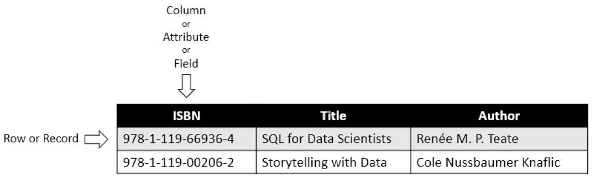
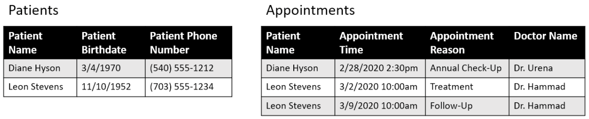
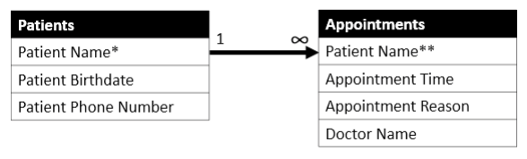
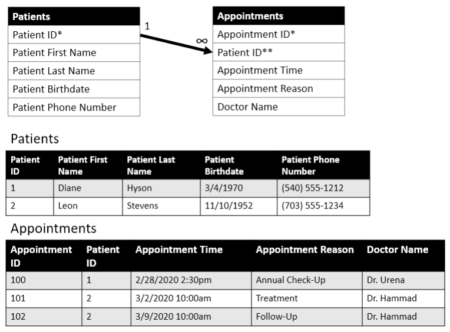
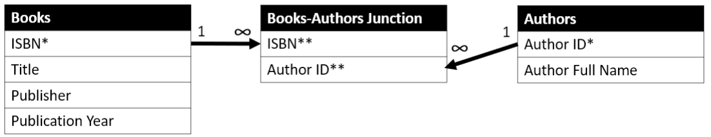
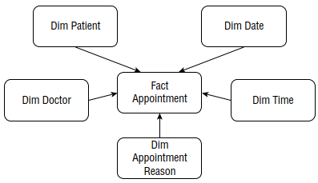

# Data Sources

- Two types of data: structured and unstructured.
  - Unstructured: text documents or images as individual files.
  - Structured: tabular format like spreadsheets or database tables.
  - Other types: CSV, JSON, XML, Graph databases, key-value stores.
- RDBMS examples: Oracle, MySQL, MS SQL Server, PostgreSQL, Amazon Redshift, IBM DB2, MS Access, SQLite, Snowflake.
  - Syntax differs slightly.
  - SQL concepts are consistent.

# Relational Databases

- A `database table` is like a spreadsheet.
  - It has row identifiers.
  - It has named column headers.
- An `entity` is an object or concept the table represents.
  - For example, in a table of `Books`, the entity is `Books`.
  - The table contains information like `ISBN number`, `title`, and `author`.
  - Some people use the terms `entity` and `table` interchangeably.
- A `row` is also called a `record` or `tuple`.
- A `column header` is also called a `field` or `attribute`.
- For example, in a table of `Books`:
  - The value in the `Author` field for the book "SQL for Data Scientists" is `Renée M. P. Teate`.

<figcaption></figcaption>

- A `database` is a collection of related `tables`.
  - A `database schema` stores information about the `tables` and their relationships.
- Example: Doctor's office `database`:
  - One `table` has patient information: `name`, `birthdate`, `phone number`.
  - Another `table` has appointment information: `patient name`, `appointment time`, `doctor name`.
  - The connection between these `tables` could be the `patient's name`.
  - Usually, a unique identifier is used since two people can have the same `name`.

<figcaption></figcaption>

- The relationship between these two `tables` is called a `one-to-many relationship`.
  - Each `patient` appears once in the `patient table`.
  - Each `patient` can appear many times in the `appointment table`.
  - These relationships are shown in an `entity-relationship diagram (ERD)`.

<figcaption></figcaption>

- An `infinity symbol`, `N`, or `crow's feet` shows the "many" side of a `one-to-many relationship`.
- The `primary key` uniquely identifies a row.
  - The `primary key` cannot be `NULL`.
  - `NULL` means no value, different from a blank space.
  - The `primary key` can be a unique value like a `Student ID` or generated by the database.
  - The `primary key` is referenced in another table called a `foreign key`.
- Example: Doctor's office `database`:
  - Each patient record in the `Patients` table has a unique `primary key`.
  - Each appointment record in the `Appointments` table has a unique `primary key`.
  - The `Appointments` table uses the `Patient ID` to link appointments to patients.
  - The patient's name is not stored in the `Appointments` table.

<figcaption></figcaption>

- Another type of relationship in `RDBMSs` is `many-to-many`.
  - It connects entities where records on each side can link to multiple records on the other side.
  - Example: `books` and `authors` have a `many-to-many relationship`.
    - Each `author` can write multiple `books`.
    - Each `book` can have multiple `authors`.
  - A `junction table` is needed to capture the pairs of related rows.

<figcaption></figcaption>

- In Figure 1.5:
  
  - `ISBN` is the `primary key` in the `Books` table.
  - `Author ID` is the `primary key` in the `Authors` table.
  - Both are `foreign keys` in the `Books-Authors Junction` table.
  - Each pairing of `ISBN` and `Author ID` is unique.
  - The pair is a multi-column `primary key` in the `Books-Authors Junction` table.
  - This setup avoids multiple rows per book or author in the `Books` table.
  - It reduces redundant data and clarifies relationships.

- `Database normalization` means not storing redundant data.
  
  - In the book database, each author's name is stored once.
  - In the doctor's office database, a patient's phone number is stored once in the patient directory.
  - Normalization reduces storage space and simplifies updates.
  - Research `relational database design` for more information.

# Dimensional Data Warehouses

- `Data warehouses` contain data from multiple sources.
  - They can be designed in a normalized relational database form or other designs.
  - They may have `raw data` and `summary` tables.
  - `Summary` tables are transformed versions of `raw data`.
  - `Data warehouses` can store historical data logs, real-time updated tables, or data snapshots.
- `Dimensional modeling` techniques are often used in `data warehouses`.
  - One common design is the `star schema`.
  - It divides data into `facts` and `dimensions`.
- A `fact` table contains the `metadata` of an entity and numeric measures to track.
  - Example: A purchase record has a timestamp, store number, order number, customer number, and amount paid.
- A `dimension` is a property of an entity to group `fact` records.
  - Example: The store in a purchase record is a `dimension`.
  - The store's `dimension table` contains information like store name.
- Example: Doctor's office database in a `star schema`.
  - `Appointments fact table` captures each appointment's details.
  - `Date dimension` and `time dimension` store properties of appointment dates and times.
- This design allows for easy grouping and summarizing of data.
  - Example: Counting appointments per time period or finding peak appointment booking times.
- Figure 1.6 shows a `dimensional data warehouse` design.
  - The design resembles a star, hence the name `star schema`.

<figcaption></figcaption>

- There might be an `appointment history log` in the `data warehouse`.
  - It records each time an appointment was changed.
  - You can see when the appointment is supposed to take place.
  - You can see how many times it was modified.
  - You can see if it was initially assigned to another doctor.
- A `dimensional model` stores more information than a `normalized relational database`.
  - `Appointment records` appear multiple times in an `appointment log table`.
  - The `date dimension table` may have a record for every calendar date.
  - Dates might extend for decades into the future.
- To design a `database` or `data warehouse`, understand these concepts in detail.
- To query the `database` for an analytical dataset:
  - Understand the `table grain` (level of detail).
  - Know what set of columns makes a row unique.
  - Understand how the `tables` are related.
- Querying a `dimensional data warehouse` with `SQL` is similar to querying a `relational database` with `SQL`.

# Asking Questions About the Data Source

- Understand the `data source`, `schema design`, and `table relationships` before writing SQL.
- Communicate with `subject matter experts` (SMEs) for insights.
  - SMEs include `database administrators` (DBAs), `ETL engineers`, and data entry personnel.
  - Use `data dictionaries` if available.
- Example questions for SMEs:
  - Which `tables` should I query for specific data?
  - What fields make up the `primary key`?
  - Are records imported directly or transformed?
  - Is this table static or updated regularly? How frequently does it update?
  - Is the data collected automatically or entered by people?
- Check value distributions in fields.
  - Visualize data using histograms during `Exploratory Data Analysis (EDA)`.
  - Analyze data by time periods to observe changes.
- Know the `type of database` for efficient querying.
  - Different databases have different SQL syntax and performance characteristics.

# Introduction to the Farmer's Market Database

- Our example `MySQL database` is for a fictional farmer's market.
  - It tracks `vendors`, `products`, `customers`, and `sales`.
  - Includes data on `market days` like date, hours, day of the week, and weather.
  - Contains `vendor` details such as booth assignments, products, and prices.
  - Vendors use `networked cash registers` to ring up items.
  - Customers scan `loyalty cards` with each transaction.
  - We have detailed logs of purchases.
    - We know who purchased which items and exactly when.

# Exercises

1. What do you think will happen in the described Books and Authors database depicted in Figure 1.5 if an author changes their name? Which records might be added or updated, and what might be the effect on the results of future queries based on this data?

2. Think of something in your life to track using a database.
   
   - One-to-Many Relationships: 
     - Example: One person can have many email addresses.
   - Many-to-Many Relationships:
     - Example: Students and courses. One student can enroll in many courses, and one course can have many students.