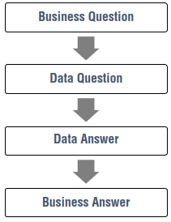
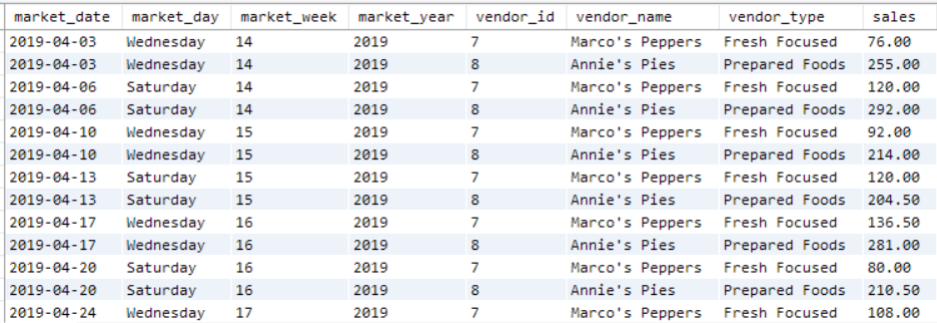
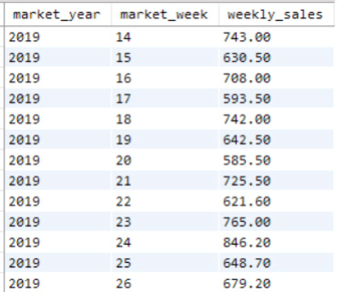
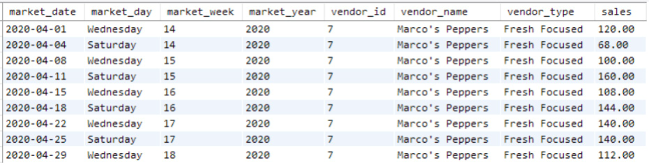
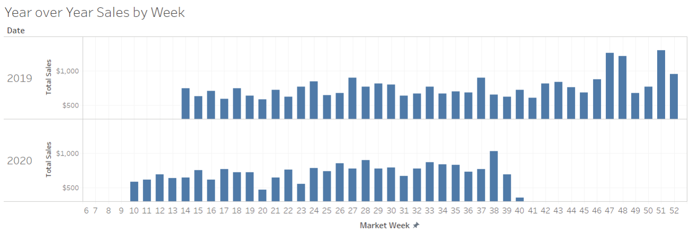
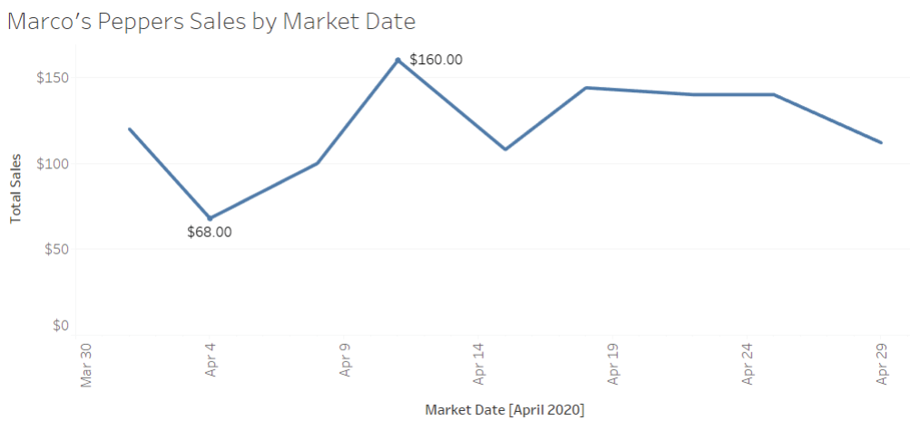
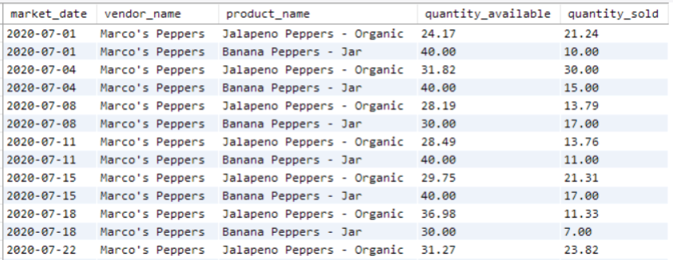

# Introduction

- In previous chapters:
  - We covered basic `SQL SELECT` syntax.
  - We used `SQL` to construct datasets to answer specific questions.

- In data analysis:
  - Being asked questions.
  - Exploring a database.
  - Writing `SQL` statements to find and pull the needed data.
  - Conducting analysis to calculate answers.
  - This process is called `ad-hoc reporting`.

- In data science:
  - A data analyst or scientist should:
    - Listen to a question from a business stakeholder.
    - Determine how to answer it using data from the database.
    - Retrieve the needed data.
    - Calculate the answers.
    - Present the result in an understandable form for decision-making.

- You now know enough `SQL` to:
  - Answer basic `ad-hoc` questions.
  - Use the demonstration database to filter, join, and summarize data.

- In the remaining chapters:
  - We'll advance these skills.
  - We'll demonstrate how to think through multiple analysis questions.
  - We'll simulate writing queries to answer business stakeholder questions.
  - We'll design and develop analytical datasets for:
    - Facilitating `ad-hoc reporting`.
    - Building dashboards.
    - Serving as inputs into predictive models.


<figcaption></figcaption>

# Thinking Through Analytical Dataset Requirements

- In this chapter:
  - We'll design reusable datasets.
  - These datasets can be queried to build many report variations.

- Experienced analysts:
  - Think about "Building Datasets for Analysis".
  - Design `SQL` queries to combine and summarize data.
  - Create datasets to answer many similar questions.

- A dataset:
  - Is like a table, summarized at the desired level of detail.
  - Has multiple measures and dimensions.
  - Is used in reports and predictive models.
  - Combines data from several tables.

- For visual reports or dashboards:
  - Join fields for human-readable labels (e.g., vendor names).
  - Include measures (e.g., sales).
  - Include dimensions (e.g., product category).

- Anticipating follow-up questions:
  - Add relevant columns or calculations to the query.
  - Make the dataset reusable for future reporting.

- Example scenario:
  - Manager asks, "What were the total sales last week?"
  - Expect follow-up questions (e.g., sales by day, vendor).

- Granularity:
  - Choose the level of detail for summarizing data.
  - Example: Summarize by day or week.

- For reporting tools like Tableau:
  - Keep the dataset granular.
  - Tableau can summarize measures automatically.

- For `SQL` queries:
  - Use `GROUP BY` to summarize at the desired level.
  - Example: Summarize by day if frequently needed.

- Example dataset design:
  - One row per day per vendor.
  - Include total daily sales and other summary metrics.

- Farmer's Market database:
  - Sales tracked in `customer_purchases` table.
  - Each row has product ID, vendor ID, customer ID, transaction date and time, quantity, and cost per quantity.
  - Design dataset with one row per date and vendor.
  - Exclude detailed customer or product information.
  - Focus on final sale amount.

- Start with a `SELECT` statement:
  - Pull only needed fields.
  - Summarize at the selected level of detail.
  - Multiply `quantity` and `cost_to_customer_per_qty` for final sale amount.

```sql
SELECT 
    market_date, 
    vendor_id, 
    quantity * cost_to_customer_per_qty 
FROM farmers_market.customer_purchases
```

- Review the output without aggregation:
  - Ensure fields and values are as expected.

- Group and sort by:
  - `vendor_id`
  - `market_date`

- Use `SUM` for the calculated cost column:
  - Round to two decimal places.
  - Alias it as `sales`.

[Figure 10.2](Fotos/Chapter10/Fig_10.2.png)
<figcaption></figcaption>

```sql
SELECT 
    market_date, 
    vendor_id, 
    ROUND(SUM(quantity * cost_to_customer_per_qty),2) AS sales 
FROM farmers_market.customer_purchases
GROUP BY market_date, vendor_id
ORDER BY market_date, vendor_id
```

- Review results to answer future questions:
  - Determine valuable information to add.

- Questions and solutions:
  - Total sales at the market last week:
    - Filter by last week's date range.
    - Sum the sales.
    - For dynamic updates, subtract 7 days from the current date.
    - Filter to sales after that date.

  - Sales at Wednesday vs. Saturday market:
    - Use `DAYNAME()` function in MySQL.
    - Add day of the week to the dataset.
    - Join `market_day` from `market_date_info` table.

  - Total sales over another time period:
    - Filter results to any date range.
    - Sum the sales.

  - Track weekly market sales over time:
    - Use `WEEK()` and `YEAR()` functions on `market_date`.
    - Group by week number or year and week.
    - Join `market_week` and `market_year` from `market_date_info` table.

  - Break down weekly sales by vendor:
    - Group or filter by `vendor_id`.
    - Join `vendor_name` and `vendor_type` for better labeling.

- Additional information to join:
  - `market_day`, `market_week`, `market_year` from `market_date_info` table.
  - `vendor_name` and `vendor_type` from `vendor` table.

- Use `LEFT JOIN` to add columns:
  - Keep all existing rows.
  - Add more columns where available.


<figcaption></figcaption>

```sql
SELECT 
    cp.market_date,
    md.market_day,
    md.market_week,
    md.market_year,
    cp.vendor_id, 
    v.vendor_name,
    v.vendor_type,
    ROUND(SUM(cp.quantity * cp.cost_to_customer_per_qty),2) AS sales
FROM farmers_market.customer_purchases AS cp
    LEFT JOIN farmers_market.market_date_info AS md
        ON cp.market_date = md.market_date 
    LEFT JOIN farmers_market.vendor AS v
        ON cp.vendor_id = v.vendor_id 
GROUP BY cp.market_date, cp.vendor_id 
ORDER BY cp.market_date, cp.vendor_id
```

# Using Custom Analytical Datasets in SQL: CTEs and Views

- Ways to store queries for reuse:
  - Create new database tables (covered in later chapters).
  - Use `Common Table Expressions` (CTEs).
  - Use `views`.

- `Common Table Expressions` (CTEs):
  - Supported by most database systems, including MySQL since version 8.0.
  - Also known as "WITH clauses".
  - Create an alias for an entire query.
  - Reference it in other queries like a database table.

```sql
WITH [query_alias] AS
(
   [query]
),
[query_2_alias] AS
(
   [query_2]
)
SELECT [column list]
FROM [query_alias]
... [remainder of query that references aliases created above]
```

- `[query_alias]` is a placeholder for the query name.
- `[query]` is a placeholder for the query to reuse.
- To alias multiple queries in the `WITH` clause:
  - Put each query inside its own parentheses.
  - Separate queries with commas.
  - Use `WITH` keyword once at the top.
  - Use `[alias_name] AS` before each new query.
  - `AS` is mandatory.

- Each query in the `WITH` clause:
  - Can reference any preceding query by its alias.

- Below the `WITH` clause:
  - Start your `SELECT` statement normally.
  - Use query aliases to refer to their results.
  - Queries in the `WITH` clause run first.

- Example:
  - Reuse the previous query to generate a dataset of sales summarized by date and vendor.
  - Put the query inside a `WITH` clause.
  - Query from it using another `SELECT` statement.

```sql
WITH sales_by_day_vendor AS
(
    SELECT 
        cp.market_date,
        md.market_day,
        md.market_week,
        md.market_year,
        cp.vendor_id, 
        v.vendor_name,
        v.vendor_type,
        ROUND(SUM(cp.quantity * cp.cost_to_customer_per_qty),2) AS sales  
    FROM farmers_market.customer_purchases AS cp
        LEFT JOIN farmers_market.market_date_info AS md
            ON cp.market_date = md.market_date
        LEFT JOIN farmers_market.vendor AS v
            ON cp.vendor_id = v.vendor_id
    GROUP BY cp.market_date, cp.vendor_id 
    ORDER BY cp.market_date, cp.vendor_id
)
 
SELECT 
    s.market_year, 
    s.market_week,
    SUM(s.sales) AS weekly_sales
FROM sales_by_day_vendor AS s
GROUP BY s.market_year, s.market_week
```


<figcaption></figcaption>

- Notice the `SELECT` statement at the bottom:
  - References `sales_by_day_vendor` CTE using its alias.
  - Gives it a shorter alias `s`.
  - Treats it like a table.
  - Can filter, perform calculations, and use its fields like a normal table.

- Using a `WITH` statement:
  - Keeps the query cleaner and easier to understand.

- In most `SQL` editors:
  - Highlight the query within each set of parentheses to run it.
  - View its results to know what data is available.
  - Cannot highlight only the `SELECT` statement at the bottom to run it alone.

- Another approach:
  - Store the query as a database `view`.
  - A `view` is treated like a table but runs dynamically to generate a result set.
  - Queries referencing `views` can take longer to run but retrieve the latest data.

- To create a `view`:
  - Precede your `SELECT` statement with `CREATE VIEW [schema_name].[view_name] AS`.
  - Replace bracketed statements with actual schema name and view name.

- Note:
  - You need database permissions to create a `view`.
  - The `vw_` prefix indicates the object is a view, not a table.

```sql
CREATE VIEW farmers_market.vw_sales_by_day_vendor AS 
SELECT 
    cp.market_date,
    md.market_day,
    md.market_week,
    md.market_year,
    cp.vendor_id, 
    v.vendor_name,
    v.vendor_type,
    ROUND(SUM(cp.quantity * cp.cost_to_customer_per_qty),2) AS sales
FROM farmers_market.customer_purchases AS cp
    LEFT JOIN farmers_market.market_date_info AS md
        ON cp.market_date = md.market_date 
    LEFT JOIN farmers_market.vendor AS v
        ON cp.vendor_id = v.vendor_id 
GROUP BY cp.market_date, cp.vendor_id 
ORDER BY cp.market_date, cp.vendor_id
```

- No results will be displayed when you run this query:
  - Only a confirmation message indicating the view was created.

- Selecting data from this view:
  - Data will be identical to Figure 10.3.

- Dataset has one row per market date per vendor:
  - Can filter this view by `vendor_id` and `market_date` range.
  - Stored view query retrieves and summarizes data from underlying tables.
  - Results are modified by the `SELECT` statement, as shown in Figure 10.5.

```sql
SELECT *
FROM farmers_market.vw_sales_by_day_vendor AS s
WHERE s.market_date BETWEEN '2020-04-01' AND '2020-04-30'
    AND s.vendor_id = 7 
ORDER BY market_date
```


<figcaption></figcaption>

- `CTEs` and `views` pull data dynamically each time they are referenced.
  - Results are not stored.

- Using the `vw_sales_by_day_vendor` view:
  - Reports on weekly sales include the latest data from `customer_purchases`.

- Paste the SQL into Business Intelligence software like `Tableau`:
  - Pull the summary dataset into a visual reporting interface.

- Tableau reports in Figures 10.6 and 10.7:
  - Built using the same dataset query.
  - Visualize data using the same fields and values as in Figures 10.4 and 10.5.


<figcaption></figcaption>


<figcaption></figcaption>

# Taking SQL Reporting Further

- Example of a reusable analytical dataset:
  - Built at the end of Chapter 9.
  - One row per `market_date`, `vendor_id`, and `product_id`.
  - Includes vendor and product information.
  - Total inventory and total sales for that day.

- Questions answered with this dataset:
  - Quantity of each product sold per vendor per market/week/month/year.
  - When are certain products in season?
  - Percentage of each vendor's inventory sold per time period.
  - Did product prices change over time?
  - Total sales per vendor for the season.
  - Frequency of vendor product discounts.
  - Which vendor sold the most tomatoes last week?

- Limitations:
  - Cannot answer questions about periods shorter than a day.
  - No detailed customer information.
  - Can slice and dice metrics by date, vendor, and product.

- Add calculated fields for reporting:
  - Percentage of product quantity sold (`percent_of_available_sold`).
  - Total discount (`discount_amount`).

- Store this dataset as a `view`:
  - Use it to answer business questions.

```sql
CREATE VIEW farmers_market.vw_sales_per_date_vendor_product AS
 
SELECT 
    vi.market_date, 
    vi.vendor_id, 
    v.vendor_name, 
    vi.product_id, 
    p.product_name,
    vi.quantity AS quantity_available,
    sales.quantity_sold,
    ROUND((sales.quantity_sold / vi.quantity) * 100, 2) AS percent_of_
available_sold, 
    vi.original_price, 
    (vi.original_price * sales.quantity_sold) - sales.total_sales AS 
discount_amount,
    sales.total_sales
FROM farmers_market.vendor_inventory AS vi
    LEFT JOIN
        (
        SELECT market_date, 
            vendor_id, 
            product_id, 
            SUM(quantity) quantity_sold, 
            SUM(quantity * cost_to_customer_per_qty) AS total_sales 
        FROM farmers_market.customer_purchases
        GROUP BY market_date, vendor_id, product_id
        ) AS sales
    ON vi.market_date = sales.market_date 
        AND vi.vendor_id = sales.vendor_id
        AND vi.product_id = sales.product_id 
    LEFT JOIN farmers_market.vendor v 
        ON vi.vendor_id = v.vendor_id
    LEFT JOIN farmers_market.product p 
        ON vi.product_id = p.product_id
ORDER BY vi.vendor_id, vi.product_id, vi.market_date
```

- To clarify what's happening in the calculation for `discount_amount`:
`(vi.original_price * sales.quantity_sold) - sales.total_sales`

- Calculation for `discount_amount`:
  - Multiply `original_price` by `quantity_sold` to get total value of products sold.
  - Subtract `total_sales` to get the total discount given by the vendor.

- Example question: 
  - "What percent of my sales at each market came from each product I brought?"
  - Use this dataset to build a report.

- Steps to answer:
  - Use a window function to get the total sales per vendor per date.
  - Divide each row's `total_sales` by the vendor's total sales for the day.

- Query for this report:
  - Shown in Figure 10.8.
  - Window functions make calculations long.
  - Syntax highlighting in the IDE helps clarify the SQL statement.


<figcaption></figcaption>

- Step-by-step calculations:
  - Query from the view `vw_sales_per_date_vendor_product`.
  - Alias total sales as `vendor_product_sales_on_market_date`.
  - Round to two decimal places for report formatting.

- Summing up each vendor's sales:
  - Use a window function to partition sales by `market_date` and `vendor_id`.
  - Alias the sum as `vendor_total_sales_on_market_date`.
  - Round to two decimal places.

- Calculating percentage of sales:
  - Divide total sales of each product by total sales of the vendor for the day.

- Example output:
  - Marco's Peppers sold one product on 4/22/2020, representing 100% of sales.
  - Annie's Pies sold three products, with the final column showing each product's sales percentage.

- Additional queries:
  - Build other reports in `SQL` using this reusable dataset.
  - Query the view to get data summary as shown in Figure 9.18.

```sql
SELECT 
    market_date, 
    vendor_name, 
    product_name, 
    quantity_available, 
    quantity_sold
FROM farmers_market.vw_sales_per_date_vendor_product AS s 
WHERE market_date BETWEEN '2020-06-01' AND '2020-07-31'
    AND vendor_name = 'Marco''s Peppers' 
    AND product_id IN (2, 4)
ORDER BY market_date, product_id
```

- Partial view of the output:
  - Shown in Figure 10.9.
  - Compare numbers to the bar chart in Figure 9.18.

- Benefit of saving queries:
  - Generate summary datasets for reuse.
  - Any tool can reference the underlying data, table joins, and calculated values.
  - Consistent results as long as data doesn't change between report generation times.


<figcaption></figcaption>

# Exercises

1. Using the view `farmers_market.vw_sales_by_day_vendor`:
  - Refer to Figure 10.3 for a preview of the data.
  - Write a query to summarize sales per vendor per market week.

2. Rewrite the query from Figure 7.11 using a `CTE` (`WITH` clause).

3. To build a report of total and average market sales by vendor booth type:
  - Modify the query from Figure 10.3.
  - Include information needed for total and average sales by booth type.