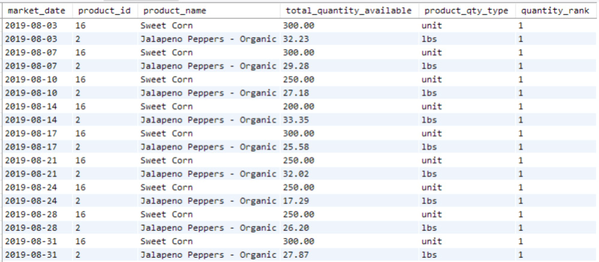
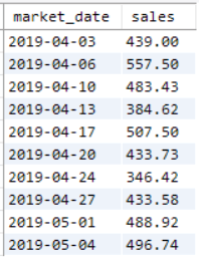
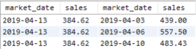
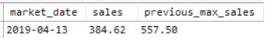
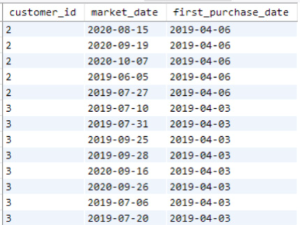
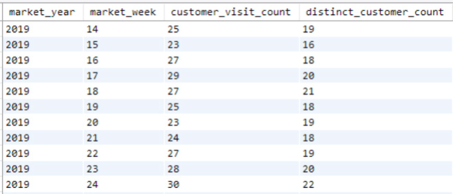

# UNIONs

- I haven't covered the `UNION` query yet.
  - It deserves a mention.
- `UNION` combines two queries.
  - Both queries must have the same number of columns.
  - Columns must have the same data types.
  - Columns must be in the same order.
- `UNION` syntax is simple.
  - Write two queries with the same number and type of fields.
  - Put a `UNION` keyword between them.
- There are many use cases for `UNION` queries.

```sql
SELECT market_year, MIN(market_date) AS first_market_date 
FROM farmers_market.market_date_info
WHERE market_year = '2019'
 
UNION

SELECT market_year, MIN(market_date) AS first_market_date 
FROM farmers_market.market_date_info
WHERE market_year = '2020'
```

- This example isn't practical.
  - You could write one query with `GROUP BY market_year`.
  - Use `WHERE market_year IN ('2019', '2020')` to get the same output.
- There are multiple ways to write queries.
  - Sometimes combining two queries is quicker.
  - Use identical columns but different criteria or aggregation.
- For a complex example:
  - Combine `CTEs` and `UNIONs`.
  - Build a report showing products with the largest quantities.
    - Bulk product with the largest weight.
    - Unit product with the highest count.

```sql
WITH 
product_quantity_by_date AS
(
    SELECT 
        vi.market_date, 
        vi.product_id, 
        p.product_name,
        SUM(vi.quantity) AS total_quantity_available, 
        p.product_qty_type
    FROM farmers_market.vendor_inventory vi
        LEFT JOIN farmers_market.product p 
            ON vi.product_id = p.product_id
    GROUP BY market_date, product_id
)
 
SELECT * FROM
(
    SELECT
        market_date,
        product_id, 
        product_name,
        total_quantity_available, 
        product_qty_type,
        RANK() OVER (PARTITION BY market_date ORDER BY total_quantity_ 
available DESC) AS quantity_rank
    FROM product_quantity_by_date 
    WHERE product_qty_type = 'unit'
 
    UNION
 
    SELECT
        market_date,
        product_id, 
        product_name,
        total_quantity_available, 
        product_qty_type,
        RANK() OVER (PARTITION BY market_date ORDER BY total_quantity_ 
available DESC) AS quantity_rank
    FROM product_quantity_by_date 
    WHERE product_qty_type = 'lbs'
) x
 
WHERE x.quantity_rank = 1 
ORDER BY market_date
```

- The `WITH` statement (`CTE`) totals product quantities at each market.
  - Uses `vendor_inventory` table.
  - Joins with `product` table for product name and quantity type.
  - `product_qty_type` values are "lbs" or "unit".
- The inner part of the query has two `UNION`ed queries.
  - Both use the `product_quantity_by_date` view from the `CTE`.
  - Each ranks by `total_quantity_available`.
  - Both return fields in the same order.
  - `WHERE` clauses separate results by `product_qty_type`.
- We can't `GROUP BY` `product_qty_type` and remove `UNION`.
  - `RANK()` function ranks by quantity available.
  - We want the top item per `product_qty_type`.
- The outer part of the query selects and filters top-ranked quantities.
  - One row per market date with the highest lbs.
  - One row per market date with the highest units.
- Example results:
  - August 2019:
    - Highest weight: organic jalapeno peppers.
    - Highest count: sweet corn.


<figcaption></figcaption>

- There are multiple ways to construct queries in `SQL`.
  - They can result in identical outputs.
- Another way to get the same output without `UNION`:
  - The second query in the `WITH` clause queries from the first.
  - The final `SELECT` statement filters the result of the second query.

```sql
WITH 
product_quantity_by_date AS
(
    SELECT 
        vi.market_date, 
        vi.product_id, 
        p.product_name,
        SUM(vi.quantity) AS total_quantity_available, 
        p.product_qty_type
    FROM farmers_market.vendor_inventory vi
        LEFT JOIN farmers_market.product p 
            ON vi.product_id = p.product_id
    GROUP BY market_date, product_id 
),
rank_by_qty_type AS
(
    SELECT
        market_date, 
        product_id, 
        product_name,
        total_quantity_available, 
        product_qty_type,
        RANK() OVER (PARTITION BY market_date, product_qty_type ORDER BY 
total_quantity_available DESC) AS quantity_rank
    FROM product_quantity_by_date
)
 
SELECT * FROM rank_by_qty_type 
WHERE quantity_rank = 1
ORDER BY market_date
```

- We achieved the same result without `UNION`.
  - Partition by `market_date` and `product_qty_type` in `RANK()`.
  - This ranks each date and quantity type.

- When is `UNION` definitely required?
  - Separate tables with the same columns for different time periods.
  - Example: event logs stored in multiple files.
  - Each file loaded into its own table in the database.
  - Static snapshots of the same dataset from different times.
  - Data migrated from one system to another.
  - Combine tables from two systems to see the entire history.

# Self-Join to Determine To-Date Maximum

- A `self-join` in `SQL` joins a table to itself.
  - Think of it as two copies of the table joined together.
  - Used to compare rows to one another.
- Write the `SQL` for a `self-join` like any other join.
  - Reference the same table name twice.
  - Give each "copy" its own alias.

```sql
SELECT t1.id1, t1.field2, t2.field2, t2.field3 
FROM mytable AS t1
   LEFT JOIN mytable AS t2
       ON t1.id1 = t2.id1
```

- This example shows syntax, not a typical use case.
  - Normally, you wouldn't join on a primary key and compare a row to itself.
- A realistic use case:
  - Use a comparison operator other than an equal sign.
  - Join every row to every previous row.
  - Example: comparing each value to all previous values.
- Use case: create a "record high to-date" indicator.
  - Example: track highest count of positive COVID-19 tests.
  - Visual indicator on a COVID-19 dashboard for new record highs.
  - Look back at past counts to see if they set a new record high.
- Example using Farmer's Market database:
  - Create a report showing if total sales on each market date were the highest to-date.
  - Use `SUM()` and `MAX()` functions for date ranges.
  - For all dates, use a self-join to compare each date to previous dates.
- Steps:
  - Summarize sales by `market_date`.
  - Put the query into a `CTE` (`WITH` clause).
  - Alias it `sales_per_market_date`.
  - Select the first 10 rows of this query.


<figcaption></figcaption>

```sql
WITH 
sales_per_market_date AS
(
    SELECT 
        market_date, 
        ROUND(SUM(quantity * cost_to_customer_per_qty),2) AS sales 
    FROM farmers_market.customer_purchases
    GROUP BY market_date
    ORDER BY market_date
) 
SELECT * 
FROM sales_per_market_date 
LIMIT 10
```

- We can select data from this "table" twice.
  - Join the table to itself using the `market_date` field.
  - Use a less-than sign (`<`) in the join.
- Aliases:
  - `cm` for "current market date" row (left side of the join).
  - `pm` for "previous market date" row.
- Be careful to avoid errors.
  - Check results to ensure the intended output.
  - Especially important if other tables are joined.
- Join every row to all rows with a lower `market_date`.
  - Filter to view the row from April 13, 2019.
  - See joined rows with earlier market dates in Figure 11.3.


<figcaption></figcaption>

```sql
WITH 
sales_per_market_date AS
(
    SELECT 
        market_date, 
        ROUND(SUM(quantity * cost_to_customer_per_qty),2) AS sales 
    FROM farmers_market.customer_purchases
    GROUP BY market_date
    ORDER BY market_date
)
SELECT * 
FROM sales_per_market_date AS cm
    LEFT JOIN sales_per_market_date AS pm 
        ON pm.market_date < cm.market_date
WHERE cm.market_date = '2019-04-13'
```

- Use `MAX()` on the `pm.sales` field.
  - `GROUP BY cm.market_date` to get the previous highest sales value.
- The output of this query is shown in Figure 11.4.
  - Compare to Figure 11.3.
  - Recognize the sales total from April 6, 2019.
  - April 6, 2019, had the highest sales before April 13, 2019.

```sql
WITH 
sales_per_market_date AS
(
    SELECT 
        market_date, 
        ROUND(SUM(quantity * cost_to_customer_per_qty),2) AS sales 
    FROM farmers_market.customer_purchases
    GROUP BY market_date
    ORDER BY market_date
)
 
SELECT 
    cm.market_date,
    cm.sales,
    MAX(pm.sales) AS previous_max_sales 
FROM sales_per_market_date AS cm
    LEFT JOIN sales_per_market_date AS pm 
        ON pm.market_date < cm.market_date
WHERE cm.market_date = '2019-04-13' 
GROUP BY cm.market_date, cm.sales
```


<figcaption></figcaption>

- Remove the date filter in the `WHERE` clause.
  - Get the `previous_max_sales` for each date.
- Use a `CASE` statement to create a flag field.
  - Indicates if current sales are higher than previous maximum sales.
  - Shows if each `market_date` set a sales record.
- The query's output is shown in Figure 11.5.
  - April 6, 2019, is labeled as a record sales day.
  - Its sales record is shown as `previous_max_sales` in Figure 11.4.
  - After a new record on May 29, 2019, `previous_max_sales` updates to the new record value.

```sql
WITH 
sales_per_market_date AS
(
    SELECT 
        market_date, 
        ROUND(SUM(quantity * cost_to_customer_per_qty),2) AS sales 
    FROM farmers_market.customer_purchases
    GROUP BY market_date
    ORDER BY market_date
)
 
SELECT 
    cm.market_date,
    cm.sales,
    MAX(pm.sales) AS previous_max_sales, 
    CASE WHEN cm.sales > MAX(pm.sales)
        THEN "YES"
        ELSE "NO"
    END sales_record_set
FROM sales_per_market_date AS cm
    LEFT JOIN sales_per_market_date AS pm 
        ON pm.market_date < cm.market_date
GROUP BY cm.market_date, cm.sales
```


<figcaption></figcaption>

# Counting New vs. Returning Customers by Week

- Summarize customers by time period.
  - Monitor weekly customer visits.
  - Track how many are new customers making their first purchase.
- Customers are counted only if they make a purchase.
  - Can't report on visitors who don't purchase.
  - Data only includes customers who use their loyalty card.
  - Assume 100% of customers are identifiable at purchase.
- Determine if a customer is new:
  - Compare each purchase date to the minimum purchase date per customer.
  - If the minimum purchase date is today, the customer is new.
- Get a summary of every market date attended by every customer.
  - Determine their first purchase dates.
  - Use `MIN()` as a window function, partitioned by `customer_id`.

```sql
SELECT DISTINCT 
    customer_id,
    market_date,
    MIN(market_date) OVER(PARTITION BY cp.customer_id) AS first_purchase_
date
FROM farmers_market.customer_purchases cp
```

- `DISTINCT` is added because each item purchased has a row in `customer_purchases`.
  - We only need one row per `market_date` per `customer_id`.
- No `GROUP BY` needed.
  - The window function partitions the data.
  - `DISTINCT` ensures no duplicate rows.
- Results from the query are shown in Figure 11.6.
  - Each row shows a date a customer shopped.
  - Also shows the customer's first purchase date.


<figcaption></figcaption>

- Put the query inside a `WITH` clause.
  - Query its results with added calculations.
- Join it to the `market_date_info` table.
  - Get the year and week of each `market_date`.
- Group by week.
  - If a customer made purchases at both markets in a week, they will have two rows.
- Do two types of counts:
  - `customer_visit_count` counts each row.
    - A customer shopping at both markets in a week is counted twice.
  - `distinct_customer_count` counts unique `customer_id` values using `DISTINCT`.
    - Only counts unique customers per week without double-counting.
- Results of the counts are shown in Figure 11.7.

```sql
WITH 
customer_markets_attended AS
(
    SELECT DISTINCT 
        customer_id,
        market_date,
            MIN(market_date) OVER(PARTITION BY cp.customer_id) AS first_purchase_ 
date
FROM farmers_market.customer_purchases cp
)
 
SELECT 
    md.market_year,
    md.market_week,
    COUNT(customer_id) AS customer_visit_count, 
    COUNT(DISTINCT customer_id) AS distinct_customer_count
FROM customer_markets_attended AS cma
    LEFT JOIN farmers_market.market_date_info AS md
        ON cma.market_date = md.market_date 
GROUP BY md.market_year, md.market_week 
ORDER BY md.market_year, md.market_week
```


<figcaption></figcaption>

- The results could be achieved with a simpler query.
  - What was the point of the `CTE` query?
- The data is now ready for further calculations.
  - We have access to each customer's first purchase date.
- We want to count new customers per week.
  - Add a column showing the percent of new customers each week.
- Add two more fields to the query.
  - The first field looks like this:

```sql
COUNT( 
    DISTINCT 
    CASE WHEN cma.market_date = cma.first_purchase_date 
        THEN customer_id 
        ELSE NULL 
    END
    ) AS new_customer_count
```

- Inside the `COUNT()` function is a `CASE` statement.
  - It checks if `market_date` equals the customer's first purchase date.
  - If they match, the `CASE` statement returns `customer_id` to count.
  - If not, it returns `NULL`.
  - Result: a distinct count of customers making their first purchase that week.
- The second field divides this value by the total distinct count of `customer_id`s.
  - This gives a percentage.
- The result of this query is shown in Figure 11.8.

```sql
WITH 
customer_markets_attended AS
(
    SELECT DISTINCT 
        customer_id,
        market_date,
            MIN(market_date) OVER(PARTITION BY cp.customer_id) AS first_purchase_ 
date
    FROM farmers_market.customer_purchases cp
)
 
SELECT 
    md.market_year,
    md.market_week,
    COUNT(customer_id) AS customer_visit_count, 
    COUNT(DISTINCT customer_id) AS distinct_customer_count, 
    COUNT(DISTINCT 
        CASE WHEN cma.market_date = cma.first_purchase_date 
            THEN customer_id 
            ELSE NULL 
        END)AS new_customer_count, 
    COUNT(DISTINCT 
        CASE WHEN cma.market_date = cma.first_purchase_date 
            THEN customer_id 
            ELSE NULL 
        END) 
        / COUNT(DISTINCT customer_id) 
        AS new_customer_percent
FROM customer_markets_attended AS cma
    LEFT JOIN farmers_market.market_date_info AS md
        ON cma.market_date = md.market_date 
GROUP BY md.market_year, md.market_week 
ORDER BY md.market_year, md.market_week
```


<figcaption></figcaption>

- On the first market date, 100% of the customers are new.
- As of now, no new customers are added after week 18 of 2019 in the Farmer's Market database.

# Summary

- These are examples of complex query structures in `SQL`.
- They show the variety of analyses and datasets you can create.
- Use different combinations of the `SQL` learned in this book.
- In the next chapter:
  - Reuse some of these concepts.
  - Generate datasets for machine learning and forecasting algorithms.

# Exercises

1. Start with the query from Figure 11.5.
  - Put the larger `SELECT` statement in a second `CTE`.
  - Write a query from its results to display current record sales and market date.
  - Can you think of another way to get the same results?
2. Modify the "New vs. Returning Customers Per Week" report (Figure 11.8).
  - Summarize the counts by vendor by week.
3. Use a `UNION` to write a query.
  - Display the market dates with the highest and lowest total sales.