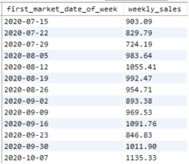
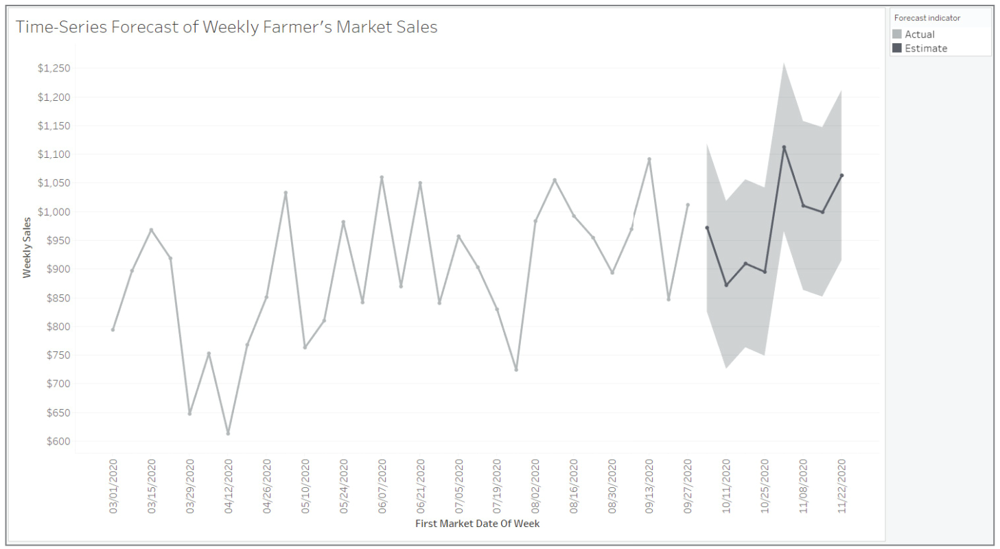
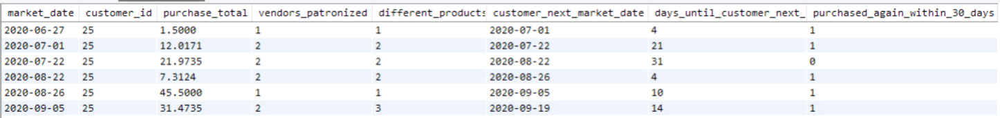
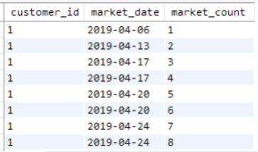
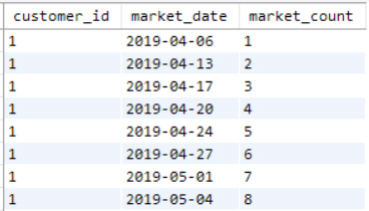
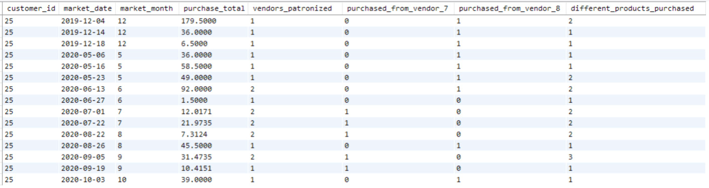
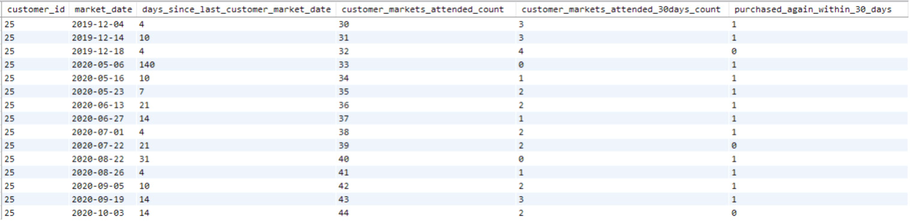

# Introduction

- In previous chapters:
  - Introduced `SQL` concepts.
  - Walked through analytical reporting examples.
- This chapter focuses on dataset design for predictive modeling.
  - Discuss datasets for classification and time series models.

- `Binary classification model`:
  - Predicts if a record belongs to one category or another.
  - Example: heart disease classification model.
    - Analyzes medical history to predict heart disease likelihood.
  - Example: weather model.
    - Uses temperature, precipitation, pressure, and wind to predict rain.
  - Example: retail scenario.
    - Predicts if a customer will return to make another purchase.

- Model training:
  - `Binary classifiers` are supervised learning models.
  - Trained with example rows of data labeled with outcomes.
  - Detects patterns and characteristics associated with results.
  - Test the trained model with example instances.
  - Compare predictions to actual outcomes to check performance.

- `Time series model`:
  - Performs statistical operations on measurements over time.
  - Forecasts future measurements.
  - Training data is a log of past data measurements.
  - Example: stock prices history to predict investment value.
  - Example: college enrollment forecasts.
  - Example: farmer's market sales trends and predictions.

- Each model type requires a different dataset.
  - Review approaches for preparing datasets using `SQL`.

# Datasets for Time Series Models

- The simplest type of time series forecasting uses a single variable.
  - Measured over specified time intervals.
  - Predicts the value of that variable at a future point in time.
- A training dataset for a simple time series model can have two columns:
  - A column with dates or datetime values.
  - A column with the measured value.

- Example: predicting high temperature tomorrow.
  - Dataset with daily high temperatures measured over years.
  - One row per day.
  - One column for the date.
  - One column for the daily high temperature.
  - The model detects patterns and trends to predict tomorrow's high temperature.

- Create a dataset to plot a time series of farmer's market sales per week.
  - This view of sales is simplistic.
  - It doesn't consider changes in vendors, inventory, or economic factors.

- In Chapter 10, we summarized sales per market date.
  - Now, summarize that data to a weekly level.
  - Join `customer_purchases` to `market_date_info`.
  - Use `market_week` field to group by week.
  - Remember, `market_week` is a number representing the week of the year.
  - Group by both `market_year` and `market_week`.

- We want a single field indicating the time period.
  - Use the first market date of each week.
  - Find the minimum market date per week.
  - Output it with the alias `first_market_date_of_week`.

```sql
SELECT 
    MIN(cp.market_date) AS first_market_date_of_week,
    ROUND(SUM(cp.quantity * cp.cost_to_customer_per_qty),2) AS weekly_sales 
FROM farmers_market.customer_purchases AS cp
    LEFT JOIN farmers_market.market_date_info AS md
        ON cp.market_date = md.market_date 
GROUP BY md.market_year, md.market_week 
ORDER BY md.market_year, md.market_week
```

- Figure 12.1 shows the last 13 rows.


<figcaption></figcaption>

- `Tableau` has built-in time series forecasting functions.
  - Uses a method called exponential smoothing.
- Import the query results into `Tableau`.
  - Use the weekly sales data to generate a sales forecast.
  - Forecast for the eight weeks beyond the last date in the dataset.

- Figure 12.2 shows a line chart visualization.
  - Lighter gray line labeled "Actual" shows actual sales per week from the query.
  - Darker gray line labeled "Estimate" shows forecasted sales for the next eight weeks.
  - Shaded area represents a 90% confidence interval for each forecasted value.


<figcaption></figcaption>

- Summarizing past sales into a weekly dataset enabled `Tableau` to forecast future weekly sales.
  - One row per week with a date column and a weekly sales total column.
  - Identified patterns in past weekly sales.

- The dataset lacks granularity to forecast daily sales.
  - No information indicating each week represents sales from two market dates.
  - Can't forecast monthly sales accurately.
  - If a new month starts between two market dates in a week, sales are categorized into the wrong month.

- Know the intended use of a dataset to make correct design choices.
- Provide documentation for the dataset.
  - Helps others understand its original purpose.
  - Important for accurate analysis.

# Datasets for Binary Classification

- `Classification algorithms` detect patterns in training datasets.
  - Contain example records from the past that fall into known categories.
  - Use detected patterns to categorize new data.
- `Binary classification algorithms` categorize inputs into one of two outcomes.
  - Example: Given a patient's medical history, do they have heart disease or not?
  - Example: Given weather data, will it rain in the next 24 hours or not?
  - Can also output a probability or likelihood score.

- Training data must be in the same form as the data to be classified.
  - Example: If input is a patient's medical history, training data must be similar.
  - Each training instance should have data as of the diagnosis date.
  - Include measurements from one and five years prior to the diagnosis date.

- Consider conditions under which the model will be applied when designing the dataset.
  - Example: If you don't have a five-year history for current patients, don't include it in training data.
  - Alternatively, train a model on data collected five years ago to predict future outcomes.

- Every classification model requires a `target variable`.
  - The thing you're trying to predict.
  - In binary classifiers, input the target as a binary value of 1 or 0.
  - Example: A binary flag indicating a diagnosis of heart disease or not.

- We won't cover how much past data is required for training and testing a model.
  - Depends on the type of model, number of columns, variation in data values, etc.
  - We won't train classification models in this book.
  - We'll discuss how to structure datasets for binary classification model training and prediction.
  - Use `SQL` to pull the data needed to train and run a classifier.

- Determine the `target variable` when structuring a dataset for binary classification.
  - The categories you're building a model to classify records into.
  - Often needs a time bounding.
  - Example: Predicting “Will this patient develop heart disease in the next five years?”
  - Time bounding affects choices when designing the training dataset.

## Creating the Dataset

- Build a dataset to train a model to predict:
  - "Will this customer return to make another purchase within the next month?"
- The binary target variable is "makes another purchase within 30 days."
  - 1 for "yes" and 0 for "no."
- Create a training dataset:
  - Summarize information about each customer as of each purchase date.
  - Flag the row with 1 if the customer made another purchase within a month.
  - Flag the row with 0 if they did not.
  - One training example per customer per purchase date.

- Benefits of multiple records per customer:
  - More training instances for the model to detect patterns.
  - Capture changes in behavior over time.
  - Be aware: frequent customers will be over-represented.

- Setting up the query:
  - Ensure correct granularity with a time-bound target variable.
  - Verify calculations before adding other data fields.
  - Example: Determine if a customer makes a purchase in the next calendar month.
  - Adjust to a dynamic one-month time limit after each purchase.

- Create a `CTE` for every purchase:
  - Reuse the `customer_markets_attended` `CTE` from Chapter 11.
  - Look up if a customer made another purchase within 30 days after each purchase date.

- Query structure:
  - `FROM`, `WHERE`, and `GROUP BY` clauses determine table(s), filters, and granularity.
  - Select from `customer_purchases` table (one row per customer per product purchased).
  - No `WHERE` clause, so all rows are returned.
  - `GROUP BY` includes `customer_id` and `market_date`.
  - Result: one row per customer per market date at which they made a purchase.

```sql
WITH 
customer_markets_attended AS
(
    SELECT DISTINCT 
        customer_id,
        market_date
    FROM farmers_market.customer_purchases 
    ORDER BY customer_id, market_date
)
 
SELECT 
    cp.market_date,
    cp.customer_id,
    SUM(cp.quantity * cp.cost_to_customer_per_qty) AS purchase_total, 
    COUNT(DISTINCT cp.vendor_id) AS vendors_patronized, 
    COUNT(DISTINCT cp.product_id) AS different_products_purchased, 
    (SELECT MIN(cma.market_date) 
    FROM customer_markets_attended AS cma
    WHERE cma.customer_id = cp.customer_id 
        AND cma.market_date > cp.market_date
    GROUP BY cma.customer_id) AS customer_next_market_date, 
    DATEDIFF(
        (SELECT MIN(cma2.market_date) 
        FROM customer_markets_attended AS cma2 
        WHERE cma2.customer_id = cp.customer_id 
            AND cma2.market_date > cp.market_date 
        GROUP BY cma2.customer_id),
    cp.market_date) AS days_until_customer_next_market_date, 
    CASE WHEN
        DATEDIFF(
            (SELECT MIN(cma3.market_date) 
            FROM customer_markets_attended AS cma3 
            WHERE cma3.customer_id = cp.customer_id 
                AND cma3.market_date > cp.market_date
            GROUP BY cma3.customer_id),
        cp.market_date) <=30 
    THEN 1 
    ELSE 0 END AS purchased_again_within_30_days 
FROM farmers_market.customer_purchases AS cp 
GROUP BY cp.customer_id, cp.market_date
ORDER BY cp.customer_id, cp.market_date
```

- `purchase_total` column:
  - Multiplies the quantity and cost of each item purchased.
  - Sums up the total spent by each customer at each market date.

- `vendors_patronized` column:
  - Distinct count of different vendors the customer purchased from that day.

- `different_products_purchased` column:
  - Distinct count of different kinds of products the customer purchased.

- These calculated columns are called `engineered features` in machine learning.
  - Explore the relationship between these values and the target variable.

- `customer_next_market_date` column:
  - Generated by a subquery referencing the `CTE`.
  - Finds the date of the customer's next purchase after the current row's `market_date`.

- Subquery details:
  - Matches `customer_id` in the subquery with the main query.
  - Limits subquery rows to those where `market_date` is after the main query's `market_date`.
  - Returns the minimum date from the list of future market dates.

- `days_until_customer_next_market_date` column:
  - Uses the same subquery.
  - Calculates the difference between the current row's date and the next market date.

- `purchased_again_within_30_days` column:
  - Uses the same calculation inside a `CASE` statement.
  - Returns a binary flag (1 or 0) indicating if the next purchase was within 30 days.

- Example rows generated by this query are shown in Figure 12.3.


<figcaption></figcaption>

- I aliased the `customer_markets_attended` `CTE` reference differently in each subquery.
  - Used `cma`, `cma2`, and `cma3` for clarity.
  - The table alias only applies within the subquery.
  - Each subquery is an aggregate that returns one value for each row.

- `customer_next_market_date` and `days_until_customer_next_market` are useful for validation.
  - Once validated, remove these columns from the machine learning dataset.
  - Only keep the target variable `purchased_again_within_30_days`.

- All other columns will be inputs to the algorithm.
  - Avoid encoding the target variable in any other field to prevent `data leakage`.
  - `Data leakage` occurs when future data is fed into the algorithm, improving predictions artificially.

## Expanding the Feature Set

- What other features might contain "signal" (detectable patterns) for the model?
  - Particular vendors might have more loyal customers.
  - Some vendors sell items that need to be replenished more frequently.
  - Shopping at a particular vendor might indicate a shopper will return sooner.
  - The number of days since a customer's last purchase could indicate frequent shoppers.

- Add columns:
  - Indicate which vendors each customer shopped at on each market day.
  - Flip the `days_until_customer_next_market_date` calculation.
  - Indicate how long it's been since the customer's last shop before the current visit.

```sql
WITH 
customer_markets_attended AS
(
    SELECT DISTINCT 
        customer_id,
        market_date
    FROM farmers_market.customer_purchases 
    ORDER BY customer_id, market_date
)
 
SELECT cp.market_date, 
    cp.customer_id,
    SUM(cp.quantity * cp.cost_to_customer_per_qty) AS purchase_total, 
    COUNT(DISTINCT cp.vendor_id) AS vendors_patronized,
    MAX(CASE WHEN cp.vendor_id = 7 THEN 1 ELSE 0 END) AS  
purchased_from_vendor_7,
    MAX(CASE WHEN cp.vendor_id = 8 THEN 1 ELSE 0 END) AS  
purchased_from_vendor_8,
    COUNT(DISTINCT cp.product_id) AS different_products_purchased,
    DATEDIFF(cp.market_date,
        (SELECT MAX(cma.market_date) 
        FROM customer_markets_attended AS cma 
        WHERE cma.customer_id = cp.customer_id 
            AND cma.market_date < cp.market_date
        GROUP BY cma.customer_id)) AS days_since_last_customer_market_date,
        CASE WHEN
        DATEDIFF(
            (SELECT MIN(cma.market_date) 
            FROM customer_markets_attended AS cma 
            WHERE cma.customer_id = cp.customer_id 
                AND cma.market_date > cp.market_date
            GROUP BY cma.customer_id),
            cp.market_date) <=30 THEN 1 ELSE 0 END AS  
purchased_again_within_30_days
FROM farmers_market.customer_purchases AS cp
GROUP BY cp.customer_id, cp.market_date
ORDER BY cp.customer_id, cp.market_date
```

- Added columns indicating if each customer purchased from vendors 7 or 8.
  - This technique can be repeated for every vendor.
- Flipped the greater-than sign to a less-than sign.
  - Finds how many days since the customer last made a purchase.
  - Feature aliased `days_since_last_customer_market_date`.

- Another useful aggregate value:
  - Representation of the customer's entire shopping history up to the date.
  - Example: How many times has the customer shopped at the market before?

- Use `ROW_NUMBER` window function to calculate this value.
  - Counts how many prior rows exist for each customer.
  - Be careful with query placement, as `ROW_NUMBER` only counts returned rows.

- Solution:
  - Put `ROW_NUMBER` in the `customer_markets_attended` `CTE`.
  - Calculate the number of past markets attended.
  - Reference the `CTE` to return the row number for the current `market_date`.
  - Alias this value as `market_count` in the `CTE` and `customer_markets_attended_count` in the main query.

- Important note:
  - Modify `customer_markets_attended` query in the `WITH` clause to use `GROUP BY` instead of `COUNT DISTINCT`.
  - `ROW_NUMBER` returns higher counts with `COUNT DISTINCT` because it calculates before `DISTINCT`.
  - Grouping by `market_date` solves this issue as the window function calculates after `GROUP BY`.

- Trial and error may be needed to get the order of operations correct.
  - View underlying data details before aggregating to ensure correct summary data.


<figcaption></figcaption>


<figcaption></figcaption>

- There are several ways to accomplish the same result in `SQL`.
- Move the `ROW_NUMBER()` into the `WHERE` clause.
  - Returns the same count for `customer_markets_attended_count`.
  - Works even if the main query is filtered to a date range that doesn't include a customer's entire purchase history.

```sql
WITH 
customer_markets_attended AS
(
    SELECT 
        customer_id,
        market_date,
        ROW_NUMBER() OVER (PARTITION BY customer_id ORDER BY market_date) 
AS market_count
    FROM farmers_market.customer_purchases 
    GROUP BY customer_id, market_date 
    ORDER BY customer_id, market_date
)
select cp.customer_id, cp.market_date, 
    (SELECT MAX(market_count) 
        FROM customer_markets_attended AS cma
        WHERE cma.customer_id = cp.customer_id 
        AND cma.market_date <= cp.market_date) AS customer_markets_
attended_count
FROM farmers_market.customer_purchases AS cp 
GROUP BY cp.customer_id, cp.market_date
ORDER BY cp.customer_id, cp.market_date
```

- Add a feature to predict if a customer returns in the next 30 days.
  - Count how many times they shopped in the previous 30 days.
- Create a column for past markets attended in the last 30 days.
  - Alias this calculation as `customer_markets_attended_30days_count`.
- This is demonstrated in the following query:

```sql
WITH 
customer_markets_attended AS
(
    SELECT 
        customer_id,
        market_date,
        ROW_NUMBER() OVER (PARTITION BY customer_id ORDER BY market_date) 
AS market_count
    FROM farmers_market.customer_purchases 
    GROUP BY customer_id, market_date 
    ORDER BY customer_id, market_date
)
select cp.customer_id, cp.market_date, 
    (SELECT COUNT(market_date) 
        FROM customer_markets_attended AS cma
        WHERE cma.customer_id = cp.customer_id 
            AND cma.market_date < cp.market_date
            AND DATEDIFF(cp.market_date, cma.market_date) <= 30) AS 
customer_markets_attended_30days_count
FROM farmers_market.customer_purchases AS cp
GROUP BY cp.customer_id, cp.market_date
ORDER BY cp.customer_id, cp.market_date
```

# Feature Engineering

- This process of creating different input values for the prediction algorithm is called `feature engineering`.
- Most binary classification algorithms require numeric inputs.
  - Features can convert other data types into numeric representations.
  - Examples: one-hot encoded flag columns, converting categorical text to numeric values, aggregate metrics, incrementing totals, summaries for different time periods.

- Important factor in feature engineering:
  - Each feature value should be knowable as of the date represented by the row (`market_date`).
  - Train the model on examples of customers with traits as of specific points in time.
  - Correlate traits with a specific outcome or target variable relative to that time.

- Do not input full date into a predictive model.
  - Use relative dates for events of interest (time between purchases).
  - Do not input `customer_id` or `market_date` into the algorithm.
  - Use them as unique identifiers or index values to tie predictions back to rows.

- The month of the market date is likely predictive.
  - The market closes in January and February.
  - Customers shopping in December have a lower likelihood of returning in the next 30 days.

- The final version of the classification dataset query includes a column representing the month.
  - Shown in Figures 12.6 and 12.7.
  - Output is split into two figures with `customer_id` and `market_date` visible in both sections.

```sql
WITH 
customer_markets_attended AS
(
    SELECT 
        customer_id,
        market_date,
        ROW_NUMBER() OVER (PARTITION BY customer_id ORDER BY market_date) 
AS market_count
    FROM farmers_market.customer_purchases 
    GROUP BY customer_id, market_date 
    ORDER BY customer_id, market_date
)
SELECT 
     cp.customer_id,
     cp.market_date,
     EXTRACT(MONTH FROM cp.market_date) as market_month, 
     SUM(cp.quantity * cp.cost_to_customer_per_qty) AS purchase_total, 
     COUNT(DISTINCT cp.vendor_id) AS vendors_patronized,
     MAX(CASE WHEN cp.vendor_id = 7 THEN 1 ELSE 0 END) purchased_from_
vendor_7,
     MAX(CASE WHEN cp.vendor_id = 8 THEN 1 ELSE 0 END) purchased_from_
vendor_8,
     COUNT(DISTINCT cp.product_id) AS different_products_purchased,
     DATEDIFF(cp.market_date,
        (SELECT MAX(cma.market_date) 
            FROM customer_markets_attended AS cma 
            WHERE cma.customer_id = cp.customer_id 
                AND cma.market_date < cp.market_date
            GROUP BY cma.customer_id)
         ) days_since_last_customer_market_date, 
    (SELECT MAX(market_count) 
        FROM customer_markets_attended AS cma
        WHERE cma.customer_id = cp.customer_id 
        AND cma.market_date <= cp.market_date) AS customer_markets_
attended_count,
    (SELECT COUNT(market_date) 
        FROM customer_markets_attended AS cma 
        WHERE cma.customer_id = cp.customer_id 
            AND cma.market_date < cp.market_date
            AND DATEDIFF(cp.market_date, cma.market_date) <= 30) AS 
customer_markets_attended_30days_count,
    CASE WHEN
        DATEDIFF(
            (SELECT MIN(cma.market_date) 
                FROM customer_markets_attended AS cma
                WHERE cma.customer_id = cp.customer_id 
                    AND cma.market_date > cp.market_date
                GROUP BY cma.customer_id),
        cp.market_date) <=30 
    THEN 1 
    ELSE 0 
    END AS purchased_again_within_30_days 
FROM farmers_market.customer_purchases AS cp
GROUP BY cp.customer_id, cp.market_date 
ORDER BY cp.customer_id, cp.market_date
```


<figcaption></figcaption>


<figcaption></figcaption>

# Taking Things to the Next Level

- In this chapter, we built datasets for training time series and binary classification models.
- Be careful not to change the granularity when joining data from additional tables.
- We engineered features using data in the `customer_purchases` table.
  - Aggregated data in many ways.
  - Use SQL to engineer a variety of features, providing different signals for the model.

- Feature engineering can also be done in model-building scripts or other software.
  - Tools like `pandas` in Python make feature engineering straightforward.
  - Benefits of doing feature engineering in SQL:
    - Store results in a database table for repeated use during training.
    - Share results with others.
    - More efficient summarization at the point of data extraction.

- If you need faster performance, ask a data engineer to optimize your SQL.
  - Provide them with a query that generates the results you need.
  - You can modify existing SQL to add columns yourself.

- Next steps:
  - Conduct Exploratory Data Analysis (EDA) to understand the relationship between input features and the target variable.
  - Train and test the model with past data containing known outcomes.
  - Feed in current data without target variable values to make predictions.
  - Evaluate model performance and iterate by engineering more features or joining more data to improve predictions.

# Exercises

1. Add a column to the final query in the chapter.
  - Count how many markets were attended by each customer in the past 14 days.

2. Add a column to the final query in the chapter.
  - Contains a 1 if the customer purchased an item that cost over $10.
  - Contains a 0 if not.
  - Hint: The calculation will follow the same form as the `purchased_from_vendor_x` flags.

3. Create a flag field (with a 1 or 0) that indicates whether the customer has reached loyal customer status.
  - The farmer's market started a customer reward program.
  - Customers get a gift basket and reusable market bag after spending at least $200 total.
  - Hint: Modify the `CTE` (`WITH` clause) to include purchase totals.
  - Add a column to the main query similar to `customer_markets_attended_count`.
  - Calculate a running total spent.