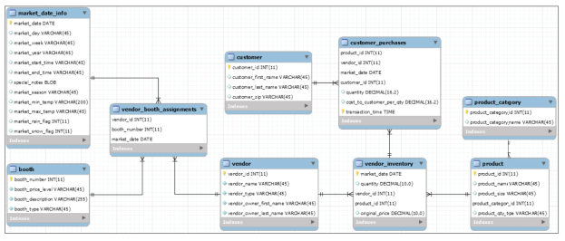

# Data Sources

- Two types of data: structured and unstructured.
    - Unstructured: text documents or images as individual files.
    - Structured: tabular format like spreadsheets or database tables.
    - Other types: CSV, JSON, XML, Graph databases, key-value stores.
- Microsoft Excel: create and maintain spreadsheets.
    - Analysis: pivot tables, data visualization.
    - Connect data between spreadsheets.
- Microsoft Access: relational database application.
    - Creates relational database model.
    - Defines rules for data table connections.
- RDBMS examples: Oracle, MySQL, MS SQL Server, PostgreSQL, Amazon Redshift, IBM DB2, MS Access, SQLite, Snowflake.
    - Syntax differs slightly.
    - SQL concepts are consistent.

# Tools for Connecting to Data Sources and Editing SQL

- First, connect to a database on a server.
    - Use a SQL Integrated Development Environment (IDE).
- This book uses MySQL Workbench Community Edition.
    - Examples query a MySQL database.
- You can also connect to a database from code.
    - Use Python or R.
    - Search for “R SQL Server” or “Python Redshift”.

# Relational Databases

- A database table is like a spreadsheet.
    - It has row identifiers and named column headers.
- An entity is an object or concept the table represents.
    - For example, in a table of Books, the entity is “Books”.
    - The table contains information like ISBN number, title, and author.
    - Some people use the terms entity and table interchangeably.
- A row is also called a record or tuple.
- A column header is also called a field or attribute.
- For example, in a table of Books:
    - The value in the Author field for the book "SQL for Data Scientists" is ‘Renée M. P. Teate’.

<figcaption></figcaption>

- A database is a collection of related tables.
    - A database schema stores information about the tables and their relationships.
- For example, in a doctor's office database:
    - One table has patient information like name, birthdate, and phone number.
    - Another table has appointment information like patient name, appointment time, and doctor name.
    - The connection between these tables could be the patient's name.
    - Usually, a unique identifier is used since two people can have the same name.

<figcaption></figcaption>

- The relationship between tables is called a one-to-many relationship.
    - Each patient appears once in the patient table but can appear many times in the appointment table.
    - These relationships are shown in an entity-relationship diagram (ERD).

<figcaption></figcaption>

- An infinity symbol, “N”, or “crow's feet” on a line between tables shows the “many” side of a one-to-many relationship.
- The primary key in a table uniquely identifies a row.
    - The primary key columns cannot all be NULL (empty).
    - NULL means no value. It is different from a blank space “ ”.
    - The primary key can be unique values like a Student ID or generated by the database.
    - The primary key identifies records in other tables. When referenced in another table, it is called a foreign key.
- For example, in a doctor's office database:
    - Each patient record in the Patients table has a unique primary key.
    - Each appointment record in the Appointments table also has a unique primary key.
    - The Appointments table uses the Patient ID to link each appointment to a patient.
    - The patient's name does not need to be stored in the Appointments table.

<figcaption></figcaption>

- Another type of relationship in RDBMSs is many-to-many.
    - It connects entities where records on each side can link to multiple records on the other side.
    - For example, books and authors have a many-to-many relationship.
        - Each author can write multiple books.
        - Each book can have multiple authors.
    - A junction or associative table is needed to capture the pairs of related rows.

<figcaption></figcaption>

- In Figure 1.5:
    - ISBN is the primary key in the Books table.
    - Author ID is the primary key in the Authors table.
    - Both are foreign keys in the Books-Authors Junction table.
    - Each pairing of ISBN and Author ID is unique.
    - The pair is a multi-column primary key in the Books-Authors Junction table.
    - This setup avoids multiple rows per book or multiple authors per book in the Books table.
    - It reduces redundant data and clarifies relationships.

- Database normalization means not storing redundant data.
    - In the book database, each author's name is stored once.
    - In the doctor's office database, a patient's phone number is stored once in the patient directory.
    - Normalization reduces storage space and simplifies updates.
    - Research “relational database design” for more information.

# Dimensional Data Warehouses

- Data warehouses store data from various sources.
    - They can be in a normalized relational database form or other designs.
    - Data can be raw or summarized.
    - Summarized data is processed and transformed.
    - This helps create analytical datasets for reports.
    - They can keep historical data logs, real-time updates, or data snapshots.
- Dimensional modeling is often used in data warehouses.
    - A common approach is the "star schema."
    - Data is divided into facts and dimensions.
    - Fact Table:
        - Contains records with metadata and measures.
        - Example: A purchase record with timestamp, store number, order number, customer number, and amount paid.
    - Dimension Table:
        - Contains properties to group or "slice and dice" fact records.
        - Example: Store dimension table with details about store like name.
    - By querying both tables, you can generate summaries.
        - Example: Total purchases by store.
- Transforming a doctor's office database into a star schema:
    - Create an Appointments Fact Table:
        - Records each appointment's details.
        - Includes patient, booking time, reason, doctor, and scheduled time.
    - Create a Date Dimension:
        - Stores properties of each appointment date.
        - Includes year, month, and day of the week.
    - Create a Time Dimension:
        - Stores properties of each appointment time.
        - Includes hour and minute.
    - This structure allows easy analysis.
        - Example: Count appointments per time period.
        - Example: Identify highest volume of appointment-booking calls.

<figcaption></figcaption>

- Figure 1.6 shows a dimensional data warehouse design.
    - It is called a star schema.
    - The design looks like a star.
- The data warehouse might include an appointment history log.
    - Tracks changes to appointments.
    - Example: Changes in scheduled time, doctor reassignment, and modification count.
    - Allows detailed analysis of appointment changes.
- Dimensional models store more information than normalized databases.
    - Redundancy: Appointment records may appear multiple times.
    - Date Dimension: Contains a record for every calendar date.
    - This approach increases data volume but simplifies querying.
- Key concepts for database design:
    - Table Grain: Level of detail in the table.
    - Table Relationships: How tables are related, such as through foreign keys.
- Querying a dimensional data warehouse using SQL:
    - Similar to querying a relational database.
    - Use SQL to join tables, filter data, and perform aggregations.

# Asking Questions About the Data Source

- Before writing SQL queries, gather information about the tables.
    - Understand the Data Source:
        - Identify the type (e.g., relational database, NoSQL, CSV).
    - Schema Design:
        - Learn the database structure and table organization.
    - Table Relationships:
        - Know relationships like one-to-many, many-to-many, one-to-one.
    - Table Details:
        - Column Names and Data Types: Know column names and data types.
        - Primary Keys: Identify unique identifiers for each table.
        - Foreign Keys: Identify keys that link tables.
        - Indexes: Check for indexes to improve performance.
    - Data Constraints:
        - Understand constraints like NOT NULL, UNIQUE, CHECK.
    - Sample Data:
        - Review sample data to understand actual values.
- Communicate with subject matter experts (SMEs) during data exploration and query development.
    - SMEs include DBAs, ETL engineers, and data generators.
    - They provide insights on database design, data collection, and updates.
    - They inform about data frequency and types.
- If values don't make sense:
    - Consult a data dictionary if available.
    - Ask SMEs for clarification.
    - SMEs can direct you to existing documentation for answers.
- Example questions to ask SMEs when learning about the data source:
1. Which tables should I look in first for relevant data? Is there an entity-relationship diagram (ERD) I can reference?
    - Helps identify the starting point for data exploration.
    - ERD provides a visual representation of tables and relationships.

2. What fields make up the primary key for this table? What is the grain of this fact table?
    - Primary key uniquely identifies each record.
    - Grain refers to the level of detail in the fact table.

3. Are these records imported directly from the source system, or have they been transformed or merged before being stored in this table?
    - Understand the origin and processing of the data.
    - Raw data might need input from data entry personnel.
    - Transformed data requires consulting ETL engineers.

4. Is this a static snapshot table, or does it update regularly? What is the update frequency? Are older records kept or overwritten?
    - Understand the update frequency and behavior of the table.
    - Static Snapshot: Contains data at a specific point in time.
    - Regular Updates: Reflects ongoing changes.
    - Knowing if older records are kept or overwritten helps with historical context.
- Live Data:
    - Continuously changing data.
    - Consider making a copy to work with stable data.
- Nightly Updates:
    - Updated once every night.
    - Know the update time to schedule dependent tasks.
- Historical Data:
    - Maintains old records as a log.
    - Use expiration date to filter outdated records for current analysis.
    - Keep past records for historical trend analysis.

5. Is this data collected automatically or entered by people? Do we have documentation on the data entry form field labels?
    - Automatically Collected Data:
        - More consistent and less prone to human error.
    - Manually Entered Data:
        - Prone to errors but provides insights into business processes.
        - Data entry personnel can explain value selections and updates.

- Distribution of Values:
    - Check Value Distribution:
        - Understand range, frequency, and statistical distribution of values.
    - Exploratory Data Analysis (EDA):
        - Visualize data with histograms to identify patterns and anomalies.
- Time Period Analysis:
    - Analyze data by time periods to identify changes over time.
    - SMEs can provide context for changes in data distribution.
- Data Entry Forms:
    - Knowing form labels helps communicate with SMEs.
    - SMEs can describe data using front-end labels.
- Knowing the type of database is crucial:
    - Efficient query writing and connection setup depend on database type.
    - Limiting rows can speed up queries in some databases.
    - Columnar databases like Redshift may have different performance characteristics.
    - Correct SQL syntax varies between databases; refer to official documentation.

# Introduction to the Farmer's Market Database

- Overview of the Database:
    - Tracks entities and activities at a fictional farmer's market.
    - Demonstrates SQL queries and database concepts.
- Database Contents:
    - Market Days: Records date, hours, day of the week, and weather.
    - Vendors: Contains vendor data, booth assignments, products, and prices.
    - Transactions:
        - Vendors use networked cash registers.
        - Customers use loyalty cards.
        - Logs detailed purchases, tracking who bought what and when.
- Business Questions Addressed:
    - How many people visit the market each week?
    - When do sales peak?
    - How does weather impact attendance?
    - When are different fruits or vegetables in season?
    - Will a new vendor affect existing vendors?
- Predictive Modeling:
    - Prepare datasets for classification and time-series forecasting.
    - Predict shopper numbers for next month or year.
    - Determine if a customer will return based on purchase history.
- Figure 1.7 shows the ERD for the Farmer's Market database.
    - Learn to write SQL statements to pull data.
    - Realistic examples of queries for data analysts and scientists.

<figcaption></figcaption>

# A Note on Machine Learning Dataset Terminology

- Terminology differences between database developers and data scientists:
    - Database Developer Terminology:
        - Rows: Also known as records.
        - Columns: Referred to as attributes or fields.
    - Data Scientist Terminology (in machine learning):
        - Rows: Called training examples, instances, or data points.
        - Columns: Known as features or input variables.
        - Target Variable: The column the model predicts, also called the output variable.

- Understanding these terms helps convert database rows and columns into training examples with features for predictive models.
    - Bridges the gap between data storage and data analysis.
    - Enables use of database information in machine learning workflows.

# Exercises

1. What do you think will happen in the described Books and Authors database depicted in Figure 1.5 if an author changes their name? Which records might be added or updated, and what might be the effect on the results of future queries based on this data?

2. Think of something in your life to track using a database.
    - One-to-Many Relationships: 
        - Example: One person can have many email addresses.
    - Many-to-Many Relationships:
        - Example: Students and courses. One student can enroll in many courses, and one course can have many students.