# The SELECT statement

- The SELECT statement is a basic SQL command to get data from a database. It allows you to:
    - View data from specific columns.
    - Combine data from multiple tables.
    - Filter results based on conditions.
    - Perform calculations on the data.
- SELECT is often capitalized in SQL code:
    - It is a reserved keyword.
    - Capitalizing helps distinguish it from other text, like field names.

# The Fundamental Syntax Structure of a SELECT Query

- An SQL SELECT query has a basic structure to specify and manipulate data. Here's the general syntax:

```sql
SELECT [columns to return]
FROM [schema.table]
WHERE [conditional filter statements]
GROUP BY [columns to group on]
HAVING [conditional filter statements that are run after grouping]
ORDER BY [columns to sort on]
```

  - SELECT: Specifies the columns to retrieve. Required.
  - FROM: Indicates the table (and optionally the schema). Required.
  - WHERE: Filters rows before grouping or selecting.
  - GROUP BY: Groups rows with the same values in specified columns.
  - HAVING: Filters groups based on conditions after grouping.
  - ORDER BY: Sorts the resulting data by one or more columns.
- The clauses in brackets are placeholders for actual columns, tables, and conditions. Only SELECT and FROM are mandatory, but other clauses help refine and organize query results.

# Selecting Columns and Limiting the Number of Rows Returned

- Basic Syntax: The simplest form of a SELECT statement is:

```sql
SELECT * FROM [schema.table]
```

- This query retrieves all columns from the specified table in the schema. `FROM schema.table` specifies the schema and table name.
- Example: 
```sql
SELECT * FROM farmers_market.product
```

- This query selects all columns and rows from the `product` table in the `farmers_market` schema.
- Without a WHERE clause, the query returns all rows in the table.
- Introducing the LIMIT Clause:
    - LIMIT restricts the number of rows returned.
    - Useful for previewing a subset of large datasets without processing the entire table.
- Example of using LIMIT:

```sql
SELECT *
FROM farmers_market.product
LIMIT 5
```

- This query retrieves all columns but only the first five rows from the `product` table.

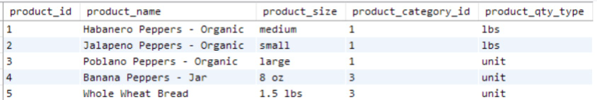
<figcaption></figcaption>

- Different database systems use different syntax to limit results:
    - MySQL: Use the LIMIT clause at the end of the query.

```sql
SELECT * FROM table_name
LIMIT number_of_rows
```

    - MS SQL Server: Use the TOP keyword before the SELECT statement.

```sql
SELECT TOP number_of_rows * FROM table_name
```

    - Oracle: Use `ROWNUM <= number` in the WHERE clause.

```sql
SELECT * FROM table_name
WHERE ROWNUM <= number_of_rows
```
- Use line breaks and indentation in SQL queries for readability; it does not affect execution.
- To specify columns to retrieve, list column names after SELECT, separated by commas, instead of using * to select all columns.
- Example:

```sql
SELECT product_id, product_name
FROM farmers_market.product
LIMIT 5
```

- This query selects the `product_id` and `product_name` columns from the `product` table and limits the output to the first five rows.


<figcaption></figcaption>

- List column names explicitly instead of using * for stability and consistency:
    - Schema Changes: Using `SELECT *` can lead to unexpected results if the table structure changes.
    - Consistent Output: Explicitly listing columns ensures consistent output even if the schema changes.
- Preventing Breakages:
    - Automated Processes: Unexpected changes in output can cause failures in automated data pipelines.
    - Error Detection: Explicitly listing columns will cause the query to fail if a column is removed or renamed, alerting you to the change.
- The following query retrieves the first five rows of market date, vendor ID, and booth number from the `vendor_booth_assignments` table:

```sql
SELECT market_date, vendor_id, booth_number 
FROM farmers_market.vendor_booth_assignments 
LIMIT 5
```

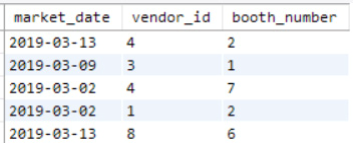
<figcaption></figcaption>

- We can sort this output by market date to make it more meaningful.

# The ORDER BY Clause: Sorting Results

- The ORDER BY clause sorts output rows based on one or more columns.
    - Specify sort order: ASC (ascending) or DESC (descending).
    - ASC: Sorts text alphabetically and numbers from low to high.
    - DESC: Sorts in reverse order.
    - In MySQL, NULL values appear first in ascending order.
    - Default sort order is ascending.

- The following query sorts the results by product name:

```sql
SELECT product_id, product_name 
FROM farmers_market.product 
ORDER BY product_name
LIMIT 5
```

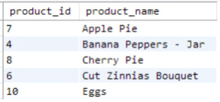
<figcaption></figcaption>

- The following query sorts the results by product ID in descending order:

```sql
SELECT product_id, product_name 
FROM farmers_market.product 
ORDER BY product_id DESC
LIMIT 5
```

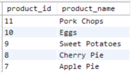
<figcaption></figcaption>

- The rows in Figure 2.5 are different from the previous query because the ORDER BY clause is executed before the LIMIT clause.
- We can first sort the output by market date and then by vendor ID.

```sql
SELECT market_date, vendor_id, booth_number
FROM farmers_market.vendor_booth_assignments
ORDER BY market_date, vendor_id
LIMIT 5
```

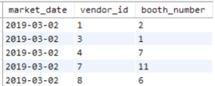
<figcaption></figcaption>

# Introduction to Simple Inline Calculations

- This section shows examples of calculations on columns.
    - Demonstrates how to incorporate calculations into SELECT queries.
- Example: Calculate the total price of a purchase.
    - Multiply the quantity and cost per quantity columns in the `customer_purchases` table.
- The raw data in the selected columns of the `customer_purchases` table is shown in Figure 2.7.

```sql
SELECT
    market_date,
    customer_id,
    vendor_id,
    quantity,
    cost_to_customer_per_qty
FROM farmers_market.customer_purchases
LIMIT 10
```


<figcaption></figcaption>

- The following query demonstrates how to multiply the values in two columns to calculate the price:

```sql
SELECT
    market_date,
    customer_id,
    vendor_id,
    quantity,
    cost_to_customer_per_qty,
    quantity * cost_to_customer_per_qty
FROM farmers_market.customer_purchases
LIMIT 10
```

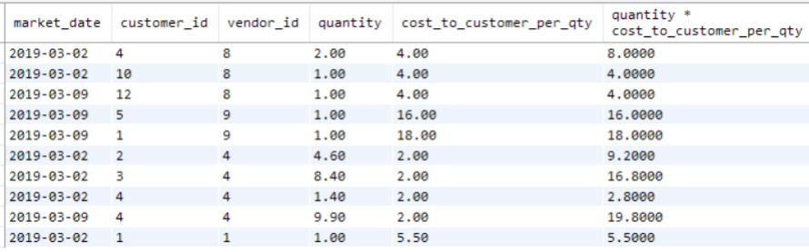
<figcaption></figcaption>

- To give the calculated column a meaningful name, use the AS keyword to create an alias.
    - Example: Assign the alias `price` to the result of the calculation.

```sql
SELECT
    market_date,
    customer_id,
    vendor_id,
    quantity * cost_to_customer_per_qty AS price
FROM farmers_market.customer_purchases
LIMIT 10
```

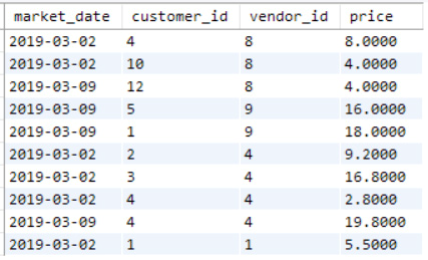
<figcaption></figcaption>

- The AS keyword is optional in MySQL, so this query will return the same result:

```sql
SELECT
    market_date,
    customer_id,
    vendor_id,
    quantity * cost_to_customer_per_qty price
FROM farmers_market.customer_purchases
LIMIT 10
```

- Next, calculate how much a customer paid for all products purchased from each vendor on a specific day.
    - Add up the prices for each customer, vendor, and market date.
- Aggregating Data:
    - Aggregate calculations summarize data across multiple rows.
    - Examples: `SUM`, `AVG`, `COUNT` functions.
    - These techniques are covered in Chapter 6.
- So far, calculations are applied to each row individually.
    - Example: Calculate the price for each purchase by multiplying quantity by cost per unit.
    - These calculations do not summarize or combine data across multiple rows.

# More Inline Calculation Examples: Rounding

- A SQL function is code that takes inputs (parameters), performs an operation, and returns a value.
- Use functions in your query to modify raw values from database tables before displaying them.
- The syntax for calling a SQL function is:
    - Input parameters can be a field (column) name or a constant value.
    - Refer to function documentation for correct parameters at https://dev.mysql.com/doc for MySQL.

- Example: The ROUND function rounds values in the `price` column to two decimal places.

```sql
SELECT
    market_date,
    customer_id,
    vendor_id,
    ROUND(quantity * cost_to_customer_per_qty, 2) AS price
FROM farmers_market.customer_purchases
LIMIT 10
```

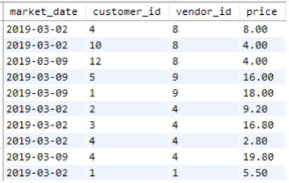
<figcaption></figcaption>

- The ROUND function can accept negative values for the second parameter to round to the left of the decimal point.
    - Example: `ROUND(1245, -2)` returns 1200.

# More Inline Calculation Examples: Concatenating Strings

- SQL functions can also manipulate text data.
- The CONCAT function concatenates strings together.
- In the customer table, the first name and last name are stored in separate columns.

```sql
SELECT *
FROM farmers_market.customer
LIMIT 5
```


<figcaption></figcaption>

- We use the CONCAT function to combine the first name, a space, and the last name into a single column called `customer_name`.

```sql
SELECT
    customer_id,
    CONCAT(customer_first_name, " ", customer_last_name) AS customer_name
FROM farmers_market.customer
LIMIT 5
```


<figcaption></figcaption>

- We can sort the last name first by an ORDER BY clause, and then concatenate the first name and last name.

```sql
SELECT
    customer_id,
    CONCAT(customer_first_name, " ", customer_last_name) AS customer_name
FROM farmers_market.customer
ORDER BY customer_last_name, customer_first_name
LIMIT 5
```


<figcaption></figcaption>

- You can nest functions within each other.
    - Example: Use the UPPER function to convert the concatenated name to uppercase.
    - Change the representation to last name, a comma, a space, and the first name, all in uppercase.

```sql
SELECT
    customer_id,
    UPPER(CONCAT(customer_last_name, ", ", customer_first_name)) AS customer_name
FROM farmers_market.customer
ORDER BY customer_last_name, customer_first_name
LIMIT 5
```


<figcaption></figcaption>

- Notes:
    - Sorting on Existing Columns: Sorting is done on `customer_last_name` and `customer_first_name` columns, not on the derived `customer_name` column.
    - Limitations of Aliases: You might not be able to reuse aliases in other parts of the query, depending on the database system and functions used.
    - Using Functions in ORDER BY: You can use functions or calculations directly in the ORDER BY clause. Example: `ORDER BY UPPER(customer_last_name)` to sort uppercased last names alphabetically.

# Evaluating Query Output

- When developing a SQL SELECT statement, follow these steps to ensure the results include the expected rows and columns in the desired format:
    - Run the query with a LIMIT clause to preview the first few rows.
        - Verify that changes are reflected in the output.
        - Inspect column names and a few output values to ensure they look as intended.
    - Verify Total Rows:
        - Run the query without the LIMIT clause or use a COUNT function to confirm the total number of rows.
- Use the Query Editor to review the results of your query.
    - Provides a quick sanity check but is not a substitute for full quality control.
    - To review the full dataset, remove the LIMIT clause from your query.
    - In MySQL Workbench, use the "Don't Limit" option under the Query menu to disable the row limit.


<figcaption></figcaption>

- Then we run the query to generate the full output.

```sql
SELECT 
     market_date, 
     customer_id, 
     vendor_id, 
     ROUND(quantity * cost_to_customer_per_qty, 2) AS price 
FROM farmers_market.customer_purchases
```

- Firstly, check the total count of rows returned to ensure it matches expectations.
    - Displayed at the bottom of the result window or in the output window.
    - Example: 21 rows in the customer_purchases table.
    - In MySQL Workbench, indicated in the Message of the Output section in the lower right.


<figcaption></figcaption>

- Next, review the resulting dataset, called "Result Grid" in MySQL Workbench.
    - Check the column headers.
    - Scroll through the rows to spot-check a few values.
    - Verify sorting if using ORDER BY.
- Use the editor to manually sort each column.
    - Example: Sort by the `market_date` column in ascending order.

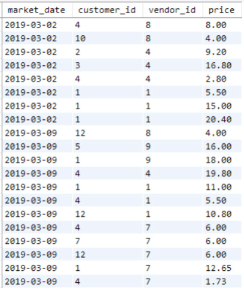
<figcaption></figcaption>

- We can also sort by the `vendor_id` column.
- This helps to check the minimum and maximum values in each column.
    - Often where errors are found, such as unexpected negative values or NULLs.
    - Look for strings that start with numbers or spaces, or other anomalies.

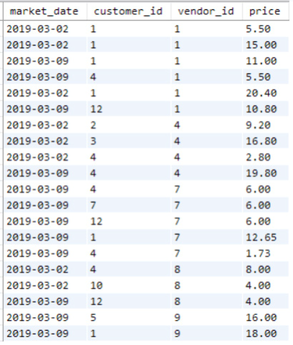
<figcaption></figcaption>

# SELECT Statement Summary

- All SQL queries start with the SELECT statement, even the most complex ones.

```sql
SELECT [columns to return]
FROM [schema.table]
ORDER BY [columns to sort on]
```

- We should be able to describe what the two queries below do:

```sql
SELECT * FROM farmers_market.vendor

SELECT 
     vendor_name,
     vendor_id,
     vendor_type
FROM farmers_market.vendor 
ORDER BY vendor_name
```

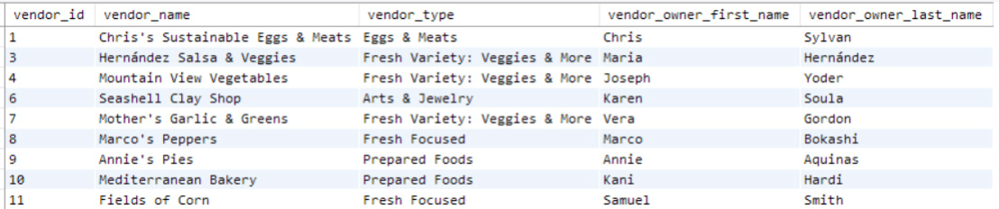
<figcaption></figcaption>


<figcaption></figcaption>

# Exercises Using the Included Database

- The following exercises refer to the customer table.
- The columns in the customer table and some example rows with data values are shown in Figure 2.11.

1. Write a query that retrieves all columns from the customer table.
2. Write a query that displays all of the columns and 10 rows from the customer table, sorted by the customer's last name, then first name.
3. Write a query that lists all customer IDs and first names in the customer table, sorted by first name.