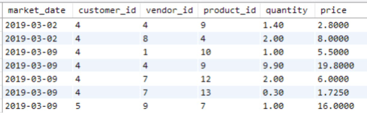
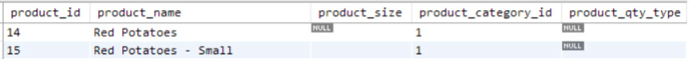
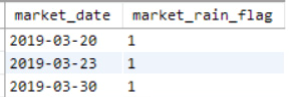

# The WHERE Clause
- The WHERE clause in a SELECT statement lists conditions to filter rows in the results set. It uses boolean logic (like "AND" or "OR") to check data against conditions and determine which rows to include. Similar to "IF" statements in other languages, it filters data based on whether conditions are met.

# Filtering SELECT Statement Results
- The WHERE clause follows the FROM statement and precedes any GROUP BY, ORDER BY, or LIMIT statements in a SELECT query:
```sql
SELECT [columns to return]
FROM [table]
WHERE [conditional filter statements]
ORDER BY [columns to sort on]
LIMIT [number of rows to return]
```
- For example, to get a list of product IDs and product names in product category 1, use a conditional statement in the WHERE clause to select only rows where the product_category_id is 1, as shown in the following query and the output in Figure 3.1:
```sql
SELECT
    product_id,
    product_name,
    product_category_id
FROM farmers_market.product
WHERE product_category_id = 1
LIMIT 5
```


<figcaption></figcaption>

- In Chapter 2, "The SELECT Statement," we returned a list of prices for items purchased by customers at the farmer's market, displaying the market date, customer ID, vendor ID, and calculated price. To print a report of everything a particular customer has ever purchased at the farmer's market, sorted by market date, vendor ID, and product ID, we can use a WHERE clause to filter the results to a specific customer ID and an ORDER BY clause to customize the sort order.
```sql
SELECT
    market_date,
    customer_id,
    vendor_id,
    product_id,
    quantity,
    quantity * cost_to_customer_per_qty AS price
FROM farmers_market.customer_purchases
WHERE customer_id = 4
ORDER BY market_date, vendor_id, product_id
LIMIT 5
```


<figcaption></figcaption>

- Behind the scenes, each conditional statement in the WHERE clause evaluates to TRUE or FALSE for each row, and only rows where the combination of conditions evaluates to TRUE are returned. For example, if a database table contains transactional data (as shown in Table 3.1) and the WHERE clause condition is "customer_id = 4," the condition will evaluate to TRUE only for rows where the customer_id is exactly 4, and the results will be filtered to include only those rows.


<figcaption></figcaption>

- The customer_id values in the database table are integers, not strings. If the customer_id values were strings, the comparison value in the WHERE clause would need to be a string as well, meaning the '4' would need to be enclosed in single quotes.

# Filtering on Multiple Conditions
- You can combine multiple conditions with boolean operators such as "AND," "OR," or "AND NOT" in the WHERE clause to filter using multiple criteria.


<figcaption></figcaption>

- If the WHERE clause lists two conditions with OR between them, like "WHERE customer_id = 3 OR customer_id = 4" as shown in Table 3.3 (some columns have been removed for readability).


<figcaption></figcaption>

- With OR between conditions, only one condition needs to be TRUE for a row to be returned. If there is a long list of OR conditions, only one condition needs to be TRUE for the row to be returned. If all conditions evaluate to FALSE, the row is not returned.
- The query for filtering customer id 4 or 3 would be:
```sql
SELECT
    market_date,
    customer_id,
    vendor_id,
    product_id,
    quantity,
    quantity * cost_to_customer_per_qty AS price
FROM farmers_market.customer_purchases
WHERE customer_id = 3 OR customer_id = 4
ORDER BY market_date, customer_id, vendor_id, product_id
```


<figcaption></figcaption>

- What would happen if the WHERE clause condition were “customer_id = 3 
AND customer_id = 4”? A query with "WHERE customer_id = 3 AND customer_id = 4" means "Return each row where the customer ID is 3 and the customer ID is 4." Since a single customer_id value per row cannot be both 3 and 4, no rows are returned. Some people mistakenly read the AND operator as "Give me all rows with customer IDs 3 and 4," but this sentence should be "Give me all rows where the customer ID is either 3 or 4," which requires an OR operator in SQL.
- When the AND operator is used, all conditions with AND between them must evaluate to TRUE for a row to be returned. For example, to return rows with a range of values, you could use "WHERE customer_id > 3 AND customer_id <= 5." Both conditions must evaluate to TRUE for a row to be returned.
```sql
SELECT
    market_date,
    customer_id,
    vendor_id,
    product_id,
    quantity,
    quantity * cost_to_customer_per_qty AS price
FROM farmers_market.customer_purchases
WHERE customer_id > 3 AND customer_id <= 5
ORDER BY market_date, customer_id, vendor_id, product_id
```


<figcaption></figcaption>

- You can combine multiple AND, OR, and NOT conditions and control their evaluation order by using parentheses, similar to specifying the order of operations in algebra. The conditions inside the parentheses are evaluated first.
```sql
SELECT 
    product_id,
    product_name
FROM farmers_market.product
WHERE
    product_id = 10
    OR (product_id > 3 
    AND product_id < 8)
```


<figcaption></figcaption>

```sql
SELECT 
    product_id,
    product_name
FROM farmers_market.product
WHERE
    (product_id = 10
    OR product_id > 3) 
    AND product_id < 8
```


<figcaption></figcaption>

- When the product ID is 10, the WHERE clause in the first query is evaluated as: TRUE OR (TRUE AND FALSE) = TRUE OR FALSE = TRUE
- The WHERE clause in the second query is evaluated as: (TRUE OR TRUE) AND FALSE = TRUE AND FALSE = FALSE
- As the result, the row with a product_id value of 10 is only returned by the first query.

# Multi-Column Conditional Filtering
- So far, the examples have shown conditions referencing one field at a time. WHERE clauses can also use values from multiple columns. For example, to find purchases made by customer 4 at vendor 7, use the following query:
```sql
SELECT
    market_date,
    customer_id,
    vendor_id,
    quantity * cost_to_customer_per_qty AS price
FROM farmers_market.customer_purchases
WHERE customer_id = 4 AND vendor_id = 7
```


<figcaption></figcaption>

- Let's try a WHERE clause with an OR condition across multiple fields. This query returns customers with the first name "Carlos" or the last name "Diaz," as shown in the following Figure:
```sql
SELECT 
    customer_id, 
    customer_first_name, 
    customer_last_name
FROM farmers_market.customer 
WHERE
    customer_first_name = 'Carlos' 
    OR customer_last_name = 'Diaz'
```


<figcaption></figcaption>

- The conditions don't have to be "exact match" filters using equals signs. For example, to find out which booth(s) vendor 2 was assigned to on or before March 9, 2019, you could use this query:
```sql
SELECT *
FROM farmers_market.vendor_booth_assignments 
WHERE
    vendor_id = 9
    AND market_date <= '2019-03-09'
ORDER BY market_date
```


<figcaption></figcaption>

# More Ways to Filter
- Filters in this chapter include numeric, string, and date comparisons to check if a field value is greater than, less than, or equal to a given value. Other ways to filter rows include checking if a field is NULL, using wildcard comparisons, checking if a field value is in a list, and checking if a field value is between two values.

## BETWEEN
- In the previous query, we checked if a date was less than or equal to another date. We can also use the BETWEEN keyword to see if a value, such as a date, is within a specified range. This query finds booth assignments for vendor 7 for any market date between March 2, 2019, and March 16, 2019, inclusive.
```sql
SELECT * 
FROM farmers_market.vendor_booth_assignments 
WHERE
    vendor_id = 7
    AND market_date BETWEEN '2019-03-02' and '2019-03-16' 
ORDER BY market_date
```


<figcaption></figcaption>

## IN
- To return a list of customers with selected last names, we could use a long list of OR comparisons, as shown in the first query. Alternatively, we can use the IN keyword with a comma-separated list of values. This returns TRUE for any row with a customer_last_name in the list. Both queries return the same results.
- The first query:
```sql
SELECT 
    customer_id, 
    customer_first_name, 
    customer_last_name
FROM farmers_market.customer 
WHERE
    customer_last_name = 'Diaz'
    OR customer_last_name = 'Edwards' 
    OR customer_last_name = 'Wilson'
ORDER BY customer_last_name, customer_first_name
```
- The second query:
```sql
SELECT 
    customer_id, 
    customer_first_name, 
    customer_last_name
FROM farmers_market.customer 
WHERE
    customer_last_name IN ('Diaz' , 'Edwards', 'Wilson') 
ORDER BY customer_last_name, customer_first_name
```


<figcaption></figcaption>

- Another use of the IN list comparison is when searching for a person but unsure of the spelling. For example, if you need to look up a customer first name but don't know the exact spelling, you can search against a list with multiple spellings, like this:
```sql
SELECT 
    customer_id, 
    customer_first_name, 
    customer_last_name
FROM farmers_market.customer 
WHERE
    customer_first_name IN ('Renee', 'Rene', 'Renée', 'René', 'Renne')
```

## LIKE
- If you know a customer's name starts with "Jer" but aren't sure if it's "Jerry," "Jeremy," or "Jeremiah," you can use the LIKE operator with wildcard characters to search for partially matched strings. In MS SQL Server, the % wildcard represents any number of characters (including none). So, LIKE 'Jer%' will search for strings that start with "Jer" and have any (or no) characters after "r":
```sql
SELECT 
    customer_id, 
    customer_first_name, 
    customer_last_name
FROM farmers_market.customer 
WHERE
    customer_first_name LIKE 'Jer%'
```


<figcaption></figcaption>

## IS NULL
- It's often useful to find rows where a field is blank or NULL. In the product table, the ``product_size`` field is not required, so it's possible to have products with no size. To find all products without sizes, you can use the IS NULL condition to filter those rows.
```sql
SELECT * 
FROM farmers_market.product 
WHERE product_size IS NULL
```


<figcaption></figcaption>

- Keep in mind that "blank" and NULL are not the same in database terms. To find all products without sizes, you might also want to check for blank strings (''), or rows where someone entered spaces into that field.
- The TRIM() function removes spaces from the beginning or end of a string value. By using a combination of the TRIM() function and a blank string comparison, you can find any row that is blank or contains only spaces. For example, the "Red Potatoes - Small" row, shown in the following Figure, has a product_size with one space in it (' '), and can be found using the following query:
```sql
SELECT * 
FROM farmers_market.product 
WHERE 
    product_size IS NULL 
    OR TRIM(product_size) = ''
```


<figcaption></figcaption>

# A Warning About Null Comparisons
- The comparison operator IS NULL is used instead of equals NULL because NULL is not a value but the absence of a value. If your query used WHERE product_size = NULL, no rows would be returned, even if there is a record with a NULL product_size, because nothing "equals" NULL, not even NULL.
- This is important for other types of comparisons as well. Look at the following two queries:
```sql
SELECT 
    market_date,
    transaction_time, 
    customer_id, 
    vendor_id, 
    quantity
FROM farmers_market.customer_purchases 
WHERE 
    customer_id = 1 
    AND vendor_id = 7 
    AND quantity > 1
```


<figcaption></figcaption>

```sql
SELECT 
    market_date,
    transaction_time, 
    customer_id, 
    vendor_id, 
    quantity
FROM farmers_market.customer_purchases 
WHERE 
    customer_id = 1 
    AND vendor_id = 7 
    AND quantity <= 1
```


<figcaption></figcaption>

- You might think that running both queries would return all records, since one looks for quantities over 1 and the other for quantities less than or equal to 1. However, NULL values aren't comparable to numbers, so a record with a NULL quantity is never returned. You can see this if you run the following query:
```sql
SELECT 
    market_date,
    transaction_time, 
    customer_id, 
    vendor_id, 
    quantity
FROM farmers_market.customer_purchases 
WHERE 
    customer_id = 1 
    AND vendor_id = 7
```


<figcaption></figcaption>

- Ideally, the database should prevent the quantity value from being NULL, but since it wasn't, a NULL value was entered.
- To return all records that don't have NULL values in a field, use the condition "[field name] IS NOT NULL" in the WHERE clause.

# Filtering Using Subqueries
- The IN list comparison used a hard-coded list of values earlier. What if you wanted to filter to a list of values returned by another query? You can do this in SQL using a subquery (a query inside a query).
- To analyze purchases made on rainy days, use the market_rain_flag in the market_date_info table, which is 0 if it didn't rain and 1 if it did. First, get a list of market dates when it rained with this query:
```sql
SELECT market_date, market_rain_flag 
FROM farmers_market.market_date_info 
WHERE market_rain_flag = 1
```


<figcaption></figcaption>

- Now let's use the list of dates generated by that query to return purchases made on those dates. When using a query in an IN comparison, you can only return the field you're comparing to, so we will not include the market_rain_flag field in the subquery. The query inside the parentheses just returns the dates shown in the previous Figure, and the outer query looks for customer_purchases records with a market_date value in that list of dates. The results in the following Figure show that all purchase records returned occurred on rainy days.
```sql
SELECT 
    market_date, 
    customer_id, 
    vendor_id, 
    quantity * cost_to_customer_per_qty price 
FROM farmers_market.customer_purchases
WHERE 
    market_date IN
        (
        SELECT market_date
        FROM farmers_market.market_date_info 
        WHERE market_rain_flag = 1
        )
LIMIT 5
```


<figcaption></figcaption>

- Creating results that depend on data in more than one table can also be accomplished using a JOIN, which you will learn about in Chapter 5, "SQL JOINs."

# Exercises
1. Refer to the data in Table 3.1. Write a query that returns all customer purchases of product IDs 4 and 9.
2. Refer to the data in Table 3.1. Write two queries: one using two conditions with an AND operator, and one using the BETWEEN operator, to return all customer purchases made from vendors with vendor IDs between 8 and 10 (inclusive).
3. Can you think of two different ways to change the final query in the chapter so it would return purchases from days when it wasn’t raining?