# The WHERE Clause

- The WHERE clause in a SELECT statement lists conditions to filter rows in the result set.
- It uses boolean logic like "AND" or "OR" to check data against conditions.
- It determines which rows to include.
- Similar to "IF" statements in other languages, it filters data based on conditions.

# Filtering SELECT Statement Results

- The WHERE clause follows the FROM statement.
- It precedes any GROUP BY, ORDER BY, or LIMIT statements in a SELECT query.

```sql
SELECT [columns to return]
FROM [table]
WHERE [conditional filter statements]
ORDER BY [columns to sort on]
LIMIT [number of rows to return]
```

- For example, to get a list of product IDs and product names in product category 1:
  - Use a conditional statement in the WHERE clause.
  - Select only rows where the product_category_id is 1.

```sql
SELECT
    product_id,
    product_name,
    product_category_id
FROM farmers_market.product
WHERE product_category_id = 1
LIMIT 5
```

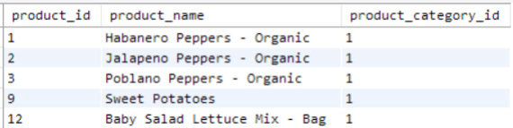
<figcaption></figcaption>

- In Chapter 2, "The SELECT Statement," we returned a list of prices for items purchased by customers at the farmer's market.
- We displayed the market date, customer ID, vendor ID, and calculated price.
- To print a report of everything a particular customer has ever purchased at the farmer's market:
  - Use a WHERE clause to filter the results to a specific customer ID.
  - Use an ORDER BY clause to sort by market date, vendor ID, and product ID.

```sql
SELECT
    market_date,
    customer_id,
    vendor_id,
    product_id,
    quantity,
    quantity * cost_to_customer_per_qty AS price
FROM farmers_market.customer_purchases
WHERE customer_id = 4
ORDER BY market_date, vendor_id, product_id
LIMIT 5
```

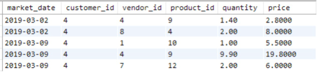
<figcaption></figcaption>

- Each condition in the WHERE clause evaluates to TRUE or FALSE for each row.
- Only rows where the conditions are TRUE are returned.
- For example, if a table has transactional data (see Table 3.1):
  - The condition "customer_id = 4" will be TRUE only for rows where customer_id is 4.
  - The results will include only those rows.


<figcaption></figcaption>

- The customer_id values in the table are integers, not strings.
- If customer_id values were strings, the comparison value need to be a string, meaning '4'.

# Filtering on Multiple Conditions

- You can combine multiple conditions with boolean operators in the WHERE clause.
- Use "AND," "OR," or "AND NOT" to filter with multiple criteria.


<figcaption></figcaption>

- If the WHERE clause lists two conditions with OR between them:
  - Example: "WHERE customer_id = 3 OR customer_id = 4" (see Table 3.3).
  - Only one condition needs to be TRUE for a row to be returned.


<figcaption></figcaption>

- With OR between conditions:
  - Only one condition needs to be TRUE for the row to be returned.
  - If all conditions are FALSE, the row is not returned.

- The query for filtering customer id 4 or 3 would be:

```sql
SELECT
    market_date,
    customer_id,
    vendor_id,
    product_id,
    quantity,
    quantity * cost_to_customer_per_qty AS price
FROM farmers_market.customer_purchases
WHERE customer_id = 3 OR customer_id = 4
ORDER BY market_date, customer_id, vendor_id, product_id
```

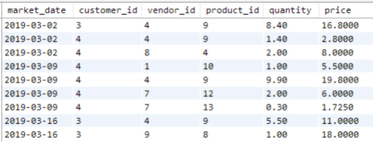
<figcaption></figcaption>

- What happens if the WHERE clause condition is "customer_id = 3 AND customer_id = 4"?
  - This means "Return each row where the customer ID is 3 and 4."
  - Since a single customer_id cannot be both 3 and 4, no rows are returned.
  - Some people mistakenly read AND as "Give me all rows with customer IDs 3 and 4."
  - The correct sentence is "Give me all rows where the customer ID is either 3 or 4," which requires OR.

- When using the AND operator:
  - All conditions with AND must be TRUE for a row to be returned.
  - Example: "WHERE customer_id > 3 AND customer_id <= 5."
  - Both conditions must be TRUE for a row to be returned.

```sql
SELECT
    market_date,
    customer_id,
    vendor_id,
    product_id,
    quantity,
    quantity * cost_to_customer_per_qty AS price
FROM farmers_market.customer_purchases
WHERE customer_id > 3 AND customer_id <= 5
ORDER BY market_date, customer_id, vendor_id, product_id
```

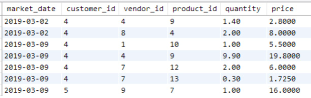
<figcaption></figcaption>

- You can combine multiple AND, OR, and NOT conditions.
- Use parentheses to control their evaluation order.
- Conditions inside parentheses are evaluated first.

```sql
SELECT 
    product_id,
    product_name
FROM farmers_market.product
WHERE
    product_id = 10
    OR (product_id > 3 
    AND product_id < 8)
```

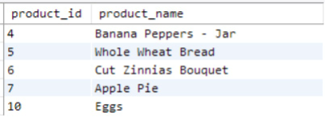
<figcaption></figcaption>

```sql
SELECT 
    product_id,
    product_name
FROM farmers_market.product
WHERE
    (product_id = 10
    OR product_id > 3) 
    AND product_id < 8
```

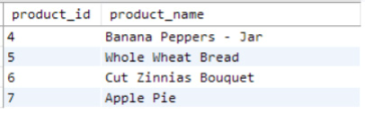
<figcaption></figcaption>

- When product ID is 10:
  - The WHERE clause in the first query is evaluated as: TRUE OR (TRUE AND FALSE) = TRUE OR FALSE = TRUE.
  - The WHERE clause in the second query is evaluated as: (TRUE OR TRUE) AND FALSE = TRUE AND FALSE = FALSE.
- As a result:
  - The row with product_id 10 is only returned by the first query.

# Multi-Column Conditional Filtering

- So far, the examples have shown conditions referencing one field at a time.
- WHERE clauses can also use values from multiple columns.
- For example, to find purchases made by customer 4 at vendor 7, use this query.

```sql
SELECT
    market_date,
    customer_id,
    vendor_id,
    quantity * cost_to_customer_per_qty AS price
FROM farmers_market.customer_purchases
WHERE customer_id = 4 AND vendor_id = 7
```

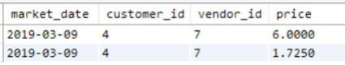
<figcaption></figcaption>

- Let's try a WHERE clause with an OR condition across multiple fields.
- This query returns customers with the first name "Carlos" or the last name "Diaz".

```sql
SELECT 
    customer_id, 
    customer_first_name, 
    customer_last_name
FROM farmers_market.customer 
WHERE
    customer_first_name = 'Carlos' 
    OR customer_last_name = 'Diaz'
```

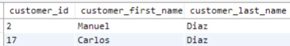
<figcaption></figcaption>

- The conditions don't have to be "exact match" filters using equals signs.
- For example, to find which booth(s) vendor 9 was assigned to on or before March 9, 2019, use this query.


```sql
SELECT *
FROM farmers_market.vendor_booth_assignments 
WHERE
    vendor_id = 9
    AND market_date <= '2019-03-09'
ORDER BY market_date
```

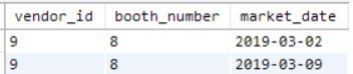
<figcaption></figcaption>

# More Ways to Filter

- Filters in this chapter include numeric, string, and date comparisons.
- Check if a field value is greater than, less than, or equal to a given value.
- Other ways to filter rows include:
  - Checking if a field is NULL.
  - Using wildcard comparisons.
  - Checking if a field value is in a list.
  - Checking if a field value is between two values.

## BETWEEN

- In the previous query, we checked if a date was less than or equal to another date.
- We can use the BETWEEN keyword to see if a value is within a specified range.
- This query finds booth assignments for vendor 7 for any market date between March 2, 2019, and March 16, 2019, inclusive.

```sql
SELECT * 
FROM farmers_market.vendor_booth_assignments 
WHERE
    vendor_id = 7
    AND market_date BETWEEN '2019-03-02' and '2019-03-16' 
ORDER BY market_date
```

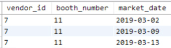
<figcaption></figcaption>

## IN

- To return a list of customers with selected last names:
  - Use a long list of OR comparisons (first query).
  - Alternatively, use the IN keyword with a comma-separated list of values.
  - This returns TRUE for any row with a customer_last_name in the list.
  - Both queries return the same results.

- The first query:

```sql
SELECT 
    customer_id, 
    customer_first_name, 
    customer_last_name
FROM farmers_market.customer 
WHERE
    customer_last_name = 'Diaz'
    OR customer_last_name = 'Edwards' 
    OR customer_last_name = 'Wilson'
ORDER BY customer_last_name, customer_first_name
```

- The second query:

```sql
SELECT 
    customer_id, 
    customer_first_name, 
    customer_last_name
FROM farmers_market.customer 
WHERE
    customer_last_name IN ('Diaz' , 'Edwards', 'Wilson') 
ORDER BY customer_last_name, customer_first_name
```

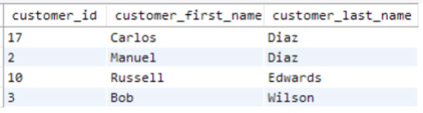
<figcaption></figcaption>

- Use the IN list comparison to search for a person when unsure of the spelling.
- For example, search for a customer first name with multiple spellings.

```sql
SELECT 
    customer_id, 
    customer_first_name, 
    customer_last_name
FROM farmers_market.customer 
WHERE
    customer_first_name IN ('Renee', 'Rene', 'Renée', 'René', 'Renne')
```

## LIKE

- If you know a customer's name starts with "Jer" but aren't sure if it's "Jerry," "Jeremy," or "Jeremiah":
  - Use the LIKE operator with wildcard characters.
  - In MS SQL Server, the % wildcard represents any number of characters (including none).
  - LIKE 'Jer%' will search for strings that start with "Jer" and have any (or no) characters after "r".

```sql
SELECT 
    customer_id, 
    customer_first_name, 
    customer_last_name
FROM farmers_market.customer 
WHERE
    customer_first_name LIKE 'Jer%'
```

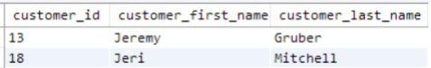
<figcaption></figcaption>

## IS NULL

- It's useful to find rows where a field is blank or NULL.
- In the product table, the `product_size` field is not required.
- Some products may have no size.
- Use the IS NULL condition to find all products without sizes.

```sql
SELECT * 
FROM farmers_market.product 
WHERE product_size IS NULL
```

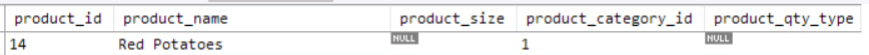
<figcaption></figcaption>

- "Blank" and NULL are not the same in database terms.
- To find all products without sizes, check for blank strings ('') or spaces in the field.

- The TRIM() function removes spaces from the beginning or end of a string.
- Use TRIM() and a blank string comparison to find rows that are blank or contain only spaces.
- Example: The "Red Potatoes - Small" row has a product_size with one space (' ').
- Use this query to find it:

```sql
SELECT * 
FROM farmers_market.product 
WHERE TRIM(product_size) = ''

```sql
SELECT * 
FROM farmers_market.product 
WHERE 
    product_size IS NULL 
    OR TRIM(product_size) = ''
```

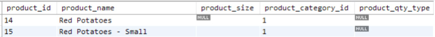
<figcaption></figcaption>

# A Warning About Null Comparisons

- The IS NULL operator is used instead of equals NULL.
- NULL is not a value but the absence of a value.
- Using WHERE product_size = NULL returns no rows.
- Nothing "equals" NULL, not even NULL.
- This is important for other types of comparisons as well.
- Look at the following two queries.

```sql
SELECT 
    market_date,
    transaction_time, 
    customer_id, 
    vendor_id, 
    quantity
FROM farmers_market.customer_purchases 
WHERE 
    customer_id = 1 
    AND vendor_id = 7 
    AND quantity > 1
```

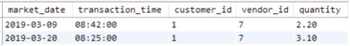
<figcaption></figcaption>

```sql
SELECT 
    market_date,
    transaction_time, 
    customer_id, 
    vendor_id, 
    quantity
FROM farmers_market.customer_purchases 
WHERE 
    customer_id = 1 
    AND vendor_id = 7 
    AND quantity <= 1
```

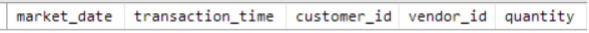
<figcaption></figcaption>

- You might think both queries would return all records.
- One looks for quantities over 1, the other for quantities less than or equal to 1.
- However, NULL values aren't comparable to numbers.
- A record with a NULL quantity is never returned.
- You can see this if you run the following query.

```sql
SELECT 
    market_date,
    transaction_time, 
    customer_id, 
    vendor_id, 
    quantity
FROM farmers_market.customer_purchases 
WHERE 
    customer_id = 1 
    AND vendor_id = 7
```

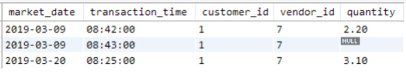
<figcaption></figcaption>

- Ideally, the database should prevent the quantity value from being NULL.
- But since it wasn't, a NULL value was entered.
- To return all records that don't have NULL values in a field:
  - Use the condition "[field name] IS NOT NULL" in the WHERE clause.

# Filtering Using Subqueries

- The IN list comparison used a hard-coded list of values earlier.
- What if you wanted to filter to a list of values returned by another query?
- You can do this in SQL using a subquery (a query inside a query).
- To analyze purchases made on rainy days:
  - Use the market_rain_flag in the market_date_info table.
  - It is 0 if it didn't rain and 1 if it did.
  - First, get a list of market dates when it rained with this query.

```sql
SELECT market_date, market_rain_flag 
FROM farmers_market.market_date_info 
WHERE market_rain_flag = 1
```

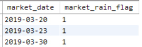
<figcaption></figcaption>

- Use the list of dates from that query to return purchases made on those dates.
- When using a query in an IN comparison:
  - Only return the field you're comparing to.
  - Do not include the market_rain_flag field in the subquery.
  - The subquery returns the dates shown in the previous Figure.
  - The outer query looks for customer_purchases records with a market_date in that list.
  - The results show that all purchase records returned occurred on rainy days.

```sql
SELECT 
    market_date, 
    customer_id, 
    vendor_id, 
    quantity * cost_to_customer_per_qty price 
FROM farmers_market.customer_purchases
WHERE 
    market_date IN
        (
        SELECT market_date
        FROM farmers_market.market_date_info 
        WHERE market_rain_flag = 1
        )
LIMIT 5
```

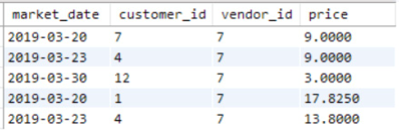
<figcaption></figcaption>

- Creating results that depend on data in more than one table can also be done using a JOIN.
- You will learn about JOINs in Chapter 5, "SQL JOINs."

# Exercises
1. Use the data in Table 3.1. Write a query to return all customer purchases of product IDs 4 and 9.
2. Use the data in Table 3.1. Write two queries:
   - One using two conditions with an AND operator.
   - One using the BETWEEN operator.
   - Return all customer purchases from vendors with vendor IDs between 8 and 10 (inclusive).
3. Think of two ways to change the final query in the chapter to return purchases from days when it wasn’t raining.