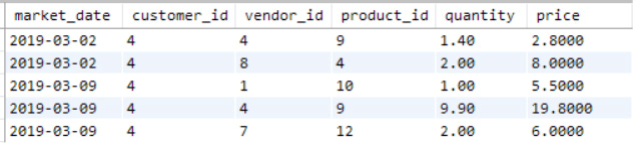
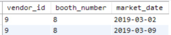
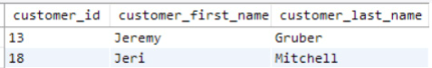
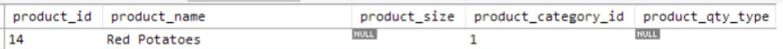
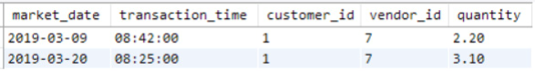
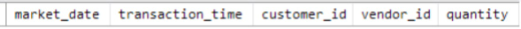

# Filtering SELECT Statement Results

- The WHERE clause follows the FROM statement.
- It precedes any GROUP BY, ORDER BY, or LIMIT statements in a SELECT query.

- For example, to get a list of product IDs and product names in product category 1:

```sql
SELECT
    product_id,
    product_name,
    product_category_id
FROM farmers_market.product
WHERE product_category_id = 1
LIMIT 5
```


<figcaption></figcaption>


```sql
SELECT
    market_date,
    customer_id,
    vendor_id,
    product_id,
    quantity,
    quantity * cost_to_customer_per_qty AS price
FROM farmers_market.customer_purchases
WHERE customer_id = 4
ORDER BY market_date, vendor_id, product_id
LIMIT 5
```


<figcaption></figcaption>

- The customer_id values in the table are integers, not strings.
- If customer_id values were strings, the comparison value need to be a string, meaning '4'.

# Filtering on Multiple Conditions

- Combine multiple conditions with "AND," "OR," or "AND NOT".

- The query for filtering customer id 4 or 3 would be:

```sql
SELECT
    market_date,
    customer_id,
    vendor_id,
    product_id,
    quantity,
    quantity * cost_to_customer_per_qty AS price
FROM farmers_market.customer_purchases
WHERE customer_id = 3 OR customer_id = 4
ORDER BY market_date, customer_id, vendor_id, product_id
```


<figcaption></figcaption>

- What happens if the WHERE clause condition is "customer_id = 3 AND customer_id = 4"?
  - This means "Return each row where the customer ID is 3 and 4."
  - Since a single customer_id cannot be both 3 and 4, no rows are returned.

- When using the AND operator:
  - All conditions with AND must be TRUE for a row to be returned.
  - Example: "WHERE customer_id > 3 AND customer_id <= 5."
  - Both conditions must be TRUE for a row to be returned.

```sql
SELECT
    market_date,
    customer_id,
    vendor_id,
    product_id,
    quantity,
    quantity * cost_to_customer_per_qty AS price
FROM farmers_market.customer_purchases
WHERE customer_id > 3 AND customer_id <= 5
ORDER BY market_date, customer_id, vendor_id, product_id
```


<figcaption></figcaption>

- You can combine multiple AND, OR, and NOT conditions.
- Use parentheses to control their evaluation order.
- Conditions inside parentheses are evaluated first.

```sql
SELECT 
    product_id,
    product_name
FROM farmers_market.product
WHERE
    product_id = 10
    OR (product_id > 3 
    AND product_id < 8)
```


<figcaption></figcaption>

```sql
SELECT 
    product_id,
    product_name
FROM farmers_market.product
WHERE
    (product_id = 10
    OR product_id > 3) 
    AND product_id < 8
```


<figcaption></figcaption>

- The row with product_id 10 is only returned by the first query.

# Multi-Column Conditional Filtering

- So far, only one field is refered for conditions.
- WHERE clauses can also use values from multiple columns.
```sql
SELECT
    market_date,
    customer_id,
    vendor_id,
    quantity * cost_to_customer_per_qty AS price
FROM farmers_market.customer_purchases
WHERE customer_id = 4 AND vendor_id = 7
```


<figcaption></figcaption>

```sql
SELECT *
FROM farmers_market.vendor_booth_assignments 
WHERE
    vendor_id = 9
    AND market_date <= '2019-03-09'
ORDER BY market_date
```


<figcaption></figcaption>

# More Ways to Filter

## BETWEEN

```sql
SELECT * 
FROM farmers_market.vendor_booth_assignments 
WHERE
    vendor_id = 7
    AND market_date BETWEEN '2019-03-02' and '2019-03-16' 
ORDER BY market_date
```


<figcaption></figcaption>

## IN

- The first query:

```sql
SELECT 
    customer_id, 
    customer_first_name, 
    customer_last_name
FROM farmers_market.customer 
WHERE
    customer_last_name = 'Diaz'
    OR customer_last_name = 'Edwards' 
    OR customer_last_name = 'Wilson'
ORDER BY customer_last_name, customer_first_name
```

- The second query:

```sql
SELECT 
    customer_id, 
    customer_first_name, 
    customer_last_name
FROM farmers_market.customer 
WHERE
    customer_last_name IN ('Diaz' , 'Edwards', 'Wilson') 
ORDER BY customer_last_name, customer_first_name
```


<figcaption></figcaption>

- Use the IN list comparison to search for a person when unsure of the spelling.

```sql
SELECT 
    customer_id, 
    customer_first_name, 
    customer_last_name
FROM farmers_market.customer 
WHERE
    customer_first_name IN ('Renee', 'Rene', 'Renée', 'René', 'Renne')
```

## LIKE

- If you know a customer's name starts with "Jer" but aren't sure if it's "Jerry," "Jeremy," or "Jeremiah":
  - the % wildcard represents any number of characters (including none).
  - LIKE 'Jer%' will search for strings that start with "Jer" and have any (or no) characters after "r".

```sql
SELECT 
    customer_id, 
    customer_first_name, 
    customer_last_name
FROM farmers_market.customer 
WHERE
    customer_first_name LIKE 'Jer%'
```


<figcaption></figcaption>

## IS NULL

- It's useful to find rows where a field is blank or NULL.

```sql
SELECT * 
FROM farmers_market.product 
WHERE product_size IS NULL
```


<figcaption></figcaption>

- The TRIM() function removes spaces from the beginning or end of a string.
- Use TRIM() and a blank string comparison to find rows that are blank or contain only spaces.

```sql
SELECT * 
FROM farmers_market.product 
WHERE 
    product_size IS NULL 
    OR TRIM(product_size) = ''
```


<figcaption></figcaption>

# A Warning About Null Comparisons

- Nothing "equals" NULL, not even NULL.
- This is important for other types of comparisons as well.

```sql
SELECT 
    market_date,
    transaction_time, 
    customer_id, 
    vendor_id, 
    quantity
FROM farmers_market.customer_purchases 
WHERE 
    customer_id = 1 
    AND vendor_id = 7 
    AND quantity > 1
```


<figcaption></figcaption>

```sql
SELECT 
    market_date,
    transaction_time, 
    customer_id, 
    vendor_id, 
    quantity
FROM farmers_market.customer_purchases 
WHERE 
    customer_id = 1 
    AND vendor_id = 7 
    AND quantity <= 1
```


<figcaption></figcaption>

```sql
SELECT 
    market_date,
    transaction_time, 
    customer_id, 
    vendor_id, 
    quantity
FROM farmers_market.customer_purchases 
WHERE 
    customer_id = 1 
    AND vendor_id = 7
```


<figcaption></figcaption>

- Ideally, the database should prevent the quantity value from being NULL.
- To return all records that don't have NULL values in a field, use the condition "[field name] IS NOT NULL" in the WHERE clause.

# Filtering Using Subqueries

```sql
SELECT 
    market_date, 
    customer_id, 
    vendor_id, 
    quantity * cost_to_customer_per_qty price 
FROM farmers_market.customer_purchases
WHERE 
    market_date IN
        (
        SELECT market_date
        FROM farmers_market.market_date_info 
        WHERE market_rain_flag = 1
        )
LIMIT 5
```


<figcaption></figcaption>

# Exercises
1. Use the data in Table 3.1. Write a query to return all customer purchases of product IDs 4 and 9.
2. Use the data in Table 3.1. Write two queries:
   - One using two conditions with an AND operator.
   - One using the BETWEEN operator.
   - Return all customer purchases from vendors with vendor IDs between 8 and 10 (inclusive).
3. Think of two ways to change the final query in the chapter to return purchases from days when it wasn’t raining.