# CASE Statement Syntax

- You use conditional reasoning daily such as "If [condition] is true, then [action]. Otherwise, [other action]."
- The syntax in SQL is as follows:

```sql
CASE
    WHEN [first conditional statement] 
      THEN [value or calculation]
    WHEN [second conditional statement] 
      THEN [value or calculation] 
    ELSE [value or calculation]
END
```

```sql
CASE
    WHEN weather_forecast = 'rain'
      THEN 'take umbrella'
    ELSE 'leave umbrella at home'
END
```

- The `WHEN` conditions are evaluated from top to bottom.
  - The `ELSE` part is optional.
  - If not included, the result will be `NULL` if no conditions evaluate to `TRUE`.
- You should always alias columns with `CASE` statements.
- To illustrate, consider this query:

```sql
SELECT
    CASE
        WHEN 1=1 THEN 'Yes'
        WHEN 2=2 THEN 'No'
    END
```

  - This query will always evaluate to "Yes" because `1=1` is always `TRUE`.
  - The `2=2` conditional statement is never evaluated, even though it is also true.
- The vendor types:

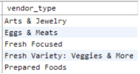
<figcaption></figcaption>

- Let's label vendors:
  - Vendors with "Fresh" are labeled as "Fresh Produce."
  - Others are labeled as "Other."

```sql
SELECT
    vendor_id,
    vendor_name,
    vendor_type,
    CASE
        WHEN LOWER(vendor_type) LIKE '%fresh%'
          THEN 'Fresh Produce'
        ELSE 'Other'
    END AS vendor_type_condensed -- Alias the column
FROM farmers_market.vendor
```

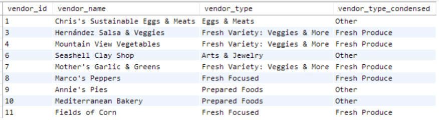
<figcaption></figcaption>

- You can use `UPPER()` with '%FRESH%'`.
- If a new vendor type containing `fresh` is added to the database:
  - The query using the `LIKE` comparison will categorize it as `Fresh Produce` in the `vendor_type_condensed` column.
- To restrict the labeling to existing vendor types:
  - Use the `IN` keyword.
  - Explicitly list the vendor types to be labeled as `Fresh Produce`.

# Creating Binary Flags Using CASE

- The Farmer's Markets occur on Wednesday evenings or Saturday mornings.

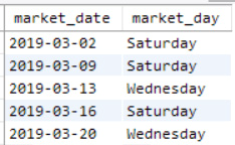
<figcaption></figcaption>

```sql
SELECT
    market_date,
    CASE
        WHEN market_day = 'Saturday' OR market_day = 'Sunday'
          THEN 1
        ELSE 0
    END AS weekend_flag
FROM farmers_market.market_date_info
LIMIT 5
```

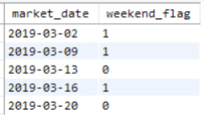
<figcaption></figcaption>

# Grouping or Binning Continuous Values Using CASE

- To return all rows and indicate whether the cost was over $50:

```sql
SELECT
    market_date,
    customer_id,
    vendor_id,
    ROUND(quantity * cost_to_customer_per_qty, 2) AS price,
    CASE
        WHEN quantity * cost_to_customer_per_qty > 50
          THEN 1
        ELSE 0
    END AS price_over_50
FROM farmers_market.customer_purchases
LIMIT 10
```

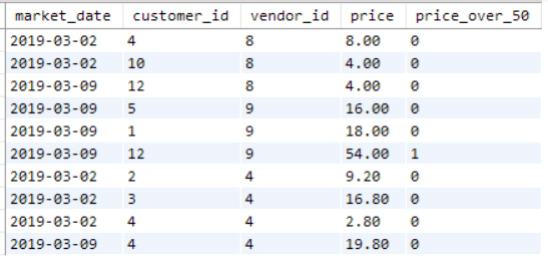
<figcaption></figcaption>

- To group line-item customer purchases into price bins:

```sql
SELECT
    market_date,
    customer_id,
    vendor_id,
    ROUND(quantity * cost_to_customer_per_qty, 2) AS price,
    CASE
        WHEN quantity * cost_to_customer_per_qty < 5.00
          THEN 'Under $5'
        WHEN quantity * cost_to_customer_per_qty < 10.00
          THEN '$5-$9.99'
        WHEN quantity * cost_to_customer_per_qty < 20.00
          THEN '$10-$19.99'
        WHEN quantity * cost_to_customer_per_qty >= 20.00
          THEN '$20 and Up'
    END AS price_bin
FROM farmers_market.customer_purchases
LIMIT 10
```

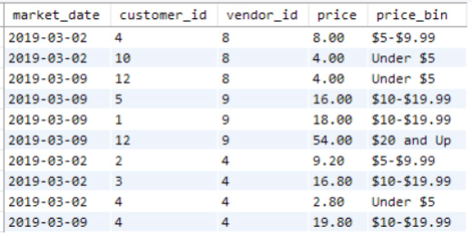
<figcaption></figcaption>

- To output the bottom end of the numeric range for the bins:

```sql
SELECT
    market_date,
    customer_id,
    vendor_id,
    ROUND(quantity * cost_to_customer_per_qty, 2) AS price,
    CASE
        WHEN quantity * cost_to_customer_per_qty < 5.00
          THEN 0
        WHEN quantity * cost_to_customer_per_qty < 10.00
          THEN 5
        WHEN quantity * cost_to_customer_per_qty < 20.00
          THEN 10
        WHEN quantity * cost_to_customer_per_qty >= 20.00
          THEN 20
    END AS price_bin_lower_end
FROM farmers_market.customer_purchases
LIMIT 10
```

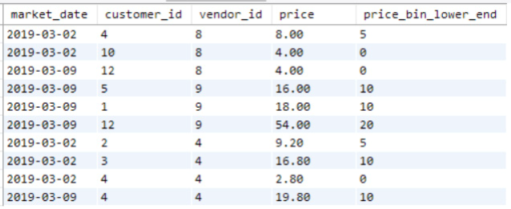
<figcaption></figcaption>

- One query generates a new column of strings.
- The other generates a new column of numbers.
- Including both columns in your query can be useful for reports:
  - The `price_bin` column provides explanatory labels but sorts alphabetically.
  - The numeric column sorts bins correctly.
- If a price is mis-entered or a refund is recorded:
  - Negative values will fall into the "Under $5" or 0 bin.
  - This makes `price_bin_lower_end` a misnomer.
  - Ensure your `CASE` statements handle unexpected values appropriately.

# Categorical Encoding Using CASE

- Convert the string variables into numeric values representing that order.
- For example:
  - The vendor booth price levels labeled "A," "B," and "C" can be converted into numeric values 1, 2, 3.


```sql
SELECT 
    booth_number,
    booth_price_level, 
    CASE 
        WHEN booth_price_level = 'A' THEN 1 
        WHEN booth_price_level = 'B' THEN 2 
        WHEN booth_price_level = 'C' THEN 3
    END AS booth_price_level_numeric 
FROM farmers_market.booth
LIMIT 5
```

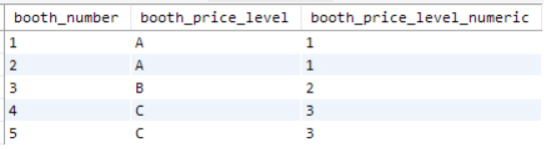
<figcaption></figcaption>

- If categories have no rank order, like vendor types:
  - Use "one-hot encoding."
    - This creates a new column for each category.
      - Assign a binary value of 1 if a row falls into that category.
      - Assign a binary value of 0 otherwise.
    - These columns are called "dummy variables."


```sql
SELECT 
    vendor_id,
    vendor_name, 
    vendor_type, 
    CASE WHEN vendor_type =  'Arts & Jewelry' 
        THEN 1
        ELSE 0 
    END AS vendor_type_arts_jewelry,
    CASE WHEN vendor_type =  'Eggs & Meats' 
        THEN 1
        ELSE 0 
    END AS vendor_type_eggs_meats,
    CASE WHEN vendor_type =  'Fresh Focused' 
        THEN 1
        ELSE 0 
    END AS vendor_type_fresh_focused,  
    CASE WHEN vendor_type =  'Fresh Variety: Veggies & More' 
        THEN 1
        ELSE 0 
    END AS vendor_type_fresh_variety,
    CASE WHEN vendor_type = 'Prepared Foods' 
        THEN 1
        ELSE 0 
    END AS vendor_type_prepared 
FROM farmers_market.vendor
```

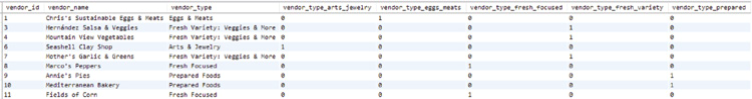
<figcaption></figcaption>

# CASE Statement Summary

- Query 1:
```sql
SELECT 
    customer_id,
    CASE 
        WHEN customer_zip = '22801' THEN 'Local' 
        ELSE 'Not Local' 
    END customer_location_type 
FROM farmers_market.customer 
LIMIT 10
```

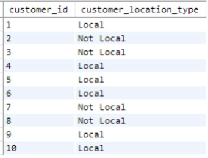
<figcaption></figcaption>

- Query 2:
```sql
SELECT 
    booth_number,
    CASE WHEN booth_price_level = 'A' 
        THEN 1 
        ELSE 0 
    END booth_price_level_A,
    CASE WHEN booth_price_level = 'B' 
        THEN 1 
        ELSE 0 
    END booth_price_level_B,
    CASE WHEN booth_price_level = 'C' 
        THEN 1 
        ELSE 0 
    END booth_price_level_C 
FROM farmers_market.booth 
LIMIT 5
```

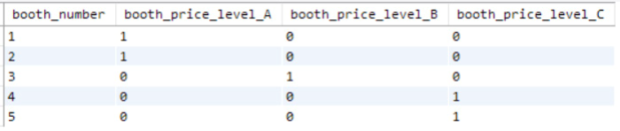

# Excercises

- Look back at Figure 2.1 in Chapter 2 for sample data and column names for the `product` table referenced in these exercises.

1. Products can be sold individually or in bulk (e.g., lbs or oz).
   - Write a query that outputs the `product_id` and `product_name` columns from the `product` table.
   - Add a column called `prod_qty_type_condensed` that displays "unit" if `product_qty_type` is "unit," and "bulk" otherwise.

2. Flag all types of pepper products sold at the market.
   - Add a column to the previous query called `pepper_flag` that outputs 1 if `product_name` contains the word "pepper" (case-insensitive), and 0 otherwise.

3. Can you think of a situation where a pepper product might not be flagged as a pepper product using the code from the previous exercise?