# Introduction
- Now that you know how to select and filter data from a database table, you might wonder how to handle data spread across multiple related tables. For example, the question "When is each type of fresh fruit or vegetable in season, locally?" requires data from the `product_category` table (to filter categories), the `product` table (for item details), and the `vendor_inventory` table (to find out when vendors sold these products). This is where SQL JOINs come in.

# Database Relationships and SQL JOINs
- In Chapter 1, "Data Sources," we introduced database relationships and the entity-relationship diagram (ERD). The relationships between tables and the key fields that connect them help us combine them using a JOIN statement in SQL. For example, to list each product name with its product category name, we need to combine the `product` and `product_category` tables, as the `product` table only has the category ID, while the category name is in the `product_category` table.
- The following Figure shows the one-to-many relationship between the `product` and `product_category` tables. Each product belongs to one category, but each category can contain many products. The primary key in the `product_category` table is `product_category_id`, and each row in the `product` table has a `product_category_id` as a foreign key, identifying the category each product belongs to.

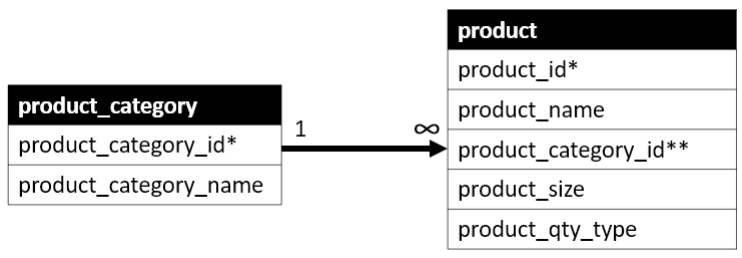
<figcaption></figcaption>

- To remind you, an infinity symbol, "N," or "crow's feet" on the end of a line connecting two tables in an ERD indicates the "many" side of a one-to-many relationship. - To combine these tables, we need to determine which type of JOIN to use. We'll use the two tables from the Farmer's Market database found in the following Figure, but remove some columns to simplify the illustration.

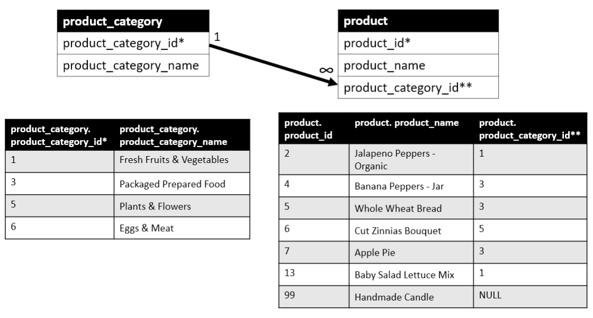
<figcaption></figcaption>

- This Figure shows the one-to-many relationship between these tables. Their primary keys are identified with an asterisk, and the foreign key with a double asterisk.
  - Each row in the `product_category` table can be associated with many rows in the `product` table.
  - But each row in the `product` table is associated with only one row in the `product_category` table.
  - The fields that connect the two tables are `product_category.product_category_id` and `product.product_category_id`.
- The first type of JOIN we'll cover is the LEFT JOIN. This tells the query to pull all records from the table on the "left side" of the JOIN, and only the matching records (based on the criteria specified in the JOIN clause) from the table on the "right side" of the JOIN.

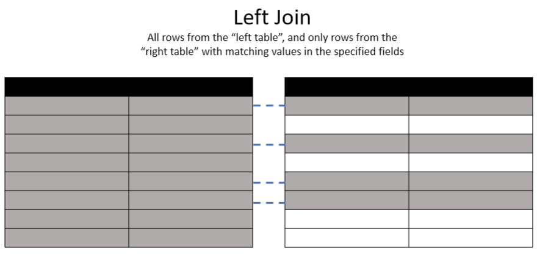
<figcaption></figcaption>

- Note that the `product` table will be on the left side of the join we're setting up, even though it was on the right side of the relationship diagram!
- In the previous Figure, you can see that there are two records in the `product` table with a `product_category_id` of 1, and only one record in the `product_category` table with the `product_category_id` of 1 (because it is the primary key in this table).
- When we LEFT JOIN the `product_category` table to the `product` table, the records with a value of 1 in the `product_category_id` fields of both tables will be joined in the results.
- Note that the data for `product_category_id` 1 from the `product_category` is repeated in two rows in the output because it matches two records in the `product` table.
- What makes this JOIN a LEFT JOIN is that all records from the product table on the left side of the join are included in the output, even if they don't have a match in the `product_category` table. But records from the `product_category` table on the right side of the join are only included if they match up with product records on the left side.
- A LEFT JOIN includes all records from the ``product`` table (left side) in the output, even if they don't have a match in the `product_category` table. Records from the `product_category` table (right side) are only included if they match up with product records on the left side.
- In the following Figure, you can see that the row with a `product_id` of 99 is included, but the values in the resulting output columns from the `product_category` are NULL. This is because there was no `product_category_id` value on which to join this product to the `product_category` table. However, the row from the `product_category` table with a `product_category_id` of 6 is not included in the output at all because it was in the "right" table and does not have a matching record on the left side, and this is a LEFT JOIN.
- In the following Figure, the row with `product_id` 99 is included, but the `product_category` values are NULL because there was no matching `product_category_id`. The row with `product_category_id` 6 is not included because it was in the "right" table and does not have a matching record on the left side.

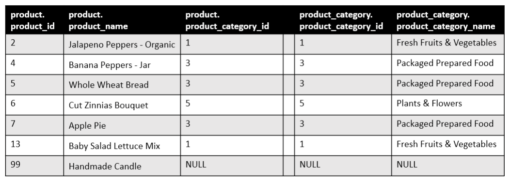
<figcaption></figcaption>

- The syntax for creating this output is:
```sql
SELECT [columns to return]
FROM [left table]
[JOIN TYPE] [right table]
ON [left table].[field in left table to match] = [right table].[field in right table to match]
```
- To pull a list of all products with each product's category name listed, we make the `product` table the "left" table in this query by listing it first after `FROM`, and the `product_category` table the "right" side by listing it after the `LEFT JOIN`, and we'll match up the records using the `product_category_id` fields, as seen after the `ON` keyword.
```sql
SELECT * FROM product 
    LEFT JOIN product_category
         ON product.product_category_id = product_category.product_category_id
```
- This query can be read as "Select everything from the product table, left joined with the product_category table, matched on the product_category_id that's common to both tables," or more specifically: "Select all columns and rows from the product table, and all columns from the product_category table for rows where the product_category's product_category_id matches a product's product_category_id."
- The following Figure shows the first 10 rows of the output from this query.

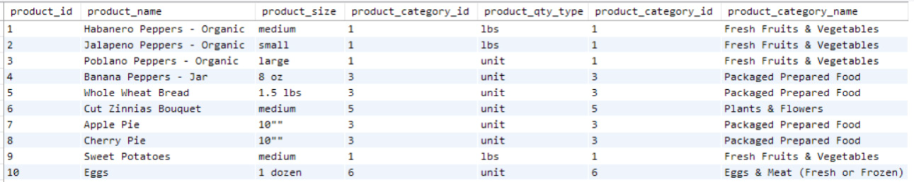
<figcaption></figcaption>

- You may have noticed two `product_category_id` columns in the previous Figure. This is because we selected all fields using the asterisk, and both tables have a field with the same name. To fix this, specify the fields to return and include `product_category_id` from only one table, or alias the column names to indicate which table each came from.
- The LEFT JOIN indicates that we want all rows from the `product` table (left side) and only the associated rows from the `product_category` table. If there is a category not associated with any products, it will not be included in the results. If there were a product without a category, it would be included in the results, with the fields on the `product_category` side being NULL.
- The ON clause matches rows in the two tables using the `product_category_id` field. Note that the `product_category_id fields` from both tables match on every row.
- If we want to retrieve specific columns from the merged dataset, we must specify which table each column is from, as different tables can have identically named columns. We can alias these columns to differentiate them. The following code shows this.
```sql
SELECT 
    product.product_id,
    product.product_name,
    product.product_category_id AS product_prod_cat_id, 
    product_category.product_category_id AS category_prod_cat_id, 
    product_category.product_category_name
FROM product 
    LEFT JOIN product_category 
         ON product.product_category_id = product_category. 
product_category_id
```

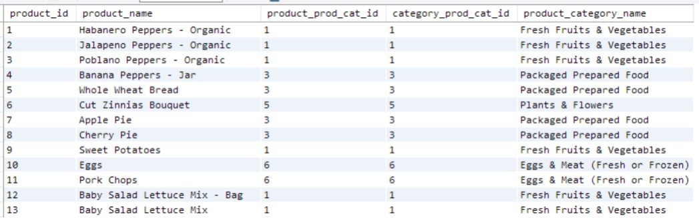
<figcaption></figcaption>

- There is another type of aliasing in a SQL query for developer convenience: table aliasing. If you don't want to write out the entire table name every time you reference it, you can assign it a short alias in the FROM clause that can then be used throughout the query. The following query demonstrates this with the table aliases `p` and `pc`.
```sql
SELECT 
    p.product_id,
    p.product_name,  
    pc.product_category_id, 
    pc.product_category_name
FROM product AS p 
    LEFT JOIN product_category AS pc
         ON p.product_category_id = pc.product_category_id 
ORDER BY pc.product_category_name, p.product_name
```
- To remind, the AS keyword between the table name and the alias is optional, but I will stick with that standard in this book for consistency.

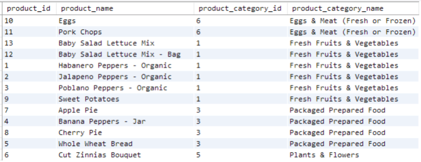
<figcaption></figcaption>

- The next type of SQL JOIN is a RIGHT JOIN. It returns all rows from the "right table" and only the matching rows from the "left table," based on the fields specified in the ON clause.

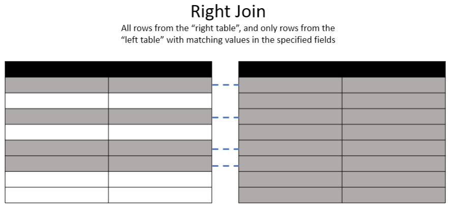
<figcaption></figcaption>

- If we use a RIGHT JOIN to merge the tables shown in the previous Figure, the result will look like the table in the following Figure. All records from the "right table," `product_category`, are returned, but only matching records from `product`. There are no products with a `product_category_id` of 6, so the first three columns of the last row are NULL.
- You would use a RIGHT JOIN to list all product categories and their products, ignoring products not in a category.

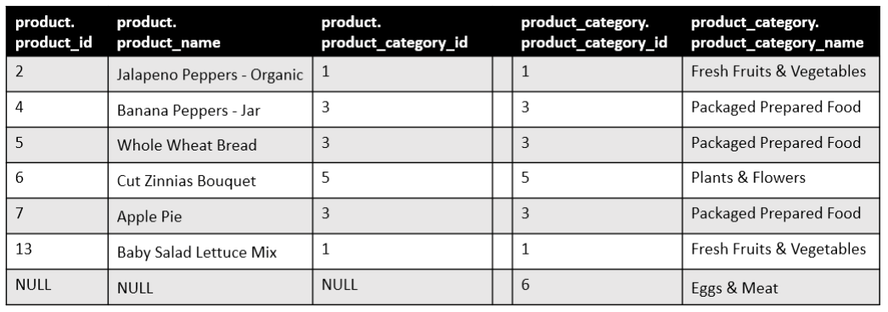
<figcaption></figcaption>

- The next type of JOIN is the INNER JOIN. This JOIN returns only the rows that have matching values in both tables.

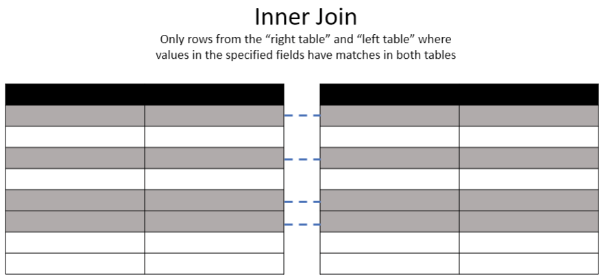
<figcaption></figcaption>

- In the following Figure, we use an INNER JOIN to merge the tables.

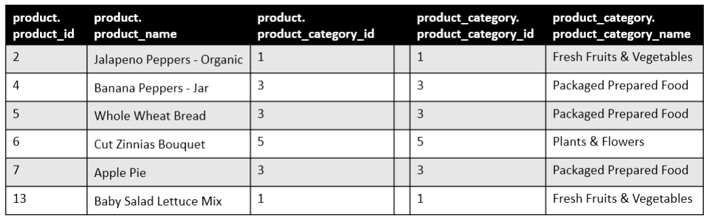
<figcaption></figcaption>

- In the output, you can see that only the rows with matching `product_category_id` values are included.
- The last type of JOIN we'll discuss is the FULL JOIN. This JOIN returns all rows when there is a match in one of the tables, and NULL values when there is no match.

## Illustration
- To practice these JOIN types, let's look at the `customer` and `customer_purchase` tables from the Farmer's Market database. This is a one-to-many relationship: a customer can have multiple purchases, but each purchase is made by only one customer. The tables are related via the `customer_id` field, which is the primary key in the `customer` table and a foreign key in the `customer_purchase` table.
- Using a LEFT JOIN with the following query, we see in the output that some rows have NULL values.
```sql
SELECT * 
FROM customer AS c
LEFT JOIN customer_purchases AS cp
    ON c.customer_id = cp.customer_id
```

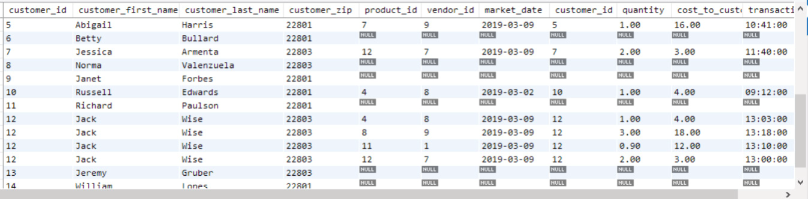
<figcaption></figcaption>

- Unlike the product-product_category relationship, there can be customers without any purchases. These customers were added to the customer table when they signed up for the farmer’s market loyalty card, so we have their data, but they haven't purchased any products yet. With a LEFT JOIN, we get a list of all customers and their associated purchases, if any. Customers with multiple purchases appear multiple times—once for each purchase. Customers without purchases have NULL values in fields from the customer_purchases table. We can use the WHERE clause to filter the list to only customers with no purchases, if desired:
```sql
SELECT c.* 
FROM customer AS c
LEFT JOIN customer_purchases AS cp
    ON c.customer_id = cp.customer_id 
WHERE cp.customer_id IS NULL
```

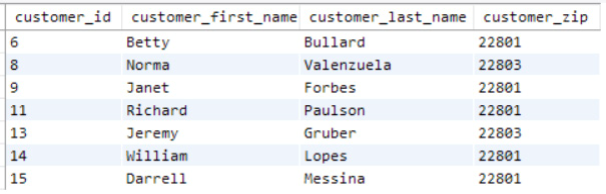
<figcaption></figcaption>

- In this case, we only selected columns from the customer table using `c.*` because 
all columns from the `customer_purchases` table will be NULL. Remember, every purchase is logged at checkout, and every customer uses their loyalty card.
- What if we wanted to list all purchases and the associated customers? We could use a RIGHT JOIN to pull all records from the `customer_purchases` table and only customers from the `customer` table who have made a purchase:
```sql
SELECT * 
FROM customer AS c
RIGHT JOIN customer_purchases AS cp
    ON c.customer_id = cp.customer_id
```

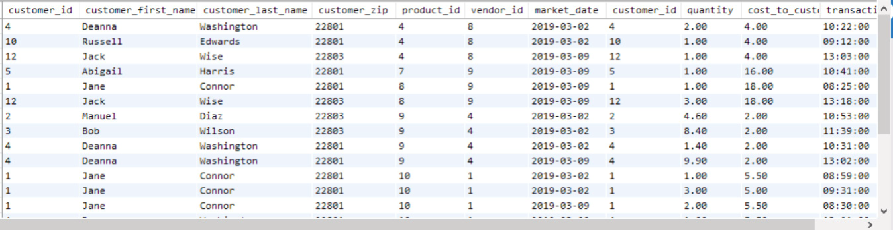
<figcaption></figcaption>

- The output is truncated to save space and doesn’t show all results, but there are no rows with NULL values in the `customer` table columns because every purchase has a `customer_id`. With a RIGHT JOIN, customers without purchases are not included in the results.
- If you only want records that have matches in both tables, use an INNER JOIN. With the customer and customer_purchases tables, an INNER JOIN returns the same results as the RIGHT JOIN because every purchase is associated with a customer.

# A Common Pitfall when Filtering Joined Data
- Going back to the LEFT JOIN example between the `customer` and `customer_purchases` tables shown in the previous Figure, how do you think the output of the following query will differ from the original LEFT JOIN query without the added WHERE clause?
```sql
SELECT * 
FROM customer AS c
LEFT JOIN customer_purchases AS cp
    ON c.customer_id = cp.customer_id 
WHERE cp.customer_id > 0
```
- All `customer_id` values are integers above 0, so it might seem like adding this WHERE clause will make no difference. However, it filters on the `customer_id` in the `customer_purchases` table (alias `cp`). This means customers without purchases will be filtered out, making the query return results like an INNER JOIN instead of a LEFT JOIN by excluding records with NULL values in the `customer_purchases` table. So, instead of the output shown in the Figure 5.12, this query’s output would look like the Figure 5.14.
- If you use a LEFT JOIN to return all rows from the "left" table, even those without a match on the "right" side, avoid filtering on fields from the "right" table without allowing NULL results, or you will filter out rows you intended to keep.
- Let's write a query to return a list of all customers who did not make a purchase at the March 2, 2019, farmer's market. We'll use a LEFT JOIN to include customers who have never made a purchase and thus have no records in the customer_purchases table:
```sql
SELECT c.*, cp.market_date 
FROM customer AS c
LEFT JOIN customer_purchases AS cp
    ON c.customer_id = cp.customer_id 
WHERE cp.market_date <> '2019-03-02'
```

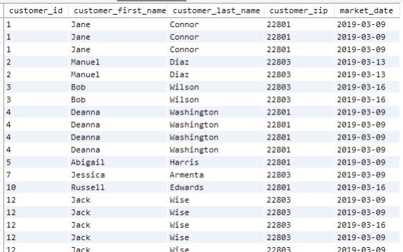
<figcaption></figcaption>

- The first problem is that we’re missing customers who have never made a purchase, like Betty Bullard shown in Figure 5.12, since we filtered on the `market_date` field from the `customer_purchases` table`, which is on the "right side" of the JOIN. SQL doesn’t evaluate value comparisons to TRUE when comparing NULL values. But we need that filter to remove customers who made a purchase that day. One solution is to write the WHERE clause to allow NULL values in the field:
```sql
SELECT c.*, cp.market_date  
FROM customer AS c
LEFT JOIN customer_purchases AS cp
    ON c.customer_id = cp.customer_id
WHERE (cp.market_date <> '2019-03-02' OR cp.market_date IS NULL)
```
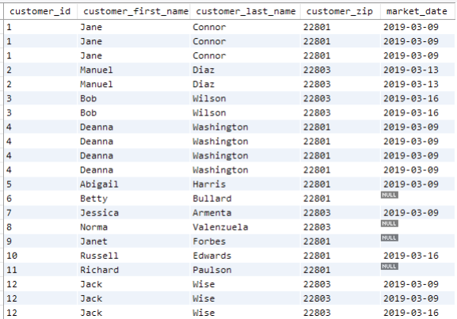
<figcaption></figcaption>

- Now we see customers without purchases in Figure 5.16, like Betty Bullard, along with customers who made purchases on other dates. The other problem is that the output contains one row per customer per item purchased, but we just want a list of customers. We can fix this by removing the `market_date` field from the `customer_purchases` table and using the DISTINCT keyword to remove duplicate records. Figure 5.17 shows the output of the following query:
```sql
SELECT DISTINCT c.*  
FROM customer AS c
LEFT JOIN customer_purchases AS cp
    ON c.customer_id = cp.customer_id
WHERE (cp.market_date <> '2019-03-02' OR cp.market_date IS NULL)
```
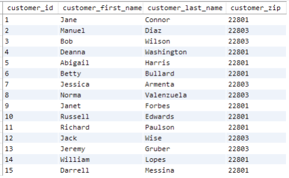
<figcaption></figcaption>

- With this approach, we filtered out unwanted records using values from the customer_purchases table without excluding desired records from the customer table. We only displayed data from one table, even though we used fields from both in the query.

# JOINs with More than Two Tables
- Let's say we want details about all farmer’s market booths and every vendor booth assignment for every market date. We might be building an interactive report to filter by booth, vendor, or date, showing booth assignments with additional booth and vendor details. This requires joining the three tables shown in Figure 5.18.
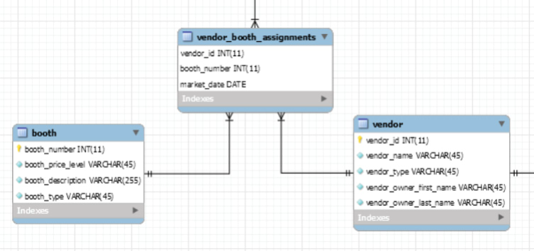
<figcaption></figcaption>

- What JOINs could we use to ensure all booths are included, even if they aren’t assigned to a vendor yet, and all vendors assigned to booths are included? We can LEFT JOIN vendor_booth_assignments to booth, including all booths, and LEFT JOIN vendor to vendor_booth_assignments. The query looks like this and results in Figure 5.19:
```sql
SELECT 
    b.booth_number,
    b.booth_type,
    vba.market_date, 
    v.vendor_id, 
    v.vendor_name, 
    v.vendor_type
FROM booth AS b 
    LEFT JOIN vendor_booth_assignments AS vba ON b.booth_number = vba.
booth_number
    LEFT JOIN vendor AS v ON v.vendor_id = vba.vendor_id
ORDER BY b.booth_number, vba.market_date
```
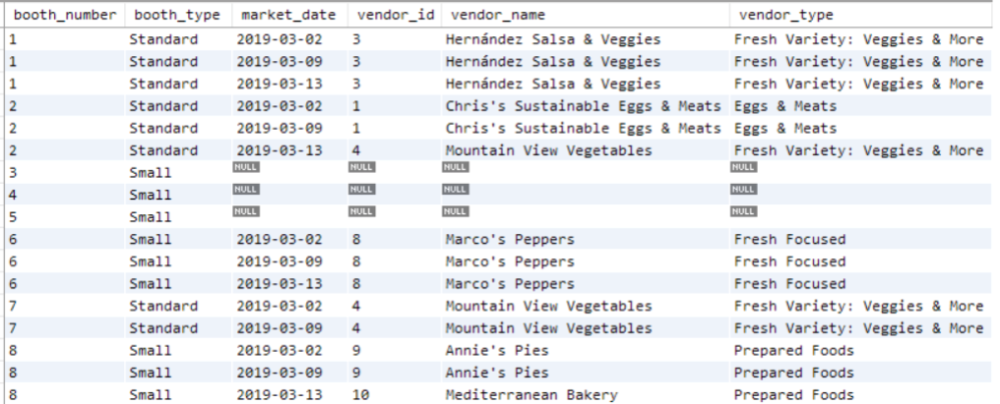
<figcaption></figcaption>

- You can think of the second JOIN as being merged into the result of the first JOIN. Since the `vendor_id` field in the `vendor` table is joined to the `vendor_id` field in the `vendor_booth_assignments` table, only vendors that exist in the `vendor_booth_assignments` table` are included in the output, as shown in Figure 5.20.

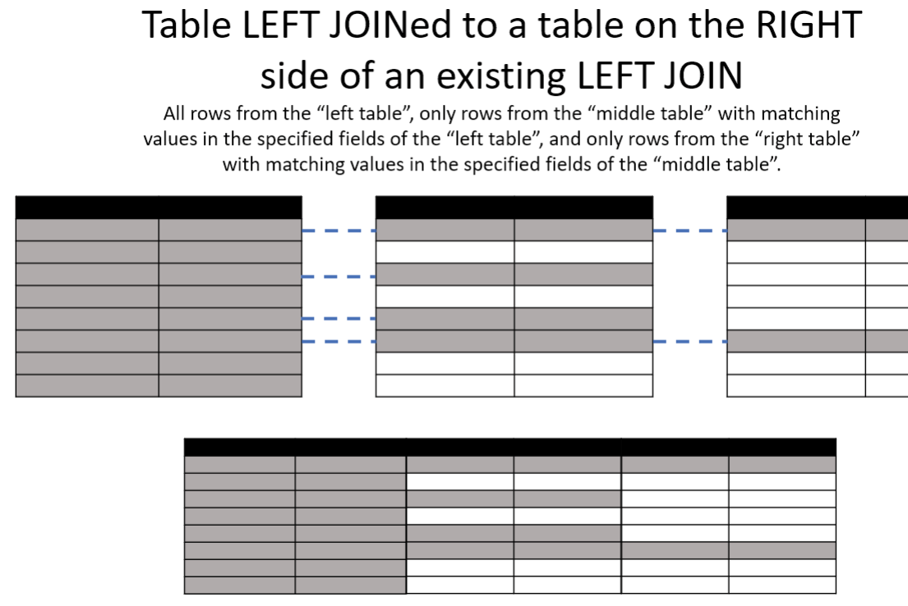
<figcaption></figcaption>

- If the third table was joined to the first table using a common field (this case is common but it isn't possible with the tables in this Farmer’s Market database, because there aren’t any other tables joined to the booth table), the arrangement would look like the diagram in Figure 5.21.

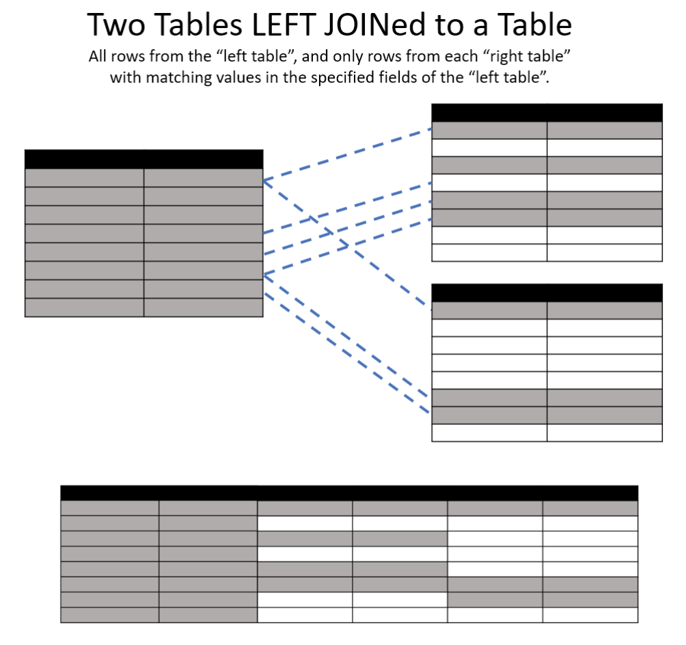
<figcaption></figcaption>

- This method of joining multiple tables is common in machine learning applications, where you have one primary table with one row per entity and many other tables LEFT JOINed to it. This allows you to pull additional data about the entity from other tables. Data in these other tables is often summarized, so the resulting dataset remains at one row per entity, with data from other tables represented by counts or sums. You will learn more about this in Chapter 6, "Aggregating Results for Analysis," when we cover aggregation. We will continue to use JOINs throughout the book, so look for more examples in later chapters.

# Exercises
1. Write a query that INNER JOINs the `vendor` table to the `vendor_booth_assignments` table on the `vendor_id` field they have in common, and sorts the result by `vendor_name`, then `market_date`.
2. Can you write a query that produces the same output as the following query, but using a LEFT JOIN instead of a RIGHT JOIN?
```sql
SELECT * 
FROM customer AS c
RIGHT JOIN customer_purchases AS cp
    ON c.customer_id = cp.customer_id
```
3. To answer the question "When is each type of fresh fruit or vegetable in season, locally?" we need data from the `product_category` table, the `product` table, and the `vendor_inventory` table. What type of JOINs would be needed to combine these three tables?