# Database Relationships and SQL JOINs

- Relationships between tables and key fields help us combine them using a `JOIN` statement.
  - For example:
    - To list each product name with its product category name, we need to combine the `product` and `product_category` tables.
    - The `product` table has product name.
    - The `product_category` table has product category name.

- Figure 5.2 shows the one-to-many relationship between the `product` and `product_category` tables.
  - Each product belongs to one category.
  - Each category can contain many products.
  - The primary key in the `product_category` table is `product_category_id`. Primary keys are marked with an asterisk.
  - Each row in the `product` table has a `product_category_id` as a foreign key, identifying the category each product belongs to. Foreign keys are marked with a double asterisk.


- To combine these tables:
  - We need to determine which type of `JOIN` to use.
  - Some columns are removed to simplify.
  - The fields that connect the two tables are `product_category.product_category_id` and `product.product_category_id`.


<figcaption></figcaption>

- `LEFT JOIN`:
  - Retrieves all records from the left table.
  - Retrieves matching records from the right table.
  - Matches based on `JOIN` criteria.

```sql
SELECT [columns to return]
FROM [left table]
[JOIN TYPE] [right table]
ON [left table].[field in left table to match] = [right table].[field in right table to match]
```

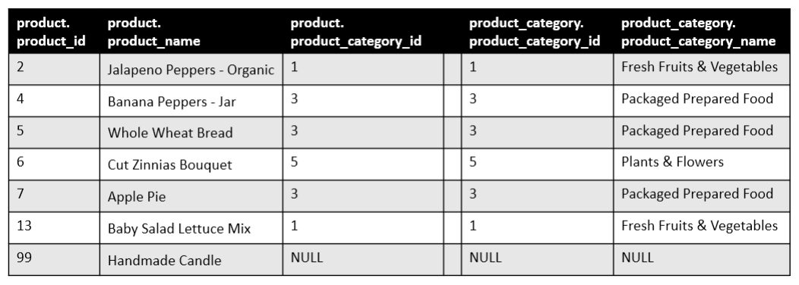
<figcaption></figcaption>

- Note:
  - The row with `product_id` 99 is included with `NULL` values for `product_category` columns due to no matching `product_category_id`.
  - The row with `product_category_id` 6 is excluded as it has no matching record in the left table.
  - `LEFT JOIN` includes all `product` records and matching `product_category` records. Non-matching `product` records still appear, but non-matching `product_category` records do not.

```sql
SELECT * FROM product 
    LEFT JOIN product_category
         ON product.product_category_id = product_category.product_category_id
```

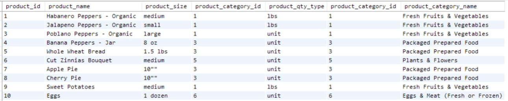
<figcaption></figcaption>

- Two `product_category_id` columns appear because we used the asterisk to select all fields from both tables.
  - To fix this, specify the fields to return and include `product_category_id` from only one table or alias the column names.
- To retrieve specific columns:
  - Specify which table each column is from.
  - Alias columns to differentiate them if they have the same name.

```sql
SELECT 
    product.product_id,
    product.product_name,
    product.product_category_id AS product_prod_cat_id, 
    product_category.product_category_id AS category_prod_cat_id, 
    product_category.product_category_name
FROM product 
    LEFT JOIN product_category 
         ON product.product_category_id = product_category. 
product_category_id
```

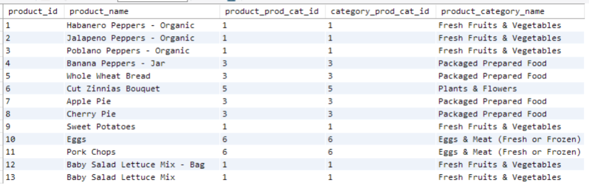
<figcaption></figcaption>

- Table aliasing in SQL allows you to use short names for tables in the `FROM` clause.
  - Assign an alias to a table for convenience.
  - Use the alias throughout the query.

```sql
SELECT 
    p.product_id,
    p.product_name,  
    pc.product_category_id, 
    pc.product_category_name
FROM product AS p 
    LEFT JOIN product_category AS pc
         ON p.product_category_id = pc.product_category_id 
ORDER BY pc.product_category_name, p.product_name
```

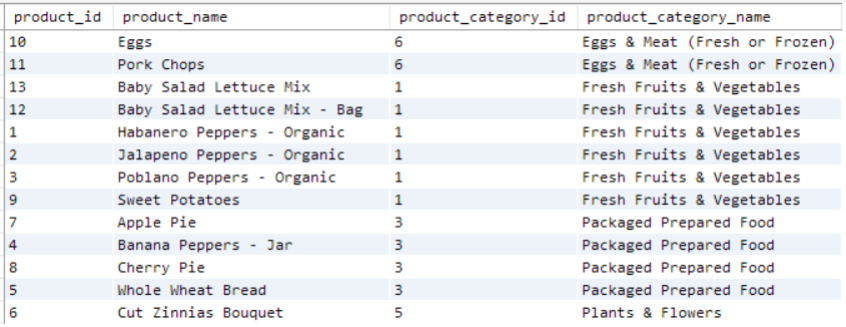
<figcaption></figcaption>

- `RIGHT JOIN`:
  - `RIGHT JOIN` returns all `product_category` records and matching `product` records.
  - The last row has `NULL` values for `product` columns because there are no products with `product_category_id` 6.

- Use `RIGHT JOIN` to:
  - List all product categories and their products.
  - Ignore products not in a category.

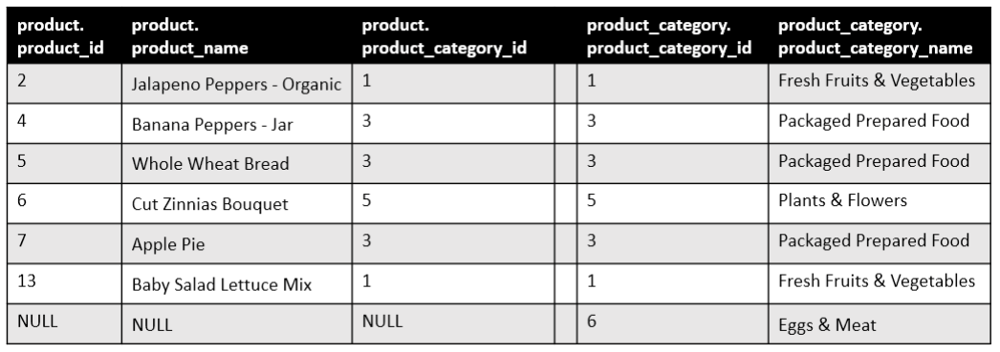
<figcaption></figcaption>

- `INNER JOIN`:
  - Only rows with matching `product_category_id` are included.

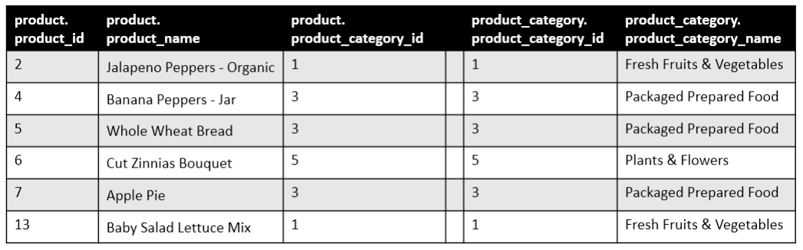
<figcaption></figcaption>

- There is a FULL JOIN, which is not covered in the book.
  - `FULL JOIN` returns all rows with matches in either table, filling `NULL` for non-matching rows.

## Illustration

- Practice `JOIN` types with `customer` and `customer_purchase` tables.
  - One-to-many relationship: each customer can have multiple purchases.
  - Tables are related via `customer_id`, the primary key in `customer` and foreign key in `customer_purchase`.
- Using a `LEFT JOIN`:

```sql
SELECT * 
FROM customer AS c
    LEFT JOIN customer_purchases AS cp
    ON c.customer_id = cp.customer_id
```

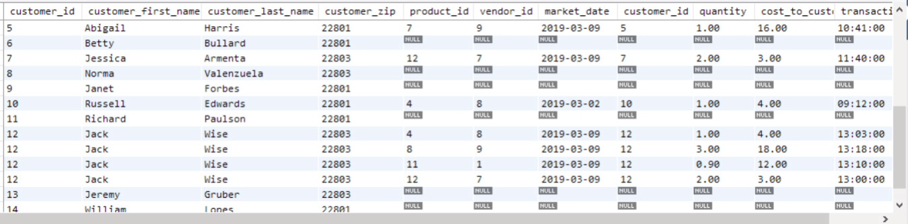
<figcaption></figcaption>
 
- Some customers might not have any purchases; they were added to the `customer` table when they signed up for the loyalty card.
  - `LEFT JOIN` lists all customers and their purchases, if any.
  - Customers with multiple purchases appear multiple times.
  - Customers without purchases have `NULL` values in `customer_purchases` fields.
  - Use the `WHERE` clause to filter only customers with no purchases.

```sql
SELECT c.* 
FROM customer AS c
    LEFT JOIN customer_purchases AS cp
    ON c.customer_id = cp.customer_id 
WHERE cp.customer_id IS NULL
```

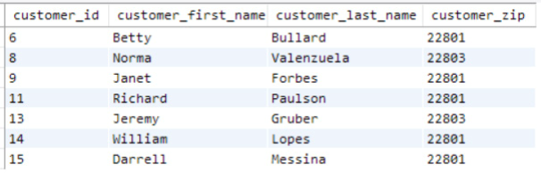
<figcaption></figcaption>

- We selected columns from the `customer` table using `c.*`.
  - All `customer_purchases` columns will be `NULL`.
  - Every purchase is logged at checkout, and every customer uses their loyalty card.

- Using a `RIGHT JOIN`:
  - Use `RIGHT JOIN` to pull all `customer_purchases` records.
  - Only customers with purchases are included.

```sql
SELECT * 
FROM customer AS c
    RIGHT JOIN customer_purchases AS cp
    ON c.customer_id = cp.customer_id
```

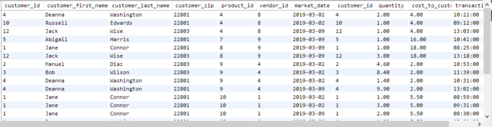
<figcaption></figcaption>

- The output is truncated to save space:
  - No `NULL` values are in the `customer` table columns since every purchase has a `customer_id`.
  - `RIGHT JOIN` excludes customers without purchases.
- Use `INNER JOIN` for records with matches in both tables.
  - For `customer` and `customer_purchases`, `INNER JOIN` returns the same results as `RIGHT JOIN` because every purchase is linked to a customer.

# A Common Pitfall when Filtering Joined Data

- 'LEFT JOIN' in the previous:

```sql
SELECT * 
FROM customer AS c
    LEFT JOIN customer_purchases AS cp
    ON c.customer_id = cp.customer_id
```

- Compared with this query?

```sql
SELECT * 
FROM customer AS c
    LEFT JOIN customer_purchases AS cp
    ON c.customer_id = cp.customer_id 
WHERE cp.customer_id > 0
```

- All `customer_id` values are positive integers.
  - Adding this `WHERE` clause filters `customer_id` in `customer_purchases` (alias `cp`).
  - Customers without purchases are excluded.
  - The query behaves like a `RIGHT JOIN`, excluding `NULL` values in `customer_purchases`.
  - The output will look like Figure 5.14, not Figure 5.12.

- With `LEFT JOIN`, avoid filtering on fields from the "right" table without allowing `NULL` values; otherwise, you'll filter out intended rows.

- Let's write a query to list customers who didn't make a purchase on March 2, 2019.

```sql
SELECT c.*, cp.market_date 
FROM customer AS c
    LEFT JOIN customer_purchases AS cp
    ON c.customer_id = cp.customer_id 
WHERE cp.market_date <> '2019-03-02' -- <> is !=
```

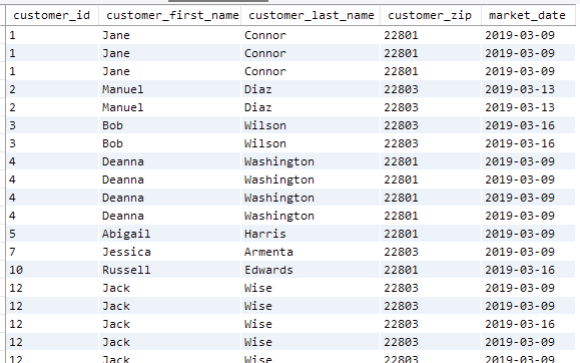
<figcaption></figcaption>

- We're missing customers without purchases, like Betty Bullard in Figure 5.12, due to filtering on `market_date` from `customer_purchases`.
  - SQL comparisons with `NULL` values return FALSE.
  - Solution: adjust the `WHERE` clause to allow `NULL` values.

```sql
SELECT c.*, cp.market_date  
FROM customer AS c
    LEFT JOIN customer_purchases AS cp
    ON c.customer_id = cp.customer_id
WHERE (cp.market_date <> '2019-03-02' OR cp.market_date IS NULL)
```
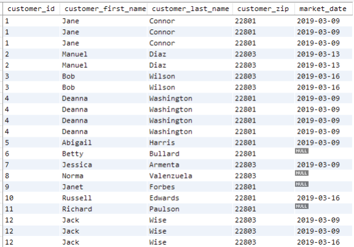
<figcaption></figcaption>

- Figure 5.16 shows customers without purchases, like Betty Bullard, and those with purchases on other dates.
  - The output has one row per customer per item purchased, but we only want a list of customers.
  - Remove the `market_date` field and use `DISTINCT` to eliminate duplicates.

```sql
SELECT DISTINCT c.*  
FROM customer AS c
    LEFT JOIN customer_purchases AS cp
    ON c.customer_id = cp.customer_id
WHERE (cp.market_date <> '2019-03-02' OR cp.market_date IS NULL)
```
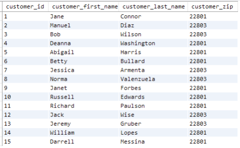
<figcaption></figcaption>

# JOINs with More than Two Tables

- We want to get details of all booths and vendor assignments for every market date:
  - Join the three tables in Figure 5.18.

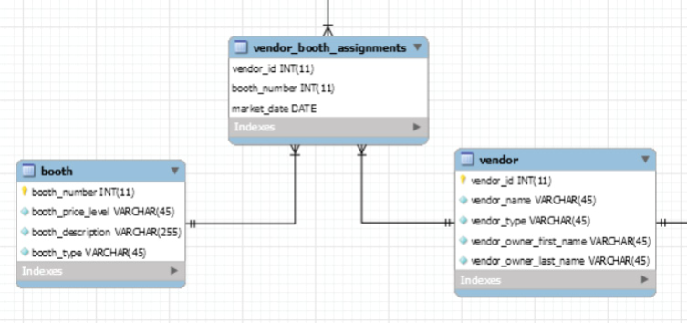
<figcaption></figcaption>

- What `JOIN`s could we use to ensure all booths are included, even if they aren’t assigned to a vendor yet, and all vendors assigned to booths are included?
  - We can `LEFT JOIN` `vendor_booth_assignments` to `booth`, including all booths.
  - `LEFT JOIN` `vendor` to `vendor_booth_assignments`.
  - The query looks like this and results in Figure 5.19:

- We use `JOIN`s to include all booths, even unassigned ones, and all vendors:
  - `LEFT JOIN` `vendor_booth_assignments` with `booth`.
  - `LEFT JOIN` `vendor` with `vendor_booth_assignments`.

```sql
SELECT 
    b.booth_number,
    b.booth_type,
    vba.market_date, 
    v.vendor_id, 
    v.vendor_name, 
    v.vendor_type
FROM booth AS b 
    LEFT JOIN vendor_booth_assignments AS vba ON b.booth_number = vba.
booth_number
    LEFT JOIN vendor AS v ON v.vendor_id = vba.vendor_id
ORDER BY b.booth_number, vba.market_date
```

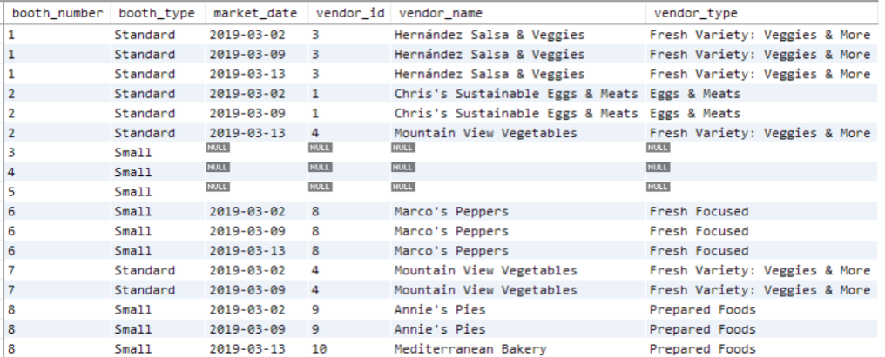
<figcaption></figcaption>

- The second `JOIN` merges into the first `JOIN` result.
  - `vendor.vendor_id` joins `vendor_booth_assignments.vendor_id`.
  - Only vendors in `vendor_booth_assignments` are included.

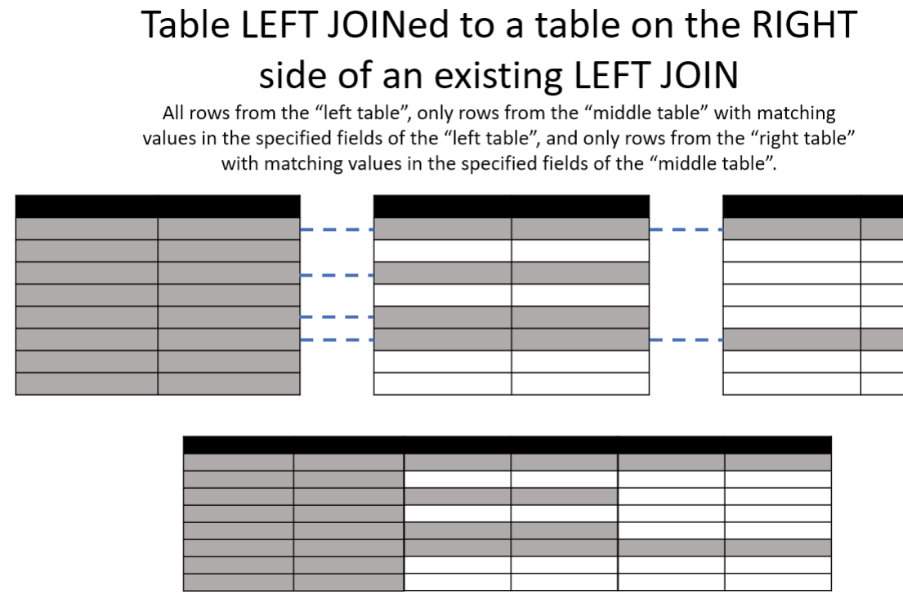
<figcaption></figcaption>

- Another type of JOIN isn't possible in the Farmer's Market database because no other tables are joined to the `booth` table.

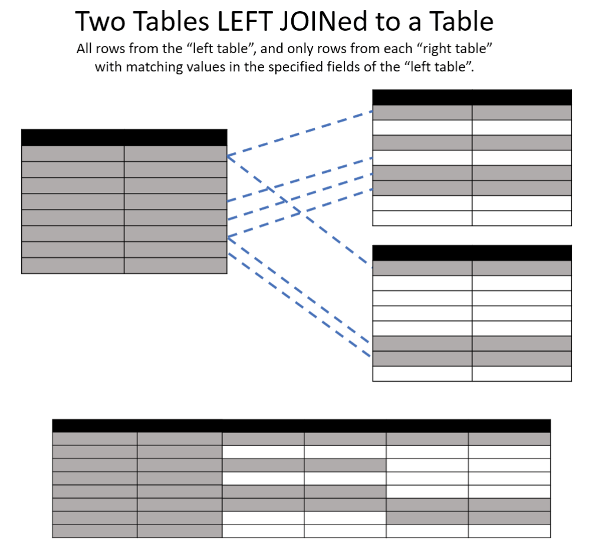
<figcaption></figcaption>

- In machine learning, multiple tables are often joined by `LEFT JOIN`ing other tables to a primary table with one row per entity. This adds summarized data (counts or sums) from other tables, keeping the dataset at one row per entity.

# Exercises

1. Write a query that `INNER JOIN`s the `vendor` table to the `vendor_booth_assignments` table on the `vendor_id` field they have in common.
   - Sort the result by `vendor_name`, then `market_date`.

2. Write a query that produces the same output as the following query but uses a `LEFT JOIN` instead of a `RIGHT JOIN`:

```sql
SELECT * 
FROM customer AS c
RIGHT JOIN customer_purchases AS cp
    ON c.customer_id = cp.customer_id
```

3. To answer the question "When is each type of fresh fruit or vegetable in season, locally?" we need data from:
   - The `product_category` table
   - The `product` table
   - The `vendor_inventory` table
   What type of `JOIN`s would be needed to combine these three tables?