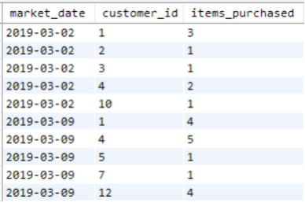
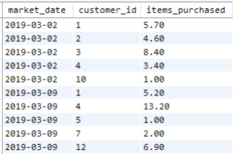
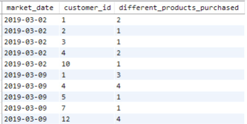
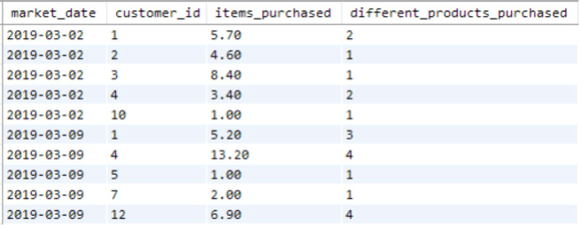
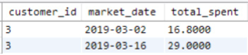
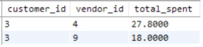
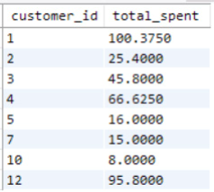
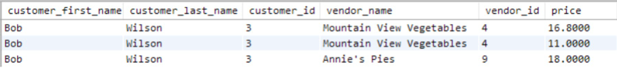
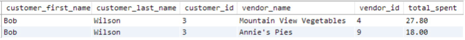
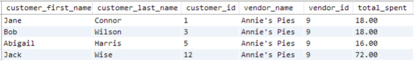

# Introduction
- SQL becomes powerful for analysis when you aggregate data. Using the GROUP BY statement, you can specify the summarization level and use aggregate functions to summarize values for each group.
- Data analysts can build dynamic summary reports with SQL that update automatically as the database updates. Dashboards and reports in software like Tableau and Cognos often rely on SQL queries to get aggregated data for reporting, which we'll cover in Chapter 10, “Building Analytical Reports with SQL.” Data scientists can use SQL to summarize data for training classification models, which we'll explore in Chapter 12, “SQL for Machine Learning.”
- It all starts with basic SQL aggregation.

# GROUP BY Syntax
- You saw the basic SQL SELECT query syntax in Chapter 2, “The SELECT Statement.” Two sections related to aggregation that we haven’t covered yet are the GROUP BY and HAVING clauses:

```sql
SELECT [columns to return]
FROM [table]
WHERE [conditional filter statements]
GROUP BY [columns to group on]
HAVING [conditional filter statements that are run after grouping]
ORDER BY [columns to sort on]
```

- The GROUP BY keywords are followed by a comma-separated list of column names that indicate how to summarize the query results.

- Using what you’ve learned so far without grouping, you might write a query to get a list of customer IDs for purchases on each market date. However, this would result in one row per item each customer purchased, showing duplicates.

```sql
SELECT 
    market_date, 
    customer_id
FROM farmers_market.customer_purchases 
ORDER BY market_date, customer_id
```

- To get one row per customer per market date, add a GROUP BY clause to summarize the results by customer_id and market_date.

```sql
SELECT 
    market_date, 
    customer_id
FROM farmers_market.customer_purchases 
GROUP BY market_date, customer_id
ORDER BY market_date, customer_id
```

- You could also use SELECT DISTINCT to remove duplicates, but here we use GROUP BY to add summary columns to the output.

# Displaying Group Summaries

- Now that you have grouped the data, you can add aggregate functions like SUM and COUNT to summarize the customer_purchases data per group. This query uses the COUNT() function to count the rows in the customer_purchases table per market date per customer. The output of this query is shown in Figure 6.1.

```sql
SELECT 
    market_date, 
    customer_id,
    COUNT(*) AS items_purchased
FROM farmers_market.customer_purchases 
GROUP BY market_date, customer_id
ORDER BY market_date, customer_id
LIMIT 10
```


<figcaption></figcaption>

- Remember, the granularity of the customer_purchases table means that if a customer buys three identical items at once, it shows up as 1 in the items_purchased column, since the purchase is recorded in one row with a quantity of 3. (See Figures 1.7 and 2.7 in Chapters 1 and 2 for reference.) If the customer buys three tomatoes, walks away, and then goes back to buy another three, it would be counted as two by the previous query, since each purchase generates a new row.

- To count all six tomatoes, sum the quantity column using the following query. The output is shown in Figure 6.2.

```sql
SELECT 
    market_date, 
    customer_id,
    SUM(quantity) AS items_purchased
FROM farmers_market.customer_purchases 
GROUP BY market_date, customer_id
ORDER BY market_date, customer_id
LIMIT 10
```


<figcaption></figcaption>

- The items_purchased column is no longer an integer because some quantities are bulk product weights. After seeing these results, you may decide it doesn't make sense to report purchases this way. Instead, you want to know how many different kinds of items each customer bought. For example, count "1" if they bought tomatoes, no matter how many, and add to that count if they bought other items like lettuce.

- This type of modification is common when designing reports. It's important to understand the granularity and structure of the table to ensure your result is accurate. I recommend writing the query without aggregation first to see the values before grouping the results.

- Now, you want a DISTINCT count of product IDs. Instead of counting rows with COUNT(*) or adding quantities with SUM(quantity), you want to count unique product_id values to see how many different kinds of products each customer bought on each market date:

```sql
SELECT 
    market_date, 
    customer_id, 
    COUNT(DISTINCT product_id) AS different_products_purchased
FROM farmers_market.customer_purchases c 
GROUP BY market_date, customer_id
ORDER BY market_date, customer_id
LIMIT 10
```


<figcaption></figcaption>

- We can also combine these summaries into a single query, as shown here and in Figure 6.4:

```sql
SELECT 
    market_date, 
    customer_id, 
    SUM(quantity) AS items_purchased,
    COUNT(DISTINCT product_id) AS different_products_purchased
FROM farmers_market.customer_purchases 
GROUP BY market_date, customer_id
ORDER BY market_date, customer_id
LIMIT 10
```


<figcaption></figcaption>

- You can include multiple aggregate functions in a single query, and they will all be applied at the same level of grouping—in this case, summarizing per market date per customer ID. Note how we use column name aliases to describe the different summary values.

- If you want to sum quantities but don't like how the "items purchased" column includes both discrete items and bulk weights (which may be in different units like pounds and ounces), we will show a solution later in the chapter in the “CASE Statements Inside Aggregate Functions” section.

# Performing Calculations Inside Aggregate Functions

- You can include mathematical operations inside aggregate functions, which are calculated at the row level before summarization. In Chapter 3, “The WHERE Clause,” you learned how to display a list of customer purchases at the farmer’s market using a WHERE clause to filter for a specific customer. The customer with ID 3 has purchased the items shown in Figure 6.5:

```sql
SELECT 
    market_date, 
    customer_id, 
    vendor_id, 
    quantity * cost_to_customer_per_qty AS price 
FROM farmers_market.customer_purchases
WHERE 
    customer_id = 3
ORDER BY market_date, vendor_id
```


<figcaption></figcaption>

- Let's say we want to know how much money this customer spent in total on each market_date, regardless of item or vendor. We can GROUP BY market_date and use the SUM aggregate function on the price calculation to add up the prices of the items purchased, as follows:

```sql
SELECT 
    customer_id, 
    market_date,
    SUM(quantity * cost_to_customer_per_qty) AS total_spent
FROM farmers_market.customer_purchases 
WHERE 
    customer_id = 3 
GROUP BY market_date
ORDER BY market_date
```


<figcaption></figcaption>

- Notice that vendor_id has been removed from the list of columns to be displayed and from the ORDER BY clause. This is because if we want the aggregation level of one row per customer per date, we can’t include vendor_id in the output. The customer can purchase from multiple vendors on a single date, so the results wouldn’t be aggregated at the level we wanted.
- Even though it’s not required to get these results, we should also add customer_id to the GROUP BY list. This way, the query will work without error even when it’s not filtered to a single customer. We’ll make this change in the next query.
- What if we wanted to find out how much this customer had spent at each vendor, regardless of date? Then we can group by customer_id and vendor_id:

```sql
SELECT 
    customer_id, 
    vendor_id,
    SUM(quantity * cost_to_customer_per_qty) AS total_spent 
FROM farmers_market.customer_purchases
WHERE 
    customer_id = 3
GROUP BY customer_id, vendor_id
ORDER BY customer_id, vendor_id
```


<figcaption></figcaption>

- We can remove the customer_id filter by removing the entire WHERE clause and GROUP BY customer_id to get a list of every customer and how much they have ever spent at the farmer’s market. The results of the following query are shown in Figure 6.8:

```sql
SELECT 
    customer_id, 
    vendor_id,
    SUM(quantity * cost_to_customer_per_qty) AS total_spent
FROM farmers_market.customer_purchases
GROUP BY customer_id, vendor_id
ORDER BY customer_id, vendor_id
```


<figcaption></figcaption>

- So far, we have been doing all this aggregation on a single table, but it can also be done on joined tables. It's a good idea to join the tables without the aggregate functions first to ensure the data is at the expected level of granularity and not generating duplicates before adding the GROUP BY.
- Let's say we want to bring in some customer details, such as first and last name, and the vendor name for the query grouped by customer_id and vendor_id. We can first join the three tables, select columns from all of them, and inspect the output before grouping, as shown in Figure 6.9:

```sql
SELECT 
    c.customer_first_name,
    c.customer_last_name,
    cp.customer_id,
    v.vendor_name,
    cp.vendor_id,
    cp.quantity * cp.cost_to_customer_per_qty AS price
FROM farmers_market.customer c
    LEFT JOIN farmers_market.customer_purchases cp
        ON c.customer_id = cp.customer_id 
    LEFT JOIN farmers_market.vendor v
        ON cp.vendor_id = v.vendor_id 
WHERE 
    cp.customer_id = 3
ORDER BY cp.customer_id, cp.vendor_id
```


<figcaption></figcaption>

- To summarize at the level of one row per customer per vendor, we need to group by all the fields from the customer and vendor tables that don't include aggregate functions. The following query shows the fields used for grouping, and the output is shown in Figure 6.10. The ROUND() function is used to format the total_spent calculation nicely in dollar form:
    
```sql
SELECT 
    c.customer_first_name,
    c.customer_last_name,
    cp.customer_id,
    v.vendor_name,
    cp.vendor_id,
    ROUND(SUM(quantity * cost_to_customer_per_qty), 2) AS total_spent
FROM farmers_market.customer c
    LEFT JOIN farmers_market.customer_purchases cp
        ON c.customer_id = cp.customer_id 
    LEFT JOIN farmers_market.vendor v
        ON cp.vendor_id = v.vendor_id 
WHERE 
    cp.customer_id = 3 
GROUP BY 
    c.customer_first_name, 
    c.customer_last_name, 
    cp.customer_id, 
    v.vendor_name, 
    cp.vendor_id
ORDER BY cp.customer_id, cp.vendor_id
```


<figcaption></figcaption>

- We can also keep the same level of aggregation and filter to a single vendor instead of a single customer, to get a list of customers per vendor. The only change needed is in the WHERE clause condition. The grouping level and output fields remain the same. In Figure 6.11, the customer_id column now has values other than 3, and the vendor_id column is limited to vendor 9:

```sql
SELECT 
    c.customer_first_name,
    c.customer_last_name,
    cp.customer_id,
    v.vendor_name,
    cp.vendor_id,
    ROUND(SUM(quantity * cost_to_customer_per_qty), 2) AS total_spent
FROM farmers_market.customer 
    LEFT JOIN farmers_market.customer_purchases cp
        ON c.customer_id = cp.customer_id 
    LEFT JOIN farmers_market.vendor v
        ON cp.vendor_id = v.vendor_id 
WHERE 
    cp.vendor_id = 9
GROUP BY
    c.customer_first_name, 
    c.customer_last_name, 
    cp.customer_id, 
    v.vendor_name, 
    cp.vendor_id
ORDER BY cp.customer_id, cp.vendor_id
```


<figcaption></figcaption>

- Or, we could remove the WHERE clause altogether and get one row for every customer-vendor pair in the database. This would be useful for a reporting system that allows front-end filtering, such as Tableau. The query can provide a list of any customer that has shopped at any vendor and the sum of how much they have spent. The reporting tool can then allow the user to choose any customer or vendor to narrow down the results dynamically.
- You can now see how all the basic SQL components you have learned in previous chapters come together to build analytical reports!

# MIN and MAX

- 


<br><br><br><br><br><br><br><br><br><br><br><br>
<html><head><meta http-equiv="Content-Type" content="text/html;charset=utf-8" /><link href="style.css" rel="stylesheet" type="text/css" /><title>SQL for Data Scientists: A Beginner's Guide for Building Datasets for Analysis</title></head><body><div type="bodymatter" class="calibre1" id="calibre_link-0">
<section aria-labelledby="c06_1" type="chapter" role="doc-chapter" class="calibre2">
<header class="calibre3">
<h1 id="calibre_link-45" class="calibre4"><span aria-label="79" type="pagebreak" id="calibre_link-46" role="doc-pagebreak" class="calibre5"></span><a id="calibre_link-47" class="calibre6"></a><span class="calibre">CHAPTER 6</span><br class="calibre7" /><span class="calibre">Aggregating Results for Analysis</span></h1>
</header>
<section aria-label="chapter opening" class="calibre2"><span id="calibre_link-48" class="calibre"></span>
<p id="calibre_link-49" class="calibre8">SQL starts becoming especially powerful for analysis when you use it to aggregate data. By using the 
<code class="calibre9">GROUP BY</code>
 statement, you can specify the level of summarization and then use aggregate functions to summarize values for the records in each group.</p>
<p id="calibre_link-50" class="calibre8">Data analysts can use SQL to build dynamic summary reports that can be automatically updated as the database is updated with new data, by simply triggering a refresh that reruns the query. Dashboards and reports built using software like Tableau and Cognos often rely on SQL queries to get the data they need from the underlying database in an aggregated form that can be used for reporting, which we'll cover in <a href="c10.xhtml" class="calibre6">Chapter 10</a>, “Building Analytical Reports with SQL.” Data scientists can use SQL to summarize data at the level of granularity needed for training a classification model, which we'll get into in more depth in <a href="c12.xhtml" class="calibre6">Chapter 12</a>, “SQL for Machine Learning.”</p>
<p id="calibre_link-51" class="calibre8">But it all starts with basic SQL aggregation.</p>
</section>
<section aria-labelledby="head-2-51" class="calibre2"><span id="calibre_link-52" class="calibre"></span>
<h2 id="calibre_link-53" class="calibre10">GROUP BY Syntax</h2>
<p class="calibre8">You saw this basic SQL 
<code class="calibre9">SELECT</code>
 query syntax in <a href="c02.xhtml" class="calibre6">Chapter 2</a>, “The SELECT Statement.” Two sections of this query that we haven't yet covered, which are both related to aggregation, are the 
<code class="calibre9">GROUP BY</code>
 and 
<code class="calibre9">HAVING</code>
 clauses:</p>
<ul class="none" id="calibre_link-54">
<li id="calibre_link-55" class="calibre11">SELECT [columns to return]</li>
<li id="calibre_link-56" class="calibre11"><span aria-label="80" type="pagebreak" id="calibre_link-57" role="doc-pagebreak" class="calibre12"></span>FROM [table]</li>
<li id="calibre_link-58" class="calibre11">WHERE [conditional filter statements]</li>
<li id="calibre_link-59" class="calibre11">GROUP BY [columns to group on]</li>
<li id="calibre_link-60" class="calibre11">HAVING [conditional filter statements that are run after grouping]</li>
<li id="calibre_link-61" class="calibre11">ORDER BY [columns to sort on]</li>
</ul>
<p id="calibre_link-62" class="calibre8">The 
<code class="calibre9">GROUP BY</code>
 keywords are followed by a comma-separated list of column names that indicate how you want to summarize the query results.</p>
<p class="calibre8">Using what you've learned so far without grouping, you might write a query like the following to get a list of the customer IDs of customers who made purchases on each market date:</p>
<pre id="calibre_link-63" class="calibre13">
<code class="calibre9">SELECT </code>
   
<code class="calibre9"> market_date, </code>
   
<code class="calibre9"> customer_id</code>
<code class="calibre9">FROM farmers_market.customer_purchases</code>
<code class="calibre9">ORDER BY market_date, customer_id</code>
</pre>
<p id="calibre_link-64" class="calibre8">However, this approach would result in one row per item each customer purchased, displaying duplicates in the output, because you're querying the 
<code class="calibre9">customer_purchases</code>
 table with no grouping specified.</p>
<p class="calibre8">To instead get one row per customer per market date, you can group the results by adding a 
<code class="calibre9">GROUP BY</code>
 clause that specifies that you want to summarize the results by the 
<code class="calibre9">customer_id</code>
 and 
<code class="calibre9">market_date</code>
 fields:</p>
<pre id="calibre_link-65" class="calibre13">
<code class="calibre9">SELECT </code>
   
<code class="calibre9"> market_date, </code>
   
<code class="calibre9"> customer_id</code>
<code class="calibre9">FROM farmers_market.customer_purchases</code>
<code class="calibre9">GROUP BY market_date, customer_id</code>
<code class="calibre9">ORDER BY market_date, customer_id</code>
</pre>
<p id="calibre_link-66" class="calibre8">You can also accomplish the same result by using 
<code class="calibre9">SELECT DISTINCT</code>
 to remove duplicates, but here we are using 
<code class="calibre9">GROUP BY</code>
 with the intention of adding summary columns to the output.</p>
</section>
<section aria-labelledby="head-2-52" class="calibre2"><span id="calibre_link-67" class="calibre"></span>
<h2 id="calibre_link-68" class="calibre10">Displaying Group Summaries</h2>
<p class="calibre8">Now that you have grouped the data at the desired level, you can add aggregate functions like 
<code class="calibre9">SUM</code>
 and 
<code class="calibre9">COUNT</code>
 to return summaries of the 
<code class="calibre9">customer_purchases</code>
 data per group. This query uses the 
<code class="calibre9">COUNT</code>
(
<code class="calibre9">)</code>
 function to count the rows in the 
<code class="calibre9">customer_purchases</code>
 table per market date per customer. The output of this query is shown in <a href="#calibre_link-1" id="calibre_link-2" class="calibre6">Figure 6.1</a>.</p>
<pre id="calibre_link-69" class="calibre13"><span aria-label="81" type="pagebreak" id="calibre_link-70" role="doc-pagebreak" class="calibre12"></span>
<code class="calibre9">SELECT </code>
   
<code class="calibre9"> market_date, </code>
   
<code class="calibre9"> customer_id,</code>
   
<code class="calibre9"> COUNT(*) AS items_purchased</code>
<code class="calibre9">FROM farmers_market.customer_purchases</code>
<code class="calibre9">GROUP BY market_date, customer_id</code>
<code class="calibre9">ORDER BY market_date, customer_id</code>
<code class="calibre9">LIMIT 10</code>
</pre>
<figure class="calibre14">
<figcaption class="calibre15">
<p class="calibre8"><span class="figurelabel"><a href="#calibre_link-2" id="calibre_link-1" role="doc-backlink" class="calibre6">Figure 6.1</a></span></p>
</figcaption>
</figure>
<p id="calibre_link-71" class="calibre8">Now, remember that the granularity of the 
<code class="calibre9">customer_purchases</code>
 table is such that if a customer were to buy three identical items, such as tomatoes, at once from a vendor, that would show up as 1 in the 
<code class="calibre9">items_purchased</code>
 column of this query's output, since the item purchase is recorded in one row in the table, with a 
<code class="calibre9">quantity</code>
 value of 3. (See <a href="c01.xhtml#c01-fig-0007" class="calibre6">Figures 1.7</a> and <a href="c02.xhtml#c02-fig-0007" class="calibre6">2.7</a> in <a href="c01.xhtml" class="calibre6">Chapters 1</a>, “Data Sources,” and <a href="c02.xhtml" class="calibre6">2</a> for reference.) If the customer were to buy three tomatoes, walk away from the stand, then go back and purchase another three tomatoes, that would be counted as two by the preceding query, since the new separate purchase would generate a new line in the database.</p>
<p class="calibre8">If instead of counting up line items, we wanted to add up all quantities purchased, to count all six tomatoes, we can sum up the quantity column using the following query. The output of this query is shown in <a href="#calibre_link-3" id="calibre_link-4" class="calibre6">Figure 6.2</a>.</p>
<pre id="calibre_link-72" class="calibre13">
<code class="calibre9">SELECT </code>
   
<code class="calibre9"> market_date, </code>
   
<code class="calibre9"> customer_id,</code>
   
<code class="calibre9"> SUM(quantity) AS items_purchased</code>
<code class="calibre9">FROM farmers_market.customer_purchases</code>
<code class="calibre9">GROUP BY market_date, customer_id</code>
<code class="calibre9">ORDER BY market_date, customer_id</code>
<code class="calibre9">LIMIT 10</code>
<span aria-label="82" type="pagebreak" id="calibre_link-73" role="doc-pagebreak" class="calibre12"></span></pre>
<figure class="calibre14">

<figcaption class="calibre15">
<p class="calibre8"><span class="figurelabel"><a href="#calibre_link-4" id="calibre_link-3" role="doc-backlink" class="calibre6">Figure 6.2</a></span></p>
</figcaption>
</figure>
<p class="calibre8">The 
<code class="calibre9">items_purchased</code>
 column is no longer an integer, because some of the quantities we're adding up are bulk product weights. After seeing these results and realizing bulk weight quantities are included, you may decide that it doesn't make sense to report the purchases this way, and you instead want to know how many different kinds of items were purchased by each customer. So now you only want to count “1” if they bought tomatoes, no matter how many individual tomatoes they purchased, or how many times they checked out, and only add to that count if they bought other items, such as lettuce.</p>
<aside class="calibre16">
<div class="top"><hr class="calibre17" /></div>
<section class="feature">
<h3 class="calibre18">NOTE</h3>
<p id="calibre_link-74" class="calibre19">Note that this type of modification occurs frequently while designing reports&mdash;either by the data analyst or by the requester/customer&mdash;so it's important to understand the granularity and structure of the underlying table to ensure that your result means what you think it does. This is why I recommend writing the query without aggregation first to see the values you will be summarizing before grouping the results.</p>
<div class="top"><hr class="calibre17" /></div>
</section>
</aside>
<p class="calibre8">What you want now is a 
<code class="calibre9">DISTINCT</code>
 count of product IDs, shown in the following query and in <a href="#calibre_link-5" id="calibre_link-6" class="calibre6">Figure 6.3</a>. So instead of counting how many rows there were in the 
<code class="calibre9">customer_purchases</code>
 table per customer per market date, like we did with 
<code class="calibre9">COUNT(*)</code>
, or adding up the quantities, like we did with 
<code class="calibre9">SUM(quantity)</code>
, we're identifying how many unique 
<code class="calibre9">product_id</code>
 values exist across those rows in the group&mdash;how many different kinds of products were purchased by each customer on each market date:</p>
<pre id="calibre_link-75" class="calibre13">
<code class="calibre9">SELECT </code>
   
<code class="calibre9"> market_date, </code>
   
<code class="calibre9"> customer_id, </code>
   
<code class="calibre9"> COUNT(DISTINCT product_id) AS different_products_purchased</code>
<code class="calibre9">FROM farmers_market.customer_purchases c</code>
<code class="calibre9">GROUP BY market_date, customer_id</code>
<code class="calibre9">ORDER BY market_date, customer_id</code>
<code class="calibre9">LIMIT 10</code>
<span aria-label="83" type="pagebreak" id="calibre_link-76" role="doc-pagebreak" class="calibre12"></span></pre>
<figure class="calibre14">

<figcaption class="calibre15">
<p class="calibre8"><span class="figurelabel"><a href="#calibre_link-6" id="calibre_link-5" role="doc-backlink" class="calibre6">Figure 6.3</a></span></p>
</figcaption>
</figure>
<p class="calibre8">We can also combine these summaries into a single query, as shown here and in <a href="#calibre_link-7" id="calibre_link-8" class="calibre6">Figure 6.4</a>:</p>
<pre id="calibre_link-77" class="calibre13">
<code class="calibre9">SELECT </code>
   
<code class="calibre9"> market_date, </code>
   
<code class="calibre9"> customer_id, </code>
   
<code class="calibre9"> SUM(quantity) AS items_purchased,</code>
   
<code class="calibre9"> COUNT(DISTINCT product_id) AS different_products_purchased</code>
<code class="calibre9">FROM farmers_market.customer_purchases</code>
<code class="calibre9">GROUP BY market_date, customer_id</code>
<code class="calibre9">ORDER BY market_date, customer_id</code>
<code class="calibre9">LIMIT 10</code>
</pre>
<figure class="calibre14">

<figcaption class="calibre15">
<p class="calibre8"><span class="figurelabel"><a href="#calibre_link-8" id="calibre_link-7" role="doc-backlink" class="calibre6">Figure 6.4</a></span></p>
</figcaption>
</figure>
<p id="calibre_link-78" class="calibre8">You can include as many different aggregate functions as you want in a single query, and they will all be applied at the same level of grouping&mdash;in this case, summarizing per market date per customer ID. Note how we are using column name aliases to describe the different summary values.</p>
<p id="calibre_link-79" class="calibre8">If you do want to sum up the quantities but don't like how the “items purchased” column includes both discrete items and bulk weights (some of which may be in pounds and some in ounces, so shouldn't be added together, anyway), we will demonstrate one possible solution later in the chapter in the “CASE Statements Inside Aggregate Functions” section.</p>
</section>
<section aria-labelledby="head-2-53" class="calibre2"><span id="calibre_link-80" class="calibre"></span>
<h2 id="calibre_link-81" class="calibre10">Performing Calculations Inside Aggregate Functions</h2>
<p class="calibre8"><span aria-label="84" type="pagebreak" id="calibre_link-82" role="doc-pagebreak" class="calibre12"></span>You can also include mathematical operations, which are calculated at the row level prior to summarization, inside the aggregate functions. In <a href="c03.xhtml" class="calibre6">Chapter 3</a>, “The WHERE Clause,” you learned how to display a list of customer purchases at the farmer’s market, using a 
<code class="calibre9">WHERE</code>
 clause to filter it to a specific customer. The customer with ID 3 has purchased the items in <a href="#calibre_link-9" id="calibre_link-10" class="calibre6">Figure 6.5</a>, which can be retrieved using the following query that calculates the price per line item:</p>
<pre id="calibre_link-83" class="calibre13">
<code class="calibre9">SELECT </code>
   
<code class="calibre9"> market_date, </code>
   
<code class="calibre9"> customer_id, </code>
   
<code class="calibre9"> vendor_id, </code>
   
<code class="calibre9"> quantity * cost_to_customer_per_qty AS price</code>
<code class="calibre9">FROM farmers_market.customer_purchases</code>
<code class="calibre9">WHERE </code>
   
<code class="calibre9"> customer_id = 3</code>
<code class="calibre9">ORDER BY market_date, vendor_id</code>
</pre>
<figure class="calibre14">

<figcaption class="calibre15">
<p class="calibre8"><span class="figurelabel"><a href="#calibre_link-10" id="calibre_link-9" role="doc-backlink" class="calibre6">Figure 6.5</a></span></p>
</figcaption>
</figure>
<p class="calibre8">Let's say we wanted to know how much money this customer spent total on each 
<code class="calibre9">market_date</code>
, regardless of item or vendor. We can 
<code class="calibre9">GROUP BY market_date</code>
, and use the 
<code class="calibre9">SUM</code>
 aggregate function on the price calculation to add up the prices of the items purchased, as follows:</p>
<pre id="calibre_link-84" class="calibre13">
<code class="calibre9">SELECT </code>
   
<code class="calibre9"> customer_id, </code>
   
<code class="calibre9"> market_date,</code>
   
<code class="calibre9"> SUM(quantity * cost_to_customer_per_qty) AS total_spent</code>
<code class="calibre9">FROM farmers_market.customer_purchases</code>
<code class="calibre9">WHERE </code>
   
<code class="calibre9"> customer_id = 3</code>
<code class="calibre9">GROUP BY market_date</code>
<code class="calibre9">ORDER BY market_date</code>
</pre>
<p id="calibre_link-85" class="calibre8">The 
<code class="calibre9">SUM()</code>
 function surrounds the “price” calculation, which means that the price will be calculated per row of the table, as we saw in the first query, and then the results will be summed up per group&mdash;in this case, per market date.</p>
<p id="calibre_link-86" class="calibre8">The summarized results are shown in <a href="#calibre_link-11" id="calibre_link-12" class="calibre6">Figure 6.6</a>, where you can see that the prices of the two line items from March 16, 2019 have been added up, and the alias has been updated to 
<code class="calibre9">total_spent</code>
 to better reflect the meaning of the <span aria-label="85" type="pagebreak" id="calibre_link-87" role="doc-pagebreak" class="calibre12"></span>summarized value. We grouped by 
<code class="calibre9">customer_id</code>
 and 
<code class="calibre9">market_date</code>
, so there is now just one summarized row per 
<code class="calibre9">customer_id</code>
 per 
<code class="calibre9">market_date</code>
.</p>
<figure class="calibre14">

<figcaption class="calibre15">
<p class="calibre8"><span class="figurelabel"><a href="#calibre_link-12" id="calibre_link-11" role="doc-backlink" class="calibre6">Figure 6.6</a></span></p>
</figcaption>
</figure>
<p id="calibre_link-88" class="calibre8">Notice that 
<code class="calibre9">vendor_id</code>
 has been removed from the list of columns to be displayed and from the 
<code class="calibre9">ORDER BY</code>
 clause. That's because if we want the aggregation level of one row per customer per date, we can't also include 
<code class="calibre9">vendor_id</code>
 in the output, because the customer can purchase from multiple vendors on a single date, so the results wouldn't be aggregated at the level we wanted.</p>
<p id="calibre_link-89" class="calibre8">Even though it's not required in order to get these results, we should also add 
<code class="calibre9">customer_id</code>
 to the 
<code class="calibre9">GROUP BY</code>
 list, so the query will work without error even when it's not filtered to a single customer. We'll make this change in the next query.</p>
<p class="calibre8">What if we wanted to find out how much this customer had spent at each vendor, regardless of date? Then we can group by 
<code class="calibre9">customer_id</code>
 and 
<code class="calibre9">vendor_id</code>
:</p>
<pre id="calibre_link-90" class="calibre13">
<code class="calibre9">SELECT </code>
   
<code class="calibre9"> customer_id, </code>
   
<code class="calibre9"> vendor_id,</code>
   
<code class="calibre9"> SUM(quantity * cost_to_customer_per_qty) AS total_spent</code>
<code class="calibre9">FROM farmers_market.customer_purchases</code>
<code class="calibre9">WHERE </code>
   
<code class="calibre9"> customer_id = 3</code>
<code class="calibre9">GROUP BY customer_id, vendor_id</code>
<code class="calibre9">ORDER BY customer_id, vendor_id</code>
</pre>
<p id="calibre_link-91" class="calibre8">The results of this query are shown in <a href="#calibre_link-13" id="calibre_link-14" class="calibre6">Figure 6.7</a>.</p>
<figure class="calibre14">

<figcaption class="calibre15">
<p class="calibre8"><span class="figurelabel"><a href="#calibre_link-14" id="calibre_link-13" role="doc-backlink" class="calibre6">Figure 6.7</a></span></p>
</figcaption>
</figure>
<p class="calibre8">We can also remove the 
<code class="calibre9">customer_id</code>
 filter&mdash;in this case by removing the entire 
<code class="calibre9">WHERE</code>
 clause since there are no other filter values&mdash;and 
<code class="calibre9">GROUP BY customer_id</code>
 only, to get a list of every customer and how much they have ever spent at the farmer’s market. The results of the following query are shown in <a href="#calibre_link-15" id="calibre_link-16" class="calibre6">Figure 6.8</a>:</p>
<pre id="calibre_link-92" class="calibre13">
<code class="calibre9">SELECT </code>
   
<code class="calibre9"> customer_id, </code>
   
<code class="calibre9"> SUM(quantity * cost_to_customer_per_qty) AS total_spent</code>
<code class="calibre9">FROM farmers_market.customer_purchases</code>
<span aria-label="86" type="pagebreak" id="calibre_link-93" role="doc-pagebreak" class="calibre12"></span>
<code class="calibre9">GROUP BY customer_id</code>
<code class="calibre9">ORDER BY customer_id</code>
</pre>
<figure class="calibre14">

<figcaption class="calibre15">
<p class="calibre8"><span class="figurelabel"><a href="#calibre_link-16" id="calibre_link-15" role="doc-backlink" class="calibre6">Figure 6.8</a></span></p>
</figcaption>
</figure>
<p id="calibre_link-94" class="calibre8">So far, we have been doing all of this aggregation on a single table, but it can be done on joined tables, as well. It's a good idea to join the tables without the aggregate functions first, to make sure the data is at the level of granularity you expect (and not generating duplicates) before adding the 
<code class="calibre9">GROUP BY</code>
.</p>
<p class="calibre8">Let's say that for the query that was grouped by 
<code class="calibre9">customer_id</code>
 and 
<code class="calibre9">vendor_id</code>
, we want to bring in some customer details, such as first and last name, and the vendor name. We can first join the three tables together, select columns from all of the tables, and inspect the output before grouping, as shown in <a href="#calibre_link-17" id="calibre_link-18" class="calibre6">Figure 6.9</a>:</p>
<pre id="calibre_link-95" class="calibre13">
<code class="calibre9">SELECT </code>
   
<code class="calibre9"> c.customer_first_name,</code>
   
<code class="calibre9"> c.customer_last_name,</code>
   
<code class="calibre9"> cp.customer_id,</code>
   
<code class="calibre9"> v.vendor_name,</code>
   
<code class="calibre9"> cp.vendor_id,</code>
   
<code class="calibre9"> cp.quantity * cp.cost_to_customer_per_qty AS price</code>
<code class="calibre9">FROM farmers_market.customer c</code>
   
<code class="calibre9"> LEFT JOIN farmers_market.customer_purchases cp</code>
       
<code class="calibre9"> ON c.customer_id = cp.customer_id</code>
   
<code class="calibre9"> LEFT JOIN farmers_market.vendor v</code>
       
<code class="calibre9"> ON cp.vendor_id = v.vendor_id</code>
<code class="calibre9">WHERE </code>
   
<code class="calibre9"> cp.customer_id = 3</code>
<code class="calibre9">ORDER BY cp.customer_id, cp.vendor_id</code>
</pre>
<figure class="calibre14">

<figcaption class="calibre15">
<p class="calibre8"><span class="figurelabel"><a href="#calibre_link-18" id="calibre_link-17" role="doc-backlink" class="calibre6">Figure 6.9</a></span></p>
</figcaption>
</figure>
<p class="calibre8">To summarize at the level of one row per customer per vendor, we will have to group by a lot more fields, including all of the customer table fields and all of <span aria-label="87" type="pagebreak" id="calibre_link-96" role="doc-pagebreak" class="calibre12"></span>the vendor table fields. Basically, we want to group by all of the displayed fields that don't include aggregate functions. The following query shows the list of fields used for grouping, and the output of this query is shown in <a href="#calibre_link-19" id="calibre_link-20" class="calibre6">Figure 6.10</a>. The 
<code class="calibre9">ROUND()</code>
 function was added here to format the 
<code class="calibre9">total_spent</code>
 calculation nicely in dollar form:</p>
<pre id="calibre_link-97" class="calibre13">
<code class="calibre9">SELECT </code>
   
<code class="calibre9"> c.customer_first_name,</code>
   
<code class="calibre9"> c.customer_last_name,</code>
   
<code class="calibre9"> cp.customer_id,</code>
   
<code class="calibre9"> v.vendor_name,</code>
   
<code class="calibre9"> cp.vendor_id,</code>
   
<code class="calibre9"> ROUND(SUM(quantity * cost_to_customer_per_qty), 2) AS total_spent</code>
<code class="calibre9">FROM farmers_market.customer c</code>
   
<code class="calibre9"> LEFT JOIN farmers_market.customer_purchases cp</code>
      
<code class="calibre9"> ON c.customer_id = cp.customer_id</code>
   
<code class="calibre9"> LEFT JOIN farmers_market.vendor v</code>
      
<code class="calibre9"> ON cp.vendor_id = v.vendor_id</code>
<code class="calibre9">WHERE </code>
   
<code class="calibre9"> cp.customer_id = 3</code>
<code class="calibre9">GROUP BY </code>
   
<code class="calibre9"> c.customer_first_name,</code>
   
<code class="calibre9"> c.customer_last_name,</code>
   
<code class="calibre9"> cp.customer_id,</code>
   
<code class="calibre9"> v.vendor_name,</code>
   
<code class="calibre9"> cp.vendor_id</code>
<code class="calibre9">ORDER BY cp.customer_id, cp.vendor_id</code>
</pre>
<figure class="calibre14">

<figcaption class="calibre15">
<p class="calibre8"><span class="figurelabel"><a href="#calibre_link-20" id="calibre_link-19" role="doc-backlink" class="calibre6">Figure 6.10</a></span></p>
</figcaption>
</figure>
<p class="calibre8">We can also keep the same level of aggregation and filter to a single vendor instead of a single customer, to get a list of customers per vendor instead of vendors per customer, as shown in the following code. Note that the only line of code that is changed is the 
<code class="calibre9">WHERE</code>
 clause condition, because even though we're changing the filter, we want the grouping level and the output fields to stay the same. You can see in <a href="#calibre_link-21" id="calibre_link-22" class="calibre6">Figure 6.11</a> that the 
<code class="calibre9">customer_id</code>
 column now has values other than 3, and the 
<code class="calibre9">vendor_id</code>
 column now is limited to vendor 9:</p>
<pre id="calibre_link-98" class="calibre13">
<code class="calibre9">SELECT </code>
   
<code class="calibre9"> c.customer_first_name,</code>
   
<code class="calibre9"> c.customer_last_name,</code>
   
<code class="calibre9"> cp.customer_id,</code>
   
<code class="calibre9"> v.vendor_name,</code>
   
<code class="calibre9"> cp.vendor_id,</code>
   
<code class="calibre9"> ROUND(SUM(quantity * cost_to_customer_per_qty), 2) AS total_spent</code>
<code class="calibre9">FROM farmers_market.customer c</code>
<span aria-label="88" type="pagebreak" id="calibre_link-99" role="doc-pagebreak" class="calibre12"></span>
<code class="calibre9"> LEFT JOIN farmers_market.customer_purchases cp</code>
   
<code class="calibre9"> ON c.customer_id = cp.customer_id</code>
   
<code class="calibre9"> LEFT JOIN farmers_market.vendor v</code>
   
<code class="calibre9"> ON cp.vendor_id = v.vendor_id</code>
<code class="calibre9">WHERE </code>
   
<code class="calibre9"> cp.vendor_id = 9</code>
<code class="calibre9">GROUP BY </code>
   
<code class="calibre9"> c.customer_first_name,</code>
   
<code class="calibre9"> c.customer_last_name,</code>
   
<code class="calibre9"> cp.customer_id,</code>
   
<code class="calibre9"> v.vendor_name,</code>
   
<code class="calibre9"> cp.vendor_id</code>
<code class="calibre9">ORDER BY cp.customer_id, cp.vendor_id</code>
</pre>
<figure class="calibre14">

<figcaption class="calibre15">
<p class="calibre8"><span class="figurelabel"><a href="#calibre_link-22" id="calibre_link-21" role="doc-backlink" class="calibre6">Figure 6.11</a></span></p>
</figcaption>
</figure>
<p id="calibre_link-100" class="calibre8">Or, we could remove the 
<code class="calibre9">WHERE</code>
 clause altogether and get one row for every customer-vendor pair in the database. This would be useful as a query to support a reporting system that allows for front-end filtering, such as Tableau. The query can provide a list of any customer that has shopped at any vendor and the sum of how much they have spent, and the reporting tool can then allow the user to choose any customer or vendor, to narrow down the results dynamically.</p>
<p id="calibre_link-101" class="calibre8">You can now see how all of the basic SQL components you have learned in previous chapters are coming together to build analytical reports!</p>
</section>
<section aria-labelledby="head-2-54" class="calibre2"><span id="calibre_link-102" class="calibre"></span>
<h2 id="calibre_link-103" class="calibre10">MIN and MAX</h2>
<p id="calibre_link-104" class="calibre8">If we wanted to get the most and least expensive items per product category, considering the fact that each vendor sets their own prices and can adjust prices per customer (which is why the 
<code class="calibre9">customer_purchases</code>
 table has a 
<code class="calibre9">cost_to_customer_per_qty</code>
 field, so the original price can be overridden at the time of purchase, if needed), we will use the 
<code class="calibre9">vendor_inventory</code>
 table, which has a field for the original price the vendors set for each item they bring to market on each market date.</p>
<p class="calibre8">First, let's look at all of the available fields in the 
<code class="calibre9">vendor_inventory</code>
 table by using the following 
<code class="calibre9">SELECT *</code>
 query. The output is shown in <a href="#calibre_link-23" id="calibre_link-24" class="calibre6">Figure 6.12</a>.</p>
<pre id="calibre_link-105" class="calibre13">
<code class="calibre9">SELECT *</code>
<code class="calibre9">FROM farmers_market.vendor_inventory</code>
<code class="calibre9">ORDER BY original_price</code>
<code class="calibre9">LIMIT 10</code>
<span aria-label="89" type="pagebreak" id="calibre_link-106" role="doc-pagebreak" class="calibre12"></span></pre>
<figure class="calibre14">

<figcaption class="calibre15">
<p class="calibre8"><span class="figurelabel"><a href="#calibre_link-24" id="calibre_link-23" role="doc-backlink" class="calibre6">Figure 6.12</a></span></p>
</figcaption>
</figure>
<p class="calibre8">We can get the least and most expensive item prices in the entire table by using the 
<code class="calibre9">MIN()</code>
 and 
<code class="calibre9">MAX()</code>
 functions without grouping in MySQL, as shown here and in <a href="#calibre_link-25" id="calibre_link-26" class="calibre6">Figure 6.13</a>:</p>
<pre id="calibre_link-107" class="calibre13">
<code class="calibre9">SELECT </code>
   
<code class="calibre9"> MIN(original_price) AS minimum_price,</code>
   
<code class="calibre9"> MAX(original_price) AS maximum_price</code>
<code class="calibre9">FROM farmers_market.vendor_inventory</code>
<code class="calibre9">ORDER BY original_price</code>
</pre>
<figure class="calibre14">

<figcaption class="calibre15">
<p class="calibre8"><span class="figurelabel"><a href="#calibre_link-26" id="calibre_link-25" role="doc-backlink" class="calibre6">Figure 6.13</a></span></p>
</figcaption>
</figure>
<p class="calibre8">But if we want to get the lowest and highest prices within each product category, we have to group by the 
<code class="calibre9">product_category_id</code>
 (and 
<code class="calibre9">product_category_name</code>
, if we want to display it), then the summary values will be calculated per group, as shown in the following query and in <a href="#calibre_link-27" id="calibre_link-28" class="calibre6">Figure 6.14</a>. Table aliases were added here since we're referencing multiple tables and need to distinguish which table each field is from:</p>
<pre id="calibre_link-108" class="calibre13">
<code class="calibre9">SELECT </code>
   
<code class="calibre9"> pc.product_category_name,</code>
   
<code class="calibre9"> p.product_category_id,</code>
   
<code class="calibre9"> MIN(vi.original_price) AS minimum_price,</code>
   
<code class="calibre9"> MAX(vi.original_price) AS maximum_price</code>
<code class="calibre9">FROM farmers_market.vendor_inventory AS vi</code>
   
<code class="calibre9"> INNER JOIN farmers_market.product AS p</code>
   
<code class="calibre9"> ON vi.product_id = p.product_id</code>
   
<code class="calibre9"> INNER JOIN farmers_market.product_category AS pc</code>
   
<code class="calibre9"> ON p.product_category_id = pc.product_category_id</code>
<code class="calibre9">GROUP BY pc.product_category_name, p.product_category_id</code>
<span aria-label="90" type="pagebreak" id="calibre_link-109" role="doc-pagebreak" class="calibre12"></span></pre>
<figure class="calibre14">

<figcaption class="calibre15">
<p class="calibre8"><span class="figurelabel"><a href="#calibre_link-28" id="calibre_link-27" role="doc-backlink" class="calibre6">Figure 6.14</a></span></p>
</figcaption>
</figure>
<p id="calibre_link-110" class="calibre8">If we were to also add columns for 
<code class="calibre9">MIN(product_name)</code>
 and 
<code class="calibre9">MAX(product_name)</code>
, we would not get the product names associated with the lowest and highest prices; instead, we would get the first and last product names, sorted alphabetically. If we wanted to get the products associated with these min and max prices per category, we would use window functions, which will be covered in the next chapter.</p>
</section>
<section aria-labelledby="head-2-55" class="calibre2"><span id="calibre_link-111" class="calibre"></span>
<h2 id="calibre_link-112" class="calibre10">COUNT and COUNT DISTINCT</h2>
<p id="calibre_link-113" class="calibre8">Suppose we wanted to count how many products were for sale on each market date, or how many different products each vendor offered. We can determine these values using 
<code class="calibre9">COUNT</code>
 and 
<code class="calibre9">COUNT DISTINCT</code>
.</p>
<p id="calibre_link-114" class="calibre8">
<code class="calibre9">COUNT</code>
 will count up the rows within a group when used with 
<code class="calibre9">GROUP BY</code>
, and 
<code class="calibre9">COUNT DISTINCT</code>
 will count up the unique values present in the specified field within the group.</p>
<p id="calibre_link-115" class="calibre8">To determine how many products are offered for sale each market date, we can count up the rows in the 
<code class="calibre9">vendor_inventory</code>
 table, grouped by date. This doesn't tell us what quantity of each product was offered or sold (because we're not adding up the quantity column, or counting customer purchases), but counts the number of products available, because there is a row in this table for each product for each vendor for each market date.</p>
<p class="calibre8">Of course, the values shown in the screenshots are too small to be realistic numbers, because the database has only been populated with a small number of sample rows per table, but you can see in <a href="#calibre_link-29" id="calibre_link-30" class="calibre6">Figure 6.15</a> that the result is a count for each 
<code class="calibre9">market_date</code>
.</p>
<pre id="calibre_link-116" class="calibre13">
<code class="calibre9">SELECT </code>
   
<code class="calibre9"> market_date, </code>
   
<code class="calibre9"> COUNT(product_id) AS product_count</code>
<code class="calibre9">FROM farmers_market.vendor_inventory</code>
<code class="calibre9">GROUP BY market_date</code>
<code class="calibre9">ORDER BY market_date</code>
</pre>
<figure class="calibre14">

<figcaption class="calibre15">
<p class="calibre8"><span class="figurelabel"><a href="#calibre_link-30" id="calibre_link-29" role="doc-backlink" class="calibre6">Figure 6.15</a></span></p>
</figcaption>
</figure>
<p class="calibre8">If we wanted to know how many different products&mdash;with unique product IDs&mdash;each vendor brought to market during a date range, we could use 
<code class="calibre9">COUNT DISTINCT</code>
 on the 
<code class="calibre9">product_id</code>
 field, like so:</p>
<pre id="calibre_link-117" class="calibre13"><span aria-label="91" type="pagebreak" id="calibre_link-118" role="doc-pagebreak" class="calibre12"></span>
<code class="calibre9">SELECT </code>
   
<code class="calibre9"> vendor_id, </code>
   
<code class="calibre9"> COUNT(DISTINCT product_id) AS different_products_offered</code>
<code class="calibre9">FROM farmers_market.vendor_inventory</code>
<code class="calibre9">WHERE market_date BETWEEN '2019-03-02' AND '2019-03-16'</code>
<code class="calibre9">GROUP BY vendor_id</code>
<code class="calibre9">ORDER BY vendor_id</code>
</pre>
<p id="calibre_link-119" class="calibre8">Note that the 
<code class="calibre9">DISTINCT</code>
 goes inside the parentheses for the 
<code class="calibre9">COUNT()</code>
 aggregate function. The results of the query are shown in <a href="#calibre_link-31" id="calibre_link-32" class="calibre6">Figure 6.16</a>.</p>
<figure class="calibre14">

<figcaption class="calibre15">
<p class="calibre8"><span class="figurelabel"><a href="#calibre_link-32" id="calibre_link-31" role="doc-backlink" class="calibre6">Figure 6.16</a></span></p>
</figcaption>
</figure>
</section>
<section aria-labelledby="head-2-56" class="calibre2"><span id="calibre_link-120" class="calibre"></span>
<h2 id="calibre_link-121" class="calibre10">Average</h2>
<p class="calibre8">What if, in addition to the count of different products per vendor, we also want the average original price of a product per vendor? We can add a line to the preceding query, and use the 
<code class="calibre9">AVG()</code>
 function, like we do in the following query, with results shown in <a href="#calibre_link-33" id="calibre_link-34" class="calibre6">Figure 6.17</a>:</p>
<pre id="calibre_link-122" class="calibre13">
<code class="calibre9">SELECT </code>
   
<code class="calibre9"> vendor_id, </code>
   
<code class="calibre9"> COUNT(DISTINCT product_id) AS different_products_offered,</code>
   
<code class="calibre9"> AVG(original_price) AS average_product_price</code>
<code class="calibre9">FROM farmers_market.vendor_inventory</code>
<code class="calibre9">WHERE market_date BETWEEN '2019-03-02' AND '2019-03-16'</code>
<code class="calibre9">GROUP BY vendor_id</code>
<code class="calibre9">ORDER BY vendor_id</code>
<span aria-label="92" type="pagebreak" id="calibre_link-123" role="doc-pagebreak" class="calibre12"></span></pre>
<figure class="calibre14">

<figcaption class="calibre15">
<p class="calibre8"><span class="figurelabel"><a href="#calibre_link-34" id="calibre_link-33" role="doc-backlink" class="calibre6">Figure 6.17</a></span></p>
</figcaption>
</figure>
<p id="calibre_link-124" class="calibre8">However, we have to think about what we're actually averaging here. Is it fair to call it “average product price” when the underlying table has one row per type of product? If the vendor brought 100 tomatoes to market, those would all be in one line of the underlying vendor inventory table, so the price of a tomato would only be included in the average once. Then if that same vendor also sold bouquets of flowers for $20, no matter how many bouquets they brought, that would only be included in the average once. If you calculated the “average product price” for the vendor this way, you would just get the average of the price of one tomato and one bouquet.</p>
<p class="calibre8">To get an actual average price of items in each vendor's inventory between the specified dates, it might make more sense to multiply the quantity of each type of item times the price of that item, which is a calculation that would occur per row, then sum that up and divide by the total quantity of items, which is a calculation that would occur per vendor. Let's try a calculation that includes these two summary values. We also surrounded the calculation with a 
<code class="calibre9">ROUND()</code>
 function to format the output in dollars, as shown in <a href="#calibre_link-35" id="calibre_link-36" class="calibre6">Figure 6.18</a>.</p>
<pre id="calibre_link-125" class="calibre13">
<code class="calibre9">SELECT </code>
   
<code class="calibre9"> vendor_id, </code>
   
<code class="calibre9"> COUNT(DISTINCT product_id) AS different_products_offered,</code>
   
<code class="calibre9"> SUM(quantity * original_price) AS value_of_inventory,</code>
   
<code class="calibre9"> SUM(quantity) AS inventory_item_count,</code>
   
<code class="calibre9"> ROUND(SUM(quantity * original_price) / SUM(quantity), 2) ASaverage_item_price</code>
<code class="calibre9">FROM farmers_market.vendor_inventory</code>
<code class="calibre9">WHERE market_date BETWEEN '2019-03-02' AND '2019-03-16'</code>
<code class="calibre9">GROUP BY vendor_id</code>
<code class="calibre9">ORDER BY vendor_id</code>
<span aria-label="93" type="pagebreak" id="calibre_link-126" role="doc-pagebreak" class="calibre12"></span></pre>
<figure class="calibre14">

<figcaption class="calibre15">
<p class="calibre8"><span class="figurelabel"><a href="#calibre_link-36" id="calibre_link-35" role="doc-backlink" class="calibre6">Figure 6.18</a></span></p>
</figcaption>
</figure>
<p id="calibre_link-127" class="calibre8">The multiplication of 
<code class="calibre9">quantity * original_price</code>
 inside the aggregate function is performed per row, then the aggregate SUMs are calculated, then the division of one 
<code class="calibre9">SUM</code>
 into the other to determine the “average item price” is calculated. So we're performing mathematical operations both before and after the 
<code class="calibre9">GROUP BY</code>
 summarization occurs.</p>
</section>
<section aria-labelledby="head-2-57" class="calibre2"><span id="calibre_link-128" class="calibre"></span>
<h2 id="calibre_link-129" class="calibre10">Filtering with HAVING</h2>
<p id="calibre_link-130" class="calibre8">Filtering is another thing that can be done in the query after summarization occurs.</p>
<p id="calibre_link-131" class="calibre8">In previous chapters and in the following query, we filtered rows using the 
<code class="calibre9">WHERE</code>
 clause. Here, we're filtering to a date range in the 
<code class="calibre9">WHERE</code>
 clause prior to grouping.</p>
<p id="calibre_link-132" class="calibre8">If you want to filter values after the aggregate functions are applied, you can add a 
<code class="calibre9">HAVING</code>
 clause to the query. This filters the groups based on the summary values.</p>
<p class="calibre8">So, modifying the previous query, let's filter to vendors who brought at least 100 items to the farmer’s market over the specified time period. You can see the 
<code class="calibre9">HAVING</code>
 clause usage in the following code, and the results in <a href="#calibre_link-37" id="calibre_link-38" class="calibre6">Figure 6.19</a>:</p>
<pre id="calibre_link-133" class="calibre13">
<code class="calibre9">SELECT </code>
   
<code class="calibre9"> vendor_id, </code>
   
<code class="calibre9"> COUNT(DISTINCT product_id) AS different_products_offered,</code>
   
<code class="calibre9"> SUM(quantity * original_price) AS value_of_inventory,</code>
   
<code class="calibre9"> SUM(quantity) AS inventory_item_count,</code>
   
<code class="calibre9"> SUM(quantity * original_price) / SUM(quantity) AS average_item_price</code>
<code class="calibre9">FROM farmers_market.vendor_inventory</code>
<code class="calibre9">WHERE market_date BETWEEN '2019-03-02' AND '2019-03-16'</code>
<code class="calibre9">GROUP BY vendor_id</code>
<code class="calibre9">HAVING inventory_item_count&gt;= 100</code>
<code class="calibre9">ORDER BY vendor_id</code>
</pre>
<p id="calibre_link-134" class="calibre8"><span aria-label="94" type="pagebreak" id="calibre_link-135" role="doc-pagebreak" class="calibre12"></span></p>
<figure class="calibre14">

<figcaption class="calibre15">
<p class="calibre8"><span class="figurelabel"><a href="#calibre_link-38" id="calibre_link-37" role="doc-backlink" class="calibre6">Figure 6.19</a></span></p>
</figcaption>
</figure>
<aside class="calibre16">
<div class="top"><hr class="calibre17" /></div>
<section class="feature">
<h3 class="calibre18">TIP</h3>
<p id="calibre_link-136" class="calibre19">If you 
<code class="calibre9">GROUP BY</code>
 all of the fields that are supposed to be distinct in your resulting dataset, then add a 
<code class="calibre9">HAVING</code>
 clause that filters to aggregated rows with a 
<code class="calibre9">COUNT(*) &gt; 1</code>
, any results returned indicate that there is more than one row with your “unique” combination of values, highlighting the existence of unwanted duplicates in your database or query results!</p>
<div class="top"><hr class="calibre17" /></div>
</section>
</aside>
</section>
<section aria-labelledby="head-2-58" class="calibre2"><span id="calibre_link-137" class="calibre"></span>
<h2 id="calibre_link-138" class="calibre10">CASE Statements Inside Aggregate Functions</h2>
<p id="calibre_link-139" class="calibre8">Earlier in this chapter, in the query that generated the output in <a href="#calibre_link-7" class="calibre6">Figure 6.4</a>, we added up the quantity value in the 
<code class="calibre9">customer_purchases</code>
 table, which included discrete items sold individually as well as bulk items sold by ounce or pound, and it was awkward to add those quantities together. In <a href="c04.xhtml" class="calibre6">Chapter 4</a>, “Conditionals / CASE Statements,” you learned about conditional 
<code class="calibre9">CASE</code>
 statements. Here, we'll use a 
<code class="calibre9">CASE</code>
 statement to specify which type of item quantities to add together using each 
<code class="calibre9">SUM</code>
 aggregate function.</p>
<p class="calibre8">First, we'll need to 
<code class="calibre9">JOIN</code>
 the 
<code class="calibre9">customer_purchases</code>
 table to the 
<code class="calibre9">product</code>
 table to pull in the 
<code class="calibre9">product_qty_type</code>
 column, which currently only contains the values “unit” and “lbs,” as shown in <a href="#calibre_link-39" id="calibre_link-40" class="calibre6">Figure 6.20</a>.</p>
<pre id="calibre_link-140" class="calibre13">
<code class="calibre9">SELECT </code>
   
<code class="calibre9"> cp.market_date,</code>
   
<code class="calibre9"> cp.vendor_id,</code>
   
<code class="calibre9"> cp.customer_id,</code>
   
<code class="calibre9"> cp.product_id,</code>
   
<code class="calibre9"> cp.quantity,</code>
   
<code class="calibre9"> p.product_name,</code>
   
<code class="calibre9"> p.product_size,</code>
   
<code class="calibre9"> p.product_qty_type</code>
<code class="calibre9">FROM farmers_market.customer_purchases AS cp</code>
   
<code class="calibre9"> INNER JOIN farmers_market.product AS p</code>
      
<code class="calibre9"> ON cp.product_id = p.product_id</code>
</pre>
<figure class="calibre14">

<figcaption class="calibre15">
<p class="calibre8"><span class="figurelabel"><a href="#calibre_link-40" id="calibre_link-39" role="doc-backlink" class="calibre6">Figure 6.20</a></span></p>
</figcaption>
</figure>
<p id="calibre_link-141" class="calibre8">To create one column that only adds up quantities of products that are sold by unit, another column that adds up quantities of products sold by the pound, and a third for any products that may be entered in the future that are sold by other units (like bulk ounces), we'll put 
<code class="calibre9">CASE</code>
 statements inside the 
<code class="calibre9">SUM</code>
 functions to indicate which values to add up in each summary column.</p>
<p class="calibre8">First, we'll review the results with the 
<code class="calibre9">CASE</code>
 statements included before grouping or using aggregate functions. Notice in <a href="#calibre_link-41" id="calibre_link-42" class="calibre6">Figure 6.21</a> that the 
<code class="calibre9">CASE</code>
 statements have <span aria-label="95" type="pagebreak" id="calibre_link-142" role="doc-pagebreak" class="calibre12"></span>separated the quantity values into three different columns, by 
<code class="calibre9">product_qty_type</code>
. These are the values we'll be adding up per group in the next step:</p>
<pre id="calibre_link-143" class="calibre13">
<code class="calibre9">SELECT </code>
   
<code class="calibre9"> cp.market_date,</code>
   
<code class="calibre9"> cp.vendor_id,</code>
   
<code class="calibre9"> cp.customer_id,</code>
   
<code class="calibre9"> cp.product_id,</code>
   
<code class="calibre9"> CASE WHEN product_qty_type = "unit" THEN quantity ELSE 0 END AS quantity_units,</code>
   
<code class="calibre9"> CASE WHEN product_qty_type = "lbs" THEN quantity ELSE 0 END AS quantity_lbs,</code>
   
<code class="calibre9"> CASE WHEN product_qty_type NOT IN ("unit","lbs") THEN quantity ELSE 0 END </code>
<code class="calibre9">AS quantity_other,</code>
   
<code class="calibre9"> p.product_qty_type</code>
<code class="calibre9">FROM farmers_market.customer_purchases cp</code>
   
<code class="calibre9"> INNER JOIN farmers_market.product p</code>
     
<code class="calibre9"> ON cp.product_id = p.product_id</code>
</pre>
<figure class="calibre14">

<figcaption class="calibre15">
<p class="calibre8"><span class="figurelabel"><a href="#calibre_link-42" id="calibre_link-41" role="doc-backlink" class="calibre6">Figure 6.21</a></span></p>
</figcaption>
</figure>
<p class="calibre8">Now we can add the 
<code class="calibre9">SUM</code>
 functions around each 
<code class="calibre9">CASE</code>
 statement to add up these values per market date per customer, as defined in the 
<code class="calibre9">GROUP BY</code>
 clause. The results are shown in <a href="#calibre_link-43" id="calibre_link-44" class="calibre6">Figure 6.22</a>. (The prior screenshot was just a subset of the full results, so there may be values added into the rows in <a href="#calibre_link-43" class="calibre6">Figure 6.22</a> that are not visible in <a href="#calibre_link-41" class="calibre6">Figure 6.21</a>.)</p>
<pre id="calibre_link-144" class="calibre13">
<code class="calibre9">SELECT </code>
   
<code class="calibre9"> cp.market_date,</code>
   
<code class="calibre9"> cp.customer_id,</code>
   
<code class="calibre9"> SUM(CASE WHEN product_qty_type = "unit" THEN quantity ELSE 0 END) AS qty_units_purchased,</code>
   
<code class="calibre9"> SUM(CASE WHEN product_qty_type = "lbs" THEN quantity ELSE 0 END) AS qty_lbs_purchased,</code>
   
<code class="calibre9"> SUM(CASE WHEN product_qty_type NOT IN ("unit","lbs") THEN quantity ELSE 0 END) AS qty_other_purchased</code>
<span aria-label="96" type="pagebreak" id="calibre_link-145" role="doc-pagebreak" class="calibre12"></span>
<code class="calibre9">FROM farmers_market.customer_purchases cp</code>
   
<code class="calibre9"> INNER JOIN farmers_market.product p</code>
     
<code class="calibre9"> ON cp.product_id = p.product_id</code>
<code class="calibre9">GROUP BY market_date, customer_id</code>
<code class="calibre9">ORDER BY market_date, customer_id</code>
</pre>
<figure class="calibre14">

<figcaption class="calibre15">
<p class="calibre8"><span class="figurelabel"><a href="#calibre_link-44" id="calibre_link-43" role="doc-backlink" class="calibre6">Figure 6.22</a></span></p>
</figcaption>
</figure>
<p id="calibre_link-146" class="calibre8">So now you have seen examples of how to use 
<code class="calibre9">COUNT</code>
, 
<code class="calibre9">COUNT DISTINCT</code>
, 
<code class="calibre9">SUM</code>
, 
<code class="calibre9">AVG</code>
, 
<code class="calibre9">MIN</code>
, and 
<code class="calibre9">MAX</code>
 aggregate SQL functions, as well as 
<code class="calibre9">CASE</code>
 statements and calculations inside the functions, and calculations performed with the summarized values. I hope that by now you are starting to dream up how to apply these skills to your own work!</p>
</section>
<section aria-labelledby="head-2-59" class="calibre2"><span id="calibre_link-147" class="calibre"></span>
<h2 id="calibre_link-148" class="calibre10">Exercises Using the Included Database</h2>
<ol class="decimal" id="calibre_link-149">
<li id="calibre_link-150" class="calibre20">Write a query that determines how many times each vendor has rented a booth at the farmer’s market. In other words, count the vendor booth assignments per 
<code class="calibre9">vendor_id</code>
.</li>
<li id="calibre_link-151" class="calibre20">In <a href="c05.xhtml" class="calibre6">Chapter 5</a>, “SQL Joins,” Exercise 3, we asked “When is each type of fresh fruit or vegetable in season, locally?” Write a query that displays the product category name, product name, earliest date available, and latest date available for every product in the “Fresh Fruits &amp; Vegetables” product category.</li>
<li id="calibre_link-152" class="calibre20">The Farmer's Market Customer Appreciation Committee wants to give a bumper sticker to everyone who has ever spent more than $50 at the market. Write a query that generates a list of customers for them to give stickers to, sorted by last name, then first name. (HINT: This query requires you to join two tables, use an aggregate function, and use the 
<code class="calibre9">HAVING</code>
 keyword.)</li>
</ol>
</section>
</section>
</div>


</body></html>