# Introduction
- SQL becomes powerful for analysis when you aggregate data. Using the GROUP BY statement, you can specify the summarization level and use aggregate functions to summarize values for each group.
- Data analysts can build dynamic summary reports with SQL that update automatically as the database updates. Dashboards and reports in software like Tableau and Cognos often rely on SQL queries to get aggregated data for reporting, which we'll cover in Chapter 10, “Building Analytical Reports with SQL.” Data scientists can use SQL to summarize data for training classification models, which we'll explore in Chapter 12, “SQL for Machine Learning.”
- It all starts with basic SQL aggregation.

# GROUP BY Syntax
- You saw the basic SQL SELECT query syntax in Chapter 2, “The SELECT Statement.” Two sections related to aggregation that we haven’t covered yet are the GROUP BY and HAVING clauses:

```sql
SELECT [columns to return]
FROM [table]
WHERE [conditional filter statements]
GROUP BY [columns to group on]
HAVING [conditional filter statements that are run after grouping]
ORDER BY [columns to sort on]
```

- The GROUP BY keywords are followed by a comma-separated list of column names that indicate how to summarize the query results.
- Using what you’ve learned so far without grouping, you might write a query to get a list of customer IDs for purchases on each market date. However, this would result in one row per item each customer purchased, showing duplicates.

```sql
SELECT 
    market_date, 
    customer_id
FROM farmers_market.customer_purchases 
ORDER BY market_date, customer_id
```

- To get one row per customer per market date, add a GROUP BY clause to summarize the results by customer_id and market_date.

```sql
SELECT 
    market_date, 
    customer_id
FROM farmers_market.customer_purchases 
GROUP BY market_date, customer_id
ORDER BY market_date, customer_id
```

- You could also use SELECT DISTINCT to remove duplicates, but here we use GROUP BY to add summary columns to the output.

# Displaying Group Summaries

- Now that you have grouped the data, you can add aggregate functions like `SUM` and `COUNT` to summarize the `customer_purchases` data per group. This query uses the `COUNT()` function to count the rows in the `customer_purchases` table per market date per customer. The output of this query is shown in Figure 6.1.

```sql
SELECT 
    market_date, 
    customer_id,
    COUNT(*) AS items_purchased
FROM farmers_market.customer_purchases 
GROUP BY market_date, customer_id
ORDER BY market_date, customer_id
LIMIT 10
```


<figcaption></figcaption>

- Remember, the granularity of the `customer_purchases` table means that if a customer buys three identical items at once, it shows up as 1 in the `items_purchased` column, since the purchase is recorded in one row with a quantity of 3. (See Figures 1.7 and 2.7 in Chapters 1 and 2 for reference.) If the customer buys three tomatoes, walks away, and then goes back to buy another three, it would be counted as two by the previous query, since each purchase generates a new row.
- To count all six tomatoes, sum the quantity column using the following query. The output is shown in Figure 6.2.

```sql
SELECT 
    market_date, 
    customer_id,
    SUM(quantity) AS items_purchased
FROM farmers_market.customer_purchases 
GROUP BY market_date, customer_id
ORDER BY market_date, customer_id
LIMIT 10
```


<figcaption></figcaption>

- The items_purchased column is no longer an integer because some quantities are bulk product weights. After seeing these results, you may decide it doesn't make sense to report purchases this way. Instead, you want to know how many different kinds of items each customer bought. For example, count "1" if they bought tomatoes, no matter how many, and add to that count if they bought other items like lettuce.
- This type of modification is common when designing reports. It's important to understand the granularity and structure of the table to ensure your result is accurate. I recommend writing the query without aggregation first to see the values before grouping the results.
- Now, you want a DISTINCT count of product IDs. Instead of counting rows with COUNT(*) or adding quantities with SUM(quantity), you want to count unique product_id values to see how many different kinds of products each customer bought on each market date:

```sql
SELECT 
    market_date, 
    customer_id, 
    COUNT(DISTINCT product_id) AS different_products_purchased
FROM farmers_market.customer_purchases c 
GROUP BY market_date, customer_id
ORDER BY market_date, customer_id
LIMIT 10
```


<figcaption></figcaption>

- We can also combine these summaries into a single query, as shown here and in Figure 6.4:

```sql
SELECT 
    market_date, 
    customer_id, 
    SUM(quantity) AS items_purchased,
    COUNT(DISTINCT product_id) AS different_products_purchased
FROM farmers_market.customer_purchases 
GROUP BY market_date, customer_id
ORDER BY market_date, customer_id
LIMIT 10
```


<figcaption></figcaption>

- You can include multiple aggregate functions in a single query, and they will all be applied at the same level of grouping—in this case, summarizing per market date per customer ID. Note how we use column name aliases to describe the different summary values.
- If you want to sum quantities but don't like how the "items purchased" column includes both discrete items and bulk weights (which may be in different units like pounds and ounces), we will show a solution later in the chapter in the “CASE Statements Inside Aggregate Functions” section.

# Performing Calculations Inside Aggregate Functions

- You can include mathematical operations inside aggregate functions, which are calculated at the row level before summarization. In Chapter 3, “The `WHERE` Clause,” you learned how to display a list of customer purchases at the farmer’s market using a `WHERE` clause to filter for a specific customer. The customer with ID 3 has purchased the items shown in Figure 6.5:

```sql
SELECT 
    market_date, 
    customer_id, 
    vendor_id, 
    quantity * cost_to_customer_per_qty AS price 
FROM farmers_market.customer_purchases
WHERE 
    customer_id = 3
ORDER BY market_date, vendor_id
```


<figcaption></figcaption>

- Let's say we want to know how much money this customer spent in total on each `market_date`, regardless of item or vendor. We can `GROUP BY` market_date and use the `SUM` aggregate function on the price calculation to add up the prices of the items purchased, as follows:

```sql
SELECT 
    customer_id, 
    market_date,
    SUM(quantity * cost_to_customer_per_qty) AS total_spent
FROM farmers_market.customer_purchases 
WHERE 
    customer_id = 3 
GROUP BY market_date
ORDER BY market_date
```


<figcaption></figcaption>

- Notice that vendor_id has been removed from the list of columns to be displayed and from the `ORDER BY` clause. This is because if we want the aggregation level of one row per customer per date, we can’t include `vendor_id` in the output. The customer can purchase from multiple vendors on a single date, so the results wouldn’t be aggregated at the level we wanted.
- Even though it’s not required to get these results, we should also add `customer_id` to the `GROUP BY` list. This way, the query will work without error even when it’s not filtered to a single customer. We’ll make this change in the next query.
- What if we wanted to find out how much this customer had spent at each vendor, regardless of date? Then we can group by `customer_id` and `vendor_id`:

```sql
SELECT 
    customer_id, 
    vendor_id,
    SUM(quantity * cost_to_customer_per_qty) AS total_spent 
FROM farmers_market.customer_purchases
WHERE 
    customer_id = 3
GROUP BY customer_id, vendor_id
ORDER BY customer_id, vendor_id
```


<figcaption></figcaption>

- We can remove the `customer_id` filter by removing the entire `WHERE` clause and `GROUP BY` `customer_id` to get a list of every customer and how much they have ever spent at the farmer’s market. The results of the following query are shown in Figure 6.8:

```sql
SELECT 
    customer_id, 
    vendor_id,
    SUM(quantity * cost_to_customer_per_qty) AS total_spent
FROM farmers_market.customer_purchases
GROUP BY customer_id, vendor_id
ORDER BY customer_id, vendor_id
```


<figcaption></figcaption>

- So far, we have been doing all this aggregation on a single table, but it can also be done on joined tables. It's a good idea to join the tables without the aggregate functions first to ensure the data is at the expected level of granularity and not generating duplicates before adding the GROUP BY.
- Let's say we want to bring in some customer details, such as first and last name, and the vendor name for the query grouped by `customer_id` and `vendor_id`. We can first join the three tables, select columns from all of them, and inspect the output before grouping, as shown in Figure 6.9:

```sql
SELECT 
    c.customer_first_name,
    c.customer_last_name,
    cp.customer_id,
    v.vendor_name,
    cp.vendor_id,
    cp.quantity * cp.cost_to_customer_per_qty AS price
FROM farmers_market.customer c
    LEFT JOIN farmers_market.customer_purchases cp
        ON c.customer_id = cp.customer_id 
    LEFT JOIN farmers_market.vendor v
        ON cp.vendor_id = v.vendor_id 
WHERE 
    cp.customer_id = 3
ORDER BY cp.customer_id, cp.vendor_id
```


<figcaption></figcaption>

- To summarize at the level of one row per customer per vendor, we need to group by all the fields from the customer and vendor tables that don't include aggregate functions. The following query shows the fields used for grouping, and the output is shown in Figure 6.10. The `ROUND()` function is used to format the `total_spent` calculation nicely in dollar form:
    
```sql
SELECT 
    c.customer_first_name,
    c.customer_last_name,
    cp.customer_id,
    v.vendor_name,
    cp.vendor_id,
    ROUND(SUM(quantity * cost_to_customer_per_qty), 2) AS total_spent
FROM farmers_market.customer c
    LEFT JOIN farmers_market.customer_purchases cp
        ON c.customer_id = cp.customer_id 
    LEFT JOIN farmers_market.vendor v
        ON cp.vendor_id = v.vendor_id 
WHERE 
    cp.customer_id = 3 
GROUP BY 
    c.customer_first_name, 
    c.customer_last_name, 
    cp.customer_id, 
    v.vendor_name, 
    cp.vendor_id
ORDER BY cp.customer_id, cp.vendor_id
```


<figcaption></figcaption>

- We can also keep the same level of aggregation and filter to a single vendor instead of a single customer, to get a list of customers per vendor. The only change needed is in the `WHERE` clause condition. The grouping level and output fields remain the same. In Figure 6.11, the `customer_id` column now has values other than 3, and the `vendor_id` column is limited to vendor 9:

```sql
SELECT 
    c.customer_first_name,
    c.customer_last_name,
    cp.customer_id,
    v.vendor_name,
    cp.vendor_id,
    ROUND(SUM(quantity * cost_to_customer_per_qty), 2) AS total_spent
FROM farmers_market.customer 
    LEFT JOIN farmers_market.customer_purchases cp
        ON c.customer_id = cp.customer_id 
    LEFT JOIN farmers_market.vendor v
        ON cp.vendor_id = v.vendor_id 
WHERE 
    cp.vendor_id = 9
GROUP BY
    c.customer_first_name, 
    c.customer_last_name, 
    cp.customer_id, 
    v.vendor_name, 
    cp.vendor_id
ORDER BY cp.customer_id, cp.vendor_id
```


<figcaption></figcaption>

- Or, we could remove the `WHERE` clause altogether and get one row for every customer-vendor pair in the database. This would be useful for a reporting system that allows front-end filtering, such as Tableau. The query can provide a list of any customer that has shopped at any vendor and the sum of how much they have spent. The reporting tool can then allow the user to choose any customer or vendor to narrow down the results dynamically.
- You can now see how all the basic SQL components you have learned in previous chapters come together to build analytical reports!

# MIN and MAX

- To find the most and least expensive items per product category, we use the `vendor_inventory` table. Vendors set their own prices and can adjust them per customer, which is why the `customer_purchases` table has a `cost_to_customer_per_qty` field. This allows the original price to be overridden at the time of purchase if needed. The `vendor_inventory` table includes the original prices set by vendors for each item on each market date.
- First, let's view all fields in the `vendor_inventory` table with the following query. The output is shown in Figure 6.12.

```sql
SELECT *
FROM farmers_market.vendor_inventory 
ORDER BY original_price
LIMIT 10
```

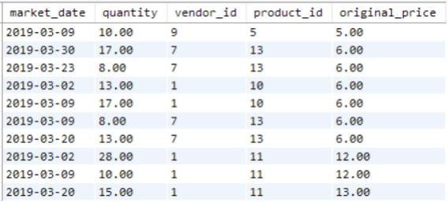
<figcaption></figcaption>

- We can find the least and most expensive item prices in the entire table by using the `MIN()` and `MAX()` functions without grouping in MySQL, as shown here and in Figure 6.13:

```sql
SELECT 
    MIN(original_price) AS minimum_price,
    MAX(original_price) AS maximum_price 
FROM farmers_market.vendor_inventory 
ORDER BY original_price
```

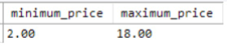
<figcaption></figcaption>

- To get the lowest and highest prices within each product category, we need to group by `product_category_id` (and `product_category_name` if we want to display it). This way, the summary values will be calculated per group. The following query demonstrates this, as shown in Figure 6.14. Table aliases are used to distinguish fields from multiple tables:

```sql
SELECT 
    pc.product_category_name,
    p.product_category_id, 
    MIN(vi.original_price) AS minimum_price, 
    MAX(vi.original_price) AS maximum_price
FROM farmers_market.vendor_inventory AS vi 
    INNER JOIN farmers_market.product AS p
        ON vi.product_id = p.product_id
    INNER JOIN farmers_market.product_category AS pc
        ON p.product_category_id = pc.product_category_id 
GROUP BY pc.product_category_name, p.product_category_id
```

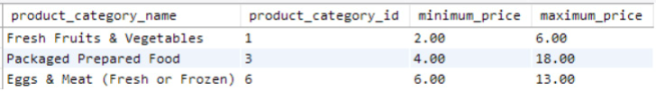
<figcaption></figcaption>

- If we add columns for `MIN(product_name)` and `MAX(product_name)`, we won't get the product names associated with the lowest and highest prices. Instead, we would get the first and last product names sorted alphabetically. To get the products associated with these min and max prices per category, we would use window functions, which will be covered in the next chapter.

# COUNT and COUNT DISTINCT

- Suppose we wanted to count how many products were for sale on each market date or how many different products each vendor offered. We can determine these values using `COUNT` and `COUNT DISTINCT`.
- `COUNT` will count the rows within a group when used with `GROUP BY`, and `COUNT DISTINCT` will count the unique values in the specified field within the group.
- To determine how many products are offered for sale each market date, we can count the rows in the `vendor_inventory` table, grouped by date. This counts the number of products available, as there is a row in this table for each product for each vendor for each market date.
- The values shown in the screenshots are small because the database has only a few sample rows per table, but you can see in Figure 6.15 that the result is a count for each `market_date`.

```sql
SELECT 
    market_date, 
    COUNT(product_id) AS product_count 
FROM farmers_market.vendor_inventory 
GROUP BY market_date
ORDER BY market_date
```

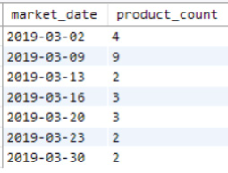
<figcaption></figcaption>

- If we wanted to know how many different products with unique product IDs each vendor brought to market during a date range, we could use `COUNT DISTINCT` on the `product_id` field, like so:

```sql
SELECT 
    vendor_id, 
    COUNT(DISTINCT product_id) AS different_products_offered 
FROM farmers_market.vendor_inventory
WHERE market_date BETWEEN '2019-03-02' AND '2019-03-16'
GROUP BY vendor_id
ORDER BY vendor_id
```

- Note that the `DISTINCT` goes inside the parentheses for the `COUNT()` aggregate function. The results of the query are shown in Figure 6.16.

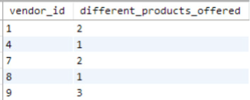
<figcaption></figcaption>

# Average

- What if we also want the average original price of a product per vendor, in addition to the count of different products per vendor? We can add a line to the previous query and use the `AVG()` function, as shown in the following query. The results are shown in Figure 6.17:

```sql
SELECT 
    vendor_id, 
    COUNT(DISTINCT product_id) AS different_products_offered, 
    AVG(original_price) AS average_product_price
FROM farmers_market.vendor_inventory
WHERE market_date BETWEEN '2019-03-02' AND '2019-03-16' 
GROUP BY vendor_id
ORDER BY vendor_id
```

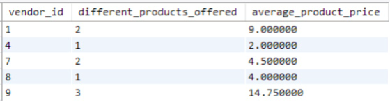
<figcaption></figcaption>

- However, we need to consider what we’re actually averaging. Is it fair to call it “average product price” when the table has one row per type of product? If a vendor brought 100 tomatoes to market, they would all be in one row of the `vendor_inventory` table, so the price of a tomato would only be included in the average once. If the same vendor also sold bouquets of flowers for $20, no matter how many bouquets they brought, that price would only be included once. Calculating the “average product price” this way would just give the average of one tomato and one bouquet.
- To get a true average price of items in each vendor’s inventory between the specified dates, it might make more sense to multiply the quantity of each type of item by its price (a calculation per row), then sum that up and divide by the total quantity of items (a calculation per vendor). Let’s try a calculation that includes these two summary values. We also use the `ROUND()` function to format the output in dollars, as shown in Figure 6.18.

```sql
SELECT 
    vendor_id, 
    COUNT(DISTINCT product_id) AS different_products_offered, 
    SUM(quantity * original_price) AS value_of_inventory, 
    SUM(quantity) AS inventory_item_count,
    ROUND(SUM(quantity * original_price) / SUM(quantity), 2) AS 
average_item_price
FROM farmers_market.vendor_inventory
WHERE market_date BETWEEN '2019-03-02' AND '2019-03-16' 
GROUP BY vendor_id
ORDER BY vendor_id
```
- The multiplication of `quantity * original_price` inside the aggregate function is done per row. Then, the aggregate `SUM`s are calculated. Finally, the division of one `SUM` by the other to determine the “average item price” is performed. This means we’re doing mathematical operations both before and after the `GROUP BY` summarization occurs.

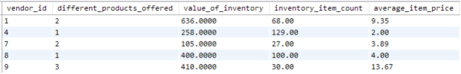
<figcaption></figcaption>

# Filtering with HAVING

- Filtering is another thing that can be done in the query after summarization occurs. 
- In previous chapters and in the following query, we filtered rows using the `WHERE` clause. Here, we’re filtering to a date range in the `WHERE` clause prior to grouping.
- If you want to filter values after the aggregate functions are applied, you can add a `HAVING` clause to the query. This filters the groups based on the summary values.
- So, modifying the previous query, let’s filter to vendors who brought at least 100 items to the farmer’s market over the specified time period. You can see the `HAVING` clause usage in the following code, and the results in Figure 6.19:

```sql
SELECT 
    vendor_id, 
    COUNT(DISTINCT product_id) AS different_products_offered, 
    SUM(quantity * original_price) AS value_of_inventory,
    SUM(quantity) AS inventory_item_count,
    SUM(quantity * original_price) / SUM(quantity) AS average_item_price
FROM farmers_market.vendor_inventory
WHERE market_date BETWEEN '2019-03-02' AND '2019-03-16' 
GROUP BY vendor_id
HAVING inventory_item_count >= 100
ORDER BY vendor_id
```

- If you `GROUP BY` all the fields that should be distinct in your resulting dataset, then add a `HAVING` clause that filters to aggregated rows with `COUNT(*) > 1`, any results returned indicate that there is more than one row with your “unique” combination of values. This highlights the existence of unwanted duplicates in your database or query results!

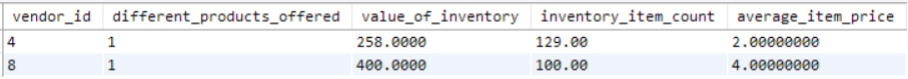
<figcaption></figcaption>

# CASE Statements Inside Aggregate Functions

- Earlier in this chapter, in the query that generated the output in Figure 6.4, we added up the quantity value in the `customer_purchases` table, which included discrete items sold individually as well as bulk items sold by ounce or pound, and it was awkward to add those quantities together. In Chapter 4, “Conditionals / CASE Statements,” you learned about conditional `CASE` statements. Here, we’ll use a `CASE` statement to specify which type of item quantities to add together using each `SUM` aggregate function.
- First, we’ll need to `JOIN` the `customer_purchases` table to the `product` table to pull in the `product_qty_type` column, which currently only contains the values “unit” and “lbs,” as shown in Figure 6.20.

```sql
SELECT 
    cp.market_date,
    cp.vendor_id, 
    cp.customer_id, 
    cp.product_id, 
    cp.quantity, 
    p.product_name, 
    p.product_size, 
    p.product_qty_type
FROM farmers_market.customer_purchases AS cp
    INNER JOIN farmers_market.product AS p
        ON cp.product_id = p.product_id
```

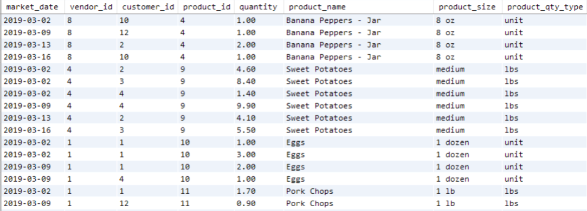
<figcaption></figcaption>

- To create one column that only adds up quantities of products sold by unit, another column that adds up quantities of products sold by the pound, and a third for any products that may be entered in the future that are sold by other units (like bulk ounces), we’ll put `CASE` statements inside the `SUM` functions to indicate which values to add up in each summary column.
- First, we’ll review the results with the `CASE` statements included before grouping or using aggregate functions. Notice in Figure 6.21 that the `CASE` statements have separated the quantity values into three different columns, by `product_qty_type`. These are the values we’ll be adding up per group in the next step:

```sql
SELECT 
    cp.market_date,
    cp.vendor_id,
    cp.customer_id,
    cp.product_id,
    CASE WHEN product_qty_type = "unit" THEN quantity ELSE 0 END AS 
quantity_units,
    CASE WHEN product_qty_type = "lbs" THEN quantity ELSE 0 END AS 
quantity_lbs,
    CASE WHEN product_qty_type NOT IN ("unit","lbs") THEN quantity ELSE 
0 END AS quantity_other,
    p.product_qty_type
FROM farmers_market.customer_purchases cp
    INNER JOIN farmers_market.product p 
        ON cp.product_id = p.product_id
```

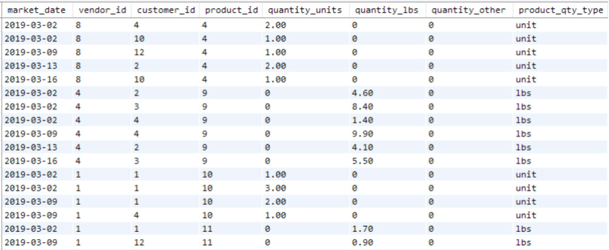
<figcaption></figcaption>

- Now we can add the `SUM` functions around each `CASE` statement to add up these values per market date per customer, as defined in the `GROUP BY` clause. The results are shown in Figure 6.22. (The prior screenshot was just a subset of the full results, so there may be values added into the rows in Figure 6.22 that are not visible in Figure 6.21.)

```sql
SELECT 
    cp.market_date,
    cp.customer_id,
    SUM(CASE WHEN product_qty_type = "unit" THEN quantity ELSE 0 END) AS 
qty_units_purchased,
    SUM(CASE WHEN product_qty_type = "lbs" THEN quantity ELSE 0 END) AS 
qty_lbs_purchased,
    SUM(CASE WHEN product_qty_type NOT IN ("unit","lbs") THEN quantity 
ELSE 0 END) AS qty_other_purchased
FROM farmers_market.customer_purchases cp
    INNER JOIN farmers_market.product p 
        ON cp.product_id = p.product_id
GROUP BY market_date, customer_id 
ORDER BY market_date, customer_id
```

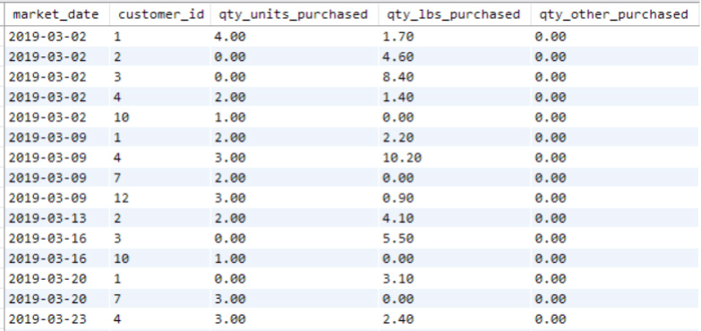
<figcaption></figcaption>

- So now you have seen examples of how to use `COUNT`, `COUNT DISTINCT`, `SUM`, `AVG`, `MIN`, and `MAX` aggregate SQL functions, as well as `CASE` statements and calculations inside the functions, and calculations performed with the summarized values. I hope that by now you are starting to think about how to apply these skills to your own work!

# Exercises Using the Included Database

1. Write a query that determines how many times each vendor has rented a booth at the farmer’s market. In other words, count the vendor booth assignments per `vendor_id`.
2. In Chapter 5, “SQL Joins,” Exercise 3, we asked, “When is each type of fresh fruit or vegetable in season, locally?” Write a query that displays the product category name, product name, earliest date available, and latest date available for every product in the “Fresh Fruits & Vegetables” product category.
3. The Farmer’s Market Customer Appreciation Committee wants to give a bumper sticker to everyone who has ever spent more than $50 at the market. Write a query that generates a list of customers for them to give stickers to, sorted by last name, then first name. (Hint: This query requires you to join two tables, use an aggregate function, and use the `HAVING` keyword.)