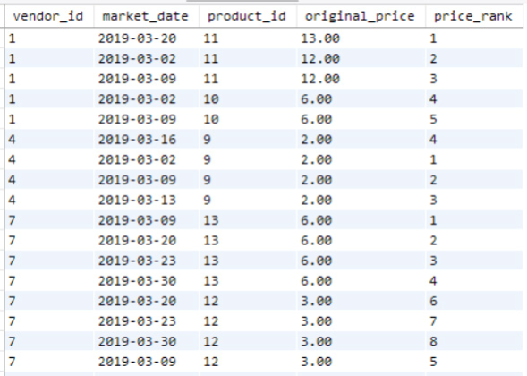

# Introduction

- All the functions we have learned so far, like ROUND(), return one value for each row in the results. When we use GROUP BY, the functions work on multiple values in a group of records, summarizing across many rows in the dataset, like AVG(). But each value returned is still linked to a single row in the results.
- Window functions also work on multiple records, but these records don't need to be grouped in the output. This allows us to compare the values from one row to a group of rows, or partition. This helps us answer questions like: If the dataset was sorted, where would this row be? How does a value in this row compare to the value in the previous row? How does a value in the current row compare to the average value for its group?
- So, window functions return group aggregate calculations along with individual row-level information for items in that group or partition. They can also be used to rank or sort values within each partition.
- One use for window functions in data science is to include information from a past record with the most recent record related to an entity. For example, we could use window functions to get the date of the first purchase a person made at the farmer’s market and show it with their detailed purchase records. This could help us see how long they had been a customer at the time of each purchase.

# ROW NUMBER

- Based on what you’ve learned in previous chapters, if you wanted to find out the cost of the most expensive product sold by each vendor, you could group the records in the `vendor_inventory` table by `vendor_id` and return the highest `original_price` value using the following query:

```sql
SELECT 
    vendor_id, 
    MAX(original_price) AS highest_price 
FROM farmers_market.vendor_inventory 
GROUP BY vendor_id
ORDER BY vendor_id
```

- But this just gives you the price of the most expensive item per vendor. If you wanted to know which item was the most expensive, how would you find out which `product_id` was linked to that `MAX(original_price)` per vendor?
- There is a window function that lets you rank rows by a value — in this case, ranking products per vendor by price — called `ROW_NUMBER()`. This approach will allow you to keep the detailed information that you would otherwise lose by aggregating like we did in the previous query:

```sql
SELECT 
    vendor_id, 
    market_date, 
    product_id, 
    original_price,
    ROW_NUMBER() OVER (PARTITION BY vendor_id ORDER BY original_price DESC) AS 
price_rank
FROM farmers_market.vendor_inventoryORDER BY vendor_id, original_price DESC
```

- Let’s break that syntax down a bit. The `ROW_NUMBER()` line means “number the rows of inventory per vendor, sorted by original price, in descending order.” The part inside the parentheses shows how to apply the `ROW_NUMBER()` function. We’re going to `PARTITION BY vendor_id` (this is like a `GROUP BY` without combining the rows, so we’re telling it how to split the rows into groups, without aggregating). Then within the partition, the `ORDER BY` shows how to sort the rows. So, we’ll sort the rows by price, high to low, within each `vendor_id` partition, and number each row. That means the highest-priced item per vendor will be first, and assigned row number 1.
- You can see in Figure 7.1 that for each vendor, the products are sorted by `original_price`, high to low, and the row numbering column is called `price_rank`. The row numbering starts over when you get to the next `vendor_id`, so the most expensive item per vendor has a `price_rank` of 1.


<figcaption></figcaption>

- To return only the record of the highest-priced item per vendor, you can query the results of the previous query (this is called a subquery) and limit the output to the #1 ranked item per `vendor_id`. With this approach, you’re not using a `GROUP BY` to aggregate the records. You’re sorting the records within each partition (a set of records that share a value or combination of values — `vendor_id` in this case), then filtering to a value (the row number called `price_rank` here) that was evaluated over that partition. Figure 7.2 shows the highest-priced product per vendor using the following query:

```sql
SELECT * FROM
(
    SELECT 
        vendor_id, 
        market_date,
        product_id, 
        original_price,
          ROW_NUMBER() OVER (PARTITION BY vendor_id ORDER BY original_price DESC) AS 
price_rank
    FROM farmers_market.vendor_inventory 
    ORDER BY vendor_id) x
WHERE x.price_rank = 1
```


<figcaption></figcaption>

- This will only return one row per vendor, even if there are multiple products with the same price. To return all products with the highest price per vendor when there is more than one with the same price, use the `RANK` function found in the next section. 
- If you want to determine which one of the multiple items gets returned by this `ROW_NUMBER` function, you can add additional sorting columns in the `ORDER BY` section of the `ROW_NUMBER` function. For example, you can sort by both `original_price` (descending) and `market_date` (ascending) to get the product brought to market by each vendor the earliest that had this top price.
- You’ll notice that the preceding query has a different structure than the queries we have written so far. There is one query embedded inside the other! Sometimes this is called “querying from a derived table,” but is more commonly called a “subquery.” 
- What we’re doing is treating the results of the “inner” `SELECT` statement like a table, here given the table alias x, selecting all columns from it, and filtering to only the rows with a particular `ROW_NUMBER`. Our `ROW_NUMBER` column is aliased `price_rank`, and we’re filtering to `price_rank = 1`, because we numbered the rows by `original_price` in descending order, so the most expensive item will have the lowest row number.
- The reason we have to structure this as a subquery is that the entire dataset has to be processed in order for the window function to find the highest price per vendor. So we can’t filter the results using a `WHERE` clause (which you’ll remember evaluates the conditional statements row by row) because when that filtering is applied, the `ROW_NUMBER` has not yet been calculated for every row.
- Figure 7.3 illustrates which parts of the SQL statement are considered the “inner” and “outer” queries. The “outer” part of a subquery is processed after the “inner” query is complete, so the row numbers have been determined, and we can then filter by the values in the price_rank column.


<figcaption></figcaption>

- Many SQL editors allow you to run the inner query by itself. You can do this by highlighting it and executing the selected SQL only. This allows you to preview the results of the inner query that will then be used by the outer query.
- If we didn’t use a subquery and tried to filter based on the values in the `price_rank` field by adding a `WHERE` clause to the first query with the `ROW_NUMBER` function, we would get an error. The `price_rank` value is unknown when the `WHERE` clause conditions are evaluated per row because the window functions have not yet checked the entire dataset to determine the ranking. If we tried to put the `ROW_NUMBER` function in the `WHERE` clause instead of referencing the `price_rank` alias, we would get a different error for the same reason.
- You will see the subquery format throughout this chapter. This is because if you want to do anything with the results of most window functions, you have to allow them to calculate across the entire dataset first. Then, by treating the results like a table, you can query from and filter by the results returned by the window functions.
- Note that you can also use `ROW_NUMBER` without a `PARTITION BY` clause to number every record across the whole result (instead of numbering per partition). If you use the same ORDER BY clause we did earlier and eliminate the `PARTITION BY` clause, then only one item with the highest price in the entire results set would get the `price_rank` of 1, instead of one item per vendor.

# RANK and DENSE RANK


<br><br><br><br><br><br><br><br><br><br><br><br>
<html><head><meta http-equiv="Content-Type" content="text/html;charset=utf-8" /><link href="style.css" rel="stylesheet" type="text/css" /><title>SQL for Data Scientists: A Beginner's Guide for Building Datasets for Analysis</title></head><body><div type="bodymatter" class="calibre1" id="calibre_link-0">
<section aria-labelledby="c07_1" type="chapter" role="doc-chapter" class="calibre2">
<header class="calibre3">
<h1 id="calibre_link-29" class="calibre4"><span aria-label="97" type="pagebreak" id="calibre_link-30" role="doc-pagebreak" class="calibre5"></span><a id="calibre_link-31" class="calibre6"></a><span class="calibre">CHAPTER 7</span><br class="calibre7" /><span class="calibre">Window Functions and Subqueries</span></h1>
</header>
<section aria-label="chapter opening" class="calibre2"><span id="calibre_link-32" class="calibre"></span>
<p id="calibre_link-33" class="calibre8">All of the functions that have been covered in this book so far, like 
<code class="calibre9">ROUND</code>
(
<code class="calibre9">)</code>
, return one value in each row of the results dataset. When 
<code class="calibre9">GROUP BY</code>
 is used, the functions operate on multiple values in an aggregated group of records, summarizing across multiple rows in the underlying dataset, like 
<code class="calibre9">AVG()</code>
, but each value returned is associated with a single row in the results.</p>
<p id="calibre_link-34" class="calibre8"><i class="calibre10">Window functions</i> operate across multiple records, as well, but those records don't have to be grouped in the output. This gives the ability to put the values from one row of data into context compared to a group of rows, or partition, enabling an analyst to write queries that answer questions like: If the dataset were sorted, where would this row land in the results? How does a value in this row compare to a value in the prior row? How does a value in the current row compare to the average value for its group?</p>
<p id="calibre_link-35" class="calibre8">So, window functions return group aggregate calculations alongside individual row‐level information for items in that group, or partition. They can also be used to rank or sort values within each partition.</p>
<p id="calibre_link-36" class="calibre8">One use for window functions in data science is to include some information from a past record alongside the most recent detail record related to an entity. For example, we could use window functions to get the date of the first purchase a person made at the farmer’s market, to be returned alongside their detailed purchase records, which could then be used to determine how long they had been a customer at the time each purchase was made.</p>
</section>
<section aria-labelledby="head-2-60" class="calibre2"><span id="calibre_link-37" class="calibre"></span>
<h2 id="calibre_link-38" class="calibre11">ROW NUMBER</h2>
<p class="calibre8"><span aria-label="98" type="pagebreak" id="calibre_link-39" role="doc-pagebreak" class="calibre12"></span>Based on what you've learned in previous chapters, if you wanted to determine how much the most expensive product sold by each vendor costs, you could group the records in the 
<code class="calibre9">vendor_inventory</code>
 table by 
<code class="calibre9">vendor_id</code>
, and return the maximum 
<code class="calibre9">original_price</code>
 value using the following query:</p>
<pre id="calibre_link-40" class="calibre13">
<code class="calibre9">SELECT </code>
   
<code class="calibre9"> vendor_id, </code>
   
<code class="calibre9"> MAX(original_price) AS highest_price</code>
<code class="calibre9">FROM farmers_market.vendor_inventory</code>
<code class="calibre9">GROUP BY vendor_id</code>
<code class="calibre9">ORDER BY vendor_id</code>
</pre>
<p id="calibre_link-41" class="calibre8">But this just gives you the price of the most expensive item per vendor. If you wanted to know which item was the most expensive, how would you determine which 
<code class="calibre9">product_id</code>
 was associated with that 
<code class="calibre9">MAX(original_price)</code>
 per vendor?</p>
<p class="calibre8">There is a window function that enables you to rank rows by a value&mdash;in this case, ranking products per vendor by price&mdash;called 
<code class="calibre9">ROW_NUMBER()</code>
. This approach will allow you to maintain the detail‐level information that you would otherwise lose by aggregating like we did in the preceding query:</p>
<pre id="calibre_link-42" class="calibre13">
<code class="calibre9">SELECT </code>
   
<code class="calibre9"> vendor_id, </code>
   
<code class="calibre9"> market_date,</code>
   
<code class="calibre9"> product_id, </code>
   
<code class="calibre9"> original_price,</code>
   
<code class="calibre9"> ROW_NUMBER() OVER (PARTITION BY vendor_id ORDER BY original_price DESC) AS price:rank</code>
<code class="calibre9">FROM farmers_market.vendor_inventoryORDER BY vendor_id, original_price DESC</code>
</pre>
<p id="calibre_link-43" class="calibre8">Let's break that syntax down a bit. I would interpret the 
<code class="calibre9">ROW_NUMBER()</code>
 line as “number the rows of inventory per vendor, sorted by original price, in descending order.” The part inside the parentheses says how to apply the 
<code class="calibre9">ROW_NUMBER()</code>
 function. We're going to 
<code class="calibre9">PARTITION BY vendor_id</code>
 (you can think of this like a 
<code class="calibre9">GROUP BY</code>
 without actually combining the rows, so we're telling it how to split the rows into groups, without aggregating). Then within the partition, the 
<code class="calibre9">ORDER BY</code>
 indicates how to sort the rows. So, we'll sort the rows by price, high to low, within each 
<code class="calibre9">vendor_id</code>
 partition, and number each row. That means the highest‐priced item per vendor will be first, and assigned row number 1.</p>
<p id="calibre_link-44" class="calibre8">You can see in <a href="#calibre_link-1" id="calibre_link-2" class="calibre6">Figure 7.1</a> that for each vendor, the products are sorted by 
<code class="calibre9">original_price</code>
, high to low, and the row numbering column is called 
<code class="calibre9">price:rank</code>
. The row numbering starts over when you get to the next 
<code class="calibre9">vendor_id</code>
, so the most expensive item per vendor has a 
<code class="calibre9">price:rank</code>
 of 1.<span aria-label="99" type="pagebreak" id="calibre_link-45" role="doc-pagebreak" class="calibre12"></span></p>
<figure class="calibre14"> <figcaption class="calibre15">
<p class="calibre8"><span class="figurelabel"><a href="#calibre_link-2" id="calibre_link-1" role="doc-backlink" class="calibre6">Figure 7.1</a></span></p>
</figcaption>
</figure>
<p class="calibre8">To return only the record of the highest‐priced item per vendor, you can query the results of the previous query (which is called a subquery), and limit the output to the #1 ranked item per 
<code class="calibre9">vendor_id</code>
. With this approach, you're not using a 
<code class="calibre9">GROUP BY</code>
 to aggregate the records. You're sorting the records within each partition (a set of records that share a value or combination of values&mdash;
<code class="calibre9">vendor_id</code>
 in this case), then filtering to a value (the row number called 
<code class="calibre9">price:rank</code>
 here) that was evaluated over that partition. <a href="#calibre_link-3" id="calibre_link-4" class="calibre6">Figure 7.2</a> shows the highest‐priced product per vendor using the following query:</p>
<pre id="calibre_link-46" class="calibre13">
<code class="calibre9">SELECT * FROM</code>
<code class="calibre9">(</code>
   
<code class="calibre9"> SELECT </code>
       
<code class="calibre9"> vendor_id, </code>
       
<code class="calibre9"> market_date,</code>
       
<code class="calibre9"> product_id, </code>
       
<code class="calibre9"> original_price,</code>
       
<code class="calibre9"> ROW_NUMBER() OVER (PARTITION BY vendor_id ORDER BY original_price DESC) AS price:rank</code>
   
<code class="calibre9"> FROM farmers_market.vendor_inventory </code>
   
<code class="calibre9"> ORDER BY vendor_id) x</code>
<code class="calibre9">WHERE x.price:rank = 1</code>
<span aria-label="100" type="pagebreak" id="calibre_link-47" role="doc-pagebreak" class="calibre12"></span></pre>
<figure class="calibre14"> 
<figcaption class="calibre15">
<p class="calibre8"><span class="figurelabel"><a href="#calibre_link-4" id="calibre_link-3" role="doc-backlink" class="calibre6">Figure 7.2</a></span></p>
</figcaption>
</figure>
<p id="calibre_link-48" class="calibre8">This will only return one row per vendor, even if there are multiple products with the same price. To return all products with the highest price per vendor when there is more than one with the same price, use the 
<code class="calibre9">RANK</code>
 function found in the next section. If you want to determine which one of the multiple items gets returned by this 
<code class="calibre9">ROW_NUMBER</code>
 function, you can add additional sorting columns in the 
<code class="calibre9">ORDER BY</code>
 section of the 
<code class="calibre9">ROW_NUMBER</code>
 function. For example, you can sort by both 
<code class="calibre9">original_price</code>
 (descending) and 
<code class="calibre9">market_date</code>
 (ascending) to get the product brought to market by each vendor the earliest that had this top price.</p>
<p id="calibre_link-49" class="calibre8">You'll notice that the preceding query has a different structure than the queries we have written so far. There is one query embedded inside the other! Sometimes this is called “querying from a derived table,” but is more commonly called a “subquery.” What we're doing is treating the results of the “inner” 
<code class="calibre9">SELECT</code>
 statement like a table, here given the table alias 
<code class="calibre9">x</code>
, selecting all columns from it, and filtering to only the rows with a particular 
<code class="calibre9">ROW_NUMBER</code>
. Our 
<code class="calibre9">ROW_NUMBER</code>
 column is aliased 
<code class="calibre9">price:rank</code>
, and we're filtering to 
<code class="calibre9">price:rank = 1</code>
, because we numbered the rows by 
<code class="calibre9">original_price</code>
 in descending order, so the most expensive item will have the lowest row number.</p>
<p id="calibre_link-50" class="calibre8">The reason we have to structure this as a subquery is that the entire dataset has to be processed in order for the window function to find the highest price per vendor. So we can't filter the results using a 
<code class="calibre9">WHERE</code>
 clause (which you'll remember evaluates the conditional statements row by row) because when that filtering is applied, the 
<code class="calibre9">ROW_NUMBER</code>
 has not yet been calculated for every row.</p>
<p id="calibre_link-51" class="calibre8"><a href="#calibre_link-5" id="calibre_link-6" class="calibre6">Figure 7.3</a> illustrates which parts of the SQL statement are considered the “inner” and “outer” queries. The “outer” part of a subquery is processed <i class="calibre10">after</i> the “inner” query is complete, so the row numbers have been determined, and we can then filter by the values in the 
<code class="calibre9">price:rank</code>
 column.</p>
<figure class="calibre14"> 
<figcaption class="calibre15">
<p class="calibre8"><span class="figurelabel"><a href="#calibre_link-6" id="calibre_link-5" role="doc-backlink" class="calibre6">Figure 7.3</a></span></p>
</figcaption>
</figure>
<aside class="calibre16">
<div class="top"><hr class="calibre17" /></div>
<section class="feature">
<h3 class="calibre18">TIP</h3>
<p id="calibre_link-52" class="calibre19">Many SQL editors allow you to run the inner query by itself, by highlighting it and executing the selected SQL only. This allows you to preview the results of the inner query that will then be used by the outer query.</p>
<div class="top"><hr class="calibre17" /></div>
</section>
</aside>
<p id="calibre_link-53" class="calibre8"><span aria-label="101" type="pagebreak" id="calibre_link-54" role="doc-pagebreak" class="calibre12"></span></p>
<p id="calibre_link-55" class="calibre8">If we didn't use a subquery, and had attempted to filter based on the values in the 
<code class="calibre9">price:rank</code>
 field by adding a 
<code class="calibre9">WHERE</code>
 clause to the first query with the 
<code class="calibre9">ROW_NUMBER</code>
 function, we would get an error. The 
<code class="calibre9">price:rank</code>
 value is unknown at the time the 
<code class="calibre9">WHERE</code>
 clause conditions are evaluated per row, because the window functions have not yet had a chance to check the entire dataset to determine the ranking. If we tried to put the 
<code class="calibre9">ROW_NUMBER</code>
 function in the 
<code class="calibre9">WHERE</code>
 clause, instead of referencing the 
<code class="calibre9">price:rank</code>
 alias, we would get a different error, but for the same reason.</p>
<p id="calibre_link-56" class="calibre8">You will see the subquery format throughout this chapter, because if you want to do anything with the results of most window functions, you have to allow them to calculate across the entire dataset first. Then, by treating the results like a table, you can query from and filter by the results returned by the window functions.</p>
<p id="calibre_link-57" class="calibre8">Note that you can also use 
<code class="calibre9">ROW_NUMBER</code>
 without a 
<code class="calibre9">PARTITION BY</code>
 clause, to number every record across the whole result (instead of numbering per partition). If you were to use the same 
<code class="calibre9">ORDER BY</code>
 clause we did earlier, and eliminate the 
<code class="calibre9">PARTITION BY</code>
 clause, then only one item with the highest price in the entire results set would get the 
<code class="calibre9">price:rank</code>
 of 1, instead of one item per vendor.</p>
</section>
<section aria-labelledby="head-2-61" class="calibre2"><span id="calibre_link-58" class="calibre"></span>
<h2 id="calibre_link-59" class="calibre11">RANK and DENSE RANK</h2>
<p id="calibre_link-60" class="calibre8">Two other window functions are very similar to 
<code class="calibre9">ROW_NUMBER</code>
 and have the same syntax, but provide slightly different results.</p>
<p class="calibre8">The 
<code class="calibre9">RANK</code>
 function numbers the results just like 
<code class="calibre9">ROW_NUMBER</code>
 does, but gives rows with the same value the same ranking. If we run the same query as before, but replace 
<code class="calibre9">ROW_NUMBER</code>
 with 
<code class="calibre9">RANK</code>
, we get the output shown in <a href="#calibre_link-7" id="calibre_link-8" class="calibre6">Figure 7.4</a>.</p>
<pre id="calibre_link-61" class="calibre13">
<code class="calibre9">SELECT </code>
   
<code class="calibre9"> vendor_id, </code>
   
<code class="calibre9"> market_date,</code>
   
<code class="calibre9"> product_id, </code>
   
<code class="calibre9"> original_price,</code>
   
<code class="calibre9"> RANK() OVER (PARTITION BY vendor_id ORDER BY original_price DESC) AS price:rank</code>
   
<code class="calibre9"> FROM farmers_market.vendor_inventory</code>
<code class="calibre9">ORDER BY vendor_id, original_price DESC</code>
</pre>
<p id="calibre_link-62" class="calibre8">If we used subquery structure and embedded this query inside another 
<code class="calibre9">SELECT</code>
 statement like we did previously, and filtered to 
<code class="calibre9">price:rank = 1</code>
, multiple rows per vendor would be returned.</p>
<p id="calibre_link-63" class="calibre8">Notice in <a href="#calibre_link-7" class="calibre6">Figure 7.4</a> that the ranking for 
<code class="calibre9">vendor_id</code>
 1 goes from 1 to 2 to 4, skipping 3. That's because there's a tie for second place, so there's no third place. If you don't want to skip numbers like this in your ranking when there is a tie <span aria-label="102" type="pagebreak" id="calibre_link-64" role="doc-pagebreak" class="calibre12"></span>(so the items for 
<code class="calibre9">vendor_id</code>
 in the example would be numbered 1 and 2 instead of 1 and 5), use the 
<code class="calibre9">DENSE_RANK</code>
 function. If you don't want any ties in your numbering at all, and want each row to have its own number, use the 
<code class="calibre9">ROW_NUMBER</code>
 function (compare the output in <a href="#calibre_link-7" class="calibre6">Figure 7.4</a> to the output in <a href="#calibre_link-1" class="calibre6">Figure 7.1</a>).</p>
<figure class="calibre14"> 
<figcaption class="calibre15">
<p class="calibre8"><span class="figurelabel"><a href="#calibre_link-8" id="calibre_link-7" role="doc-backlink" class="calibre6">Figure 7.4</a></span></p>
</figcaption>
</figure>
</section>
<section aria-labelledby="head-2-62" class="calibre2"><span id="calibre_link-65" class="calibre"></span>
<h2 id="calibre_link-66" class="calibre11">NTILE</h2>
<p id="calibre_link-67" class="calibre8">The 
<code class="calibre9">ROW_NUMBER()</code>
 and 
<code class="calibre9">RANK()</code>
 functions can help answer a question that asks something like “What are the top 10 items sold at the farmer’s market, by price?” (by filtering the results to rows numbered less than or equal to 10). But what if you were asked to return the “top tenth” of the inventory, when sorted by price? You could start by running a query that used the 
<code class="calibre9">COUNT()</code>
 function, dividing the number returned by 10, then writing another query that numbers the rows, and filtering to those with a row number less than or equal to the number you just determined. But that isn't a dynamic solution, and you'd have to modify it as the number of rows in the database changed.</p>
<p class="calibre8">The dynamic solution is to use the 
<code class="calibre9">NTILE</code>
 function. With 
<code class="calibre9">NTILE</code>
, you specify a number inside the parentheses, 
<code class="calibre9">NTILE(n)</code>
, to indicate that you want the results broken up into <i class="calibre10">n</i> blocks. So, to get the top tenth, you could put 10 in the parentheses, with no partition (segmenting the entire results set), then filter to the rows in 
<code class="calibre9">NTILE</code>
 1, like so:</p>
<pre id="calibre_link-68" class="calibre13">
<code class="calibre9">SELECT </code>
   
<code class="calibre9"> vendor_id, </code>
   
<code class="calibre9"> market_date,<span aria-label="103" type="pagebreak" id="calibre_link-69" role="doc-pagebreak" class="calibre12"></span></code>
   
<code class="calibre9"> product_id, </code>
   
<code class="calibre9"> original_price,</code>
   
<code class="calibre9"> NTILE(10) OVER (ORDER BY original_price DESC) AS price:ntile</code>
   
<code class="calibre9"> FROM farmers_market.vendor_inventory</code>
<code class="calibre9">ORDER BY original_price DESC</code>
</pre>
<p id="calibre_link-70" class="calibre8">If the number of rows in the results set can be divided evenly, the results will be broken up into <i class="calibre10">n</i> equally sized groups, labeled 1 to <i class="calibre10">n</i>. If they can't be divided up evenly, some groups will end up with one more row than others.</p>
<p id="calibre_link-71" class="calibre8">Note that the 
<code class="calibre9">NTILE</code>
 is only using the count of rows to split the groups (or to split the partition into groups, if you specify a partition), and is not using a field value to determine where to make the splits. Therefore, it's possible that two rows with the same value specified in the 
<code class="calibre9">ORDER BY</code>
 clause (two products with the same 
<code class="calibre9">original_price</code>
, in this case) will end up in two different 
<code class="calibre9">NTILE</code>
 groups.</p>
<p id="calibre_link-72" class="calibre8">You can sort on additional fields if you want a little more control over how the rows are split into 
<code class="calibre9">NTILE</code>
 groups. But if you want to ensure that all items with the same price are grouped together, for example, then it would make more sense to use 
<code class="calibre9">RANK</code>
 than 
<code class="calibre9">NTILE</code>
, because in that case, you aren't looking for evenly sized groupings.</p>
</section>
<section aria-labelledby="head-2-63" class="calibre2"><span id="calibre_link-73" class="calibre"></span>
<h2 id="calibre_link-74" class="calibre11">Aggregate Window Functions</h2>
<p id="calibre_link-75" class="calibre8">You learned about aggregate SQL functions like 
<code class="calibre9">SUM()</code>
 in <a href="c06.xhtml" class="calibre6">Chapter 6</a>, “Aggregating Results for Analysis,” and in this chapter you have learned about window functions that partition the results set. Can you imagine how they might be used together? It turns out that you can use most aggregate functions across partitions like the window functions, returning an aggregate calculation for a partition on every row in that partition (or, for the whole results set, if you don't use the 
<code class="calibre9">PARTITION BY</code>
 clause). One way this approach can be used is to compare each row's value to the aggregate value for that grouped category.</p>
<p class="calibre8">For example, what if you are a farmer selling products at the market, and you want to know which of your products were above the average price per product on each market date? (Remember that because of the way our database is designed, this isn't a true average for the full inventory, because we're not multiplying by a quantity, but you can think of it as the average display price in a product catalog.) We can use the 
<code class="calibre9">AVG()</code>
 function as a window function, partitioned by 
<code class="calibre9">market_date</code>
, and compare each product's price to that value. First, let's try using 
<code class="calibre9">AVG()</code>
 as a window function. The output of the following query is shown in <a href="#calibre_link-9" id="calibre_link-10" class="calibre6">Figure 7.5</a>:</p>
<pre id="calibre_link-76" class="calibre13">
   
<code class="calibre9"> SELECT </code>
       
<code class="calibre9"> vendor_id, </code>
       
<code class="calibre9"> market_date,</code>
       
<code class="calibre9"> product_id, <span aria-label="104" type="pagebreak" id="calibre_link-77" role="doc-pagebreak" class="calibre12"></span></code>
       
<code class="calibre9"> original_price,</code>
       
<code class="calibre9"> AVG(original_price) OVER (PARTITION BY market_date ORDER BY market_date) </code>
           
<code class="calibre9"> AS average_cost_product_by_market_date</code>
   
<code class="calibre9"> FROM farmers_market.vendor_inventory</code>
</pre>
<figure class="calibre14"> 
<figcaption class="calibre15">
<p class="calibre8"><span class="figurelabel"><a href="#calibre_link-10" id="calibre_link-9" role="doc-backlink" class="calibre6">Figure 7.5</a></span></p>
</figcaption>
</figure>
<p id="calibre_link-78" class="calibre8">The 
<code class="calibre9">AVG()</code>
 function in this query is structured as a window function, meaning it has “OVER (PARTITION BY __ ORDER BY __)” syntax, so instead of returning a single row per group with the average for that group, like you would get with 
<code class="calibre9">GROUP BY</code>
, this function displays the average for the partition on every row within the partition. You can see in <a href="#calibre_link-9" class="calibre6">Figure 7.5</a> that when you get to a new 
<code class="calibre9">market_date</code>
 value in the results dataset, the 
<code class="calibre9">average_cost_product_by_market_date</code>
 value changes.</p>
<p id="calibre_link-79" class="calibre8">Now, let's wrap that query inside another query (use it as a subquery) so we can compare the original price per item to the average cost of products on each market date that has been calculated by the window function. In this example, we are comparing the values in the last two columns of <a href="#calibre_link-9" class="calibre6">Figure 7.5</a>. Remember that we can't compare the two values in the original query, because the window function is calculated over multiple rows and won't have a value for the partition yet when the 
<code class="calibre9">WHERE</code>
 clause filters are being applied row by row.</p>
<p class="calibre8">Using a subquery, we can filter the results to a single vendor, with 
<code class="calibre9">vendor_id</code>
 1, and only display products that have prices above the market date's average product cost. Here we will also format the 
<code class="calibre9">average_cost_product_by_market_date</code>
 to two digits after the decimal point using the 
<code class="calibre9">ROUND()</code>
 function:</p>
<pre id="calibre_link-80" class="calibre13">
<code class="calibre9">SELECT * FROM</code>
<code class="calibre9">(</code>
   
<code class="calibre9"> SELECT </code>
       
<code class="calibre9"> vendor_id, </code>
       
<code class="calibre9"> market_date,</code>
       
<code class="calibre9"> product_id, <span aria-label="105" type="pagebreak" id="calibre_link-81" role="doc-pagebreak" class="calibre12"></span></code>
       
<code class="calibre9"> original_price,</code>
       
<code class="calibre9"> ROUND(AVG(original_price) OVER (PARTITION BY market_date ORDER BY market_date), 2) </code>
             
<code class="calibre9"> AS average_cost_product_by_market_date</code>
   
<code class="calibre9"> FROM farmers_market.vendor_inventory</code>
<code class="calibre9">) x</code>
<code class="calibre9">WHERE x.vendor_id = 1 </code>
   
<code class="calibre9"> AND x.original_price&gt; x.average_cost_product_by_market_date</code>
<code class="calibre9">ORDER BY x.market_date, x.original_price DESC</code>
</pre>
<p id="calibre_link-82" class="calibre8">Note that we will get different (and incorrect) results if we put the 
<code class="calibre9">WHERE</code>
 clause filtering by 
<code class="calibre9">vendor_id</code>
 inside the parentheses with the original query in this case. That's because the results set of the inner 
<code class="calibre9">SELECT</code>
 statement would be filtered to 
<code class="calibre9">vendor_id</code>
 1 before the window function was calculated, we would only be calculating the average price of vendor 1's products! Since we want to compare vendor 1's prices on each market date to the average price of all vendors’ products on each market date, we don't want to filter to 
<code class="calibre9">vendor_id</code>
 1 until after the averages have been calculated, so we put the 
<code class="calibre9">WHERE</code>
 clause on the “outer” query outside the parentheses.</p>
<p id="calibre_link-83" class="calibre8">The results of the preceding query are shown in <a href="#calibre_link-11" id="calibre_link-12" class="calibre6">Figure 7.6</a>. So 
<code class="calibre9">vendor_id</code>
 1 had a single product, with 
<code class="calibre9">product_id</code>
 11, that was above the average product cost on each of the market dates listed.</p>
<figure class="calibre14"> 
<figcaption class="calibre15">
<p class="calibre8"><span class="figurelabel"><a href="#calibre_link-12" id="calibre_link-11" role="doc-backlink" class="calibre6">Figure 7.6</a></span></p>
</figcaption>
</figure>
<p class="calibre8">Another use of an aggregate window function is to count how many items are in each partition. The following is a query that counts how many different products each vendor brought to market on each date, and displays that count on each row. This way, even if the results weren't sorted in a way that let you quickly determine how many inventory rows there are for each vendor, you would know that the row you're looking at represents just one of the products in a counted set:</p>
<pre id="calibre_link-84" class="calibre13">
<code class="calibre9">SELECT </code>
   
<code class="calibre9"> vendor_id, </code>
   
<code class="calibre9"> market_date,</code>
   
<code class="calibre9"> product_id, </code>
   
<code class="calibre9"> original_price,</code>
   
<code class="calibre9"> COUNT(product_id) OVER (PARTITION BY market_date, vendor_id) vendor_product_count_per_market_date</code>
   
<code class="calibre9"> FROM farmers_market.vendor_inventory </code>
<code class="calibre9">ORDER BY vendor_id, market_date, original_price DESC</code>
<span aria-label="106" type="pagebreak" id="calibre_link-85" role="doc-pagebreak" class="calibre12"></span></pre>
<p id="calibre_link-86" class="calibre8">The output for this query is shown in <a href="#calibre_link-13" id="calibre_link-14" class="calibre6">Figure 7.7</a>. You can see that even if I'm only looking at one row for vendor 9 on March 9, 2019, I would know that it is one of three products that vendor had in their inventory on that market date.</p>
<figure class="calibre14"> 
<figcaption class="calibre15">
<p class="calibre8"><span class="figurelabel"><a href="#calibre_link-14" id="calibre_link-13" role="doc-backlink" class="calibre6">Figure 7.7</a></span></p>
</figcaption>
</figure>
<p class="calibre8">You can also use aggregate window functions to calculate running totals. In the first query shown next, we're not using a 
<code class="calibre9">PARTITION BY</code>
 clause, so the running total of the price is calculated across the entire results set, in the sort order specified in the 
<code class="calibre9">ORDER BY</code>
 clause of the 
<code class="calibre9">SUM()</code>
 window function. The results are displayed in <a href="#calibre_link-15" id="calibre_link-16" class="calibre6">Figure 7.8</a>.</p>
<pre id="calibre_link-87" class="calibre13">
<code class="calibre9">SELECT customer_id, </code>
   
<code class="calibre9"> market_date, </code>
   
<code class="calibre9"> vendor_id, </code>
   
<code class="calibre9"> product_id, </code>
   
<code class="calibre9"> quantity * cost_to_customer_per_qty AS price,</code>
   
<code class="calibre9"> SUM(quantity * cost_to_customer_per_qty) OVER (ORDER BY market_date, transaction_time, customer_id, product_id) AS running_total_purchases</code>
<code class="calibre9">FROM farmers_market.customer_purchases</code>
<span aria-label="107" type="pagebreak" id="calibre_link-88" role="doc-pagebreak" class="calibre12"></span></pre>
<figure class="calibre14"> 
<figcaption class="calibre15">
<p class="calibre8"><span class="figurelabel"><a href="#calibre_link-16" id="calibre_link-15" role="doc-backlink" class="calibre6">Figure 7.8</a></span></p>
</figcaption>
</figure>
<p class="calibre8">In this next query, we are calculating the same running total, but it is partitioned by 
<code class="calibre9">customer_id</code>
. That means that each time we get to a new 
<code class="calibre9">customer_id</code>
, the running total resets. So we're getting a running total of the cost of items purchased by each customer, sorted by the date and time, and the product ID (in case any two items have identical purchase times). The result is shown in <a href="#calibre_link-17" id="calibre_link-18" class="calibre6">Figure 7.9</a>.</p>
<pre id="calibre_link-89" class="calibre13">
<code class="calibre9">SELECT customer_id, </code>
   
<code class="calibre9"> market_date, </code>
   
<code class="calibre9"> vendor_id, </code>
   
<code class="calibre9"> product_id, </code>
   
<code class="calibre9"> quantity * cost_to_customer_per_qty AS price,</code>
   
<code class="calibre9"> SUM(quantity * cost_to_customer_per_qty) OVER (PARTITION BY customer_id ORDER BY market_date, transaction_time, product_id) AS customer_spend_running_total</code>
<code class="calibre9">FROM farmers_market.customer_purchases</code>
</pre>
<figure class="calibre14"> 
<figcaption class="calibre15">
<p class="calibre8"><span class="figurelabel"><a href="#calibre_link-18" id="calibre_link-17" role="doc-backlink" class="calibre6">Figure 7.9</a></span></p>
</figcaption>
</figure>
<p class="calibre8">This 
<code class="calibre9">SUM</code>
 functions as a running total because of the combination of the 
<code class="calibre9">PARTITION BY</code>
 and 
<code class="calibre9">ORDER BY</code>
 clauses in the window function. We showed what happens when there is only an 
<code class="calibre9">ORDER BY</code>
 clause, and when both clauses are present. What do you expect to happen when there is only a 
<code class="calibre9">PARTITION BY</code>
 clause (and no 
<code class="calibre9">ORDER BY</code>
 clause)?</p>
<pre id="calibre_link-90" class="calibre13">
<code class="calibre9">SELECT customer_id, </code>
   
<code class="calibre9"> market_date, </code>
   
<code class="calibre9"> vendor_id, </code>
   
<code class="calibre9"> product_id, </code>
   
<code class="calibre9"> ROUND(quantity * cost_to_customer_per_qty, 2) AS price,</code>
   
<code class="calibre9"> ROUND(SUM(quantity * cost_to_customer_per_qty) OVER (PARTITION BY customer_id), 2) AS customer_spend_total</code>
<code class="calibre9">FROM farmers_market.customer_purchases</code>
</pre>
<p id="calibre_link-91" class="calibre8">As hinted at by the field name alias, this version with no in‐partition sorting calculates the total spent by the customer and displays that summary total on <span aria-label="108" type="pagebreak" id="calibre_link-92" role="doc-pagebreak" class="calibre12"></span>every row. So, without the 
<code class="calibre9">ORDER BY</code>
, the 
<code class="calibre9">SUM</code>
 is calculated across the entire partition, instead of as a per‐row running total, as shown in <a href="#calibre_link-19" id="calibre_link-20" class="calibre6">Figure 7.10</a>. We also added the 
<code class="calibre9">ROUND()</code>
 function so this final output displays the prices with two numbers after the decimal point.</p>
<figure class="calibre14"> 
<figcaption class="calibre15">
<p class="calibre8"><span class="figurelabel"><a href="#calibre_link-20" id="calibre_link-19" role="doc-backlink" class="calibre6">Figure 7.10</a></span></p>
</figcaption>
</figure>
</section>
<section aria-labelledby="head-2-64" class="calibre2"><span id="calibre_link-93" class="calibre"></span>
<h2 id="calibre_link-94" class="calibre11">LAG and LEAD</h2>
<p id="calibre_link-95" class="calibre8">With the running total example in the previous section, you can start to see how SQL can be used to calculate changes in a value over time.</p>
<p id="calibre_link-96" class="calibre8">Using the 
<code class="calibre9">vendor_booth_assignments</code>
 table in the Farmer's Market database, we can display each vendor's booth assignment for each 
<code class="calibre9">market_date</code>
 alongside their previous booth assignments using the 
<code class="calibre9">LAG()</code>
 function.</p>
<p class="calibre8">
<code class="calibre9">LAG</code>
 retrieves data from a row that is a selected number of rows back in the dataset. You can set the number of rows (offset) to any integer value <i class="calibre10">x</i> to count <i class="calibre10">x</i> rows backwards, following the sort order specified in the 
<code class="calibre9">ORDER BY</code>
 section of the window function:</p>
<pre id="calibre_link-97" class="calibre13">
<code class="calibre9">SELECT</code>
   
<code class="calibre9"> market_date, </code>
   
<code class="calibre9"> vendor_id,</code>
   
<code class="calibre9"> booth_number,</code>
   
<code class="calibre9"> LAG(booth_number,1) OVER (PARTITION BY vendor_id ORDER BY market_date, vendor_id) AS previous_booth_number</code>
<code class="calibre9">FROM farmers_market.vendor_booth_assignments</code>
<code class="calibre9">ORDER BY market_date, vendor_id, booth_number</code>
</pre>
<p id="calibre_link-98" class="calibre8">In this case, for each 
<code class="calibre9">vendor_id</code>
 for each 
<code class="calibre9">market_date</code>
, we're pulling the 
<code class="calibre9">booth_number</code>
 the vendor had 1 market date in the past. As you can see in <a href="#calibre_link-21" id="calibre_link-22" class="calibre6">Figure 7.11</a>, the values are all NULL for the first market date, because there is no prior market date to pull values from.<span aria-label="109" type="pagebreak" id="calibre_link-99" role="doc-pagebreak" class="calibre12"></span></p>
<figure class="calibre14"> 
<figcaption class="calibre15">
<p class="calibre8"><span class="figurelabel"><a href="#calibre_link-22" id="calibre_link-21" role="doc-backlink" class="calibre6">Figure 7.11</a></span></p>
</figcaption>
</figure>
<p class="calibre8">The recipient of a report like this, such as the manager of the farmer’s market, may want to filter these query results to a specific market date to determine which vendors are new or changing booths that day, so we can contact them and ensure setup goes smoothly. We will create this report by wrapping the query with the 
<code class="calibre9">LAG</code>
 function in another query, which we can use to filter the results to a 
<code class="calibre9">market_date</code>
 and vendors whose current 
<code class="calibre9">booth_number</code>
 is different from their 
<code class="calibre9">previous_booth_number</code>
:</p>
<pre id="calibre_link-100" class="calibre13">
<code class="calibre9">SELECT * FROM</code>
<code class="calibre9">(</code>
   
<code class="calibre9"> SELECT </code>
       
<code class="calibre9"> market_date, </code>
       
<code class="calibre9"> vendor_id,</code>
       
<code class="calibre9"> booth_number,</code>
       
<code class="calibre9"> LAG(booth_number,1) OVER (PARTITION BY vendor_id ORDER BY market_date, vendor_id) AS previous_booth_number</code>
       
<code class="calibre9"> FROM farmers_market.vendor_booth_assignments</code>
       
<code class="calibre9"> ORDER BY market_date, vendor_id, booth_number</code>
<code class="calibre9">) x</code>
<code class="calibre9">WHERE x.market_date = '2019-04-10'</code>
       
<code class="calibre9"> AND (x.booth_number &lt;&gt; x.previous_booth_number OR x.previous_booth_number IS NULL)</code>
</pre>
<p id="calibre_link-101" class="calibre8">If you look closely at <a href="#calibre_link-21" class="calibre6">Figure 7.11</a>, you can see that for the April 10, 2019 market, vendor 1 and vendor 4 have swapped booths compared to the previous market date. This would be hard to spot from a printout of this output, but using the preceding query, we can return just the rows with booth changes on the specified date, as shown in <a href="#calibre_link-23" id="calibre_link-24" class="calibre6">Figure 7.12</a>.<span aria-label="110" type="pagebreak" id="calibre_link-102" role="doc-pagebreak" class="calibre12"></span></p>
<figure class="calibre14"> 
<figcaption class="calibre15">
<p class="calibre8"><span class="figurelabel"><a href="#calibre_link-24" id="calibre_link-23" role="doc-backlink" class="calibre6">Figure 7.12</a></span></p>
</figcaption>
</figure>
<p id="calibre_link-103" class="calibre8">To show another example use case, let's say we want to find out if the total sales on each market date are higher or lower than they were on the previous market date. In this example, we are going to use the 
<code class="calibre9">customer_purchases</code>
 table from the Farmer's Market database, and also add in a 
<code class="calibre9">GROUP BY</code>
 function, which the previous examples did not include. The window functions are calculated after the grouping and aggregation occurs.</p>
<p class="calibre8">First, we need to get the total sales per market date, using a 
<code class="calibre9">GROUP BY</code>
 and regular aggregate 
<code class="calibre9">SUM</code>
. The results of the following query are shown in <a href="#calibre_link-25" id="calibre_link-26" class="calibre6">Figure 7.13</a>:</p>
<pre id="calibre_link-104" class="calibre13">
<code class="calibre9">SELECT </code>
   
<code class="calibre9"> market_date, </code>
   
<code class="calibre9"> SUM(quantity * cost_to_customer_per_qty) AS market_date_total_sales</code>
<code class="calibre9">FROM farmers_market.customer_purchases</code>
<code class="calibre9">GROUP BY market_date</code>
<code class="calibre9">ORDER BY market_date</code>
</pre>
<figure class="calibre14"> 
<figcaption class="calibre15">
<p class="calibre8"><span class="figurelabel"><a href="#calibre_link-26" id="calibre_link-25" role="doc-backlink" class="calibre6">Figure 7.13</a></span></p>
</figcaption>
</figure>
<p class="calibre8">Then, we can add the 
<code class="calibre9">LAG()</code>
 window function to output the previous 
<code class="calibre9">market_date</code>
's calculated sum on each row. We 
<code class="calibre9">ORDER BY market_date</code>
 in the window function to ensure it's the previous market date we're comparing to and not another date. You can see in <a href="#calibre_link-27" id="calibre_link-28" class="calibre6">Figure 7.14</a> that each row has a new total value (for that market date), as well as the previous market date's total:</p>
<pre id="calibre_link-105" class="calibre13">
<code class="calibre9">SELECT </code>
   
<code class="calibre9"> market_date, </code>
   
<code class="calibre9"> SUM(quantity * cost_to_customer_per_qty) AS market_date_total_sales,</code>
   
<code class="calibre9"> LAG(SUM(quantity * cost_to_customer_per_qty), 1) OVER (ORDER BY market_date) AS previous_market_date_total_sales</code>
<code class="calibre9">FROM farmers_market.customer_purchases</code>
<code class="calibre9">GROUP BY market_date</code>
<code class="calibre9">ORDER BY market_date</code>
<span aria-label="111" type="pagebreak" id="calibre_link-106" role="doc-pagebreak" class="calibre12"></span></pre>
<figure class="calibre14"> 
<figcaption class="calibre15">
<p class="calibre8"><span class="figurelabel"><a href="#calibre_link-28" id="calibre_link-27" role="doc-backlink" class="calibre6">Figure 7.14</a></span></p>
</figcaption>
</figure>
<p id="calibre_link-107" class="calibre8">
<code class="calibre9">LEAD</code>
 works the same way as 
<code class="calibre9">LAG</code>
, but it gets the value from the next row instead of the previous row (assuming the offset integer is 1). You can set the offset integer to any value <i class="calibre10">x</i> to count <i class="calibre10">x</i> rows forward, following the sort order specified in the 
<code class="calibre9">ORDER BY</code>
 section of the window function. If the rows are sorted by a time value, 
<code class="calibre9">LAG</code>
 would be retrieving data from the past, and 
<code class="calibre9">LEAD</code>
 would be retrieving data from the future (relative to the current row). These values can also now be used in calculations; for example, to determine the change in sales week to week.</p>
<p id="calibre_link-108" class="calibre8">This chapter just covers the tip of the iceberg when it comes to window functions! Look in the documentation for the type of database you're working with to see what other functions are available, and what caveats to be aware of for each. Some database systems offer additional capabilities. For example, PostgreSQL supports something called “window naming,” Oracle has additional useful aggregate functions like 
<code class="calibre9">LISTAGG</code>
 (which operates on string values), and some database systems allow for additional clauses like 
<code class="calibre9">RANGE</code>
.</p>
<p id="calibre_link-109" class="calibre8">Once you understand the concept of a window function and how to use it in your query, you have the knowledge you need to research and apply the many variations.</p>
</section>
<section aria-labelledby="head-2-65" class="calibre2"><span id="calibre_link-110" class="calibre"></span>
<h2 id="calibre_link-111" class="calibre11">Exercises Using the Included Database</h2>
<ol class="decimal" id="calibre_link-112">
<li id="calibre_link-113" class="calibre20">Do the following two steps:
<ol class="lower-latin" id="calibre_link-114">
<li id="calibre_link-115" class="calibre20">Write a query that selects from the 
<code class="calibre9">customer_purchases</code>
 table and numbers each customer's visits to the farmer’s market (labeling each market date with a different number). Each customer's first visit is labeled 1, second visit is labeled 2, etc. (We are of course not counting visits where no purchases are made, because we have no record of those.) You can either display all rows in the 
<code class="calibre9">customer_purchases</code>
 table, with the counter changing on each new market date for each customer, or select only the unique market dates per customer (without purchase details) and number those visits. HINT: One of these approaches uses 
<code class="calibre9">ROW_NUMBER()</code>
 and one uses 
<code class="calibre9">DENSE_RANK()</code>
.</li>
<li id="calibre_link-116" class="calibre20"><span aria-label="112" type="pagebreak" id="calibre_link-117" role="doc-pagebreak" class="calibre12"></span>Reverse the numbering of the query from a part so each customer's most recent visit is labeled 1, then write another query that uses this one as a subquery and filters the results to only the customer's most recent visit.</li>
</ol>
</li>
<li id="calibre_link-118" class="calibre20">Using a 
<code class="calibre9">COUNT()</code>
 window function, include a value along with each row of the 
<code class="calibre9">customer_purchases</code>
 table that indicates how many different times that customer has purchased that 
<code class="calibre9">product_id</code>
.</li>
<li id="calibre_link-119" class="calibre20">In the last query associated with <a href="#calibre_link-27" class="calibre6">Figure 7.14</a> from the chapter, we used 
<code class="calibre9">LAG</code>
 and sorted by 
<code class="calibre9">market_date</code>
. Can you think of a way to use 
<code class="calibre9">LEAD</code>
 in place of 
<code class="calibre9">LAG</code>
, but get the exact same output?</li>
</ol>
</section>
</section>
</div>


</body></html>