# Setting datetime Field Values

- The `market_date_info` table does not have `datetime` fields.
- To demonstrate `date` and `time` functions without combining fields in every query:
  - Create a demonstration table.
  - Combine `market_date` and `market_start_time` fields from `market_date_info` table.
- We will cover table creation in Chapter 14, "Storing Machine Learning Results."
- Here, I will explain the functions used.

```sql
CREATE TABLE farmers_market.datetime_demo AS
(
    
 SELECT market_date, 
        
 market_start_time, 
        
 market_end_time,
        
 STR_TO_DATE(CONCAT(market_date, ' ', market_start_time), '%Y-%m-%d %h:%i %p') 
            
 AS market_start_datetime,
        
 STR_TO_DATE(CONCAT(market_date, ' ', market_end_time), '%Y-%m-%d %h:%i %p') 
            
 AS market_end_datetime
    
 FROM farmers_market.market_date_info
)
```

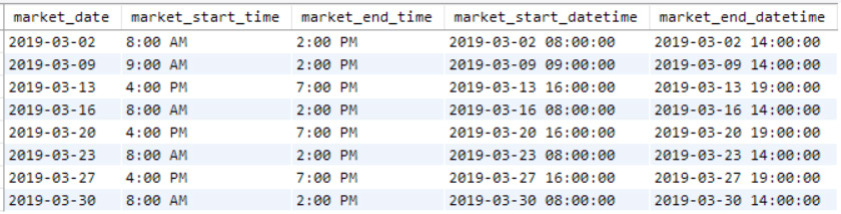
<figcaption></figcaption>

- The innermost part of the nested functions:
  - `CONCAT()` combines `market_date` and `market_start_time` into a single string.
- The surrounding `STR_TO_DATE()` function:
  - Converts string values to date values.
  - The string of percent signs and letters in single quotes is an input parameter.
    - It tells the function how the date and time are formatted.
- Formatting codes:
  - `%Y` is a 4-digit year.
  - `%m` is a 2-digit month.
  - `%d` is a 2-digit day.
  - `%h` is the hour.
  - `%i` represents the minutes.
  - `%p` indicates an AM/PM indicator.
- These codes are common and originate from the C programming language.
- To find SQL date and time function documentation:
  - Search the internet for “[database system] date and time functions.”
  - For MySQL 8.0, visit: [MySQL Date and Time Functions](https://dev.mysql.com/doc/refman/8.0/en/date-and-time-functions.html).

- The functions in the query associated with Figure 8.1:
  - Combine `date` and `time` strings into a `datetime` string.
  - Convert the combined string to a `datetime` data type.
- The final `market_start_datetime` and `market_end_datetime` fields:
  - Stored as `datetime` values.
  - Used to perform calculations, like finding the difference between two `datetimes`.
- The `STR_TO_DATE()` function:
  - Converts a string to a `date`, `time`, or `datetime`.
  - Returns `NULL` if the input string is not correctly formatted.
- In Figure 8.1:
  - Dates are formatted as `YYYY-MM-DD`.
  - Times are in 24-hour format (`HH:MM:SS`).
  - Indicates fields are `datetimes`.
  - Note: It is also possible to format a string to look like a `datetime` using the `DATE_FORMAT()` function.

# EXTRACT and DATE_PART

- You will encounter `datetime` data types, such as `timestamps`, in databases.
- Sometimes, you only need a portion of the stored `date` and `time` value.
  - Example: Extract month and day from a full date.
  - Create a year-over-year comparison by aligning daily totals from different years by month and day.

- Functions to retrieve portions of a `datetime` value:
  - `EXTRACT` (MySQL)
  - `DATE_PART` (Redshift)
  - `DATEPART` (Oracle and SQL Server)
- The example Farmer's Market database uses MySQL.
  - Examples use `EXTRACT()`.
  - Concepts are the same for other functions, but syntax varies.
- The `market_start_datetime` field in Figure 8.2 is a MySQL `datetime` type field.

- MySQL functions to extract parts of a `datetime` field:
  - `EXTRACT()`
  - `DATE()`
  - `TIME()`
- Use `datetime` values from the `datetime_demo` table created earlier.
  - Extract `date` and `time` parts from the fields.

- The following query demonstrates five different `date parts` that can be extracted from the `datetime`.
  - Use time intervals allowed by the database system (see documentation for others).
  - Extract portions of a `datetime` field as needed.

```sql
SELECT market_start_datetime,
   
 EXTRACT(DAY FROM market_start_datetime) AS mktsrt_day,
   
 EXTRACT(MONTH FROM market_start_datetime) AS mktsrt_month,
   
 EXTRACT(YEAR FROM market_start_datetime) AS mktsrt_year,
   
 EXTRACT(HOUR FROM market_start_datetime) AS mktsrt_hour,
   
 EXTRACT(MINUTE FROM market_start_datetime) AS mktsrt_minute
 FROM farmers_market.datetime_demo
 WHERE market_start_datetime = '2019-03-02 08:00:00'
```

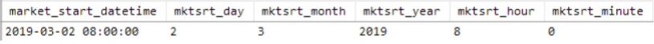
<figcaption></figcaption>

- Shortcuts for extracting the entire `date` and `time` from the `datetime` field:
  - No need to extract each part and re-concatenate.
- The following query demonstrates the `DATE()` and `TIME()` functions:

```sql
SELECT market_start_datetime,
   
 DATE(market_start_datetime) AS mktsrt_date,
   
 TIME(market_start_datetime) AS mktsrt_time
FROM farmers_market.datetime_demo
WHERE market_start_datetime = '2019-03-02 08:00:00'
```

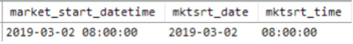
<figcaption></figcaption>

# DATE_ADD and DATE_SUB

- Storing string dates as `datetime` values allows date calculations.
  - Not possible with numbers, punctuation, and letters in a string field.
- Date math can get complex with multiple time zones.
  - Assume all `datetimes` are from the same time zone.
- Use `market_start_datetime` and `market_end_datetime` fields to demonstrate.

- Example: Determine sales within the first 30 minutes after the market opens.
  - Dynamically calculate the cutoff time for every market date.
  - Use the `DATE_ADD` function.
  - Add 30 minutes to the start time.
  - Pass the `datetime`, interval (minutes), and number of minutes to `DATE_ADD`.

- The following query demonstrates this:
  - Filter results to a single market date for clarity.
  - See Figure 8.4 for the calculated `mktstrt_date_plus_30min`, which is 30 minutes after `market_start_datetime`.

```sql
SELECT market_start_datetime,
   
 DATE_ADD(market_start_datetime, INTERVAL 30 MINUTE) AS mktstrt_date_plus_30min
FROM farmers_market.datetime_demo
WHERE market_start_datetime = '2019-03-02 08:00:00'
```


<figcaption></figcaption>

- To calculate 30 days past a date:
  - Change the interval parameter from `MINUTE` to `DAY`.
  - Add 30 days instead.

- The following query demonstrates this:
  - See Figure 8.5 for the calculated `mktstrt_date_plus_30days`, which is 30 days after `market_start_datetime`.

```sql
SELECT market_start_datetime,
   
 DATE_ADD(market_start_datetime, INTERVAL 30 DAY) AS mktstrt_date_plus_30days
FROM farmers_market.datetime_demo
WHERE market_start_datetime = '2019-03-02 08:00:00'
```

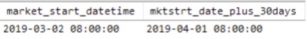
<figcaption></figcaption>

- There is a related function called `DATE_SUB()` that subtracts intervals from `datetimes`.
- Instead of switching to `DATE_SUB()`, you can add a negative number to the `datetime`.
- The following query demonstrates this:
  - Using `DATE_ADD()` to add -30 days to a date.
  - Same effect as using `DATE_SUB()` to subtract 30 days from a date.
  - Results are shown in Figure 8.6.

```sql
SELECT market_start_datetime,
   
 DATE_ADD(market_start_datetime, INTERVAL -30 DAY) AS mktstrt_date_plus_neg30days,
   
 DATE_SUB(market_start_datetime, INTERVAL 30 DAY) AS mktstrt_date_minus_30days
FROM farmers_market.datetime_demo
WHERE market_start_datetime = '2019-03-02 08:00:00'
```

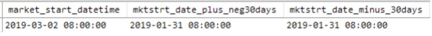
<figcaption></figcaption>

# DATEDIFF

- In the previous section, we added 30 days to a date using `DATE_ADD()`.
  - Used to determine if an action occurs within 30 days of the first purchase date.
- Another way to check if two dates are within 30 days of each other: `DATEDIFF()`.

- `DATEDIFF` is a SQL function available in most database systems.
  - Accepts two dates or `datetime` values.
  - Returns the difference between them in days.

- Example query:
  - Inner query (aliased "x") returns the first and last market dates from `datetime_demo` table.
  - Outer query calculates the difference between those two dates using `DATEDIFF`.
  - Output is shown in Figure 8.7.

```sql
SELECT 
   
 x.first_market, 
   
 x.last_market, 
   
 DATEDIFF(x.last_market, x.first_market) days_first_to_last
FROM
(
   
 SELECT 
       
 min(market_start_datetime) first_market, 
       
 max(market_start_datetime) last_market
   
 FROM farmers_market.datetime_demo
) x
```

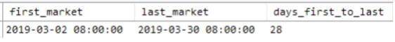
<figcaption></figcaption>

# TIMESTAMPDIFF

- The `DATEDIFF` function returns the difference in days.
- MySQL also has a function called `TIMESTAMPDIFF`.
  - Returns the difference between two `datetimes` in any chosen interval.

- Example: Calculate the hours and minutes between the market start and end times on each market date.
  - Results are shown in Figure 8.8.

```sql
SELECT market_start_datetime, market_end_datetime,
   
 TIMESTAMPDIFF(HOUR, market_start_datetime, market_end_datetime) 
      
 AS market_duration_hours,
   
 TIMESTAMPDIFF(MINUTE, market_start_datetime, market_end_datetime)
      
 AS market_duration_mins
 FROM farmers_market.datetime_demo
```

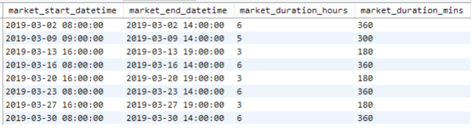
<figcaption></figcaption>

- In Oracle SQL:
  - Subtract two `datetimes` from one another.
  - Use the `EXTRACT` function to specify the interval for the result.

- In Redshift and MS SQL Server:
  - `TIMESTAMPDIFF` doesn't exist and isn't necessary.
  - `DATEDIFF` allows specification of a `datepart` interval as a parameter.

- Note about `timestamp` values:
  - Stored as 32-bit integers representing the number of seconds since January 1, 1970.
  - Latest `timestamp` that fits within 32 bits is 2038-01-19 03:14:07.
  - Timestamps above this value will cause an integer overflow.
  - Similar to the “Y2K” issue.
  - Database systems will need updates to use a new `timestamp` standard.

# Date Functions in Aggregate Summaries and Window Functions

- In this section, we'll explore ways to use `date` functions when summarizing data.

- Example: Get a profile of each farmer’s market customer's habits over time.
  - Group results at the customer level.
  - Include date-related summary information in the output.
  - Use sample data to demonstrate these concepts.

- First, get each customer's purchase detail records.
  - Focus on the dates each customer made purchases.
  - Query the database for records of `customer_id` 1.

- Figure 8.9 shows all purchases made by customer 1 over time.
  - Summarize this data.
  - Get their earliest purchase date, latest purchase date, and number of different days they made a purchase.

```sql
SELECT customer_id, market_date 
FROM farmers_market.customer_purchases
WHERE customer_id = 1
```

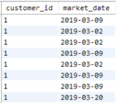
<figcaption></figcaption>

- We'll `GROUP BY` `customer_id`.
- Use `MIN` and `MAX` to get the earliest and latest purchase dates.
- Use `COUNT DISTINCT` to determine the number of different dates they made purchases.

```sql
SELECT customer_id, 
   
 MIN(market_date) AS first_purchase, 
   
 MAX(market_date) AS last_purchase,
   
 COUNT(DISTINCT market_date) AS count_of_purchase_dates
FROM farmers_market.customer_purchases
WHERE customer_id = 1
GROUP BY customer_id
```

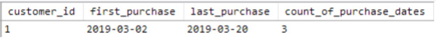
<figcaption></figcaption>

- To determine how long a person has been a customer:
  - Get the difference between the first and last purchase.
- Use `DATEDIFF` on the aggregate `MIN` and `MAX` dates.
  - These are still date values, valid for `DATEDIFF`.
- Remove the customer filter to see results for all customers.
  - Results are shown in Figure 8.11.

```sql
SELECT customer_id, 
   
 MIN(market_date) AS first_purchase, 
   
 MAX(market_date) AS last_purchase,
   
 COUNT(DISTINCT market_date) AS count_of_purchase_dates,
   
 DATEDIFF(MAX(market_date), MIN(market_date)) AS days_between_first_last_purchase
FROM farmers_market.customer_purchases
GROUP BY customer_id
```

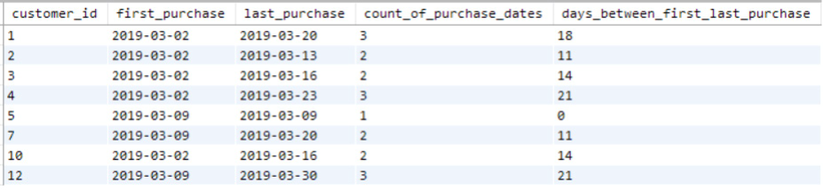
<figcaption></figcaption>

- To know how long it's been since the customer last made a purchase:
  - Use the `CURDATE()` function.
  - It may be called `CURRENT_DATE`, `TODAY()`, `SYSDATE`, or `GETDATE()` in different SQL systems.
  - Check the documentation for your database system.

- The following query demonstrates its usage:
  - `CURDATE()` represents the current system date in any calculation.
  - Note: The server's current time might differ from your local time due to time zone settings.

```sql
SELECT customer_id, 
   
 MIN(market_date) AS first_purchase, 
   
 MAX(market_date) AS last_purchase,
   
 COUNT(DISTINCT market_date) AS count_of_purchase_dates,
   
 DATEDIFF(MAX(market_date), MIN(market_date)) AS days_between_first_last_purchase,
   
 DATEDIFF(CURDATE(), MAX(market_date)) AS days_since:last_purchase
FROM farmers_market.customer_purchases
GROUP BY customer_id
```

- Going back to the window functions covered in Chapter 7, "Window Functions Frequently Used by Data Scientists":
  - Write a query that gives us the days between each purchase a customer makes.
- Example: Customer 1's detailed purchases (previously shown in Figure 8.9).
  - Use `RANK` and `LAG` window functions.
  - Retrieve each purchase date along with the next purchase date.
  - Have both values per row to display and calculate the time between each.

```sql
SELECT customer_id, market_date,
   
 RANK() OVER (PARTITION BY customer_id ORDER BY market_date) AS purchase_number,
   
 LEAD(market_date,1) OVER (PARTITION BY customer_id ORDER BY market_date) 
AS next_purchase
FROM farmers_market.customer_purchases
WHERE customer_id = 1
```

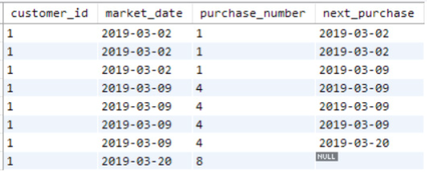
<figcaption></figcaption>

- We didn't quite accomplish the goal of retrieving each purchase date and the previous purchase date.
  - Multiple rows with the same date occur when the customer purchased multiple items on the same date.
- We can resolve this a few ways:

- Approach 1:
  - Remove duplicates using the `DISTINCT` keyword.
  - Use a `WHERE` clause filter to remove rows where the two dates (current and next purchase) are the same.

- Approach 2:
  - Remove duplicates in the initial dataset.
  - Use a subquery (a query inside a query) to get the date differences.
  - Move the window functions to the outer query.
  - Fix the issue of `RANK` counting each purchase, when we want to count each purchase date.

- This is what the second approach looks like:

```sql
SELECT 
   
 x.customer_id, 
   
 x.market_date,
   
 RANK() OVER (PARTITION BY x.customer_id ORDER BY x.market_date) 
AS purchase_number,
   
 LEAD(x.market_date,1) OVER (PARTITION BY x.customer_id ORDER BY x.market_date) 
AS next_purchase

FROM
( 
   
 SELECT DISTINCT customer_id, market_date
   
 FROM farmers_market.customer_purchases
   
 WHERE customer_id = 1
) x
```

We can add a line to use that `next_purchase` date in a `DATEDIFF` calculation:

```sql
SELECT 
   
 x.customer_id, 
   
 x.market_date,
   
 RANK() OVER (PARTITION BY x.customer_id ORDER BY x.market_date) 
      
 AS purchase_number,
   
 LEAD(x.market_date,1) OVER (PARTITION BY x.customer_id ORDER BY x.market_date) 
AS next_purchase,
   
 DATEDIFF(
   
 LEAD(x.market_date,1) OVER 
   
 (PARTITION BY x.customer_id ORDER BY x.market_date),
   
 x.market_date
   
 ) AS days_between_purchases
FROM
( 
   
 SELECT DISTINCT customer_id, market_date
   
 FROM farmers_market.customer_purchases
   
 WHERE customer_id = 1
) x
```

- This may look confusing, but we used the same `LEAD` function inside the `DATEDIFF` as we used in the `next_purchase` field above it.
- The second `DATEDIFF` parameter is just `market_date`.
  - We are calculating the days between the current row's `market_date` and `next_purchase` columns.
- We can't just insert the `next_purchase` column name into the query there.
  - We have to calculate it for the `days_between_purchases` field as well.
  - Calculations don't happen sequentially and are at the same level (the outer query).

- The results of the preceding query are shown in Figure 8.13.
  - The final `days_between_purchases` value is `NULL`.
  - That's because that row's `next_purchase` date is `NULL`, since there are no more purchases for customer 1 after March 20, 2019.

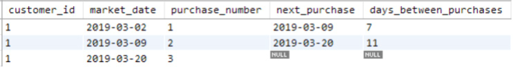
<figcaption></figcaption>

- To use the `next_purchase` field name inside the `DATEDIFF()` function and avoid inserting the `LEAD()` calculation twice:
  - Use another query layer.
  - Have a query of a query of a query.

- Remove the `customer_id` filter to return all customers.
- Filter to each customer's first purchase by adding a filter on the calculated `purchase_number`.
- This query answers the question: "How many days pass between each customer's first and second purchase?"

- The results of this query are shown in Figure 8.14.

```sql
SELECT 
   
 a.customer_id, 
   
 a.market_date AS first_purchase, 
   
 a.next_purchase AS second_purchase,
   
 DATEDIFF(a.next_purchase, a.market_date) AS time_between_1st_2nd_purchase
FROM
(
   
 SELECT 
      
 x.customer_id, 
      
 x.market_date,
      
 RANK() OVER (PARTITION BY x.customer_id ORDER BY x.market_date) 
AS purchase_number,
      
 LEAD(x.market_date,1) OVER (PARTITION BY x.customer_id ORDER BY x.market_date) 
AS next_purchase
      
 FROM
      
 ( 
        
 SELECT DISTINCT customer_id, market_date
        
 FROM farmers_market.customer_purchases
      
 ) x
) a
WHERE a.purchase_number = 1
```
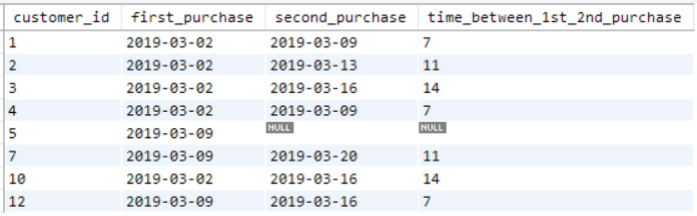
<figcaption></figcaption>

- In Chapter 10, "Building Analytical Reports with SQL," we will cover `Common Table Expression` (CTE) or "WITH clause."
  - Offers another way to select from precalculated values.
  - Avoids nesting multiple queries inside one another.
  - Helps keep queries simpler and easier to read.

- Returning to simpler aggregate functions using dates:
  - Refer to customer 1's purchase history (originally shown in Figure 8.9).
  - Assume today's date is March 31, 2019.
  - The marketing director wants to give infrequent customers an incentive to return in April.
  - The director asks for a list of customers who made a purchase at only one market event in the previous month.
  - They want to send an email with a coupon for a discount on a purchase made in April.

- Steps to pull up that list:
  - Find everyone who made a purchase in the 31 days prior to March 31, 2019.
  - Filter the list to those who only made a purchase on a single market date during that time.

- This query retrieves a list of one row per market date per customer within that date range:

```sql
SELECT DISTINCT customer_id, market_date 
FROM farmers_market.customer_purchases
WHERE DATEDIFF('2019-03-31', market_date) <= 31
```

- Next, query the results of that query.
  - Count the distinct `market_date` values per customer during that time.
  - Filter to those with exactly one `market_date` using the `HAVING` clause.
  - Remember, `HAVING` is like `WHERE`, but calculated after the `GROUP BY` aggregation.

```sql
SELECT x.customer_id, 
   
 COUNT(DISTINCT x.market_date) AS market_count
FROM
(
   
 SELECT DISTINCT customer_id, market_date 
   
 FROM farmers_market.customer_purchases
   
 WHERE DATEDIFF('2019-03-31', market_date) <= 31
) x
GROUP BY x.customer_id
HAVING COUNT(DISTINCT market_date) = 1
```

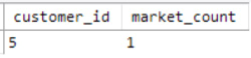
<figcaption></figcaption>

- If fulfilling a report request:
  - Join these results to the `customer` table.
  - Get the customer name and contact information.
- Here, we have shown how to use `date` calculations to filter a list of customers by their actions.

# Exercises

1. Get the `customer_id`, `month`, and `year` (in separate columns) of every purchase in the `farmers_market.customer_purchases` table.

2. Write a query that:
  - Filters to purchases made in the past two weeks.
  - Returns the earliest `market_date` in that range as a field called `sales_since_date`.
  - Returns a sum of the sales (`quantity * cost_to_customer_per_qty`) during that date range.
  - Use the `CURDATE()` function for the current date.
  - For testing, replace `CURDATE()` with '2019-03-31' to get the report for the two weeks prior to March 31, 2019.

3. In MySQL, use the `DAYNAME()` function to:
  - Return the full name of the day of the week on which a date occurs.
  - Query the `market_date_info` table.
  - Return the `market_date`, `market_day`, and the calculated day of the week name for each `market_date`.
  - Create a calculated column using a `CASE` statement to indicate if the recorded day in the database differs from the calculated day of the week.
  - This is a quality control query to check manually entered data for correctness.