# Introduction

- Exploratory Data Analysis (EDA) is the first step in predictive modeling.
  - Data scientists explore the dataset before building a model.
  - SQL can be used to explore an already-prepared dataset.

- What if you don't have a dataset yet?
  - Explore raw data directly from database tables.
  - Use SQL to familiarize yourself with the tables and data.

- EDA can be done in various ways:
  - Jupyter notebook with Python.
  - Tableau workbook.
  - SQL queries.

- Later EDA focuses on:
  - Distributions of values.
  - Relationships between columns.
  - Identifying correlations between features and the target variable.

- Here, we use SQL queries to explore tables in the Farmer's Market database.
  - Demonstrate real EDA by familiarizing with the data for the first time.

# Demonstrating Exploratory Data Analysis with SQL

- Real-world scenario for EDA:
  - Director of Farmer's Market asks for help with reports.
  - Access to the database is provided.
  - No specific report requirements yet.
  - Focus on general product availability and purchase trends.
  - E-R diagram from Chapter 1 shows table relationships.

- Familiarize with these tables:
  - `product`
  - `vendor_inventory`
  - `customer_purchases`

- Questions to ask via query:
  - How large are the tables?
  - How far back does the data go?
  - What information is available about each product and purchase?
  - What makes a row unique in each table?
  - What date and time dimensions are available?
  - How do values look when summarized over time?
  - How is data in each table related to others?
  - How to join tables for reporting?

# Exploring the Products Table

- Some databases offer `DESCRIBE [table name]` or `DESC [table name]` to list columns and data types.
- Not available in every database and doesn't show data preview.
- We'll use a universal approach to preview data.

- Start with the `product` table:
  - Select everything, limit to 10 rows:

```sql
SELECT * FROM farmers_market.product
LIMIT 10
```

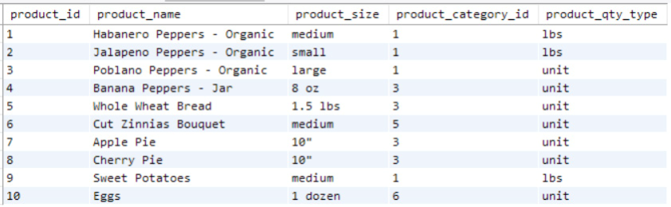
<figcaption></figcaption>

- Output in Figure 9.1:
  - Columns: `product_id`, `product_name`, `product_size`, `product_category_id`, `product_qty_type`.
  - Most fields are populated, few `NULL` values.
  - Table catalogs products with metadata like name and category.
  - Not a transactional table for sales or purchases.
  - `product_category_id` might be a foreign key to `product_category` table.
  - `product_qty_type` values: "lbs" and "unit".

- `product_id` appears to be the primary key.
- To check if `product_id` is unique:
  - Group by `product_id`.
  - Return groups with more than one record.
  - This checks if `product_id` is unique per record.

```sql
SELECT product_id, count(*)
FROM farmers_market.product
GROUP BY product_id
HAVING count(*)> 1
```

- No results returned, so no `product_id` groups have more than one row.
- Each `product_id` is unique.
- Table has a granularity of one row per product.

- Check `product_category` table:
  - How many different categories are there?
  - What do those categories look like?

```sql
SELECT * FROM farmers_market.product_category
```

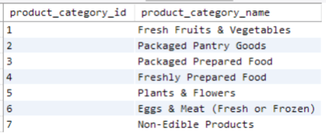
<figcaption></figcaption>

- Results in Figure 9.2:
  - Shows how the Farmer's Market groups product types.
  - Useful for writing reports on inventory and trends by product category.

- How many different products are in the `product` table?

```sql
SELECT count(*) FROM farmers_market.product
```

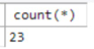
<figcaption></figcaption>

- Figure 9.3 shows 23 products in the database.
- For reports, give columns meaningful headers.
- During EDA, quick queries for information don't need aliases.

- Next question: How many products per category?
- Join `product` and `product_category` tables.
- Count products in each category.

```sql
SELECT pc.product_category_id, pc.product_category_name, 
   
 count(product_id) AS count_of_products
FROM farmers_market.product_category AS pc
LEFT JOIN farmers_market.product AS p 
   
 ON pc.product_category_id = p.product_category_id
GROUP BY pc.product_category_id
```

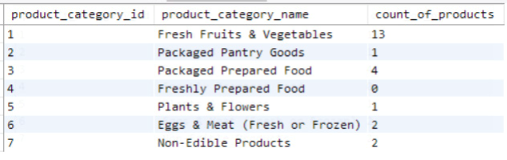
<figcaption></figcaption>

- Figure 9.4 shows:
  - IDs match categories.
  - Most common category: "Fresh Fruits & Vegetables".
  - "Freshly Prepared Food" category has no products yet.

# Exploring Possible Column Values

- Explore column values:
  - What is in the `product_qty_type` field?
  - How many different quantity types are there?

- Use `DISTINCT` to find unique values:

```sql
SELECT DISTINCT product_qty_type
FROM farmers_market.product
```

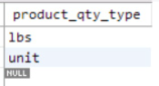
<figcaption></figcaption>

- Figure 9.5 shows:
  - Two quantity types: "lbs" and "unit".
  - Some products have `NULL` in `product_qty_type`.
  - Remember this when filtering or calculating based on this column.

- Explore `vendor_inventory` table:

```sql
SELECT * FROM farmers_market.vendor_inventory
LIMIT 10
```

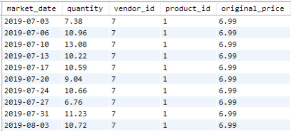
<figcaption></figcaption>

- Figure 9.6 shows:
  - One row per `market_date`, `vendor_id`, and `product_id`.
  - Quantity of product brought by vendor and `original_price`.
  - `original_price` might be the price before sales or deals.
  - Tracked per market date, so changes over time are recorded.
  - Quantity is a decimal value.

- Confirm primary key assumption:
  - Use `DESCRIBE` function or schema query if available.
  - Otherwise, group by expected unique fields and use `HAVING` to check for duplicates.

```sql
SELECT market_date, vendor_id, product_id, count(*)
FROM farmers_market.vendor_inventory
GROUP BY market_date, vendor_id, product_id
HAVING count(*)> 1
```

- No duplicate combinations found.
- `vendor_inventory` table has one record per `market_date`, `vendor_id`, and `product_id`.
- MySQL Workbench can highlight primary keys.
- Figure 9.7 confirms a composite primary key of the three fields.

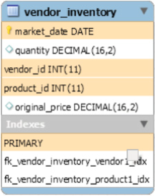
<figcaption></figcaption>

- `market_date` field has dates.
- Questions: How far back does the data go? When was the first and latest market tracked?

- Get minimum and maximum values from `market_date`:

```sql
SELECT min(market_date), max(market_date)
FROM farmers_market.vendor_inventory
```

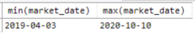
<figcaption></figcaption>

- Figure 9.8 shows:
  - About one and a half years of records.
  - Limited training data for annual seasonality forecasts.
  - Check if purchases were tracked during the entire period.

- Another question: How many different vendors are there?
  - When did they start selling?
  - Which are still selling at the most recent `market_date`?

- Group by `vendor_id` to get earliest and latest dates for each vendor.
- Sort by these dates to see which vendors sold the longest ago and most recently.

```sql
SELECT vendor_id, min(market_date), max(market_date)
FROM farmers_market.vendor_inventory
GROUP BY vendor_id
ORDER BY min(market_date), max(market_date)
```

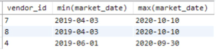
<figcaption></figcaption>

- Figure 9.9 shows:
  - Inventories of only three vendors in the database.
  - Vendors 7 and 8 have been selling since April 3, 2019.
  - They last brought inventory on October 10, 2020.
  - Vendor 4 started later and last sold on September 30, 2020.

# Exploring Changes Over Time

- Check if the market changed format during COVID-19 in 2020.
  - This indicator could impact sales and be valuable for predictive modeling.

- Another question: Do vendors sell year-round or seasonally?
  - Extract month and year from each `market_date`.
  - Look at the counts of vendors each month.

```sql
SELECT
EXTRACT(YEAR FROM market_date) AS market_year,
EXTRACT(MONTH FROM market_date) AS market_month,
COUNT(DISTINCT vendor_id) AS vendors_with_inventory
FROM farmers_market5.vendor_inventory
GROUP BY EXTRACT(YEAR FROM market_date), EXTRACT(MONTH FROM market_date)
ORDER BY EXTRACT(YEAR FROM market_date), EXTRACT(MONTH FROM market_date)
```

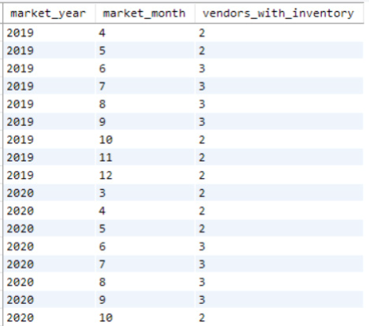
<figcaption></figcaption>

- Only three vendors have inventory in this example database.
- Figure 9.10 shows:
  - Three vendors from June to September.
  - Two vendors per month the rest of the year.
  - One vendor (likely vendor 4) may be seasonal.
  - No months 1 and 2 listed, only months 3–12.
  - Farmer’s market must be closed in January and February.
  - Check with the Director to confirm or identify data issues.
  - Discover these aspects during EDA to know what to expect in reports.

- Next, explore a particular vendor's inventory.
  - Start with vendor ID 7 from a previous query.

```sql
SELECT * FROM farmers_market.vendor_inventory
WHERE vendor_id = 7
ORDER BY market_date, product_id
```

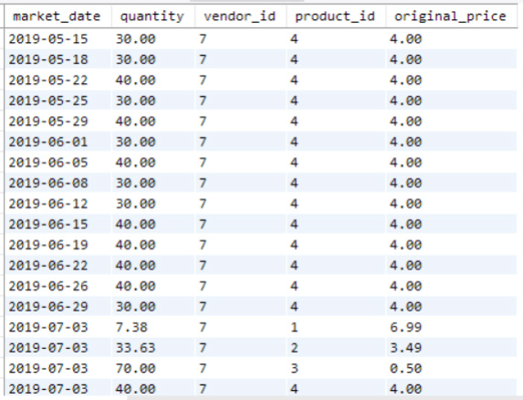
<figcaption></figcaption>

- Figure 9.11 shows a part of result:
  - Vendor 7 sold one product through most of May and June.
  - Other products (IDs 1–3) appear in July.
  - Product 4 price is constant at $4.00 throughout the period.

# Exploring Multiple Tables Simultaneously

- Some products have round quantities, others are continuous numbers.
  - Possibly products sold by weight.
  - Vendor always brings 30 or 40 of product 4 to each market.
  - Compare how many of those items are sold at each market.

- Explore `customer_purchases` table:
  - See what data is available.
  - Select all fields and 10 rows for a preview.

```sql
SELECT * FROM farmers_market.customer_purchases
LIMIT 10
```

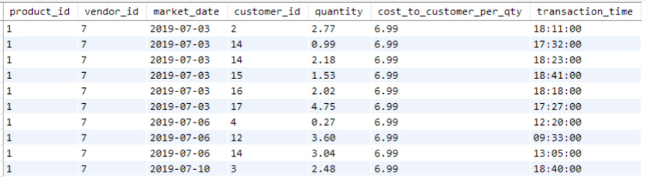
<figcaption></figcaption>

- Figure 9.12 shows:
  - Each row has `product_id`, `vendor_id`, `market_date`, `customer_id`, `quantity`, `cost_to_customer_per_qty`, and `transaction_time`.
  - Each product purchased by a customer is in its own row.
  - Multiple units of the same product can be recorded in one row (`quantity` field).
  - `cost_to_customer_per_qty` suggests different customers might pay different prices.
  - `quantity` and `cost_to_customer_per_qty` values have two decimal places.

- Each purchase's `transaction_time` is recorded.
  - Allows reports on customer flow throughout the day.
  - Estimate how long each customer spends at the market.

- `vendor_id` and `product_id` are included.
  - Look closer at purchases of vendor 7's product #4.

```sql
SELECT * FROM farmers_market.customer_purchases
WHERE vendor_id = 7 AND product_id = 4
ORDER BY market_date, transaction_time
```

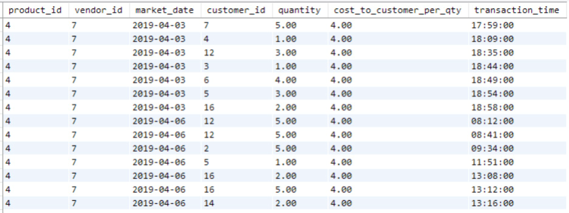
<figcaption></figcaption>

- Figure 9.13 shows:
  - For two market dates, most customers buy 1 to 5 items at a time.
  - Spending $4 per item.
  - customer_id 12 appears several times.
- Run the same query filtered or sorted by `customer_id` to explore one customer's purchase history in detail.

```sql
SELECT * FROM farmers_market.customer_purchases
WHERE vendor_id = 7 AND product_id = 4 AND customer_id = 12
ORDER BY customer_id, market_date, transaction_time
```

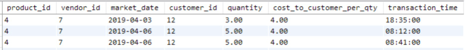
<figcaption></figcaption>

- Figure 9.14 shows:
  - Customer 12 appears several times.
  - They first purchased on April 3.
  - Bought five more on April 6, then five more 30 minutes later.
- Sorting and filtering data by `market_date`, `vendor_id`, and `customer_id` helps understand the data.

- Detailed view shows multiple sales per vendor per product per day.
- To compare sales to inventory, aggregate sales by `market_date`.
- Group by `market_date`, `vendor_id`, and `product_id`.
- Sum quantities sold and calculate total sales for each group.

```sql
SELECT market_date, 
    vendor_id, 
    product_id, 
    SUM(quantity) quantity_sold, 
    SUM(quantity * cost_to_customer_per_qty) total_sales
FROM farmers_market.customer_purchases 
WHERE vendor_id = 7 and product_id = 4 
GROUP BY market_date, vendor_id, product_id
ORDER BY market_date, vendor_id, product_id
```

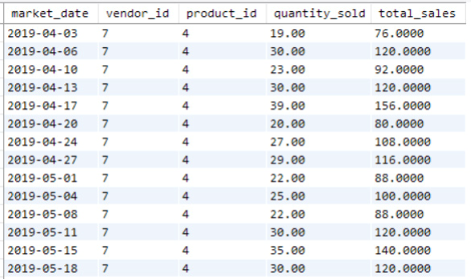
<figcaption></figcaption>

- For a report, round dollars to two decimal places.
- For exploration, no need to spend extra time on formatting.

# Exploring Inventory vs. Sales

- Now we need inventory counts to compare sales to inventory.

- Throughout EDA, we've explored data in related tables.
- Now we can join them to understand relationships.

- Aggregated `customer_purchases` to the same granularity as `vendor_inventory`.
- Join the two tables to view inventory and sales side by side.

- Join tables and display all columns to check the combination.
- Alias `customer_purchases` summary table as "sales".
- Limit output to 10 rows since no filter applied yet.

```sql
SELECT * FROM farmers_market.vendor_inventory AS vi
    LEFT JOIN
        (
        SELECT market_date, 
            vendor_id, 
            product_id, 
            SUM(quantity) AS quantity_sold, 
            SUM(quantity * cost_to_customer_per_qty) AS total_sales 
        FROM farmers_market.customer_purchases
        GROUP BY market_date, vendor_id, product_id
        ) AS sales
        ON vi.market_date = sales.market_date 
            AND vi.vendor_id = sales.vendor_id 
            AND vi.product_id = sales.product_id 
ORDER BY vi.market_date, vi.vendor_id, vi.product_id
LIMIT 10
```

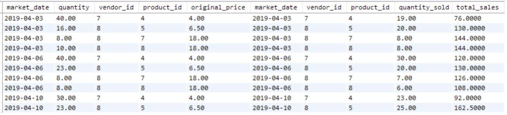
<figcaption></figcaption>

- Figure 9.16 shows:
  - `vendor_id`, `product_id`, and `market_date` match on every row.
  - Summary values for `vendor_id` 8 and `product_id` 4 match `customer_purchases`.

- Confirm join looks correct.
- Remove redundant columns by specifying which columns to display.
- Use `vendor_inventory` as the left side of the JOIN.
  - A customer can't buy inventory that doesn't exist.
  - Check data to ensure no purchases without inventory.
  - Inventory that doesn't get purchased should be visible.

- Join additional lookup tables for human-readable values.
  - Pull in vendor and product names.

- Filter to `vendor_id` 7 and `product_id` 4 to compare inventory to sales:

```sql
SELECT vi.market_date, 
    vi.vendor_id, 
    v.vendor_name, 
    vi.product_id, 
    p.product_name,
    vi.quantity AS quantity_available, 
    sales.quantity_sold, 
    vi.original_price, 
    sales.total_sales
FROM farmers_market.vendor_inventory AS vi
    LEFT JOIN
        (
        SELECT market_date, 
            vendor_id, 
            product_id, 
            SUM(quantity) AS quantity_sold, 
            SUM(quantity * cost_to_customer_per_qty) AS total_sales 
        FROM farmers_market.customer_purchases
        GROUP BY market_date, vendor_id, product_id
        ) AS sales
    ON vi.market_date = sales.market_date 
        AND vi.vendor_id = sales.vendor_id
        AND vi.product_id = sales.product_id 
    LEFT JOIN farmers_market.vendor v 
        ON vi.vendor_id = v.vendor_id 
    LEFT JOIN farmers_market.product p
        ON vi.product_id = p.product_id 
WHERE vi.vendor_id = 7 
    AND vi.product_id = 4
ORDER BY vi.market_date, vi.vendor_id, vi.product_id
```

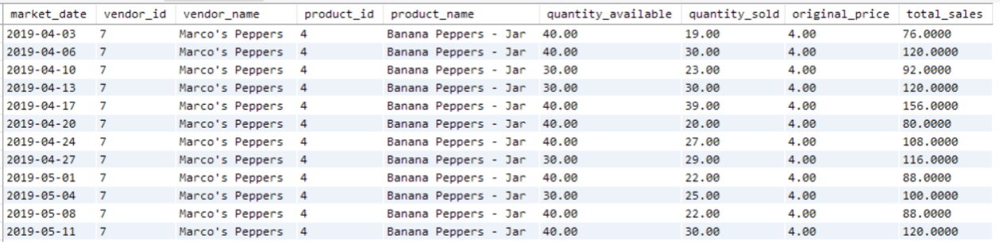
<figcaption></figcaption>

- Figure 9.17 shows:
  - Vendor: Marco's Peppers
  - Product: Banana Peppers
  - Brings 30–40 jars each time
  - Sells between 1 and 40 jars per market

- To explore sales distribution:
  - Remove the `WHERE` clause
  - Pull dataset into reporting software like Tableau
  - Build dashboards and reports

- Figure 9.18: Dashboard with inventory and sales of selected products during the selected date range
- Figure 9.19: Histogram showing how many different market dates each count of jars of Banana Peppers were sold

- More calculations in SQL:
  - Calculate the percent of each vendor's inventory sold at each market

- Next chapter:
  - Explore more analytical queries for building reports using SQL

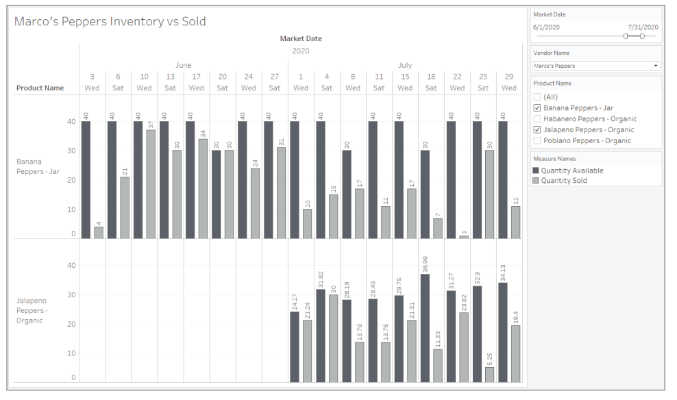
<figcaption></figcaption>

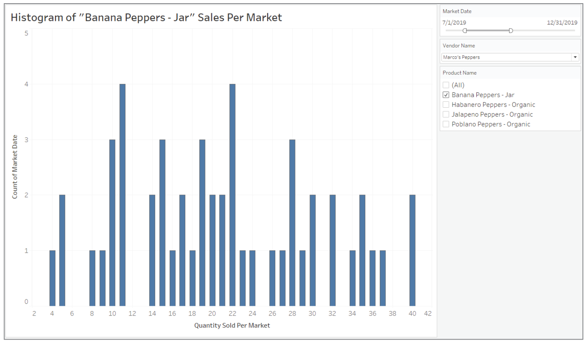
<figcaption></figcaption>

# Excercises

1. Check if `customer_purchases` data was collected for the same time frame as `vendor_inventory`. Write a query to get the earliest and latest dates in the `customer_purchases` table.

2. Use the `DAYNAME` and `EXTRACT` functions on the `customer_purchases` table. Select and group by the weekday and hour of the day. Count the distinct number of customers during each hour of the Wednesday and Saturday markets. Refer to Chapters 6 and 8 for information on `COUNT DISTINCT` and `EXTRACT` functions.

3. Write two more queries to explore or summarize the data in the `product`, `vendor_inventory`, or `customer_purchases` tables. What other questions haven't we yet asked about the data in these tables that you would be curious about?