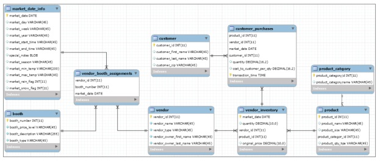

# Data Sources
- There are two types of data: structured and unstructured.
    - Untructured data is such as text documents or images stored as individual files in a computer's file system.
    - Structured data is typically organized into a tabular format, like a spreadsheet or database table containing limited-length text or numeric values.
    - Other types of files include CSV text files, JSON retrieved via API, XML in a NoSQL database, Graph databases with special query languages, key-value stores, and so on.
- Microsoft Excel is used for creating and maintaining spreadsheets. It also includes some analysis capabilities, such as pivot tables for summarizing spreadsheets and data visualization tools for plotting data points from a spreadsheet. Some functions in Excel can connect data in one spreadsheet to another.
- Microsoft Access is a relational database application for creating a true relational database model and defining rules for how the data tables are interconnected.
- Relational Database Management Systems (RDBMSs) are such as Oracle, MySQL, MS SQL Server, PostgreSQL, Amazon Redshift, IBM DB2, MS Access, SQLite, and Snowflake. The syntax for each can differ slightly, but the general concepts about Structured Query Language (SQL) are consistent across products.
# Tools for Connecting to Data Sources and Editing SQL
- First step is connecting to a database on a server. This is generally done through a SQL Integrated Development Environment (IDE).
- The IDE referenced throughout this book is MySQL Workbench Community Edition because in the examples a MySQL database is queried.
- We can connect to a database directly from code such as Python or R. For example, search for “R SQL Server” or “Python Redshift”. 
# Relational Databases
- A database table is like a well-defined spreadsheet, with row identifiers and named column headers.
- An entity is an object or concept that the table represents and captures data for. For example, in a table of Books, the entity is “Books”. The “Book table” contains information about many books such as ISBN number, title, and author. Some people use the terms entity and table interchangeably.
- A row is interchangeably called a record or tuple.
- A column header is interchangeably called a field or attribute.
- For example, in a table of Books, we can say that “the value in the Author field in the SQL for Data Scientists record in the Books table is ‘Renée M. P. Teate’.” Or, “In the Books table, the row representing the book SQL for Data Scientists contains the value ‘Renée M. P. Teate’ in the Author column.”
- A database is a collection of related tables. A database schema stores information about the tables and the relationships between them, defining the structure of the database.
- For example, in a doctor's office database, one table contains information about patients such as name, birthdate, and phone number. Another table contains information about appointments such as patient's name, appointment time, reason for the visit, and the name of the doctor. The connection between these two tables could be the patient's name. In reality, a unique identifier would be assigned to each patient, since two people can have the same name.
- The relationship between the entities (tables) is called a one-to-many relationship. Each patient only appears in the patient directory table one time but can appear in many appointments in the Appointment table. Database relationships are depicted in an entity-relationship diagram (ERD).

- An infinity symbol, “N”, or “crow's feet” on the end of a line connecting two tables indicates that it is the “many” side of a one-to-many relationship.
- The primary key in a table is a column or combination of columns that uniquely identifies a row.
    - The combination of values in the primary key columns cannot all be NULL (empty). NULL is the absence of any value, a totally empty field. NULLs are treated differently than blanks in SQL. Blank is a single space “ ” in a string field.
    - The primary key can be unique values such as a Student ID Card number or can be generated by the database and not carry meaning elsewhere “in real life”.
    - The primary key in a table is used to identify the records in other tables that relate to each of its records. When a table's primary key is referenced in another table, it is called a foreign key.
- For example, the doctor's office database assign an auto-incrementing integer value to serve as the primary key for each patient record in the Patients table and for each appointment record in the Appointments table. Then, the appointment-tracking table uses the generated Patient ID value to link each appointment to each patient, and the patient's name doesn't even need to be stored in the Appointments table.

- Another type of relationship found in RDBMSs is called many-to-many. It's a connection between entities where the records on each side of the relationship can connect to multiple records on the other side. For example, there would be a many-to-many relationship between books and authors, because each author can write multiple books, and each book can have multiple authors. In order to create this relationship in the database, a junction or associative table will be needed to capture the pairs of related rows.

- In Figure 1.5, the ISBN, which is the primary key in the Books table, and the Author ID, which is the primary key in the Authors table are both foreign keys in the Books-Authors Junction table. Each pairing of ISBN and Author ID in the junction table would be unique, so the pair of fields is considered a multi-column primary key in the Books-Authors Junction table. By setting up this database relationship so that there are no multiple rows per book in the Books table or multiple authors listed per book in the Authors column of the Books table. We reduce the amount of redundant data stored in the database and clarify how the entities are related in real life.
- The idea of not storing redundant data is known as database normalization. In the book database example, we only store each author's full name once, no matter how many books they have written. In the doctor's office example, we don't store a patient's phone number repeatedly in the Appointments table, because it's already stored in the related “patient directory” table, and can be found by connecting the two tables via the Patient ID.
    - Normalization reduces the amount of storage space and the complexity of updating data, since each value is stored a minimal number of times.
    - Research “relational database design” for more information.
# Dimensional Data Warehouses
- Data warehouses contain data from various sources. They can be designed in a normalized relational database form (as described in the previous section) or other design standards. The data stored can be raw directly extracted from other databases, or summarized, which means it has been processed and transformed. This allows for the creation of analytical datasets that can be stored and referenced for multiple reports. Data warehouses can maintain historical data logs, real-time updated tables, or snapshots of data at a specific points in time.
- Data warehouses often use dimensional modeling techniques for their design. One common approach within this technique is the "star schema." In a star schema, the data is divided into two types: facts and dimensions.
	- Fact Table: Contains records with "metadata" about an entity and measures (usually numeric values) to track and summarize. For example, a transactional record of an item purchased at a retail store includes the timestamp, store number, order number, customer number, and amount paid.
	- Dimension Table: Contains properties of the entity that can be used to group or "slice and dice" the fact records. For example, the store where the purchase was made is a dimension. The store dimension table would include additional information about the store, such as its name.
	- By querying both fact and dimension tables, you can generate summaries, such as total purchases by store.
- Transforming a doctor's office database into a star schema involves creating an appointments fact table and separate dimension tables for date and time:
	- Appointments Fact Table: Records each appointment's occurrence, including details like the patient, booking time, reason, doctor, and scheduled time.
	- Date Dimension: Stores properties of each appointment date, such as year, month, and day of the week.
	- Time Dimension: Stores properties of each appointment time, such as hour and minute.
	- This structure allows for easy analysis, such as counting appointments per time period or identifying the highest volume of appointment-booking calls, by grouping the fact data by different dimensions.

- Figure 1.6 depicts an example dimensional data warehouse design. Can you see why this design is called a star schema? Schematic illustration of an example dimensional data warehouse design. 
- In addition to the main appointments fact table, the data warehouse might include an appointment history log. This log records each change made to an appointment.
	- Appointment History Log: Tracks modifications to appointments, such as changes in scheduled time, reassignment to different doctors, and the number of times an appointment was modified.
	- This log allows for detailed analysis of appointment changes, providing insights into scheduling patterns, doctor reassignments, and the frequency of modifications.
- In a dimensional model, more information is stored compared to a normalized relational database:
	- Redundancy: Appointment records may appear multiple times in an appointment log table to track changes over time.
	- Date Dimension: Contains a record for every calendar date, even if no appointments are scheduled for those dates. This table might include dates far into the future to facilitate long-term analysis.
	- This approach increases data volume but simplifies querying and analysis by providing a comprehensive view of all relevant data.
- When designing a database or data warehouse, a deep understanding of concepts like dimensional modeling and star schemas is essential. However, for querying the database to build analytical datasets, focus on two main aspects:
	- Table Grain: The level of detail in the table, defined by the set of columns that make each row unique.
	- Table Relationships: How tables are related to one another, such as through foreign keys.
- With this knowledge, querying a dimensional data warehouse using SQL is similar to querying a relational database. You can use SQL to join tables, filter data, and perform aggregations based on the relationships and grain of the tables.
# Asking Questions About the Data Source
- Before writing any SQL queries, it's crucial to gather comprehensive information about the tables you'll be working with. This preparation ensures that your queries are accurate and efficient. Here are the steps and considerations:
	- Understand the Data Source: Identify the type of data source (e.g., relational database, NoSQL database, CSV file) and its characteristics.
	- Schema Design: Familiarize yourself with the database schema, which includes the structure of the database, the tables it contains, and their organization. This helps you understand how data is stored and how different tables relate to each other.
	- Table Relationships: Learn about the relationships between tables, such as one-to-many, many-to-many, and one-to-one relationships. This understanding is crucial for writing JOIN queries and ensuring data integrity.
	- Table Details: Gather detailed information about the specific tables you'll be querying, including:
		- Column Names and Data Types: Know the names of the columns and the types of data they store (e.g., integers, strings, dates).
		- Primary Keys: Identify the primary key(s) for each table, which uniquely identify each row.
		- Foreign Keys: Identify any foreign keys, which establish relationships between tables.
		- Indexes: Check if there are any indexes on the columns, which can improve query performance.
	- Data Constraints: Understand any constraints on the data, such as NOT NULL, UNIQUE, and CHECK constraints. These constraints ensure data integrity and can affect how you write your queries.
	- Sample Data: Review some sample data from the tables to get a sense of the actual values stored in the columns. This can help you write more accurate queries and anticipate potential issues.
- If you have access to subject matter experts (SMEs), such as database administrators (DBAs), ETL engineers, or the people who generate or enter the data, stay in communication with them throughout the data exploration and query development process. SMEs can provide valuable insights into why the database was designed the way it is, how the data is collected and updated, and what to expect in terms of data frequency and types.
- If you encounter values that don't make sense, you can consult a data dictionary (if available and accurate) or directly ask the SMEs for clarification. They can also point you to existing documentation if your questions are easily answered there.
- Here are some example questions you might want to ask the SMEs as you're first learning about the data source:
1. Here are the questions I'm being asked to answer in my analysis. Which tables in this database should I look in first for the relevant data? And is there an entity-relationship diagram documenting the relationships between them that I can reference?
- These questions help you identify the starting point for your data exploration. In large data warehouses with many tables, knowing where to look first can save a lot of time. An entity-relationship diagram (ERD) provides a visual representation of the tables and their relationships, making it easier to understand how the data is organized.
2. What set of fields make up the primary key for this table? Or, what is the grain of this fact table?
- The primary key uniquely identifies each record in a table. Knowing the primary key fields is crucial for understanding how to join tables and ensure data integrity. The "grain" of a fact table refers to the level of detail it contains, which helps you understand how to filter, group, and summarize the data.
3. Are these records imported directly from the source system, or have they been transformed or merged in some way before being stored in this table?
- This question helps you understand the origin and processing of the data. If the data is raw from the source system, you might need to talk to the people entering the data to understand it better. If the data has been transformed or merged, you should consult the ETL (Extract, Transform, Load) engineers who programmed the transformations.
4. Is this a static snapshot table, or does it update regularly? At what frequency does it update? And are older records expired and kept as new data is added, or is the existing record overwritten when changes occur?
- Understanding the update frequency and behavior of the table is important for interpreting the data correctly. A static snapshot table contains data at a specific point in time, while a regularly updated table reflects ongoing changes. Knowing whether older records are kept or overwritten helps you understand the historical context of the data.
- Live Data: If the table contains "live" data that is being updated as you work, it means the data is continuously changing. In such cases, consider making a copy of the table to work with, ensuring that changes in your calculations or models are due to your code and not the changing data.
- Nightly Updates: Some datasets are updated on a nightly basis, meaning they receive new data or changes once every night. It’s important to know the exact time these updates occur. This allows you to schedule dependent tasks, such as data extracts or reports, to run after the table has been updated with the latest data. This ensures that your analysis is based on the most current data available.
- Historical Data: If the table maintains old records as a log, it means historical data is preserved alongside new data. You can use the expiration date to filter out outdated records if you only need the latest data. This is useful for current analysis. Alternatively, you can keep past records for historical trend analysis. This is useful for understanding changes over time and making informed decisions based on historical data.
5. Is this data collected automatically as events occur, or are the values entered by people? Do we have documentation on the interface that they can see with the data entry form field labels?
- Automatically Collected Data: Data collected automatically by systems or sensors as events occur is generally more consistent and less prone to human error.
- Manually Entered Data: Data entered by people can be more prone to errors due to manual entry. However, the people doing the data entry can provide valuable insights into the business processes that generated the data. They can explain why certain values were selected, what might trigger an update of a record, or what automated processes are initiated when they make changes.
- Distribution of Values:
	- Check Value Distribution: It's important to check how the values in each field are distributed. This includes understanding the range of possible values, the frequency of categorical values, and the statistical distribution of continuous or discrete numeric values.
	- Exploratory Data Analysis (EDA): Visualizing the data at this exploratory stage can be very helpful. Histograms are especially useful for understanding the distribution of numeric values. EDA helps identify patterns, anomalies, and insights in the data.
- Time Period Analysis: Analyzing the data broken down by time periods (such as by fiscal year) can reveal changes in distributions over time. This can help identify points where old records stop being updated, business processes change, or past values get zeroed out. Talking to SMEs can provide context for these changes.
- Data Entry Forms: Knowing how the data entry forms look can improve communication with SMEs. They may not know the field names in the underlying database but can describe the data using the labels they see on the front-end interface. This helps bridge the gap between technical and non-technical stakeholders.
- Knowing the type of database is crucial:
	- The type of database is crucial for efficient query writing and connection setup.
	- For some databases, limiting the number of rows can speed up queries.
	- In columnar databases like Redshift, querying all columns, even with a single row, might be slower than summarizing a single column across many rows due to data storage mechanisms.
	- Knowing the database type is essential for referencing the correct SQL syntax in official documentation, as syntax can vary between databases.
# Introduction to the Farmer's Market Database
- Overview of the Database: The database is designed to track various entities and activities at a fictional farmer's market. It serves as an example for demonstrating SQL queries and database concepts throughout the book.
- Database Contents:
	- Market Days: Records details such as date, hours, day of the week, and weather for each day the market is open.
	- Vendors: Contains data about each vendor, their booth assignments, products, and prices.
	- Transactions:
		- Vendors use networked cash registers to ring up individual items.
		- Customers use loyalty cards with every transaction.
		- This setup allows for detailed logs of purchases, tracking who bought what and when.
- Business Questions Addressed:
	- The database is designed to answer various analytical questions, such as:
		- How many people visit the market each week throughout the year?
		- When do sales peak?
		- How does inclement weather impact attendance?
		- When are different fruits or vegetables in season locally?
		- Will a new vendor affect existing vendors, or is there enough demand?
- Predictive Modeling:
	- Datasets from the database will be prepared for predictive modeling techniques like classification and time-series forecasting.
	- These models aim to answer questions such as:
		- How many shoppers should be expected next month or next year?
		- Is a customer likely to return in the next month based on their purchase history?
- Figure 1.7 shows the ERD for the entire Farmer's Market database. Throughout this book, we will be diving into details of the different tables and relationships depicted in Figure 1.7, as we learn how to write SQL statements that can actually be used to pull data from this database, giving realistic examples of queries that data analysts and data scientists develop.
- Schematic illustration of the ERD for the entire Farmer’s Market database.

# A Note on Machine Learning Dataset Terminology
- There is a difference in terminology between database developers and data scientists, particularly when working with datasets used for training predictive models in machine learning.
- Database Developer Terminology:
	- Rows: Also known as records.
	- Columns: Referred to as attributes or fields.
- Data Scientist Terminology (in the context of machine learning):
	- Rows: Called training examples, instances, or data points. Each row represents a single example or case that the model learns from.
	- Columns: Known as features or input variables. These are the input data used by the model to make predictions.
	- Target Variable: The column that the model is trying to predict. Also referred to as the output variable.
- By understanding these terms and concepts, you'll be able to convert rows and columns from database tables into training examples with features that a predictive model can learn from. This knowledge bridges the gap between data storage and data analysis, enabling the use of database information in machine learning workflows.
# Exercises
1. What do you think will happen in the described Books and Authors database depicted in Figure 1.5 if an author changes their name? Which records might be added or updated, and what might be the effect on the results of future queries based on this data?
2. Think of something in your life that you could track using a database. What entities in this database might have one-to-many relationships with one another? Many-to-many?