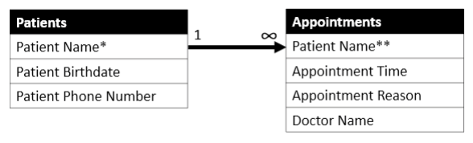
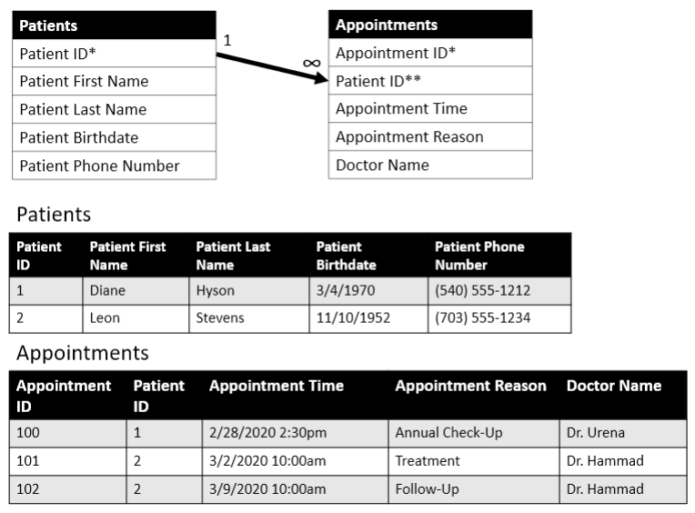
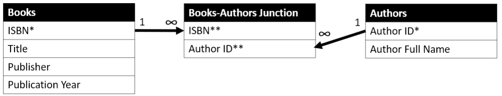

# Data Sources

- There are two types of data: structured and unstructured.
    - Untructured data is such as text documents or images stored as individual files in a computer's file system.
    - Structured data is typically organized into a tabular format, like a spreadsheet or database table containing limited-length text or numeric values.
    - Other types of files include CSV text files, JSON retrieved via API, XML in a NoSQL database, Graph databases with special query languages, key-value stores, and so on.
- Microsoft Excel is used for creating and maintaining spreadsheets. It also includes some analysis capabilities, such as pivot tables for summarizing spreadsheets and data visualization tools for plotting data points from a spreadsheet. Some functions in Excel can connect data in one spreadsheet to another.
- Microsoft Access is a relational database application for creating a true relational database model and defining rules for how the data tables are interconnected.
- Relational Database Management Systems (RDBMSs) are such as Oracle, MySQL, MS SQL Server, PostgreSQL, Amazon Redshift, IBM DB2, MS Access, SQLite, and Snowflake. The syntax for each can differ slightly, but the general concepts about Structured Query Language (SQL) are consistent across products.

# Tools for Connecting to Data Sources and Editing SQL

- First step is connecting to a database on a server. This is generally done through a SQL Integrated Development Environment (IDE).
- The IDE referenced throughout this book is MySQL Workbench Community Edition because in the examples a MySQL database is queried.
- We can connect to a database directly from code such as Python or R. For example, search for “R SQL Server” or “Python Redshift”. 

# Relational Databases

- A database table is like a well-defined spreadsheet, with row identifiers and named column headers.
- An entity is an object or concept that the table represents and captures data for. For example, in a table of Books, the entity is “Books”. The “Book table” contains information about many books such as ISBN number, title, and author. Some people use the terms entity and table interchangeably.
- A row is interchangeably called a record or tuple.
- A column header is interchangeably called a field or attribute.
- For example, in a table of Books, we can say that “the value in the Author field in the SQL for Data Scientists record in the Books table is ‘Renée M. P. Teate’.” Or, “In the Books table, the row representing the book SQL for Data Scientists contains the value ‘Renée M. P. Teate’ in the Author column.”
- A database is a collection of related tables. A database schema stores information about the tables and the relationships between them, defining the structure of the database.
- For example, in a doctor's office database, one table contains information about patients such as name, birthdate, and phone number. Another table contains information about appointments such as patient's name, appointment time, reason for the visit, and the name of the doctor. The connection between these two tables could be the patient's name. In reality, a unique identifier would be assigned to each patient, since two people can have the same name.
- The relationship between the entities (tables) is called a one-to-many relationship. Each patient only appears in the patient directory table one time but can appear in many appointments in the Appointment table. Database relationships are depicted in an entity-relationship diagram (ERD).

- An infinity symbol, “N”, or “crow's feet” on the end of a line connecting two tables indicates that it is the “many” side of a one-to-many relationship.
- The primary key in a table is a column or combination of columns that uniquely identifies a row.
    - The combination of values in the primary key columns cannot all be NULL (empty). NULL is the absence of any value, a totally empty field. NULLs are treated differently than blanks in SQL. Blank is a single space “ ” in a string field.
    - The primary key can be unique values such as a Student ID Card number or can be generated by the database and not carry meaning elsewhere “in real life”.
    - The primary key in a table is used to identify the records in other tables that relate to each of its records. When a table's primary key is referenced in another table, it is called a foreign key.
- For example, the doctor's office database assign an auto-incrementing integer value to serve as the primary key for each patient record in the Patients table and for each appointment record in the Appointments table. Then, the appointment-tracking table uses the generated Patient ID value to link each appointment to each patient, and the patient's name doesn't even need to be stored in the Appointments table.

- Another type of relationship found in RDBMSs is called many-to-many. It's a connection between entities where the records on each side of the relationship can connect to multiple records on the other side. For example, there would be a many-to-many relationship between books and authors, because each author can write multiple books, and each book can have multiple authors. In order to create this relationship in the database, a junction or associative table will be needed to capture the pairs of related rows.

- In Figure 1.5, the ISBN, which is the primary key in the Books table, and the Author ID, which is the primary key in the Authors table are both foreign keys in the Books-Authors Junction table. Each pairing of ISBN and Author ID in the junction table would be unique, so the pair of fields is considered a multi-column primary key in the Books-Authors Junction table. By setting up this database relationship so that there are no multiple rows per book in the Books table or multiple authors listed per book in the Authors column of the Books table. We reduce the amount of redundant data stored in the database and clarify how the entities are related in real life.
- The idea of not storing redundant data is known as database normalization. In the book database example, we only store each author's full name once, no matter how many books they have written. In the doctor's office example, we don't store a patient's phone number repeatedly in the Appointments table, because it's already stored in the related “patient directory” table, and can be found by connecting the two tables via the Patient ID.
    - Normalization reduces the amount of storage space and the complexity of updating data, since each value is stored a minimal number of times.
    - Research “relational database design” for more information.

# Dimensional Data Warehouses
 

# Dimensional Data Warehouses

Data warehouses often contain data from multiple underlying data sources. They can be designed in a normalized relational database form, as described in the previous section, or using other design standards. They may contain both “raw data” extracted from other databases directly, and “summary” tables that are combined or transformed versions of that raw data (for example, the analytical datasets you will learn to build in this book could be permanently stored as tables in a data warehouse, to be referenced by multiple reports). Data warehouses can contain historical data logs with past and current records, tables that are updated in real time as the source systems are updated, or snapshots of data to preserve it as it existed at a past moment in time.

Often, data warehouses are designed using dimensional modeling techniques. We won't go in-depth into the details of dimensional modeling here, but one concept you are likely to come across when querying tables in data warehouses is a “star schema” design that divides the data into facts and dimensions.

The way I think of facts and dimensions is that a record in a fact table contains the “metadata” of an entity, as well as any measures (which are usually numeric values) you want to track and later summarize. A dimension is property of that entity you can group or “slice and dice” the fact records by, and a dimension table will contain further information of that property.

So, for example, a transactional record of an item purchased at a retail store is a fact, containing the timestamp of the purchase, the store number, order number, customer number, and the amount paid. The store the purchase was made at is a dimension of the item purchase fact, and the associated store dimension table would contain additional information about the store, such as its name. You could then query both the fact and the dimension tables to get a summary of purchases by store.

If we transformed our doctor's office database into a star schema, we might have an appointments fact table capturing the occurrence of every appointment, which patient it was for, when it was booked, the reason for the appointment, which doctor it was with, and when it is scheduled to occur. We might also have a date dimension and a time dimension, storing the various properties of each appointment date and time (such as year or day of week) and appointment-booking date and time.

This would allow us to easily count up how many appointments occurred per time period or determine when the highest volume of appointment-booking calls take place, by grouping the “transactional” fact information by different dimensions.

Figure 1.6 depicts an example dimensional data warehouse design. Can you see why this design is called a star schema?

Schematic illustration of an example dimensional data warehouse design.

Figure 1.6

There might also be an appointment history log in this data warehouse, with a record of each time the appointment was changed. That way, not only could we tell when the appointment is supposed to take place, but how many times it was modified, whether it was initially assigned to another doctor, etc.

Note that when compared to a normalized relational database, a dimensional model stores a lot more information. Appointment records will appear multiple times in an appointment log table. There may be a record for every calendar date in the date dimension table, even if no appointments are scheduled for that date yet, and the list of dates might extend for decades into the future!

If you're designing a database or data warehouse, you need to understand these concepts in much more detail than we'll cover here. But in order to query the database to build an analytical dataset, you primarily need to understand the data warehouse table grain (level of detail; what set of columns makes a row unique) and how the tables are related to one another. Once you have that information, querying a dimensional data warehouse with SQL is much like querying a relational database with SQL.

# Asking Questions About the Data Source

Once you find out what type of data source you're working with and learn about the schema design and the relationships between the database tables, there is still a lot of information you should gather about the tables you'll be querying before you dive into writing any SQL.

If you are lucky enough to have access to subject matter experts (SMEs) who know the details of why the database was designed the way it is, how the data is collected and updated, and what to expect in terms of the frequency and types of data that may be updating as you work with the database, stay in communication with them throughout the data exploration and query development process. These might be database administrators (DBAs), ETL engineers (the people who extract, transform, and load data from a source system into a data warehouse), or the people who actually generate or enter the data into the source system in the first place. If you spot some values that don't seem to make sense, you can sometimes look in a data dictionary to learn more (if one exists and is correct), but often going directly to the SMEs to get the details is the best approach. If your questions are easily answered by existing documentation, they will point you to it!

Here are some example questions you might want to ask the SMEs as you're first learning about the data source:

	- “Here are the questions I'm being asked to answer in my analysis. Which tables in this database should I look in first for the relevant data? And is there an entity-relationship diagram documenting the relationships between them that I can reference?”

	- These questions are especially helpful for large data warehouses with a lot of tables, where being pointed in the right direction from the start can save a lot of time searching for the data you need.
	- “What set of fields make up the primary key for this table?” Or, “What is the grain of this fact table?”

	- Understanding the level of detail of each table is important in order to know how to filter, group, and summarize the data in the table, and join it to other tables.
	- “Are these records imported directly from the source system, or have they been transformed or merged in some way before being stored in this table?”

	- This is helpful to know when debugging data that doesn't look like you expected. If the database is “raw” data from the source system, you might talk to those entering the data to learn more about it. If it has gone through a transformation or includes data from several different tables in the system of origin, then the first stop to understand a value would likely be the ETL engineers who programmed the code that modified it.
	- “Is this a static snapshot table, or does it update regularly? At what frequency does it update? And are older records expired and kept as new data is added, or is the existing record overwritten when changes occur?”

	- If a table you're querying contains “live” data that is being updated as you work, and you are using it to perform calculations or as an input to a machine learning algorithm, you may want to make a copy of it to use while working. That way, you know that changes in the calculations or model output are due to changes in your code, and not due to data that is changing as you debug.

	- For datasets updated on a nightly basis, you might want to know what time they refresh, so you can schedule other things that depend on it, like an extract refresh, to occur after the table gets the latest data.

	- If old records are maintained in the table as a log, you can use the expiration date to filter out old records if you only want the latest ones, or keep past records if you're reporting on historical trends.
	- “Is this data collected automatically as events occur, or are the values entered by people? Do we have documentation on the interface that they can see with the data entry form field labels?”

	- Data entered by people may be more prone to error because of manual entry, but the people doing the data entry are often extremely valuable to talk to if you want to understand the business processes that generated the data. You can ask them why certain values were selected, what might trigger an update of a record, or what automated processes are kicked off when they make a change or process a batch.

	- It's a good idea to check to see how the values in each field are distributed: What is the range of possible values? If a column contains categorical values, how many rows fall into each category? If the column contains continuous or discrete numeric values, what is the shape of the statistical distribution? I find that it helps to visualize the data at this exploratory stage, called Exploratory Data Analysis (EDA). Histograms are especially useful for this purpose.

	- Additionally, you might explore the data broken down by time period (such as by fiscal year) to see if those distributions change over time. If you find that they do, you may find out by talking to the SMEs that there is a point at which old records stop being updated, a business process changed, or past values get zeroed out in certain cases, for example.

	- Knowing how their data entry forms look can also help with communication with SMEs about the data, because they may not know the field names in the underlying database but will be able to describe the data using the labels they can see on the front-end interface.

Knowing the type of database is also important for writing more efficient queries, but that is something you are likely to know from the start, as you will probably need that information in order to connect to it. In some database systems, limiting the number of rows returned will make a query run faster. However, in “columnar” database systems like Redshift, even when limiting results to a single row, returning data from all columns may take longer to complete than summarizing all of the values in a single column across thousands of rows because of how the data is physically stored and compiled behind the scenes before being returned to you.

Additionally, you will need to know the type of database in order to look up SQL syntax details in the official documentation, since syntax can differ slightly between database systems.

# Introduction to the Farmer's Market Database

The MySQL database we'll be using for example queries throughout much of this book serves as a tracking system for vendors, products, customers, and sales at a fictional farmer's market. This relational database contains information about each day the farmer's market is open, such as the date, the hours, the day of the week, and the weather. There is data about each vendor, including their booth assignments, products, and prices. We're going to pretend that (unlike at many real farmer's markets) vendors use networked cash registers to ring up individual items, and customers scan farmer's market loyalty cards with every transaction, so we have detailed logs of their purchases (we know who purchased which items and exactly when).

The Farmer's Market database was designed to allow for demonstration of a variety of queries, including those a data analyst might write to answer business questions about the market, such as “How many people visit the market each week throughout the year, and when do our sales peak?” “How much does inclement weather impact attendance?” “When is each type of fresh fruit or vegetable in season, locally?” and “Is this proposed new vendor likely to take business away from existing vendors, or is there enough demand to support another vendor selling these goods?”

We will also prepare datasets based on this database for use with predictive modeling techniques like classification and time-series forecasting, transforming the data into a format that can be used as an input for statistical models and machine learning algorithms. These can help answer questions such as “How many shoppers should we expect to have next month? Next year?” and “Based on what we know about their purchase history, is this customer likely to return in the next month?”

Figure 1.7 shows the ERD for the entire Farmer's Market database. Throughout this book, we will be diving into details of the different tables and relationships depicted in Figure 1.7, as we learn how to write SQL statements that can actually be used to pull data from this database, giving realistic examples of queries that data analysts and data scientists develop.

Schematic illustration of the ERD for the entire Farmer’s Market database.

Figure 1.7

# A Note on Machine Learning Dataset Terminology

So far, we have defined rows (or records) and columns (or attributes or fields) the way a database developer might. However, if the table is a transformed dataset designed for use in training a predictive model (which is what you will be learning to create throughout this book), a data scientist might use different terminology to describe the rows and columns in that dataset.

In this special use case, the set of values in each row can be used as inputs to train a model, and that row is often called a “training example” (or “instance” or “data point”). And each input column is a “feature” (or “input variable”). A machine learning algorithm might rank important features, letting you know which attributes are most useful to the model for making its prediction. The column that contains the output that the model is trying to predict is called the “target variable.”

By the end of this book, you will have learned how to convert “rows and columns” in database tables into “training examples” with “features” for a predictive model to learn from.

# NOTE

In an ERD, an infinity symbol, “N”, or “crow's feet” on the end of a line connecting two tables indicates that it is the “many” side of a one-to-many relationship. You can see the infinity symbol next to the Appointments table in Figure 1.3.

The primary key in a table is a column or combination of columns that uniquely identifies a row. The combination of values in the primary key columns must be unique per record, and cannot all be NULL (empty). The primary key can be made of values that occur in the data that are unique per record—such as a Student ID Card number in a table of students at a university—or it can be generated by the database and not carry meaning elsewhere “in real life,” like an integer value that increments automatically every time a new record is created. The primary key in a table can be used to identify the records in other tables that relate to each of its records. When a table's primary key is referenced in another table, it is called a foreign key.

Notice that the NULL value is described in this section as “empty” and not as “blank.” In database terms, NULL and “blank” aren't necessarily the same thing. For example, a single space “ ” can be considered a “blank” value in a string field, but is not NULL, because there is a space character stored there. A NULL is the absence of any value, a totally empty field. NULLs are treated differently than blanks in SQL.

# Exercises

1.     What do you think will happen in the described Books and Authors database depicted in Figure 1.5 if an author changes their name? Which records might be added or updated, and what might be the effect on the results of future queries based on this data?

2. Think of something in your life that you could track using a database. What entities in this database might have one-to-many relationships with one another? Many-to-many?

...............................................................................................................................................................................................................................................................

# Data Sources

As a data analyst or data scientist, you will encounter data from many sources—from databases to spreadsheets to Application Programming Interfaces (APIs)—which you are expected to use for predictive modeling. Understanding the source system your data comes from, how it was initially gathered and stored, and how frequently it is updated, will take you a long way toward an effective analysis. In my experience, issues with a predictive model can often be traced back all the way to the source data or the query that first pulls the data from the source. Exploring the data available for your analysis starts with exploring the structure of the source database.

# Data Sources

Data can be stored in many forms and structures. Examples of unstructured data include text documents or images stored as individual files in a computer's file system. In this book, we'll be focusing on structured data, which is typically organized into a tabular format, like a spreadsheet or database table containing limited-length text or numeric values.

Many software applications enable the organization of data into structured forms. One example you are likely familiar with is Microsoft Excel, for creating and maintaining spreadsheets. Excel also includes some analysis capabilities, such as pivot tables for summarizing spreadsheets and data visualization tools for plotting data points from a spreadsheet. Some functions in Excel allow you to connect data in one spreadsheet to another, but in order to create a true relational database model and define rules for how the data tables are interconnected, Microsoft offers a relational database application called Access.

My first experiences with relational database design were in MS Access, and the basic Structured Query Language (SQL) concepts I learned in order to query data from an Access database are the same concepts I have used throughout my career—in increasingly complex ways. I have since extracted data from other Relational Database Management Systems (RDBMSs) such as MS SQL Server, Oracle Database, MySQL, and Amazon Redshift. Though the syntax for each can differ slightly, the general concepts, many of which you will learn in this book, are consistent across products.

SQL-style RDBMSs were first developed in the 1970s, and the basic database design concepts have stood the test of time; many of the database systems that originated then are still in use today. The longevity of these tools is another reason that SQL is so ubiquitous and so valuable to learn.

As a professional who works with data, you will likely encounter several of the following popular Relational Database Management Systems:

	- Oracle
	- MySQL
	- MS SQL Server
	- PostgreSQL
	- Amazon Redshift
	- IBM DB2
	- MS Access
	- SQLite
	- Snowflake
	
You will also likely work with data retrieved from other types of files at some point, such as CSV text files, JSON retrieved via API, XML in a NoSQL database, Graph databases with special query languages, key-value stores, and so on. However, relational SQL databases still dominate the industry for structured data storage and are the most likely database systems you will encounter on the job.

# Tools for Connecting to Data Sources and Editing SQL

When you start an analysis project, the first step is often connecting to a database on a server. This is generally done through a SQL Integrated Development Environment (IDE) or with code that connects to the database without a graphical user interface (GUI) to run queries that extract the data and store it in a structure that you can work with downstream in your analysis, such as a dataframe.

The IDE referenced for demonstration purposes throughout this book is MySQL Workbench Community Edition, which was chosen because we'll be querying a MySQL database in the examples. MySQL is open source under the GPL license, and MySQL Workbench CE is free to download.

Many other IDEs will allow you to connect to databases and will perform syntax-highlighting of SQL (highlighting keywords to make it easier to read and to spot errors). All major database systems support Open Database Connectivity (ODBC), which uses drivers to standardize the interfaces between software applications and databases. Whoever has granted you permission to access a database should give you documentation on how to securely connect to it via your selected IDE.

You can also connect to a database directly from code such as Python or R. Search for your preferred language and the type of database (for example, “R SQL Server” or “Python Redshift”) and you will find packages or add-ons that enable you to embed SQL queries in your code and return results in the form of a dataframe or other data structure. The database system's official documentation will also provide information about connecting to it from other software and from within your code. Searching “MySQL connector” brings up a list of drivers for use with different languages, for example.

If you are writing code in a language like Python and will be passing a SQL statement to a function as a string, where it won't be syntax highlighted, you can write SQL in a free text tool that performs SQL syntax highlighting, such as Notepad++, or in a SQL IDE, and then paste the final result into your code.

# Relational Databases

If you have never explored a database, you can think of a database table like a well-defined spreadsheet, with row identifiers and named column headers. Each table may store different subsets and types of data at different levels of detail.

An entity is the “thing” (object or concept) that the table represents and captures data for. If there is a table that contains data about books, the entity is “Books,” and the “Book table” is the data structure that contains information about the Book entity. Some people use the terms entity and table interchangeably.

You may see me using the terms row and record interchangeably in this book: a record in a database is like a row in a table and displayed the same way. Some people call a database row a tuple.

You may also see me using the terms column, field, and attribute as synonyms. A column header in a spreadsheet is the equivalent of an attribute name in a table. Each column in a database table stores data about an attribute of the entity.

For example, as illustrated in Figure 1.1, in a table of Books there would be a row for each book, with an ISBN number column to identify each book. The ISBN is an attribute of the book entity. The Author column in the row in the Books table representing this book would have my name in it, so you could say that “the value in the Author field in the SQL for Data Scientists record in the Books table is ‘Renée M. P. Teate’.” Or, “In the Books table, the row representing the book SQL for Data Scientists contains the value ‘Renée M. P. Teate’ in the Author column.”

Table presented with three rows and three columns. It records I S B N, title, and author.

Figure 1.1

A database is a collection of related tables, and a database schema stores information about the tables (and other database objects), as well as the relationships between them, defining the structure of the database.

To illustrate an example of a relationship between database tables, imagine that one table in a database contains a record (row) for every patient that's ever scheduled an appointment at a doctor's office, with each patient's name, birthdate, and phone number, like a directory. Another table contains a record of every appointment, with the patient's name, appointment time, reason for the visit, and the name of the doctor the patient has an appointment with. The connection between these two tables could be the patient's name. (In reality, a unique identifier would be assigned to each patient, since two people can have the same name, but for this illustration, the name will suffice.) In order to create a report of every patient who has an appointment scheduled in the next week along with their contact information, there would have to be an established connection between the patient directory table and the appointment table, enabling someone to pull data from both tables simultaneously. See Figure 1.2.

A set of two tables titled, patients and appointments.

Figure 1.2

The relationship between the entities just described is called a one-to-many relationship. Each patient only appears in the patient directory table one time but can have many appointments in the related appointment-tracking table. Each appointment only has one patient's name associated with it.

Database relationships like this one are depicted in what's called an entity-relationship diagram (ERD). The ERD for these two tables is shown in Figure 1.3.

An illustration showing the relationship between patients and appointments.

Figure 1.3

As mentioned, using the Patient Name in the previous example is a poor selection of primary key, because two patients can have the same name, so your primary key won't necessarily end up uniquely identifying patients. One option that is common practice in the industry is to create a field that generates an auto-incrementing integer to serve as a unique identifier for each new row, so as not to rely on other values unique to a record that may be a privacy concern or unavailable at the time the record is created, such as Social Security numbers.

So, let's say that instead, the doctor's office database assigned an auto-incrementing integer value to serve as the primary key for each patient record in the Patients table and for each appointment record in the Appointments table. Then, the appointment-tracking table can use that generated Patient ID value to link each appointment to each patient, and the patient's name doesn't even need to be stored in the Appointments table. In Figure 1.4, you can see a database design where the Patient ID is serving as a primary key in the Patients table, and as a foreign key in the Appointments table.

An illustration showing the relationship between patients and appointments and the corresponding tables.

Figure 1.4

Another type of relationship found in RDBMSs is called many-to-many. As you might guess, it's a connection between entities where the records on each side of the relationship can connect to multiple records on the other side. Using our Books example, if we had a table of Authors, there would be a many-to-many relationship between books and authors, because each author can write multiple books, and each book can have multiple authors. In order to create this relationship in the database, a junction or associative table will be needed to capture the pairs of related rows. See Figure 1.5.

An illustration of the relationships between books, books-authors junction, and authors.

Figure 1.5

In the ERD shown in Figure 1.5 you can see that the ISBN, which is the primary key in the Books table, and the Author ID, which is the primary key in the Authors table (denoted by asterisks) are both foreign keys in the Books-Authors Junction table (denoted by double asterisks). Each pairing of ISBN and Author ID in the junction table would be unique, so the pair of fields can be considered a multi-column primary key in the Books-Authors Junction table.

By setting up this database relationship so that we don't end up with multiple rows per book in the Books table or multiple authors listed per book in the Authors column of the Books table and have a junction table that only contains the identifiers matching up the related tables, we are reducing the amount of redundant data stored in the database and clarifying how the entities are related in real life.

The idea of not storing redundant data in a database unnecessarily is known as database normalization. In the book database example, we only have to store each author's full name once, no matter how many books they have written. In the doctor's office example, there's no need to store a patient's phone number repeatedly in the Appointments table, because it's already stored in the related “patient directory” table, and can be found by connecting the two tables via the Patient ID (we will cover SQL JOINs, which are used to merge data from multiple tables, in Chapter 5, “SQL JOINs”). Normalization can reduce the amount of storage space a database requires and also reduce the complexity of updating data, since each value is stored a minimal number of times. We won't go into all of the details of normalization here, but if you are interested in learning more about it, research “relational database design.”

# Dimensional Data Warehouses

Data warehouses often contain data from multiple underlying data sources. They can be designed in a normalized relational database form, as described in the previous section, or using other design standards. They may contain both “raw data” extracted from other databases directly, and “summary” tables that are combined or transformed versions of that raw data (for example, the analytical datasets you will learn to build in this book could be permanently stored as tables in a data warehouse, to be referenced by multiple reports). Data warehouses can contain historical data logs with past and current records, tables that are updated in real time as the source systems are updated, or snapshots of data to preserve it as it existed at a past moment in time.

Often, data warehouses are designed using dimensional modeling techniques. We won't go in-depth into the details of dimensional modeling here, but one concept you are likely to come across when querying tables in data warehouses is a “star schema” design that divides the data into facts and dimensions.

The way I think of facts and dimensions is that a record in a fact table contains the “metadata” of an entity, as well as any measures (which are usually numeric values) you want to track and later summarize. A dimension is property of that entity you can group or “slice and dice” the fact records by, and a dimension table will contain further information of that property.

So, for example, a transactional record of an item purchased at a retail store is a fact, containing the timestamp of the purchase, the store number, order number, customer number, and the amount paid. The store the purchase was made at is a dimension of the item purchase fact, and the associated store dimension table would contain additional information about the store, such as its name. You could then query both the fact and the dimension tables to get a summary of purchases by store.

If we transformed our doctor's office database into a star schema, we might have an appointments fact table capturing the occurrence of every appointment, which patient it was for, when it was booked, the reason for the appointment, which doctor it was with, and when it is scheduled to occur. We might also have a date dimension and a time dimension, storing the various properties of each appointment date and time (such as year or day of week) and appointment-booking date and time.

This would allow us to easily count up how many appointments occurred per time period or determine when the highest volume of appointment-booking calls take place, by grouping the “transactional” fact information by different dimensions.

Figure 1.6 depicts an example dimensional data warehouse design. Can you see why this design is called a star schema?

Schematic illustration of an example dimensional data warehouse design.

Figure 1.6

There might also be an appointment history log in this data warehouse, with a record of each time the appointment was changed. That way, not only could we tell when the appointment is supposed to take place, but how many times it was modified, whether it was initially assigned to another doctor, etc.

Note that when compared to a normalized relational database, a dimensional model stores a lot more information. Appointment records will appear multiple times in an appointment log table. There may be a record for every calendar date in the date dimension table, even if no appointments are scheduled for that date yet, and the list of dates might extend for decades into the future!

If you're designing a database or data warehouse, you need to understand these concepts in much more detail than we'll cover here. But in order to query the database to build an analytical dataset, you primarily need to understand the data warehouse table grain (level of detail; what set of columns makes a row unique) and how the tables are related to one another. Once you have that information, querying a dimensional data warehouse with SQL is much like querying a relational database with SQL.

# Asking Questions About the Data Source

Once you find out what type of data source you're working with and learn about the schema design and the relationships between the database tables, there is still a lot of information you should gather about the tables you'll be querying before you dive into writing any SQL.

If you are lucky enough to have access to subject matter experts (SMEs) who know the details of why the database was designed the way it is, how the data is collected and updated, and what to expect in terms of the frequency and types of data that may be updating as you work with the database, stay in communication with them throughout the data exploration and query development process. These might be database administrators (DBAs), ETL engineers (the people who extract, transform, and load data from a source system into a data warehouse), or the people who actually generate or enter the data into the source system in the first place. If you spot some values that don't seem to make sense, you can sometimes look in a data dictionary to learn more (if one exists and is correct), but often going directly to the SMEs to get the details is the best approach. If your questions are easily answered by existing documentation, they will point you to it!

Here are some example questions you might want to ask the SMEs as you're first learning about the data source:

	- “Here are the questions I'm being asked to answer in my analysis. Which tables in this database should I look in first for the relevant data? And is there an entity-relationship diagram documenting the relationships between them that I can reference?”

	- These questions are especially helpful for large data warehouses with a lot of tables, where being pointed in the right direction from the start can save a lot of time searching for the data you need.
	- “What set of fields make up the primary key for this table?” Or, “What is the grain of this fact table?”

	- Understanding the level of detail of each table is important in order to know how to filter, group, and summarize the data in the table, and join it to other tables.
	- “Are these records imported directly from the source system, or have they been transformed or merged in some way before being stored in this table?”

	- This is helpful to know when debugging data that doesn't look like you expected. If the database is “raw” data from the source system, you might talk to those entering the data to learn more about it. If it has gone through a transformation or includes data from several different tables in the system of origin, then the first stop to understand a value would likely be the ETL engineers who programmed the code that modified it.
	- “Is this a static snapshot table, or does it update regularly? At what frequency does it update? And are older records expired and kept as new data is added, or is the existing record overwritten when changes occur?”

	- If a table you're querying contains “live” data that is being updated as you work, and you are using it to perform calculations or as an input to a machine learning algorithm, you may want to make a copy of it to use while working. That way, you know that changes in the calculations or model output are due to changes in your code, and not due to data that is changing as you debug.

	- For datasets updated on a nightly basis, you might want to know what time they refresh, so you can schedule other things that depend on it, like an extract refresh, to occur after the table gets the latest data.

	- If old records are maintained in the table as a log, you can use the expiration date to filter out old records if you only want the latest ones, or keep past records if you're reporting on historical trends.
	- “Is this data collected automatically as events occur, or are the values entered by people? Do we have documentation on the interface that they can see with the data entry form field labels?”

	- Data entered by people may be more prone to error because of manual entry, but the people doing the data entry are often extremely valuable to talk to if you want to understand the business processes that generated the data. You can ask them why certain values were selected, what might trigger an update of a record, or what automated processes are kicked off when they make a change or process a batch.

	- It's a good idea to check to see how the values in each field are distributed: What is the range of possible values? If a column contains categorical values, how many rows fall into each category? If the column contains continuous or discrete numeric values, what is the shape of the statistical distribution? I find that it helps to visualize the data at this exploratory stage, called Exploratory Data Analysis (EDA). Histograms are especially useful for this purpose.

	- Additionally, you might explore the data broken down by time period (such as by fiscal year) to see if those distributions change over time. If you find that they do, you may find out by talking to the SMEs that there is a point at which old records stop being updated, a business process changed, or past values get zeroed out in certain cases, for example.

	- Knowing how their data entry forms look can also help with communication with SMEs about the data, because they may not know the field names in the underlying database but will be able to describe the data using the labels they can see on the front-end interface.

Knowing the type of database is also important for writing more efficient queries, but that is something you are likely to know from the start, as you will probably need that information in order to connect to it. In some database systems, limiting the number of rows returned will make a query run faster. However, in “columnar” database systems like Redshift, even when limiting results to a single row, returning data from all columns may take longer to complete than summarizing all of the values in a single column across thousands of rows because of how the data is physically stored and compiled behind the scenes before being returned to you.

Additionally, you will need to know the type of database in order to look up SQL syntax details in the official documentation, since syntax can differ slightly between database systems.

# Introduction to the Farmer's Market Database

The MySQL database we'll be using for example queries throughout much of this book serves as a tracking system for vendors, products, customers, and sales at a fictional farmer's market. This relational database contains information about each day the farmer's market is open, such as the date, the hours, the day of the week, and the weather. There is data about each vendor, including their booth assignments, products, and prices. We're going to pretend that (unlike at many real farmer's markets) vendors use networked cash registers to ring up individual items, and customers scan farmer's market loyalty cards with every transaction, so we have detailed logs of their purchases (we know who purchased which items and exactly when).

The Farmer's Market database was designed to allow for demonstration of a variety of queries, including those a data analyst might write to answer business questions about the market, such as “How many people visit the market each week throughout the year, and when do our sales peak?” “How much does inclement weather impact attendance?” “When is each type of fresh fruit or vegetable in season, locally?” and “Is this proposed new vendor likely to take business away from existing vendors, or is there enough demand to support another vendor selling these goods?”

We will also prepare datasets based on this database for use with predictive modeling techniques like classification and time-series forecasting, transforming the data into a format that can be used as an input for statistical models and machine learning algorithms. These can help answer questions such as “How many shoppers should we expect to have next month? Next year?” and “Based on what we know about their purchase history, is this customer likely to return in the next month?”

Figure 1.7 shows the ERD for the entire Farmer's Market database. Throughout this book, we will be diving into details of the different tables and relationships depicted in Figure 1.7, as we learn how to write SQL statements that can actually be used to pull data from this database, giving realistic examples of queries that data analysts and data scientists develop.

Schematic illustration of the ERD for the entire Farmer’s Market database.

Figure 1.7

# A Note on Machine Learning Dataset Terminology

So far, we have defined rows (or records) and columns (or attributes or fields) the way a database developer might. However, if the table is a transformed dataset designed for use in training a predictive model (which is what you will be learning to create throughout this book), a data scientist might use different terminology to describe the rows and columns in that dataset.

In this special use case, the set of values in each row can be used as inputs to train a model, and that row is often called a “training example” (or “instance” or “data point”). And each input column is a “feature” (or “input variable”). A machine learning algorithm might rank important features, letting you know which attributes are most useful to the model for making its prediction. The column that contains the output that the model is trying to predict is called the “target variable.”

By the end of this book, you will have learned how to convert “rows and columns” in database tables into “training examples” with “features” for a predictive model to learn from.

# NOTE

In an ERD, an infinity symbol, “N”, or “crow's feet” on the end of a line connecting two tables indicates that it is the “many” side of a one-to-many relationship. You can see the infinity symbol next to the Appointments table in Figure 1.3.

The primary key in a table is a column or combination of columns that uniquely identifies a row. The combination of values in the primary key columns must be unique per record, and cannot all be NULL (empty). The primary key can be made of values that occur in the data that are unique per record—such as a Student ID Card number in a table of students at a university—or it can be generated by the database and not carry meaning elsewhere “in real life,” like an integer value that increments automatically every time a new record is created. The primary key in a table can be used to identify the records in other tables that relate to each of its records. When a table's primary key is referenced in another table, it is called a foreign key.

Notice that the NULL value is described in this section as “empty” and not as “blank.” In database terms, NULL and “blank” aren't necessarily the same thing. For example, a single space “ ” can be considered a “blank” value in a string field, but is not NULL, because there is a space character stored there. A NULL is the absence of any value, a totally empty field. NULLs are treated differently than blanks in SQL.

# Exercises

1.     What do you think will happen in the described Books and Authors database depicted in Figure 1.5 if an author changes their name? Which records might be added or updated, and what might be the effect on the results of future queries based on this data?

2. Think of something in your life that you could track using a database. What entities in this database might have one-to-many relationships with one another? Many-to-many?

