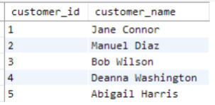
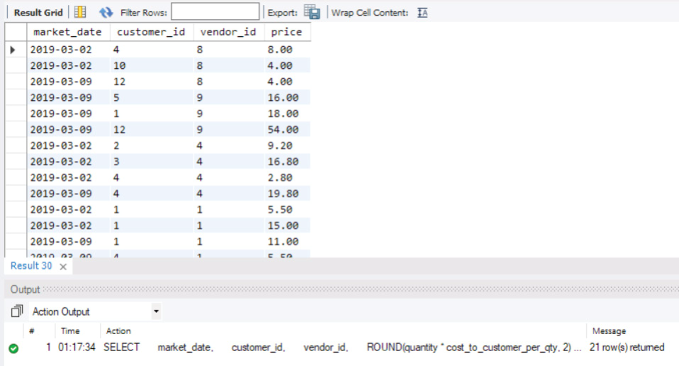

# The SELECT Statement
- The SELECT statement is a fundamental SQL command used to retrieve data from a database. It allows you to:
  - View data from specific columns in a table.
  - Combine data from multiple tables.
  - Filter results based on conditions.
  - Perform calculations on the data.
- In SQL code, the word SELECT is often capitalized because it is a reserved keyword that tells the database how to execute your query. Capitalizing it helps distinguish it from other text in the query, like field names.
# The Fundamental Syntax Structure of a SELECT Query
- An SQL SELECT query follows a basic structure where you specify the data you want to retrieve and how to manipulate it. Here's the general syntax:
```sql
SELECT [columns to return]
FROM [schema.table]
WHERE [conditional filter statements]
GROUP BY [columns to group on]
HAVING [conditional filter statements that are run after grouping]
ORDER BY [columns to sort on]
```
- SELECT: Specifies the columns you want to retrieve from the table. This clause is required.
- FROM: Indicates the table (and optionally the schema) to select data from. This clause is also required.
- WHERE: Applies conditions to filter rows before grouping or selecting.
- GROUP BY: Groups rows that have the same values in specified columns.
- HAVING: Filters groups based on conditions, applied after grouping.
- ORDER BY: Sorts the resulting data based on one or more columns.
- The clauses in brackets are placeholders for the actual columns, tables, and conditions you will use. While only the SELECT and FROM clauses are mandatory, the other clauses help refine and organize your query results.
# Selecting Columns and Limiting the Number of Rows Returned
- Basic Syntax: The simplest form of a SELECT statement is:
```sql
SELECT * FROM [schema.table]
```
- This query retrieves all columns from the specified table in the schema. `FROM schema.table` specifies the schema and table name.
- Example: 
```sql
SELECT * FROM farmers_market.product
```
- This query selects all columns and all rows from the `product` table in the `farmers_market` schema.
- Because there is no WHERE clause to filter results, the query returns all rows (every record) in the table.
- Introducing the LIMIT Clause:
  - The LIMIT clause is used to restrict the number of rows returned by a query.
  - This is especially useful when working with large datasets to preview a subset of the data without processing the entire table.
- Example of using LIMIT:
```sql
SELECT *
FROM farmers_market.product
LIMIT 5
```
- This query retrieves all columns but only the first five rows from the `product` table.

- Some database systems use different syntax to limit results:
- MySQL: The LIMIT clause is placed at the end of the query.
```sql
SELECT * FROM table_name
LIMIT number_of_rows
```
- MS SQL Server: The TOP keyword is placed before the SELECT statement.
```sql
SELECT TOP number_of_rows * FROM table_name
```
- Oracle: Use the WHERE clause with `ROWNUM <= number` to limit results. The condition `ROWNUM <= number_of_rows` is placed in the WHERE clause.
```sql
SELECT * FROM table_name
WHERE ROWNUM <= number_of_rows
```
- In the examples above, the FROM clause is put on the second line. You can use line breaks and indentation in your SQL queries to enhance readability without affecting how the code runs; SQL treats spaces, tabs, and line breaks the same way.  For specifying which columns to retrieve from a table, list the column names after the SELECT keyword, separated by commas, instead of using * which selects all columns.
- Example:
```sql
SELECT product_id, product_name
FROM farmers_market.product
LIMIT 5
```
- This query selects the `product_id` and `product_name` columns from the `product` table and limits the output to the first five rows.

- You should list the column names explicitly instead of using * when you want all columns returned, especially when the query is part of an automated data pipeline:
  - Stability and Consistency:
    - Schema Changes: If the underlying table structure changes—such as adding new columns or rearranging column order—using `SELECT *` can lead to unexpected results.
    - Consistent Output: Explicitly listing column names ensures that the output remains consistent even if the table schema changes.
  - Preventing Breakages:
    - Automated Processes: In automated data pipelines that run without human intervention, unexpected changes in output can cause downstream processes to fail or produce incorrect results.
    - Error Detection: If a column is removed or renamed, explicitly listing columns will cause the query to fail, alerting you to the change immediately.
- The following query retrieves the first five rows of market date, vendor ID, and booth number from the `vendor_booth_assignments` table:
```sql
SELECT market_date, vendor_id, booth_number 
FROM farmers_market.vendor_booth_assignments 
LIMIT 5
```

- We can sort this output by market date to make it more meaningful.
# The ORDER BY Clause: Sorting Results
- The ORDER BY clause is used to sort the output rows based on one or more columns. You can specify the sort order (ascending ASC or descending DESC) for each column. ASC sorts text alphabetically and numeric values from low to high, while DESC sorts them in reverse order. In MySQL, NULL values appear first when sorting in ascending order. The default sort order is ascending.
- The following query sorts the results by product name.
```sql
SELECT product_id, product_name 
FROM farmers_market.product 
ORDER BY product_name
LIMIT 5
```

- The following query sorts the results by product ID in descending order.
```sql
SELECT product_id, product_name 
FROM farmers_market.product 
ORDER BY product_id DESC
LIMIT 5
```

- The rows in Figure 2.5 are different from the previous query because the ORDER BY clause is executed before the LIMIT clause.
- We can first sort the output by market date and then by vendor ID.
```sql
SELECT market_date, vendor_id, booth_number
FROM farmers_market.vendor_booth_assignments
ORDER BY market_date, vendor_id
LIMIT 5
```

# Introduction to Simple Inline Calculations
- In this section, examples of calculations performed on columns are shown. This give insight into how calculations are incorporated into the basic SELECT query syntax.
- Let's say we want to calculate the total price of a purchase by multiplying the quantity and cost per quantity columns in the `customer_purchases` table.
- The raw data in the selected columns of the `customer_purchases` table is shown in Figure 2.7.
```sql
SELECT
    market_date,
    customer_id,
    vendor_id,
    quantity,
    cost_to_customer_per_qty
FROM farmers_market.customer_purchases
LIMIT 10
```

- The following query demonstrates how to multiply the values in two columns to calculate the price.
```sql
SELECT
    market_date,
    customer_id,
    vendor_id,
    quantity,
    cost_to_customer_per_qty,
    quantity * cost_to_customer_per_qty
FROM farmers_market.customer_purchases
LIMIT 10
```

- To give the calculated column a meaningful name, we can create an alias using the AS keyword. We can assign the alias `price` to the result of the calculation.
```sql
SELECT
    market_date,
    customer_id,
    vendor_id,
    quantity * cost_to_customer_per_qty AS price
FROM farmers_market.customer_purchases
LIMIT 10
```

- The AS keyword is optional in MySQL, so the following query will return the same results as the previous query:
```sql
SELECT
    market_date,
    customer_id,
    vendor_id,
    quantity * cost_to_customer_per_qty price
FROM farmers_market.customer_purchases
LIMIT 10
```
- The next logical step is to calculate how much a customer paid for all the products they purchased from each vendor on a specific day. This involves adding up the prices for each customer, vendor, and market date.
- Aggregating Data:
  - Aggregate calculations summarize data across multiple rows.
  - Examples include functions like `SUM`, `AVG`, `COUNT`, which combine data from several rows into a single result. These techniques are covered in Chapter 6.
- So far, calculations are applied to each row individually. For instance, calculating the price for each purchase by multiplying quantity by cost per unit. These calculations do not summarize or combine data across multiple rows.
# More Inline Calculation Examples: Rounding
- A SQL function is a piece of code that takes inputs (parameters), performs an operation on them, and returns a value.
- You can use functions directly in your query to modify raw values from database tables before displaying them. The syntax for calling a SQL function is:
```sql
FUNCTION_NAME([parameter 1],[parameter 2], . . . .[parameter n])
```
- The input parameters might be a field (column) name or a constant value. Look up the specific function documentation for the correct parameters at https://dev.mysql.com/doc for MySQL.
- Example: The ROUND function is used to round the values in the `price` column to two decimal places.
```sql
SELECT
    market_date,
    customer_id,
    vendor_id,
    ROUND(quantity * cost_to_customer_per_qty, 2) AS price
FROM farmers_market.customer_purchases
LIMIT 10
```

- The ROUND function can accept negative values for the second parameter to round to the left of the decimal point. For example, `ROUND(1245, -2)` will return 1200.
# More Inline Calculation Examples: Concatenating Strings
- SQL functions can also be used to manipulate text data. The CONCAT function is used to concatenate strings together.
- In the customer table, we have the first name and last name of the customer stored in separate columns. 
```sql
SELECT *
FROM farmers_market.customer
LIMIT 5
```

- We use the CONCAT function to combine the first name, a space, and the last name into a single column called `customer_name`.
```sql
SELECT
    customer_id,
    CONCAT(customer_first_name, " ", customer_last_name) AS customer_name
FROM farmers_market.customer
LIMIT 5
```

- We can sort the last name first by an ORDER BY clause, and then concatenate the first name and last name.
```sql
SELECT
    customer_id,
    CONCAT(customer_first_name, " ", customer_last_name) AS customer_name
FROM farmers_market.customer
ORDER BY customer_last_name, customer_first_name
LIMIT 5
```

- It is possible to nest functions within each other. For example, we can use the UPPER function to convert the concatenated name to uppercase. We change the representation of the customer name to last name, a comma, a space, and the first name, all in uppercase.
```sql
SELECT
    customer_id,
    UPPER(CONCAT(customer_last_name, ", ", customer_first_name)) AS customer_name
FROM farmers_market.customer
ORDER BY customer_last_name, customer_first_name
LIMIT 5
```

- Notes:
  - Sorting on Existing Columns: The sorting is done on ``customer_last_name`` and ``customer_first_name`` columns, not on the derived ``customer_name`` column.
  - Limiations of Aliases: Depending on the database system, functions used, and the execution order of your query, you might not be able to reuse aliases in other parts of the query. This means you can't always reference a derived column alias in the ORDER BY clause or other parts of the query.
  - Using Functions in ORDER BY: It is possible to use functions or calculations directly in the ORDER BY clause. For example, you could use ``ORDER BY UPPER(customer_last_name)`` to sort the uppercased last names alphabetically.
# Evaluating Query Output
- When developing a SQL SELECT statement, you can ensure the results include the expected rows and columns in the desired format by following these steps:
  - Run the query with a LIMIT clause to preview the first few rows. This helps you verify that the changes you made are reflected in the output. Inspect the column names and a few output values to ensure they look as intended.
  - Verify Total Rows: To confirm how many rows would be returned without the LIMIT, you can run the query without the LIMIT clause or use a COUNT function.
- You can use the Query Editor to review the results of your query to ensure they look correct. This method provides a quick sanity check but is not a substitute for full quality control before putting a query into production. To review the full dataset, remove the LIMIT clause from your query. For example, in MySQL Workbench, you can find the "Don't Limit" option under the Query menu to disable the row limit.

- The we run the query to generate the full output.
```sql
SELECT 
     market_date, 
     customer_id, 
     vendor_id, 
     ROUND(quantity * cost_to_customer_per_qty, 2) AS price 
FROM farmers_market.customer_purchases
```
- Firstly, we look at the total count of rows returned, to ensure it matches our expectations. This is displayed at the bottom of the result window or in the output window. In this example, there are 21 rows in the customer_purchases table. In MySQL Workbench, it is indicated in the Message of the Output section in the lower right.

- Next, we look at the resulting dataset, which is called "Result Grid" in MySQL Workbench.
  - We check the column headers.
  - We scroll through the rows to spot-check a few of the values.
  - If we use ORDER BY, we verify that the sorting is correct.
- We can use the editor to manually sort each column. For example, we sort by the `market_date` column in ascending order.

- We can also sort by the `vendor_id` column.

- This helps me look at the minimum and maximum values in each, because that's often where errors are found, such as unexpected negative values or NULLs, strings that start with numbers or spaces, or other anomalies.
# SELECT Statement Summary
- All SQL queries start with the SELECT statement, even the most complex ones.
```sql
SELECT [columns to return]
FROM [schema.table]
ORDER BY [columns to sort on]
```
- We should be able to describe what the two queries below do:
```sql
SELECT * FROM farmers_market.vendor

SELECT 
     vendor_name,
     vendor_id,
     vendor_type
FROM farmers_market.vendor 
ORDER BY vendor_name
```


# Exercises Using the Included Database
- The following exercises refer to the customer table. The columns contained in the customer table, and some example rows with data values, are shown in Figure 2.11.
1. Write a query that retrieves all columns from the customer table.
2. Write a query that displays all of the columns and 10 rows from the customer table, sorted by the customer's last name, then first name.
3. Write a query that lists all customer IDs and first names in the customer table, sorted by first name.